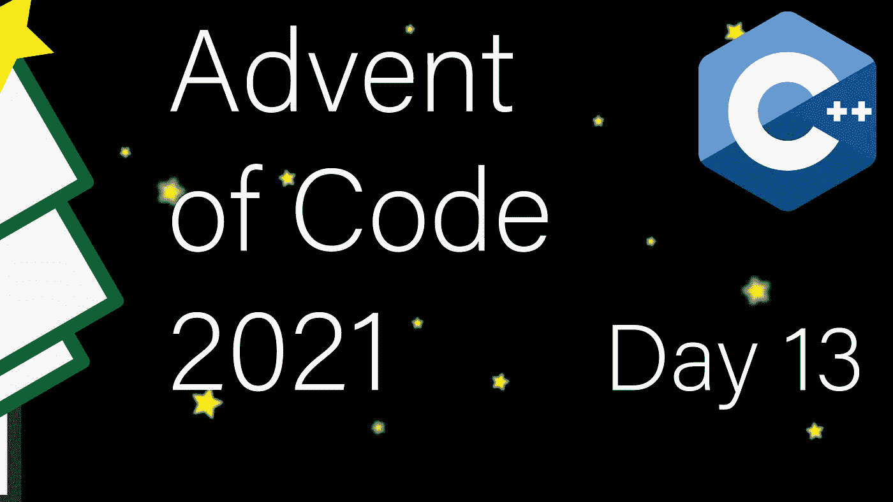

# 现代 C++代码的出现:第 13 天

> 原文：<https://itnext.io/modern-c-in-advent-of-code-day13-4ae500de12b0?source=collection_archive---------5----------------------->

今天是代码问世的第十三天。今天，我们将使用 C++20 系列来折叠透明纸。



一如既往，请先尝试解决问题，然后再看解决方案。对于本系列中的所有文章，[查看这个列表](https://medium.com/@happy.cerberus/list/advent-of-code-2021-using-modern-c-c5814cb6666e)。

# 第 13 天:第一部分

我们的输入是 2D 平面上的一系列点和折叠指令。我们先把问题简化一点。我们总是只在一个方向折叠，所以问题的 2D 性质是不相关的。

让我们看看当我们折叠一个数字时会发生什么。

```
0 1 2 3 4 5 6 7 8 9
  x           x x
```

如果我们用数字 5 折叠这三个数字(1、7 和 8 ),我们反映出数字 5 周围的数字是中心。而且，我们总是只向零反映。

```
0 1 2 3 4 5 6 7 8 9
  x o o   |   - -
```

这就引出了一个简单的公式:`center — (number-center)`或者`2*center — number`。当折叠纸张时，我们将这个公式应用于每个点的 x 或 y 值。

这样一来，我们现在可以开始我们通常的工作了:声明和初始测试。我们将重用从[第 5 天](/modern-c-in-advent-of-code-day5-4777e4037869)开始的点数据类型。

在我们的测试中，我们还检查了 fold 函数，它折叠单个数字:

fold 函数实现了上面提到的公式，我们还注意不要折叠成负数:

对于解析，我们重用第 5 天的代码来解析点，然后用它来读取输入的第一部分:

注意`clear()`调用(第 31 行)，它从流中清除了`badbit`。如果我们不这样做，对`getline`的连续调用将会失败而不尝试读取。为了读取输入的第二部分，我们检查每一行的前缀，然后将行尾转换成一个数字(为了正确解析，我们应该检查转换是否成功)。

如前所述，对于折叠，我们检查所有点，并将折叠应用于相应的坐标:

注意，我们必须将折叠的元素插入到一个新的`unordered_set`中，因为在迭代时修改一个`unordered_set`是不安全的。

我们的主要功能仍然非常简单:

# 第十三天:第二部分

对于我们任务的第二部分，我们必须处理所有的纸张折叠，然后打印出结果来阅读现在解码的字母。

我们首先需要扩展 fold 函数来处理所有折叠:

为了打印出结果，我们需要将由坐标给出的点转换成一个立体的 2D 网格。然而，为此，我们首先需要网格的维度。幸运的是，我们知道网格将小于每个维度中的最小折叠点:

我们通过轴(第 2 行和第 4 行)过滤折叠，然后选择最小的数量(第 3 行和第 5 行)。注意，过滤器是懒惰的，只在`min_element`算法迭代元素时才发生。

我们现在可以构建一个 2D 网格(第 7 行)并遍历这些点，将相应的像素设置为#(第 9 行)。

这又让我们的主要功能变得非常简单:

# 链接和技术说明

每日解决方案存储库位于:[https://github.com/HappyCerberus/moderncpp-aoc-2021](https://github.com/HappyCerberus/moderncpp-aoc-2021)。

[看看这个列表，里面有关于《代码降临》](https://medium.com/@happy.cerberus/list/advent-of-code-2021-using-modern-c-c5814cb6666e)其他日子的文章。

请不要忘记亲自尝试[降临码](https://adventofcode.com/2021)。

# 感谢您的阅读

感谢您阅读这篇文章。你喜欢吗？

我也在 YouTube 上发布视频。你有问题吗？在推特或 LinkedIn 上联系我。