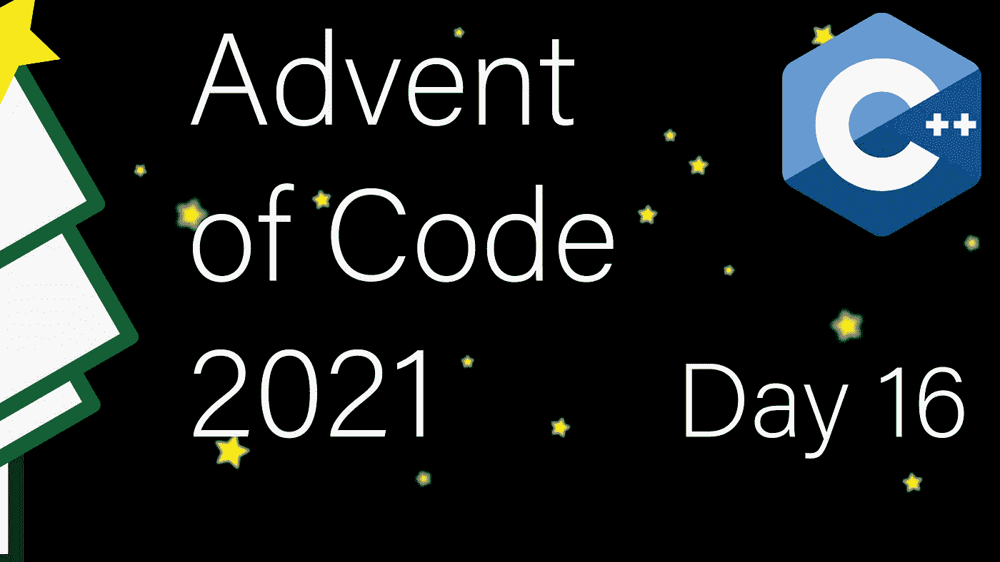

# 现代 C++代码的出现:第 16 天

> 原文：<https://itnext.io/modern-c-in-advent-of-code-day16-6de15011455b?source=collection_archive---------2----------------------->

今天是[代码](https://adventofcode.com/2021)问世的第十六天。今天，我们将分析和评估以压缩二进制格式编码的数据包，这种压缩二进制格式编码为文本。好玩。

一如既往，请先尝试解决问题，然后再看解决方案。对于本系列中的所有文章，[请看这个列表](https://medium.com/@happy.cerberus/list/advent-of-code-2021-using-modern-c-c5814cb6666e)。

# 第 16 天

今天的问题太难理解了。首先，我们的输入是编码为十六进制文本的数据，其中每个字符是一个数字 0-F，代表 4 位数据。为了解析这个输入，我们需要遵循递归包格式。

关于 AoC 的描述非常详细，但它可以归结为三种类型的数据包:

*   文字包:`[version:3][type:3 == 4]([literal_chunk:5])+`
*   大小运营商包:`[version:3][type:3][type:1 == 0][bit_length:15]([sub_packet])+`
*   清点运营商数据包:`[version:3][type:3][type:1 == 1][count:11]([sub_packet])+`

因此，无论哪种情况，我们都从一个由版本和类型组成的六位(3+3)报头开始。如果类型的值为 4，我们就有了一个文本。否则，我们有一个运营商包。文字的数据由重复的五位块组成，其中第一位用来表示最后一个块(如果为零)，其余 4 位是值的一部分。大小确定的操作符分组使用要读取的总比特数(15 比特字段)来指定子分组的数量。计数的操作符包使用它们的计数(11 位字段)指定子包的数量。

## 花式比特流

今天，我们将用不同于往常的方式来解决这个问题。首先，我们将在一个想法的基础上构建我们的实现，并在完成后实现支持代码。

那么这个想法是什么呢？想象一下，我们可以编写以下代码:

这样一个界面无疑会让编写今天问题的解决方案变得令人愉快。假设我们有了这个比特流，并开始实现一个解决方案。

## 代表数据包

我们需要从表示递归分组数据结构开始:

每个包要么包含一个文字，要么包含子包(第 19 行)。子分组由大小字段(以比特为单位的长度或计数)和实际分组的向量组成。我们也有一些助手函数，因为使用`std::variant`很麻烦。

## 从语法上分析

假设我们已经有了神奇的比特流，让我们来实现解析:

对于解析文本，我们一直循环，直到遇到一个带有前导零的块(第 8 行)，并且我们一直将四个值位添加到总值中(第 7 行)。

为了解析包本身，我们首先读取头部，然后根据类型，要么将其视为文字，要么开始读取子包。注意，为了读取特定数量的位，我们创建了一个子位流，这就是为什么输入操作符需要接受 BaseBitStream(这开始决定位流类需要如何工作)。

## 解决办法

总结这些版本，我们可以跨子包递归:

对于第 2 部分，我们必须解释 type 字段的所有可能值，并将整个数据包视为具有以下语义的数字表达式:

*   类型 0:子包的总和
*   类型 1:子包产品
*   类型 2:最少的子包
*   类型 3:子包的最大数量
*   类型 4 是文字
*   类型 5:如果第一个子包大于第二个子包，则为 1，否则为零
*   类型 6:如果第一个子包小于第二个子包，则为 1，否则为零
*   类型 7:如果第一个子包等于第二个子包，则为 1，否则为零

我们可以通过向`uint64_t`引入一个转换操作符来非常直接地实现这一点:

这种转换将触发递归扩展，因为每个子表达式也需要相应的子包转换成`uint64_t`。

然后我们可以在主函数中使用这两个解决方案:

## 比特流

好了，现在我们有了一个完整但行不通的解决方案。是时候实现缺失的部分了，比特流。我们知道我们将需要三个类，一个用于输入流操作符的`BaseBitStream`，`BitStream`类用于表示流，另一个`SubBitStream`类支持位读取限制。

让我们从用`field_width`修饰符实现基类开始。

我们将实际读数推迟到`BitStream`类(第 9 行)。接下来，`field_width_mod`的输入流操作符重载使我们能够设置下面字段的宽度(第 12 行)。最后，我们为任何整数类型重载输入流操作符(第 16 行)，然后根据请求读取有限数量的位(第 19 行)或该类型的整个宽度(第 17 行)。

对于主要的输入解析，我们通过使用一个生成器将四位块转换成一个比特流来帮助自己:

然后`read_bits`方法将它集合在一起，并读取所请求的位数(第 25 行)。

对于子位流，我们还跟踪要读取的总位数限制:

## 测试

最后，由于我们今天以相反的顺序做事情，是时候使用来自 AoC 的测试数据进行测试了:

# 链接和技术说明

每日解决方案存储库位于:[https://github.com/HappyCerberus/moderncpp-aoc-2021](https://github.com/HappyCerberus/moderncpp-aoc-2021)。

[看看这个列表，里面有关于《代码降临》其他日子的文章](https://medium.com/@happy.cerberus/list/advent-of-code-2021-using-modern-c-c5814cb6666e)。

并且请不要忘记亲自尝试一下[降临码](https://adventofcode.com/2021)。

# 感谢您的阅读

感谢您阅读这篇文章。你喜欢吗？

我也在 YouTube 上发布视频。你有问题吗？在推特[或 LinkedIn](https://twitter.com/SimonToth83) 上联系我。