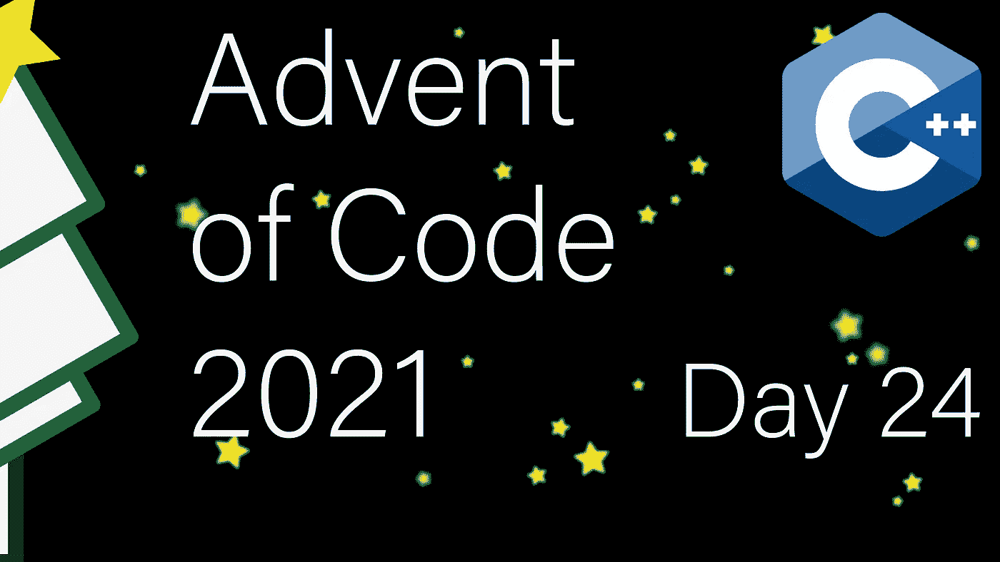

# 现代 C++代码的出现:第 24 天

> 原文：<https://itnext.io/modern-c-in-advent-of-code-day24-4a7a11000778?source=collection_archive---------0----------------------->

这是[代码](https://adventofcode.com/2021)问世的第二十四天。今天将搜索有效的程序输入。



一如既往，请先尝试解决问题，然后再看解决方案。对于本系列中的所有文章，[查看这个列表](https://medium.com/@happy.cerberus/list/advent-of-code-2021-using-modern-c-c5814cb6666e)。

# 第 24 天

今天，我们的输入是 ALU 的机器代码。ALU 有四个寄存器(w、x、y、z ),支持六条指令:

*   `inp a`读取一个数字并将其存储在寄存器`a`中
*   `add a b`执行`a+=b`其中 a 是寄存器，b 是寄存器或数字
*   `mul a b`执行`a*=b`其中 a 是寄存器，b 是寄存器或数字
*   `div a b`执行`a/=b`其中 a 是寄存器，b 是寄存器或数字
*   `mod a b`执行`a%=b`其中 a 是寄存器，b 是寄存器或数字
*   `eql a b`执行`a=(a==b)`其中 a 是寄存器，b 是寄存器或数字

我们的目标是确定在执行代码后，导致寄存器`z`包含零的最高 14 位输入(没有零)是什么。

这个任务很有欺骗性。你可能认为我们必须构建一个虚拟机。但是，如果您查看输入，代码是处理一个数字的重复块。此外，只有三个参数:

```
01: inp w
02: mul x 0
03: add x z
04: mod x 26
05: div z **1**
06: add x **13**
07: eql x w
08: eql x 0
09: mul y 0
10: add y 25
11: mul y x
12: add y 1
13: mul z y
14: mul y 0
15: add y w
16: add y **5**
17: mul y x
18: add z y
```

第 5 行是除数，第 6 行是偏移量，第 16 行是修饰符。除此之外，代码应用以下公式:

```
if (z[i-1] % 26 + offset[i] == digit[i])
  z = z[i-1] / divisor[i];
else
  z = (z[i-1] / divisor[i])*26 + digit[i] + modifier[i];
```

## 从语法上分析

由于我们不再关心指令本身，我们可以只提取参数:

## 搜索

我们可以通过对可达 z 值进行有效的 BFS 来搜索最高解:

这个解决方案只是勉强可行，这主要取决于`std::unordered_map`，因为在更深的层次上，许多解决方案都失败了。我们执行公式(第 10–12 行)并记住每个唯一 z 值的最大数字(第 13–15 行)。

解决第 2 部分需要简单切换第 15 行`std::min`上的`std::max`:

我被迷惑了，直到几个小时前我的头撞在键盘上才注意到这个模式。因此，今天我将留给你这个简单的解决方案。

# 链接和技术说明

每日解决方案存储库位于:[https://github.com/HappyCerberus/moderncpp-aoc-2021](https://github.com/HappyCerberus/moderncpp-aoc-2021)。

[看看这个列表，里面有关于《代码降临》其他日子的文章](https://medium.com/@happy.cerberus/list/advent-of-code-2021-using-modern-c-c5814cb6666e)。

并且请不要忘记亲自尝试一下[降临码](https://adventofcode.com/2021)。

# 感谢您的阅读

感谢您阅读这篇文章。你喜欢吗？

我也在 YouTube 上发布视频。你有问题吗？在推特[或 LinkedIn](https://twitter.com/SimonToth83) 上联系我。