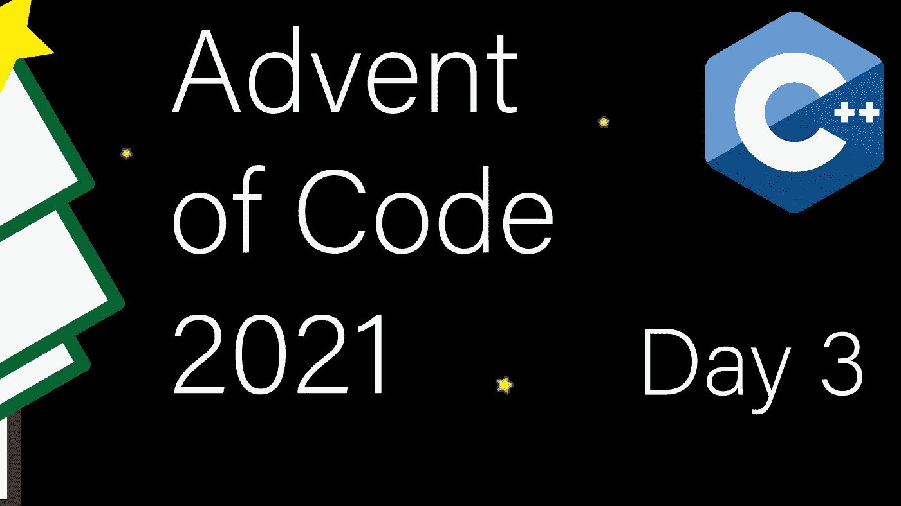

# 现代 C++代码的出现:第三天

> 原文：<https://itnext.io/modern-c-in-advent-of-code-day3-4a105922b5d0?source=collection_archive---------3----------------------->

这是代码问世的第三天。今天，我们将探索算法和比特拨弄。



一如既往，请先尝试解决问题，然后再看解决方案。对于本系列中的所有文章，[查看这个列表](https://medium.com/@happy.cerberus/list/advent-of-code-2021-using-modern-c-c5814cb6666e)。

# 第三天:第一部分

今天的目标是处理二进制数，在第一部分中，目标是从最频繁和最不频繁的位构造数。因此，例如，给定三个数字的列表`0b111, 0b100, 0b000`，对于第一位，最频繁的位是 1，对于第二个 0 和第三个 0。所以由最频繁出现的位组成的数字是`0b100`，由最不频繁出现的位组成的数字是`0b011`。

代码出现时的问题规范没有说明在出现平局的情况下我们应该做什么，例如`0b111, 0b000`。因此，我不得不做出判断，认为`1`位更频繁。因此，由最频繁出现的位产生的数将是`0b111`，由最不频繁出现的位产生的数将是`0b000`。

另一个未指明的方面是在类似`0b101, 0b100, 0b111`的情况下会发生什么。数字是由最不常用的位`0b010`还是`0b110`组成的？我再次进行了判断调用，我确实将零个实例算作有效频率，所以这里的结果将是`0b010`。

有了这个序言，让我们进入解决方案。是的，复数，因为从输入中逐个读取数字的流版本和期望所有数据都在一个向量中的内存解决方案展示了不同的可能方法。

我将讨论为什么我们指定宽度，为什么我们在两个版本中指定不同的宽度，但是像往常一样，让我们从测试开始。

这里唯一需要注意的是，将位宽动态指定为函数参数允许输入具有不同的宽度。相反，接受位宽作为模板参数的版本要求所有测试输入都是一致的。

我们正在测试`epsilon_rate`函数，但是我还没有指定它的函数原型。原因是，我们可以简单地将γ速率作为它的补充来计算ε速率。请注意，这只适用于我们将 0 频率视为有效频率的情况。

`UINT32_MAX`将所有 32 位设置为`1`。当我们移位它时，我们从最低有效位开始创建一个零序列(`1111 << 2 == 1100`)。反转该值会创建一个“与”掩码，该掩码将在计算补码后删除任何设置为 1 的多余位。

```
// ex. for width = 4 and gamma_rate = 1010
UINT_MAX << 4           == 1111 1111 1111 1111 1111 1111 1111 0000
mask = ~(UINT_MAX << 4) == 0000 0000 0000 0000 0000 0000 0000 1111
~gamma_rate             == 1111 1111 1111 1111 1111 1111 1111 0101
~gamma_rate & mask      ==                                    0101
```

在向您展示伽玛速率的解决方案之前，我需要讨论两个辅助函数:

`div2_roundup`功能将允许我们检查哪个频率更高。`v&1`返回最低有效位，如果数字是奇数则返回 1，如果数字是偶数则返回 0。

在`has_bit_set`函数中，我们首先构造一个在测试位置设置了单个位的数。如果该位被置位，按位 AND 将返回一个非零值，否则返回零。当转换为布尔值时，非零值被视为真，零被视为假。

外部循环(第 3 行)遍历了 20 个比特.因为我们需要从左到右构建数字，所以我们需要从最高有效位到最低有效位迭代。一旦我们考虑一个特定的位，我们必须计算有多少个数字设置了这个位。公式`cnt_one >= div2_roundup(data.size())`是一个布尔表达式，如果一半或更多的数字设置了该位，则返回 true，否则返回 false。之后，我们使用 bool 到 int 转换:

*   如果一半或更多的数字将此位设置为 1，则条件为真，这将转换为 1，因此我们向结果添加 1 位
*   如果一半或更多的数字将此位设置为 0，则条件为假，这将转换为 0，因此我们在结果中添加一个 0 位

这个版本要求我们将数据预读到一个向量中。这可能不太方便，所以让我们来看看流式版本:

我们这里有两个阶段。首先，我们通过处理输入来计算频率(第 5-10 行)。我们使用`std::bitset<width>`大大简化了这个任务。我们可以迭代每个数字的位，并累加在每个位置看到的 1 的数量。然而，`std::bitset`也迫使我们将位宽作为模板参数传递。结果的构造(第 11–14 行)与之前的版本相同。

最后是主函数，这里我选择了向量变量，因为它对主函数提出了额外的要求，即将输入读入向量:

我们再次使用`std::bitset`来读取二进制数，而不是使用`std::ransform`中的运算，我们使用`std::identity{}`来返回传递给它的任何东西，但是然后我们使用成员函数`to_ulong()`来投影每个`std::bitset`，该函数返回作为无符号长整数读取的位。投影是 C++20 中引入的`std::ranges`的新特性之一。

# 第三天:第二部分

在第二部分，我们将再次玩比特。任务是选择两个数字。同样，一个将遵循“最多”路径，另一个将遵循“最少”路径。然而，随着我们的搜索，我们将缩小我们的选择。因此，在选择`oxygen_generator`状态时，我们将首先选择最频繁的第一位。这将是`oxygen_generator`状态的第一位。然后，我们将选择范围缩小到最频繁的第一位，并从中选择最频繁的第二位。例如:

```
0b1111, 0b1011, 0b1101, 0b0100
most_freq = 1, result = 1...
0bx111, 0bx011, 0bx101
most_freq = 1, result = 11..
0bxx11, 0bxx01
most_freq = 1 result = 111.
0bxxx1
most_freq = 1, result = 1111
```

在我们进入解决方案之前，让我们看一下我们的声明:

测试是:

如果你熟悉排序算法，你可能会在问题描述中注意到一些熟悉的东西。事实上，这的确有快速排序的味道。

因此，我们可以遵循快速排序逻辑，但是因为我们只关心一个值，所以我们将只在分区的一侧递归。

我们根据当前位的值对数据进行分区(使用`std::partition`)。这意味着分割点之前和之后的所有元素都具有相同值的相应位。根据两个范围(开始到分割点与分割点到结束)中的哪一个更大，我们或者递归选择最常见的`oxygen_rating`(更长的范围)或者最不常见的`co2_rating`(更短的范围)。

我们也只在给定子范围上递归，这意味着我们只考虑具有最常见或最不常见位的元素。最后，当我们只有一个元素或者已经查看了所有的位时，我们结束。

最后，我们必须解决只有一个分区的情况。当所有数字都具有相同的位值时，就会发生这种情况。在这种情况下，分割点等于终点。

综上所述，我们的主要功能如下:

# 链接和技术说明

每日解决方案存储库位于:[https://github.com/HappyCerberus/moderncpp-aoc-2021](https://github.com/HappyCerberus/moderncpp-aoc-2021)。

[查看此列表，了解《代号](https://medium.com/@happy.cerberus/list/advent-of-code-2021-using-modern-c-c5814cb6666e)问世前几天的文章。

请不要忘记亲自尝试[降临码](https://adventofcode.com/2021)。

# 感谢您的阅读

感谢您阅读这篇文章。你喜欢吗？

我还在 T2 的 YouTube 上发布视频。你有问题吗？在[推特](https://twitter.com/SimonToth83)或 [LinkedIn](https://www.linkedin.com/in/simontoth) 上联系我。