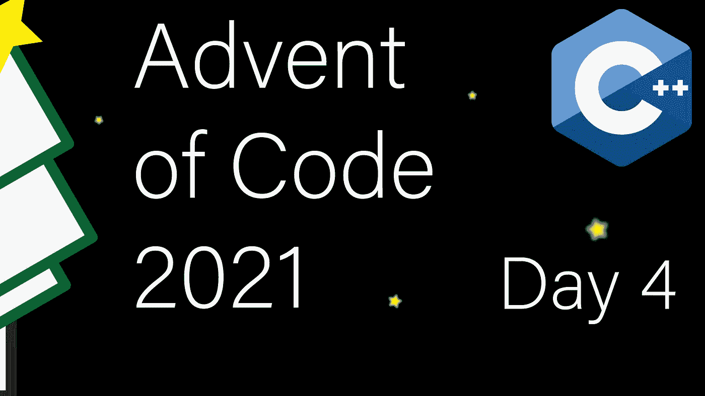

# 现代 C++代码的出现:第 4 天

> 原文：<https://itnext.io/modern-c-in-advent-of-code-day4-14bee3fd1609?source=collection_archive---------2----------------------->

这是代码问世的第四天。今天，我们将设计一些漂亮的数据结构。



一如既往，请先尝试解决问题，然后再看解决方案。对于这个系列的所有文章，[看看这个列表](https://medium.com/@happy.cerberus/list/advent-of-code-2021-using-modern-c-c5814cb6666e)。

# 第四天:第一部分和第二部分

是的，今天会有点短，只是因为第一部分的解和第二部分几乎一样。

今天我们玩宾果游戏，目标是选出首先获胜的宾果棋盘(最后是第二部分)。我们在输入的第一行得到一个抽签数字的列表，然后是一个宾果板序列。每个棋盘由一个 5x5 的数字网格组成。例如:

```
1, 2, 3, 4, 5 1  2  3  4  5
 6  7  8  9 10
11 12 13 14 15
16 17 18 19 20
21 22 23 24 25
```

五个数字被抽出后，该棋盘立即获胜(第一行将被填充)。

在阅读了描述之后，您的第一反应可能是将板保存在内存中，并在每次抽取后检查受影响的行或列是否被填充。然而，我们可以通过聪明地设计我们的数据结构来简化这一切。

填充一行或一列意味着什么？每行和每列都有五个数字。如果我们填充一个，未填充的数字的计数将正好减少一。当我们到达零时，我们知道该行/列被填充。所以我们需要跟踪的是每行和每列的空缺职位的数量。

这个计数是不够的，因为我们还需要知道在绘制数字时要更新哪些列和行。我们需要一张从一个数字到它的位置的地图。

最后，我们必须跟踪未标记数字的总和，因为我们的目标是返回棋盘上未标记数字的总和乘以最后抽取的数字。所有这些加在一起就是我们的国家。

设计好数据结构后，我们现在需要实现解决方案的两个阶段。首先，读取输入并将其存储在我们的数据结构中，其次，处理平局并检测获胜状态。

对于测试，我们使用一个简单的例子，只有一块板和来自 AoC 的测试输入。

让我们看看如何解析输入并将数据存储在状态数据结构中:

我们期望一系列的网格，每个网格由 25 个数字组成。我们在输入结束时停止读取(第 7 行)。然而，我们在读取时可能会遇到错误，所以我们想在这种情况下抛出一个异常(第 8–9 行)。

一旦我们读取了一个数字，我们需要存储它在数字到行和列的映射中的位置。注意，`insert`只会在键(数字)不存在的情况下修改映射，并返回一个迭代器到现有的或刚刚插入的元素。

我们每块板子有五行五列，我们一行一行的读数字。因此行位置是`board_id*(5+5) + i/5`，列位置是`board_id*(5+5) + i%5`。在读取整个棋盘之后，我们初始化每行和每列的未标记项目的计数(第 19 行)以及每个棋盘上的初始和(我们存储 sum*2，原因将在下一节解释)。

随着输入解析的完成和数据结构的构建，我们可以计算出哪个棋盘会先赢。

首先，我们减少棋盘的总数，因为我们标记了这个数字(第 9 行)。这也是`sum*2`发挥作用的地方。请记住，我们已经记录了这个数字的列和行位置。因此，我们将有效地减少总和两次(一次用于列，一次用于行)。

调整总和后，我们减少给定列或行(第 13 行)中未标记数字的数量，如果我们达到零，我们就知道这个棋盘刚刚赢了。因为我们只是处理收到的抽签数字，所以我们知道这是第一个获胜的棋盘。

将此调整到今天问题的第二部分很简单:

我们跟踪哪些棋盘赢了(通过使用一个`unordered_set`来避免重复检测)，并且只有在赢了的棋盘的数量等于棋盘的总数时才返回(第 17 行)。否则，代码与第 1 部分的解决方案相同。

最后要讨论的是主函数(这是针对第 2 部分的):

我们首先读取输入的第一行，其中包含抽取的数字，然后使用已经呈现的`operator>>`重载解析棋盘。

今天的快速解决方案到此结束。我认为，这很好地展示了良好的数据结构设计的重要性。

# 链接和技术说明

每日解决方案存储库位于:[https://github.com/HappyCerberus/moderncpp-aoc-2021](https://github.com/HappyCerberus/moderncpp-aoc-2021)。

[看看这个列表，里面有关于《代号](https://medium.com/@happy.cerberus/list/advent-of-code-2021-using-modern-c-c5814cb6666e)出现的其他日子的文章。

请不要忘记亲自尝试[降临码](https://adventofcode.com/2021)。

# 感谢您的阅读

感谢您阅读这篇文章。你喜欢吗？

我也在 YouTube 上发布视频。你有问题吗？在[推特](https://twitter.com/SimonToth83)或 [LinkedIn](https://www.linkedin.com/in/simontoth) 上联系我。