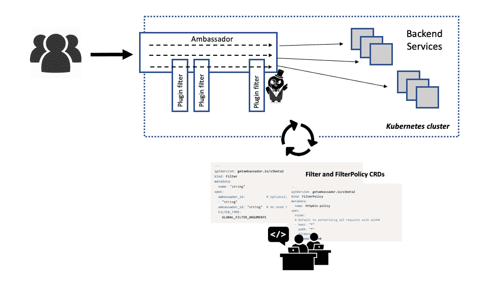

# 使用 Ambassador 动态修改 Kubernetes 入口流量:添加元数据、转换有效负载等

> 原文：<https://itnext.io/modifying-kubernetes-ingress-traffic-dynamically-with-ambassador-add-metadata-transform-payloads-1626ee1cf6b?source=collection_archive---------7----------------------->

三月初，我们[宣布为 Ambassador Pro API 网关推出](https://blog.getambassador.io/announcing-ambassador-pro-0-2-filters-and-filter-policies-979fbea39d7c)请求[过滤器和过滤策略](https://www.getambassador.io/reference/filter-reference/)，我们已经看到了这一领域许多有趣的发展。许多 Ambassador 用户希望在最终用户的请求到达后端服务之前对其进行处理，而过滤器提供了一个完美的框架来实现这一点。

例如，您是否希望向基于客户 ID 标题、cookie 或 JWT 的请求添加额外的客户元数据？是否要删除可能意外添加到请求中的不适当或敏感的数据？还是希望对请求有效负载执行简单的转换？解决方案可能是实现一个插件过滤器。



**大使过滤器正在运行，通过过滤器和过滤器策略 CRDs 进行配置**

# 实现入口横切关注点

任何从事企业 Java 或。NET 应用程序将熟悉 HTTP 过滤器的概念，许多其他语言和框架的开发人员也是如此。过滤器是一个很好的抽象点，用于实现跨领域的关注点，如身份验证/授权、操作请求数据以及向传入的 HTTP 请求添加元数据，然后在堆栈中进一步使用。它们还可以包含条件逻辑，以便只触发特定的请求或模式，并且它们可以链接在一起，形成任意复杂的功能管道。

Ambassador Pro 为过滤器提供了 Kubernetes 自定义资源定义(CRD ),用于初始化和配置要使用的过滤器，还提供了过滤器策略，用于指定应该过滤哪些请求以及应用过滤器的顺序。目前 Ambassador Pro 支持实现四种类型的过滤器:[外部](https://www.getambassador.io/reference/filter-reference/#filter-type-external)、 [JWT](https://www.getambassador.io/reference/filter-reference/#filter-type-jwt) 、 [OAuth2](https://www.getambassador.io/reference/filter-reference/#filter-type-oauth2) 和[插件](https://www.getambassador.io/reference/filter-reference/#filter-type-plugin)。前三个主要与实现身份验证和授权有关，但第四个为实现定制逻辑提供了很大的灵活性。

通过包含 SDK 和用于快速开发的[本地插件运行器](https://www.getambassador.io/docs/guides/filter-dev-guide/#rapid-development-of-a-custom-filter)，为 Ambassador Pro 创建过滤器变得更加容易。运行过滤器时还提供了一些有用的现成功能，例如自动注入跟踪头以帮助调试，以及通过使用 FilterPolicy CRD 简化运行时声明性配置和定制。

# 过滤器和过滤器策略

插件过滤器是用 Go 编写的，它们必须有一个签名为`PluginMain(w http.ResponseWriter, r *http.Request)`的`main.PluginMain`函数。例如，一个简单插件的摘录如下所示:

```
package mainimport (
 "net/http"
)func PluginMain(w http.ResponseWriter, r *http.Request) { 
    ...
    w.Header().Set(“customer-details”, customer)
    w.WriteHeader(http.StatusOK).
}
```

关于插件过滤器的编译、打包和部署的完整说明包含在 Ambassador Pro " [开发过滤器](https://www.getambassador.io/docs/guides/filter-dev-guide/)"文档中。

一旦您在 Ambassador 旁边部署了过滤器，您就可以将过滤器定义为 Kubernetes 资源:

```
---
apiVersion: getambassador.io/v1beta2
kind: Filter
metadata:
  name: "customer-metadata-inject"
spec:
  ambassador_id: "x457"
  Plugin:
    name: "customer-metadata-inject" # Plugin's `.so` file name
```

您还可以定义 FilterPolicy 资源，根据主机和路径来指定应该将哪些请求发送到您的筛选器。

```
---
apiVersion: getambassador.io/v1beta2
kind: FilterPolicy
metadata:
  name: customer-metadata-inject-policy
spec:
  rules:
  # Default to authorizing all requests with auth0
  - host: "*"
    path: "*"
    filters:
    - name: auth0
  # Inject customer metadata for /user/ path 
  - host: "*"
    path: /user/*
    filters:   
    - name: auth0
    - name: customer-metadata-inject
  # Don't run any filters for the /logout/ path
  - host: "*"
    path: /logout/*
    filters: null
```

就这么简单。实现过滤器的唯一限制是您的想象力——注意不要将高度耦合的业务逻辑合并到过滤器中，这可能会成为一个维护问题！

# 开始使用过滤器

如果你还没有下载 [Ambassador Pro](https://www.getambassador.io/pro/) ，你可以通过该项目的网站开始一个[14 天的免费试用](https://www.getambassador.io/pro/free-trial)。一旦您将 Ambassador Pro 安装到您的 Kubernetes 集群中，下一个最好的参考资源是[过滤器参考](https://www.getambassador.io/reference/filter-reference/)文档和[过滤器开发指南](https://www.getambassador.io/docs/guides/filter-dev-guide/)文档。

像往常一样，你也可以通过 Twitter([@ getambassadorio](https://twitter.com/getambassadorio))、 [Slack](https://d6e.co/slack) 提出任何问题，或者通过 [GitHub](https://github.com/datawire/ambassador) 提出问题。

*本文此前发表于* [*getambassador.io 博客*](https://blog.getambassador.io/pre-processing-augmenting-and-transforming-user-ingress-requests-using-filters-in-ambassador-pro-1c2438a36058) *。*