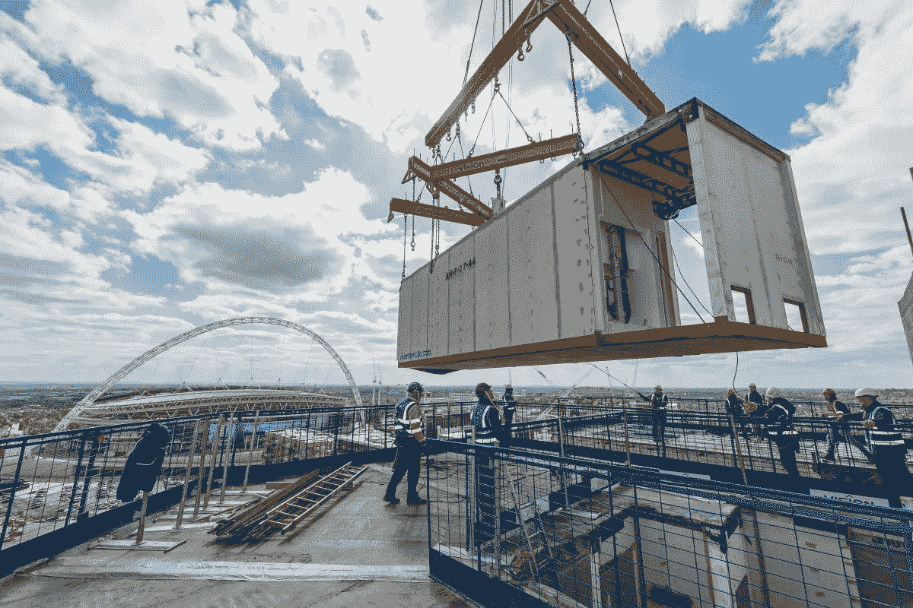

# 挂载一个 Kubernetes Worker 的根文件系统作为容器卷——为了乐趣和财富！

> 原文：<https://itnext.io/mount-a-kubernetes-workers-root-filesystem-as-a-container-volume-for-fun-and-fortune-53ae492698db?source=collection_archive---------2----------------------->

带一个支持容器来分析你的 Kube 工人

> *本文描述了如何在 pod 容器中挂载和分析所选 kube worker 的根文件系统(* `*/*` *)。该方法展示了一种在工作主机上获取 shell 以进行分析和维护的替代方法，例如，当 kubelet 报告 DiskPressure 时释放磁盘空间。*
> 
> ***警告*** *该方法要求您是 kubernetes 集群的集群管理员。这需要* `*cluster-admin*` *的特权。这应该只能从运行在* `*kube-system*` *命名空间中的特权 pod 中进行。如果在除了* `*kube-system*` *之外的任何其他名称空间中有任何其他 creds，您可能需要在您的集群上设置*[*PodSecurityPolicies*](https://kubernetes.io/docs/concepts/policy/pod-security-policy/)*。*
> 
> ***免责声明*** *本文不是针对你与 Kubernetes 的情况的具体建议。有可能对 kubernetes 工人造成伤害。永远要考虑上下文。*

# 1.使用标签识别并锁定 Kube 工人

首先，找到一个标签来称呼特定的 kubernetes 工作人员:

$ kubectl 获取节点—显示标签

对于每个节点来说,`kubernetes.io/hostname`标签是唯一的。让我们试试:

# 2.创建支持窗格

接下来，创建一个用于 worker analysis 的 pod，它只需休眠一个小时，我们就可以进入并交互浏览主机文件系统。这是完整的 Pod 清单(`analyse-worker-fs.yml`):

> *这里我们创建一个* `*hostPath*` *卷，它捕获了 worker 的整个根文件系统(* `*/*` *)，并将其挂载到 busybox 容器的挂载点* `*/host*` *。为此，您的 kube 凭据必须有权在 worker FS 的根目录下创建 hostPath 卷。*
> 
> *我们通过在 pod 规范中使用* `*nodeSelector*` *来确保它在我们的目标 Kube Worker (* `*kubernetes.io/hostname=ip-10-1-79-78.cryptocracy.org*` *)上得到调度。*

创建 pod:

如果 pod 已经存在，请删除它并创建一个新的。

# 3.启动交互式外壳

启动交互式外壳:

现在您是 root 用户，可以访问安装在`/host`的完整 worker root 文件系统！

# 4.分析工作主机根文件系统

您可以分析主机根文件系统上的大问题

一些最大的家政机会可能会在`/host/var/cache`和`/host/var/crash`找到。

# 拒绝许可？需要更多功能？

例如，您想要更改主机内核参数:

或者，您想要访问主机设备？

要为您的维护任务授予细粒度的内核功能，请使用:

对于可能的能力常数，请参考 Linux 内核源代码中的 [capability.h](https://github.com/torvalds/linux/blob/master/include/uapi/linux/capability.h) 。

> *注意 podSpec 中省略了* `*CAP*` *前缀。详见* [*kube 文档*](https://kubernetes.io/docs/tasks/configure-pod-container/security-context/#set-capabilities-for-a-container) *。*

或者，使用特权容器:

[*https://github.com/doughgle*](https://github.com/doughgle)

[1]通过 Kubelet 攻击 Kubernetes—https://labs . mwrinfosecurity . com/blog/attack-Kubernetes-through-kube let/