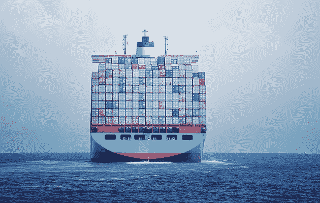

# 库伯内特快车谋杀案:码头集装箱的生与死

> 原文：<https://itnext.io/murder-on-the-kubernetes-express-the-life-and-death-of-a-docker-container-d7aec13f8188?source=collection_archive---------3----------------------->

每天，数以百万计的码头集装箱被旋转起来，用于他们的资源，然后一旦它们达到目的，不再有用，就被杀死。

这是一种残酷的存在，但对作为开发人员的你我来说却是极其有益的。

你看，在过去的几年里，容器极大地改变了软件公司构建、发布和维护他们的应用程序的方式。

这是因为容器允许我们打包一个应用程序的代码和它的所有依赖项，这样它就可以在任何计算环境下平稳快速地运行。

不仅如此，容器还非常适合持续集成/持续部署(CI/CD)方法——允许您尽快向客户提供新的特性、增强功能或错误修复，这反过来又会推动您交付的软件的增长和改进。

这些只是工作流程的好处。

还记得我之前跟你说过的集装箱的“诞生和谋杀”吗？这个循环被称为**水平扩展** —这是当您的应用程序看到的流量超过您当前的资源所能处理的流量时，增加额外容器的结果……然后在流量减少时终止这些容器。

当您大规模运营时，整个部署自动化流程变得至关重要。

现在，你可能会想，“哇！听起来工作量很大！”…

你是对的。但是有个好消息。容器编排系统为您完成所有繁重的工作。

虽然你可以选择一个容器编排系统——Docker Swarm、Apache Mesos——但市场上没有一个系统能像 Kubernetes 那样受欢迎。

而且理由很充分。

Kubernetes 是一个开源工具，允许您利用内部、混合或公共云基础架构，让您可以自由地将工作负载迁移到任何地方。它提供安全、网络和存储服务，并且可以同时管理多个集群。

此外，它自动化了许多您过去必须手动执行的流程。例如:

*   控制哪个服务器将托管您的容器
*   允许您轻松快速地扩展您的资源
*   在应用程序出现问题时自动回滚
*   计算集装箱的“最佳位置”,以优化集装箱平衡
*   实时扩展资源和应用

很酷，对吧！？

最终，Kubernetes 可以更有效地利用硬件，让您最大限度地利用资源并节省资金。

但是事情变得棘手了。

你看，当你使用像 Kubernetes 这样的容器编排工具时，你在一个 YAML 文件中描述你的应用程序的配置。

这个配置文件告诉 Kubernetes 如何收集容器映像，如何在容器之间建立网络，如何挂载存储卷，以及在哪里存储该容器的日志。

容器通常以复制组的形式部署到主机上。当需要将新容器部署到集群中时，Kubernetes 会安排部署，并根据您选择的预定义约束(如 CPU 或内存可用性)寻找最合适的主机来放置容器。

基本上，一旦容器在主机上运行，Kubernetes 就会根据您在容器的 Dockerfile 中列出的规范来管理它的生命周期。

这意味着 Kubernetes 正在为您自动完成所有这些任务…但它是基于您作为开发人员设置的配置来完成的。

虽然您可能是一名优秀的工程师，但您可能不知道在部署的第一个月内您将获得多少流量，或者您的应用程序将如何运行。

这就是为什么，特别是在最初的几个月里，监控 Kubernetes 集群是非常重要的。

现在，有一些非常好的开源监控工具可以用在你的桌面上。

例如，Prometheus 包含一种强大而灵活的查询语言 PromQL，它允许您抓取 Kubernetes 集群，并在时间序列数据库中记录有洞察力的实时指标。

当您将 Prometheus 与 Grafana(一种数据可视化工具)结合使用时，结果是在易于推理的图表中漂亮地显示指标。

Prometheus 和 Grafana 一起为您的 Kubernetes 集群提供强大的数据可视化和监控功能。

但是这些工具只能在桌面上使用。

这意味着在第一个月左右的时间里，当您仍在微调并了解您的集群将如何运行或您的应用程序看到多少流量时，您会被束缚在办公桌前。

事实上，直到最近，还没有任何出色的移动解决方案可以让您在旅途中获取集群的指标。

幸运的是，如果你在 Kubernetes 集群上运行 Prometheus/Grafana 监控堆栈，现在有一个名为 [**Aetos**](https://github.com/project-aetos/Aetos) 的移动应用程序，允许你直接从手机上关注 Kubernetes 集群的健康&性能。

这在你创业的第一个月左右非常有用，尤其是如果你不想一直呆在办公桌前。

而且应用程序真的很好用。只需将您的 Grafana URL 以及 Grafana API 密钥放入应用程序，Aetos 就会以易读的图表形式为您提供实时数据。

目前，该应用程序在一个一体化的可滚动视图中提供 CPU 使用率、内存使用率、网络饱和度和系统饱和度的指标。

结果显示在几个不同的图表中，让您可以快速了解性能，只需用拇指轻轻一划，就可以在它们之间切换。

此外，它基于开源堆栈构建，因此无需担心定价问题。

不用说，它有它的好处。

但是不管你如何监控你的集群，如果你有一个还没有容器化的遗留代码库，你可能要开始考虑让它发生。

毕竟，集装箱化是未来的发展方向。

此外，当涉及到销毁已经达到其生命周期终点的容器时，我想你会发现让 Kubernetes 为你做这些脏活要比盯着他们的脸自己扣动扳机容易得多。

…除非你喜欢那种东西(你这个无情的怪物)。

投稿作者:

罗伯特·麦克哈尔菲 | [杰伊·科根](https://github.com/JayCogen44) | [特里斯坦·舍恩菲尔德](https://github.com/trischoe) | [肯·布里斯科](https://github.com/Kenneth-Brisco)