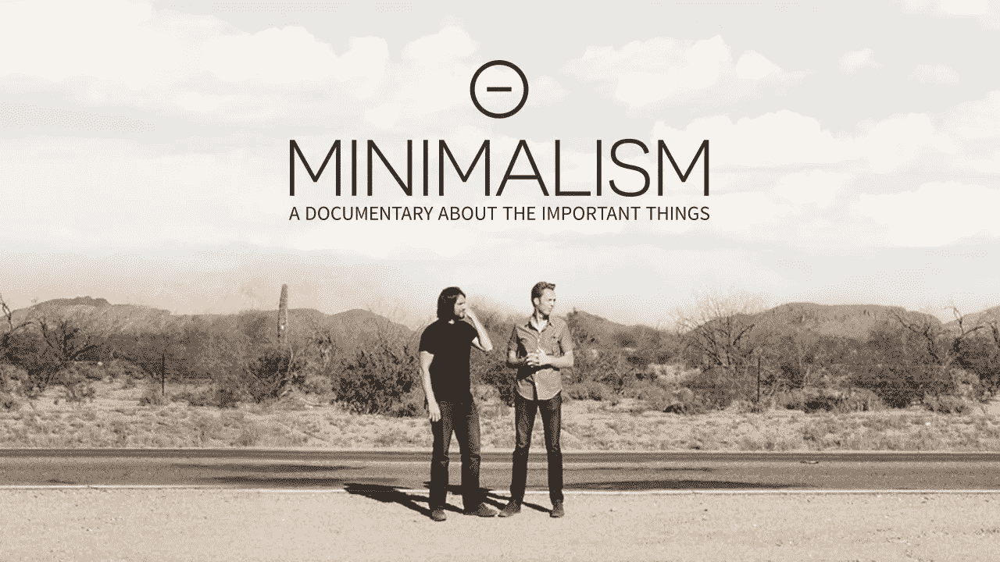

# 我对软件工程的极简方法

> 原文：<https://itnext.io/my-minimalist-approach-to-software-engineering-5bc743ecb295?source=collection_archive---------6----------------------->

“想象一种更少的生活。充满激情的生活，不受你周围混乱世界的束缚。好吧，你所想象的是一种有意的生活。这不是完美的生活。生活并不轻松。但这很简单。”极简主义中的约书亚·菲尔兹·米尔伯恩

我最近看了很多关于极简主义以及它如何改善我们生活的内容。由于我对它的真正着迷，我一直在尝试看看我是否能把极简主义应用到我生活中的每一件大事和小事上。

作为一名软件工程师，其中一件“事情”就是软件工程和开发。

# 什么是极简主义？

极简主义的定义和标准可能因人而异。有些人可能会说，极简主义指的是尽可能多地扔掉一些东西。其他人可能会说，极简主义指的是只扔掉你讨厌的东西。归根结底，你将极简主义应用到生活中的方式取决于你自己；做极简主义没有对错之分，因为它们只是一系列改善你生活的想法。

对我来说，极简主义很简单:摆脱对我没用的东西，专注于帮助我获得快乐的东西。虽然我意识到这个定义非常松散，但还是让我们深入了解一下我关于放下“某些东西”的标准:

*   那个“东西”给我带来效用了吗(比如快乐、幸福和/或平静)？
*   **我经常用那个“东西”吗？如果我做了，这可能是我生活中必不可少的。**
*   **我为什么会有那个“东西”？**如果我能清楚地回答这个问题(而不是仅仅说“哦，是的，因为乔治也有这个问题”，那么我可能有一个很好的理由去拥有它。

极简主义对采纳它的人有很多好处。马特·达维拉的纪录片《极简主义:一部关于重要事物的纪录片》特别讨论了这一点。

“想象一个少用的人生。更少的东西，更少的混乱，更少的压力，债务和不满。较少干扰的生活。现在想象一个拥有更多的生活。更多时间。更有意义的关系。更多的成长，贡献和满足。”—瑞安·尼科德穆斯的极简主义

想象一下上面，但是在软件工程和开发中。

# 是时候停下来了。

我最近看到一个(有点像爸爸的)笑话，描述了一个在科技行业日益普遍的现象:

你如何写一句“你好，世界！" Node.js 中的程序？"

" npm 类型安装 hello-world "

每天，科技领域都在变得越来越充斥着我们不需要的东西。新的包和组件不断被添加到包管理器和代码库中；有些有用，但大多数没用。每个人都想启动下一个 React.js，并在技术领域掀起风暴，这样做的门槛并不高(尽管让它成功是另一回事)。

我见过有人带来一个库只是为了做简单的过滤。例如，考虑下面的代码块:

这可能很简单:

我知道，当你想确保与所有语言运行时版本的最大兼容性时，引入一个库可能是有用的(据我所知，过滤只是在 ES5 中引入的)。然而，在这种情况下，如果您在 Node 10 环境中实现这段代码，您可以只使用。filter()函数，而不是引入外部依赖。

“啊，这只是一个小图书馆！有什么坏处？”

问题是，这种思维过程是一个非常危险的过程。通过继续这个思考过程，我们可能会开始自由地引入库来实现相对琐碎的功能。

起初，引入库似乎无害，但是它也带来了一些风险，例如:

*   杂乱——库可能会相互重叠，并且可能有多种做事方式。哪种方法是正确的可能变得不清楚。
*   遵从他人的意见——所有的图书馆都有自己的一套规则，不管它看起来有多不情愿。例如，您可能需要修改数据，以便新引入的库可以接受它——可能它只接受数字而不接受小数。
*   更多的精神负担——如果该库有一个漏洞，您必须更新以进行修补，该怎么办？我要更新多少个包/库？我应该更新哪些库，如何确保它不会破坏其他所有的库？新补丁有没有什么贬低的改动？

我不是说“不要带图书馆。”我是说“请注意你在应用程序中引入和使用的东西。”很多时候，人们引入库或使用框架是基于“其他人都在使用它”的事实。

# 有目的地发展

我们引入代码库的任何一行代码都应该有以下问题的答案:

“为什么？”

上述问题没有正确或错误的答案；重要的是要注意我们作为软件工程师交付了什么，以及我们为什么交付它们。这就是为什么 Scrum 中的“用户故事”有三个组成部分:用户、动作和对用户的好处；把这三个放在一起就形成了你的用户故事的“为什么”。

同样重要的是，要考虑到我们放入的每一个代码都会增加一切崩溃的风险。不一定是电脑的错；只是我们的大脑空间有限，所以更大的代码库会让我们更难持续开发和维护。

这不仅限于代码；我们还需要为我们做出的每个架构决策考虑这个问题。

并非所有的系统都将达到脸书或谷歌搜索的规模。并不是所有的系统都需要“微服务”或者“AI/ML”的概念。在某些情况下，一张 Excel 表就足以满足业务需求。在其他情况下，具有简单形式的整体应用程序对用户来说已经足够好了，这是我最近在我当前的副业项目中了解到的。

“但是正常运行时间！可扩展性！可靠性！”

我的问题是:你真的需要你的花哨的框架/技术来实现它们，这样对你的客户就足够了吗？

# 过度工程的故事

我的客户拥有一家矿业公司，有几个现场位置。由于公司的规模，他发现很难跟踪公司资产(如卡车、拖拉机等)的维护工作。).他让我想出一个可能的解决方案来解决这个问题；他的愿景是拥有“一个软件”来跟踪所有这些维护活动。

我马上想到了一个解决方案:我可以在无服务器架构上构建应用的后端，我可以在 React.js 上开发应用的前端，并将它们部署到 AWS！

谢天谢地，我的合伙人(他正在帮我做商业分析工作)把我带回了现实。“我们不要在这里太兴奋。让我们先做一个原型，看看我们需要什么数据和功能，”她说。

不到一天，我们就打开了一个谷歌表单，上面填写了获取客户所需数据所需的所有字段(据我们当时所知)。第二天，我的合伙人向我们的客户展示了谷歌表单，你猜怎么着:

他很喜欢。他说，“这正是我需要的！”

事实证明，当我们的客户说他想要一个应用程序时，他实际上并不需要从头开始创建一个成熟的应用程序。他想要一个应用程序，因为这是他对如何解决他的实际问题的最佳猜测:“我如何跟踪我所有资产的所有维护工作？”

# 结论——找出原因的重要性

作为软件工程师，我们被雇佣不是因为我们能制作软件。我们受雇来解决问题，而企业已经做出决定，这些问题可以使用我们的技能(即工程软件)来解决。

软件工程是达到目的的一种手段。它不是解决所有问题的方法。如果你不能解决你的客户所面临的任何问题，制作一个搜索引擎或图书馆不会让你变得富有和/或受欢迎。

通过检查为什么，我们可以开始弄清楚如何应用我们的技能来为我们的客户提供更好的体验和解决方案。