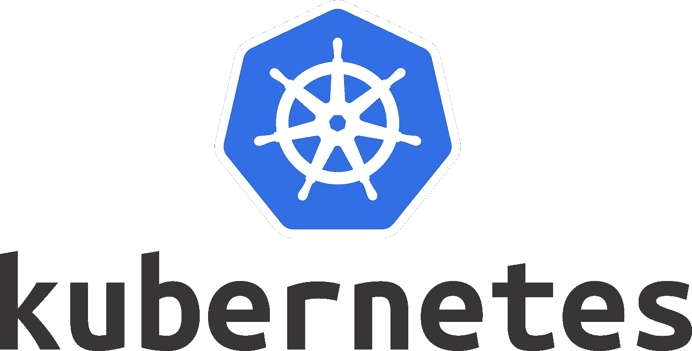

# Kubernetes 中的网络策略

> 原文：<https://itnext.io/network-policies-in-kubernetes-c983c1b5eee9?source=collection_archive---------2----------------------->

我们使用 [terraform](https://www.terraform.io/) 和 [terragrunt](https://terragrunt.gruntwork.io/) 将我们的整个基础设施定义为代码，作为我们 [Azure](https://azure.microsoft.com/) 迁移的一部分。这包括 Azure Kubernetes 服务和所有的资源。我在以前的一篇帖子中提到，我们使用 Linkerd 的 [mTLS 成功设置了 pod 到 pod 的通信加密，但我们希望确保在名称空间中的不同 pod 之间有一个额外的通信权限层，它只允许 pod 之间通过允许的协议和端口进行通信，同时限制其他一切。进入](https://linkerd.io/2.11/features/automatic-mtls/) [Kubernetes 网络策略](https://kubernetes.io/docs/concepts/services-networking/network-policies/)，它允许更多的自定义控制来允许/限制 CIDR 块、名称空间和协议相互通信。



Kubernetes 网络策略使用 Linux [*IP 表*](https://linux.die.net/man/8/iptables) 来执行策略，该策略被翻译成允许/不允许规则集的[形式，然后被应用为 *IP 表*过滤规则。网络策略](https://docs.microsoft.com/en-us/azure/aks/use-network-policies#network-policy-options-in-aks)的[先决条件是拥有一个网络插件，在 Kubernetes 行话中被称为 CNI 或](https://kubernetes.io/docs/concepts/services-networking/network-policies/#prerequisites)[集群网络接口](https://kubernetes.io/docs/concepts/cluster-administration/networking/)，它作为控制器来执行这些规则。有很多选择，在 Azure 上，Azure CNI 是我们的自然选择。

[](https://docs.microsoft.com/en-us/azure/virtual-network/container-networking-overview) [## 使用 Azure 虚拟网络的容器网络

### 通过利用相同的软件定义的网络堆栈，将丰富的 Azure 网络功能集引入容器…

docs.microsoft.com](https://docs.microsoft.com/en-us/azure/virtual-network/container-networking-overview) 

我们希望将通信限制在名称空间级别，而不是 pod 级别。网络策略主页上有一个很好的例子，描述了网络策略资源的不同组件。之后，我不得不坐下来思考一个更好的方法来把这些信息转化成我的方式。我们这边的要求基本上是限制入站流量，允许所有出站流量，并且只允许来自某些 IP 地址的流量。我们还希望允许来自基础应用程序名称空间的流量，例如 Linkerd、 [cert-manager](https://cert-manager.io/) 等。，以便各个名称空间中的 pod 可以利用不同的服务，同时保持应用程序之间的隔离。

[](https://cert-manager.io/) [## 证书管理器

### 2022 证书管理器作者。2022 Linux 基金会。保留所有权利。Linux 基金会已经注册了…

cert-manager.io](https://cert-manager.io/) 

网络策略的地形代码如下:

我不得不说，我花了一些时间来表达 from 块，但是当它工作的时候是非常值得的。

而其各自的 terragrunt 配置为:

这一切看起来都很棒，是时候对它进行测试了！为此，我使用了两种不同的服务；一个 [nginx](https://www.nginx.com/) 容器，部署在默认名称空间中，作为一个简单的 http 服务器，一个 [busy box](https://busybox.net/) 容器作为一个控制模块，我将在不同的名称空间中运行。想法是将网络策略应用到默认的名称空间，并从不同的名称空间访问运行在该名称空间中的 nginx 容器。

接下来的事情是启动我的 [iTerm](https://iterm2.com/) 终端的另一个面板，并开始测试过程。

```
<!DOCTYPE html>
<html>
<head>
<title>Welcome to nginx!</title>
[...]
```

有趣的是，我访问了 nginx 容器，这很奇怪，因为根据网络策略配置，它不应该让请求通过。我通过 linkerd 名称空间进行了尝试，并且成功了(这并不奇怪，因为这是允许的)。我意识到我可能搞砸了一些事情，于是跑回文档。我可以断定一切都按照预期的方式进行了配置，但是为什么网络策略不能工作并过滤来自测试名称空间的请求。

我又开始看配置，我在设置匹配表情的部分引起了我的注意。我开始[更深入地阅读](https://kubernetes.io/docs/concepts/services-networking/network-policies/#behavior-of-to-and-from-selectors)关于【matchExpression 和 matchLabel 如何工作。我发现我是在以正确的方式使用它，但是还有一些事情是不正确的…

```
ingress_from_namespace_selector_match_expressions = [{
  "key" : "name",
  "operator" : "In"
  "value" : ["cert-manager", "linkerd"]
}]
```

我做的另一件事是描述默认的名称空间，并分析它的标签和注释，以确保万无一失。那里有一件特别的东西引起了我的注意。我意识到标签中名称空间的名称与我传递的完全不同…

```
kubectl describe ns default
Name:         default
Labels:       kubernetes.io/metadata.name=default
Annotations:  <none>
Status:       Active
```

只是为了它，我更新了匹配表达式配置中的名称，以具有完整的 Kubernetes 标签名称…

```
ingress_from_namespace_selector_match_expressions = [{
  "key" : "kubernetes.io/metadata.name",
  "operator" : "In"
  "value" : ["cert-manager", "linkerd"]
}]
```

…通过`terragrunt apply`应用更改，从测试名称空间返回并执行繁忙框中的命令，并 ping nginx 容器，瞧！请求被过滤了！

```
kubectl run --rm -it busybox --image=busybox:stable --namespace test # send a request to the nginx container running in the default namespace
wget -O- --timeout=2 --tries=1 [http://backend.default](http://backend.default) wget: download timed out
```

这是一个相当令人讨厌的发现，当然，我已经忽略了当事情不像预期的那样工作时，很自然会出现的揪头发和诅咒宇宙的步骤。然而，令人悲伤的是，将`namespaceSelector`中的`matchExpression`的键设置为与标签完全相同是非常矛盾的[IMHO。](https://www.merriam-webster.com/dictionary/oxymoron)