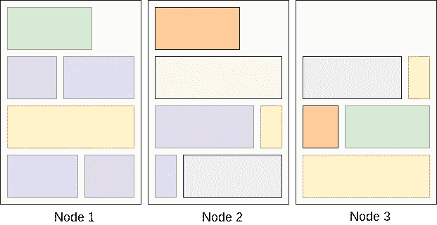
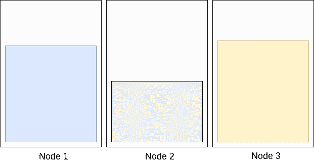

# 面向准备成长的初创公司的新一代开发运维服务

> 原文：<https://itnext.io/next-gen-devops-for-a-startup-that-is-ready-to-grow-4f26f2877b6e?source=collection_archive---------2----------------------->

对于那些与最先进的云技术并驾齐驱的人来说，如今扩展并不构成大的挑战。除非我们谈论的是像网飞这样的大规模世界级服务，否则利用现代云原生工具，现在可以相当容易地部署可以覆盖成千上万人的应用程序，同时避免像 Heroku 这样昂贵的 PaaS 服务。尽管如此，仍有许多公司被困在过去，无法前进，因为在这个充满技术炒作的世界里缺乏指导。尝试新事物代表着一种风险，并非每家公司都愿意承担这种风险，主要是因为这样做需要利用科技行业最稀缺的资源:人。

随着对优秀技术人才的需求持续增长，寻找优秀技术人才变得越来越困难，正因为如此，公司被迫采用(或继续使用)广为人知且通常较老的技术，如 Java 或 C#。当涉及到构建产品时，除了哪个工具最适合工作之外，还有许多因素要考虑，除非你打算花大量的钱雇佣市场上最好的专业人员，否则最好保持简单。然而，**通过使用像 Kubernetes 和 Prometheus 这样的云原生技术**(这两个都是在[云原生计算基金会](https://www.cncf.io/)主持的唯一毕业项目)，你可以获得巨大的好处，尽管市场对小企业家很无情，但我打算展示一个 DevOps 专业人员如何能够**极大地提高你的团队的灵活性并降低你的运营成本**。

我通常感觉到的一个问题是，由于公司使用的是有点旧的技术，他们认为设计应用程序的新方法不能应用到他们自己的应用程序中。老式的单一应用程序仍然是许多公司事实上的标准，而像微服务和十二因素应用程序这样的概念正在被搁置。发生这种情况的一个可能原因是，当我们谈论部署微服务时，许多人**不知道从哪里开始**。其实这并不意外。正如我们所知，在过去几年中，传统基础架构上增加了许多新层，增加了新来者的学习曲线。曾经是一堆裸机为一个应用服务，几个负载平衡器面对流量，现在是一组复杂的组件在一个动态配置的基础架构上协同工作。虽然微服务的概念相当简单，但很难想象它在实践中是如何工作的。在本文中，我打算简要说明我如何将 DevOps 文化和云原生技术带到一家预计未来几年将有大量增长的公司，并帮助他们为未来做好准备。

# 最大限度地利用基础设施

不管你使用哪家云提供商，它都会很贵。这是因为**他们不仅仅提供基础设施，还提供高可用性和值得购买的抽象层次。**那时，当我们不得不管理我们自己的裸机时，我们不得不处理各种问题，从错误配置的路由器和损坏的磁盘到我们不得不准备应对的硬件故障。目前 AWS 提供弹性块存储(EBS ),年故障率最高为 0.2%(包括部分故障)。虽然成本很高，但它为您提供了可靠性，否则您将不得不支付一个专门的团队来获得，同时还有许多冗余的硬件。

也就是说，理解为什么 AWS 会在它的很多产品前面加上“弹性”关键词是很重要的。由于您可以根据自己的需要扩展弹性块存储(EBS ),因此可以理解它为什么有这个名称，但是如果弹性计算云(EC2)实例在启动后不能修改，它为什么被称为弹性的呢？嗯，这是因为 **EC2 实例预期寿命很短**，在需要时被实例化，在不再需要时终止，最好是在运行时大量使用。不应该像对待任何其他租用的服务器一样对待 EC2 实例，因为与租用的服务器相比，启动 EC2 实例没有任何成本，也没有长期的义务。事实证明，如果您总是使用 EC2 实例的全部容量，**它们最终不会那么昂贵！**

那么，如何以最大限度地利用分配给你的 EC2 资源的方式来设计你的应用呢？进入 Kubernetes，DC/OS 和 Hadoop YARN。它们都以自己的方式使您能够做到这一点，它们中的每一个对于许多应用程序都是有用的。例如，Kubernetes 可以配置为在高负载下自动提供 EC2 实例，并在之后关闭它们。**您的整个基础设施成为一个巨大的资源池**,可以通过扩展可用 EC2 实例的数量来扩展或收缩，而 Kubernetes 则在这些节点中编排您的容器化应用。您所要担心的就是构建您的应用程序，以便它可以充分利用这些平台。**用哪种编程语言构建你的应用程序并不重要**。

现在，您应该开始更好地理解为什么微服务架构与像 Kubernetes 这样的容器编排工具配合得如此好了。当调度一个 pod 时，Kubernetes 总是试图将它放入一个具有运行该 pod 所需的可用资源的节点中。如果您有多个微服务，您最终会将它们分布在如下所示的节点中:

当构建大型整体应用程序时，Kubernetes 将无法找到具有足够资源的节点来满足您的应用程序，最终将创建更多 EC2 实例来分配您的应用程序所需的大量 RAM(或 CPU)。这样，您的集群使用情况可能会如下所示:

最终使用微服务架构设计您的应用程序允许您充分利用像 Kubernetes 这样的容器编排工具，从而降低您的基础设施成本。此外，正如您应该在接下来的主题中看到的，Kubernetes 是一个非常有价值的工具，可以用来建立连续交付管道和监控/记录分布式应用程序。

*(Obs。:如果你觉得不能把你的应用拆分成微服务，不要慌！其他集群范围的工具，如 DC/操作系统，与它们配合得非常好。)*

# 轻松实现连续交付

向一个 Java 开发团队介绍 Kubernetes 并不是一件简单的事情，对于这个团队来说，微服务架构仍然是一个谜。不仅 Kubernetes 有许多大多数开发人员从未接触过的新概念，而且出于安全原因，必须避免直接访问集群。那么，如何在不增加应用程序部署复杂性的情况下，用 Kubernetes 增强团队的能力呢？最简单的答案是:通过设置**自动连续输送管道。**

现在有很多持续交付工具，您将选择哪一个在很大程度上取决于您的需求。例如，如果您使用许多不同的技术，并且您需要它非常灵活，那么您最好使用像 Jenkins 这样由更大的开源社区支持的工具。因为我们的团队没有这些需求，所以我更喜欢选择我认为是，而不是 Jenkins，一个非常简单和直观的工具: [GoCD](https://www.gocd.org/) 。

对于不了解 GoCD 的人来说，它是由 ThoughtWorks 开发的免费开源的持续交付工具。它取代了 Cruise Control——一个十年前的 CI/CD 软件，也是由 TW 开发的，比 Jenkins 早。所以对于那些认为 GoCD 不是一个成熟工具的人来说，你应该知道它提供了一个对抗 Jenkins 的好对手。

那么，**如何设置 GoCD 向 Kubernetes 交付应用程序呢？**嗯，其实你没有。 [Helm](https://helm.sh/) 负责发布和升级 Kubernetes 中的应用程序。它允许您构建所谓的图表，描述在集群中运行应用程序所需的 Kubernetes 资源。GoCD 的工作是构建应用程序及其 docker 映像，并将其上传到 AWS Elastic Container Registry(如果您问我，这是一个糟糕的名称，因为它不存储容器，而是存储映像)。之后，GoCD 使用 Helm 来升级 Kubernetes 中的应用程序版本，使用新的映像和参数。管道看起来就像这样简单:

这里最复杂的部分是让开发者理解如何构建舵图，因为这需要一些关于 Kubernetes 的基础知识。为了解决这个问题，我构建了两个示例图表，可用于部署具有外部访问、基本身份验证和持久卷的通用应用程序。很快，所有的开发人员都开发了自己的图表，并在 Kubernetes 上部署了一些东西。漂亮！

# 监控和记录

在将一个应用程序部署到 Kubernetes 之后，人们可能会怀疑是否一切都正常工作。为了向开发人员提供这些信息，需要进行两个设置:日志记录和监控。**在这里，你可以看到 Kubernetes 有多神奇！**

为了进行日志记录，我在 Kubernetes 中部署了一个所谓的 DaemonSet——一个在集群中的每台机器上产生一个 pod 的工作负载。这个 pod 特别包含一个 [Fluentd](https://www.fluentd.org/) 数据收集器，它跟踪每个节点上运行的 docker 容器中的所有日志，用日志来自哪个 pod/namespace 等信息丰富它们，并将其提交给 [AWS Elasticsearch 服务](https://aws.amazon.com/pt/elasticsearch-service/)。很容易，**每个开发者都可以在 [Kibana](https://www.elastic.co/products/kibana) 中看到他们应用程序的日志**！

为了监控[，Prometheus](https://prometheus.io/) 与 [Grafana](https://grafana.com/) 一起使用。 **Prometheus 能够从 Kubernetes** 中的所有 pods 中抓取指标，这些 pods 包含某些注释，这些注释指示了指标公开的端点。由于我们所有的应用程序都是 Java，我们将官方的 [JMX 导出器](https://github.com/prometheus/jmx_exporter)附加到我们所有的部署中，并配置 Prometheus 来收集通过 JMX 公开的指标。我们很快开始看到 JVM 指标出现在 Grafana 中！

Kubernetes 的美妙之处在于，您可以批量应用更改或从应用程序中提取信息。这使您能够开发各种插件来实现分布式监控、日志记录、自动扩展、安全保护、路由等等！[云本地计算基金会](https://www.cncf.io/projects/)主持了一系列项目，其中大部分都支持开箱即用的 Kubernetes。如果你在他们孵化和毕业的项目中没有找到你需要的，看看云原生社区周围项目的[整体景观](https://landscape.cncf.io/)。

# 自动缩放及其他

最后，为了充分利用 Kubernetes，我们必须允许它自动伸缩，并且足够完美，Kubernetes 本身已经有一个官方的 [**集群自动缩放器**](https://github.com/kubernetes/autoscaler/tree/master/cluster-autoscaler) 项目。它通过观察每个 pod 所需的资源量与每个节点中的可用资源量来工作，并基于该信息向集群添加或删除节点。显然，这过于简化了这个令人惊叹的工具，因为它实际上有很多功能，如:从云提供商自动发现自动扩展组，根据 pod 扩展正确类型的实例组(例如，一些 pod 可能需要 GPU 实例)，确保 pod 没有任何针对给定实例组的反相似性策略，等等…重点是:如果您正确设置了 Cluster Autoscaler，您将永远不必再担心空闲资源。最后但同样重要的是，自动扩展设置的一个重要层是[水平机架自动缩放器](https://kubernetes.io/docs/tasks/run-application/horizontal-pod-autoscale/)，这是一种根据负载扩展特定部署的机架数量的方法。它与 Cluster Autoscaler 配合使用，为您的集群提供充分的弹性。

有无数的工具可以用来改进 Kubernetes。 [Cert-manager](https://github.com/jetstack/cert-manager/) 可用于自动提供[免费提供的 TLS 证书，让我们加密](https://letsencrypt.org/)；大使可以作为一个 API 网关使用到你的集群，并启用 canary 版本；gRPC 允许你轻松地建立舱间通信——可能性是无限的，最终结果通常是迷人的。**决定采用 DevOps 文化的公司所获得的利益是无价的**，我很自豪能够创造如此多的价值，这要感谢一个愿意为开源生态系统做出贡献的大型社区。