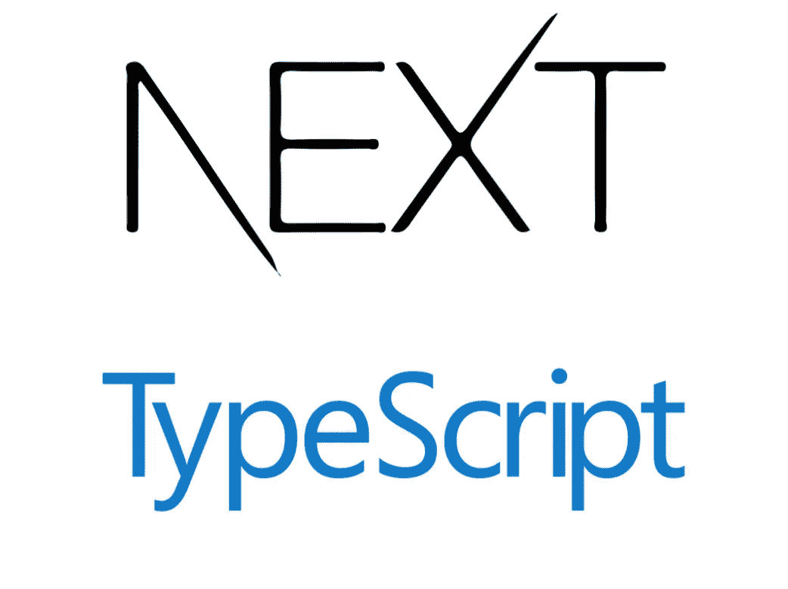

# Next.js 出色的类型脚本集成

> 原文：<https://itnext.io/next-js-awesome-typescript-integration-d05cfe9af057?source=collection_archive---------1----------------------->

很多人喜欢 Next.js，很多人喜欢 Typescript。所以，最终会有一群人想要一起使用它们，你可以猜到，这已经发生了。那么，我们有什么选择呢？默认的是使用官方的 Zeit 的`[next-typescript](https://github.com/zeit/next-plugins/tree/master/packages/next-typescript)`包。它使用了`ts-loader`并且运行良好，但是在 webpack-typescript-loaders 市场上有第二个人物(如果不是一个的话):它是`[awesome-typescript-loader](https://github.com/s-panferov/awesome-typescript-loader)`。使用它的主要原因是它的[性能优化](https://github.com/s-panferov/awesome-typescript-loader#differences-between-ts-loader):与`babel`的集成(这是 Next.js 的完美案例)和在单独的进程中运行类型检查器(你也可以用`[fork-ts-checker-webpack-plugin](https://github.com/Realytics/fork-ts-checker-webpack-plugin)`来做，但是包含电池是一件好事)。请注意，[并不总是比`ts-loader`快](https://github.com/s-panferov/awesome-typescript-loader/issues/497)，所以不要不经过实际测量就盲目切换。但是通常只要正确使用它，编译时间就会大大增加，所以让我们开始尝试将 Next.js 与令人敬畏的 Typescript Loader 集成起来，耶！

> 第一号免责声明:⚠️这仅兼容 Next.js v5️，不兼容 v6，详见[本推理](https://github.com/saitonakamura/next-awesome-typescript/issues/8#issuecomment-394487142)
> 
> 第一号声明:如果你对细节感兴趣，你可以直接使用我的`[next-awesome-typescript](https://github.com/saitonakamura/next-awesome-typescript)` [插件](https://github.com/saitonakamura/next-awesome-typescript)

所以，我们想做的第一件事是使用这个超级棒的 Next.js v5 特性，称为[通用 Webpack](https://zeit.co/blog/next5#universal-webpack-and-next-plugins) ，因为它允许我们以某种方式改变默认的 Next.js webpack 配置。您可以通过在`next.config.js`文件中提供`webpack`函数和其他配置来实现。

如何修改 Next.js 默认 webpack 配置

好了，让我们加上`awesome-typescript-loader`。

如何将 awesome-typescript-loader 添加到 Next.js webpack 配置

请注意带有`defaultLoaders.babel`的那一行，因为它基本上意味着我们首先通过两个加载器`awesome-typescript-loader`，然后通过 Next.js 配置通过`babel-loader`运行我们的文件。为了让`babel`为我们完成大部分的传输工作，我们需要通知`typescript`我们的意图。为此，我们将创建`tsconfig.json`(如果您之前没有)。最小的会是这个样子。

最小 tsconfig.json

就这样，应该能行！但是现在我们的配置在速度方面并不比`next-typescript`好。我们从巴别塔整合开始。为此，我们需要在`awesome-typescript-loader`配置中启用`useBabel`选项，并将 Next.js 默认的 babel 配置传递给`babelOptions`。这里的问题是 Next.js 默认的 babel 配置包含`cacheDirectory`选项，这在 babel 集成的上下文中是不适用的，因为缓存是常见的，所以我们需要省略它。我在这里写了小而简单的`omit` helper，但是你可以自由地使用任何你想要的方法:lodash，ramda，object destructing 等等。

如何添加巴别塔集成

请注意，我们删除了`defaultLoaders.babel`。我们要采取的下一步是启用缓存。

如何添加缓存

最后一种方法是使用`CheckerPlugin`在一个单独的进程中运行 typecheck，以进一步加快编译时间。

如何在单独的进程中运行 typecheck

因此，我们编写了一个相当具有编译性能的 Next.js 类型脚本配置。当然，手动编写 webpack 配置可能很麻烦，但不用担心，我写了一个`[next-awesome-typescript](https://github.com/saitonakamura/next-awesome-typescript)` [插件](https://github.com/saitonakamura/next-awesome-typescript)，它可以完成所有这些，甚至更多！随意放置一颗星星，提出一个问题，留下评论，订阅 t̶o̶̶m̶o̶r̶e̶̶w̶e̶e̶k̶l̶y̶̶s̶c̶i̶e̶n̶c̶e̶̶v̶i̶d̶e̶o̶s，对不起，我的媒体:)