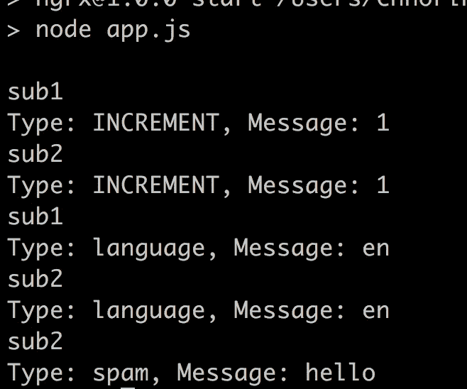

# NGRX —从头开始，第一部分，发布订阅

> 原文：<https://itnext.io/ngrx-from-the-beginning-part-i-a76c3c690ac7?source=collection_archive---------6----------------------->


在 [Twitter](https://twitter.com/chris_noring) 上关注我，很乐意接受您对主题或改进的建议/Chris

> *NGRX 是 Redux 模式的一个实现。Redux 模式本身是一种发布/订阅模式，也称为发布-订阅模式。本质上，这种模式是关于一个关键的事情，当一个变化发生时，它可能是你的应用程序的一个或多个部分的关注点，你需要一种方法来传达这种变化。您还需要一种方法来做到这一点，而无需耦合您的代码*

好吧，那么，让我们从头开始，学习 Pub Sub，Redux，我们需要的类型脚本和一些基本的 RxJS，不要再混淆了，好吗？

本文是系列文章的一部分:

*   NGRX —从开始，第一部分，发布-订阅，**我们在这里**
*   [NGRX —从头开始，第二部分，Redux，核心概念，和不同的实现，Redux](https://medium.com/@noringc/ngrx-from-the-beginning-part-ii-redux-6305b481c55)
*   [NGRX —从头开始，第三部，NGRX store](/ngrx-from-the-beginning-part-iii-ngrx-store-d094ac72e1fa) ，
*   NGRX-从头开始，第四部分，存储最佳实践
*   NGRX —从头开始，第五部分，NGRX 效果，*进行中*
*   NGRX —从头开始，第六部分，NGRX 实体，*进行中*

本文涵盖以下内容:

*   **发布-订阅**，它是什么以及我们为什么需要它
*   **使用消息进行通信**，发布-订阅模式的实现，以及我们如何将其应用于我们正在使用的任何基于组件的库/框架。

正如我们在开始时所说，NGRX 是 Redux 的一个实现，我们真正添加到应用程序中的是发布-订阅功能，当系统发生变化时，它会广播一条消息。好吧，那什么时候发生？想象一下，你已经把你的应用程序设置成某种语言，然后你改变了那种语言，会发生什么呢？嗯，很有可能某个特定的语言集意味着你的应用程序已经将部分或全部应用程序翻译成了那个选定的语言。因此，当引入一种语言时，需要进行一些翻译，问题是应用程序的哪个部分受到了影响？你可能比我更清楚这一点，但让我们尝试引入一些推理。您的应用程序可能会被分成几个组件，以便于维护。如果你的应用由许多页面组成，每个页面有一个组件，你不需要发布订阅。

> *嗯？*

如果你有一个简单的应用程序，比如说有 5 个页面，每个页面有一个组件，那么当你改变到一种新的语言时，你只需要影响你所站的页面。此时，您可能会调用一个服务，用伪代码请求这些新的翻译，如下所示:

```
function onLanguageChange(newLang) {
  service.getTranslationsByLang(newLang); 
}
```

现在你需要想出一种方法，把这些新的翻译应用到你的网站上，就像这样:

```
function onLanguageChange(newLang) { 
  const translations = service.getTranslationsByLang(newLang);
  this.title = translations.title; 
  this.description = translations.description 
}
```

然后当你从这个页面切换到另一个页面时，你需要做一些类似上面的事情，但是要尽可能早，在构造函数或者`ngOnInit`中，像这样:

```
constructor(){ 
  const translations = service.getTranslationsByLang(newLang);
  this.title = translations.title; 
  this.description = translations.description; 
}
```

> *那么我什么时候需要发布/订阅呢？*

一旦你在一个页面上有了很多组件，你做了一个*应用程序范围的*改变，比如一个语言的改变，你需要告诉所有那些组件你需要关心的改变已经发生了。现在，如果你正在使用 Angular，你可以使用它们的`@Input`绑定在那些组件上设置一个属性，但是这很快就变得非常混乱，让我展示给你看:

```
class Component { 
  private _lang = '';   @Input('language') 
  set lang(value) { 
    this._lang = value; 
    const translations = service.getTranslationsByLang(newLang);
    this.title = translations.title; 
    this.description = translations.description; 
  }; 
  get language() { 
    return this._lang; 
  } 
}
```

感觉有点耦合吧，有很多东西要写？

# 用信息交流

在这一点上，伤害是真实的，因为你很可能为 10 个不同的组件编写了上面的代码。你可能想出了一个好办法来省略对`service.getTranslationsByLang`的呼叫，只在一个中心位置这样做，然后我们只发送翻译。

伤害是由什么组成的？啊，现在我们问了正确的问题，伤害不是因为我们需要写 3-4 行代码并给组件上的每个属性分配正确的翻译——伤害是因为我们使用属性在 X 个组件上设置语言。这种交流信息的方式非常复杂，并且非常依赖于我们使用的特定框架。

> 好的，那么有什么更好的方法呢？

更好的方法是用消息交流。用消息交流意味着我们有一个发送者和一个或多个收听者。有很多方法可以做到这一点。以下是一个不完整的列表:

*   使用普通实现
*   使用库 EventEmitter
*   使用 RxJS

让我们不要让这篇文章太长，但让我们实现第一种情况，一个普通的实现。

# 一个普通的实现

在不使用库的实现中，我们需要满足以下条件:

*   我们需要一种传递信息的方式
*   一种订阅、退订消息的方式

好了，让我们来看看一个简单的实现:

```
class PubSub { 
  constructor() { 
    this.listeners = []; 
  } 

  send(messageType, message) { 
    this.listeners.forEach(l => l(messageType, message)); 
  }   subscribe(listener) { 
    this.listeners.push(listener); 
  } unsubscribe(list) { 
    this.listeners = this.listeners.filter( l => l !== list); 
  } 
} module.exports = PubSub;
```

我们上面的实现支持使用`send()`方法发送消息，而`subscribe()`和`unsubscribe()`方法为我们提供了添加/移除监听器的方法。这就是我们要做的所有事情。

让我们来看看这个，它看起来像这样:

```
const PubSub = require('./pubsub'); 
const ps = new PubSub(); const l1 = (type, message) => { 
  console.log('sub1'); 
  console.log(`Type: ${type}, Message: ${message} `); 
}; const l2 = (type, message) => { 
  console.log('sub2'); 
  console.log(`Type: ${type}, Message: ${message} `); 
} ps.subscribe(l1); 
ps.subscribe(l2) ps.send('INCREMENT', 1); 
ps.send('language', 'en'); // l1 is no longer listening
ps.unsubscribe(l1); ps.send('spam', 'hello');
```

从上面我们可以看到，我们定义了两个监听器`l1`和`l2`。两个听众都订阅了我们的`PubSub`类。然后我们看到`l1`通过调用`unsubscribe()`停止监听。运行该程序，我们得到以下输出:



输出显示了我们的两个监听器是如何得到消息`INCREMENT`和`language`的，而只有`l2`得到消息`spam`，因为`l1`在消息发生之前就已经退订了。

好了，我们的`PubSub`班好像还行。那么这一切有什么意义呢？这个想法是为了展示两件事:

1.  用消息通信
2.  以一种松散耦合的方式交流，即我们不依赖 Angular、Vue、React 或我们使用的任何库的实现细节。

将此应用到我们的组件中，在我们更改语言的地方，我们将得到以下代码:

```
class PubSub { 
  constructor() { 
    this.listeners = []; 
  }   send(messageType, message) { 
    this.listeners.forEach(l => l(messageType, message)); 
  }   subscribe(listener) { 
    this.listeners.push(listener); 
  } unsubscribe(list) { 
    this.listeners = this.listeners.filter( l => l !== list); 
  } 
} const pubSub = new PubSub(); module.exports = pubsub;
```

上面我们通过创建一个`PubSub`的实例对我们的`PubSub`类做了一点小小的改变，我们正在导出的就是这个实例。

```
import PubSub = require('pubsub'); class Component {   
  constructor() { } 
  setLanguage() { 
    pubsub.send('changeLanguage', 'en'); 
  } 
}
```

上面的发送组件只是导入我们的`PubSub`实例，并通过调用方法`send()`发送消息。

```
import PubSub = require('pubsub'); class OtherComponent { 
  constructor() {  
    pubsub.subscribe(this.onMessage).bind(this); 
  }   onMessage(type, message) { 
    if (type === 'changeLanguage') { 
      const translations = service.getTranslationsByLang(message);
      this.title = translations.title; 
    } 
  } 
}
```

监听组件正在使用同一个`PubSub`实例，并在构造函数中将它的`onMessage()`方法设置为监听器。当消息被发送时，同样的`onMessage()`方法被调用。同样值得注意的是，在我们继续从翻译服务获取新的翻译之前，我们如何检查发送的消息是否属于类型`changeLanguage`。

# 摘要

这篇文章旨在讨论 NGRX 和 Redux 的底层模式，即发布-订阅。向一个或多个听众发送消息的能力。我们讨论了何时需要它，甚至构建了一个非常简单的实现，一个名为`PubSub`的类，并展示了如何在我们的组件中使用它。

在下一部分中，我们将特别关注模式 Redux，它是一个更专门化的发布订阅版本，本质上是相同的模式，但是具有对当前状态的记忆，并且以更谨慎的方式改变状态。