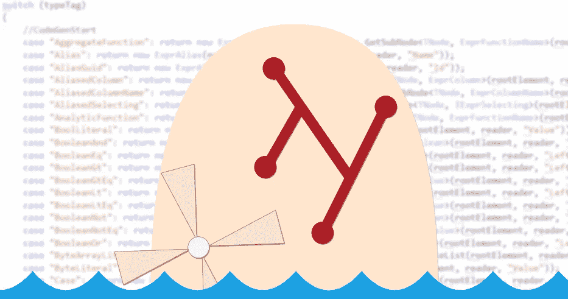

# 不需要等待。Net 5 开始使用罗斯林代码生成

> 原文：<https://itnext.io/no-need-to-wait-for-net-5-to-start-using-code-generation-with-roslyn-f2317b438a6c?source=collection_archive---------0----------------------->



最近，当我回顾即将包含在中的新功能时。Net 5，偶然发现了一个有趣的——[C #源码生成器](https://devblogs.microsoft.com/dotnet/introducing-c-source-generators/)。我对这个特性特别感兴趣，因为我在过去的… 5 年里一直使用类似的方法，微软提议的只是将这种方法更深入地集成到构建过程中。

此外，我将分享我在代码生成中使用 Roslyn 的经验，我认为这将有助于您更好地了解微软到底提供了什么以及何时可以使用它。

首先，让我们看一个典型的代码生成场景。您有一些外部信息源，比如数据库、某个 REST 服务的 JSON 描述、另一个程序集(通过反射)等等。使用这些信息，您可以生成各种类型的源代码，比如 dto、db 模型类或 REST 服务的代理。

然而，有时会出现这样的情况，即没有任何外部信息源，您需要的一切都包含在项目本身的源代码中，您希望在其中添加一些生成的代码。

巧合的是，我最近发表的一个开源项目就有这样一个例子。在这个项目中有超过 100 个代表 SQL 语法树节点的[类](https://github.com/0x1000000/SqExpress/tree/main/SqExpress/Syntax)，我需要创建访问者，这些访问者将[遍历](https://github.com/0x1000000/SqExpress/blob/main/SqExpress/SyntaxTreeOperations/Internal/ExprWalker.cs)和[修改](https://github.com/0x1000000/SqExpress/blob/main/SqExpress/SyntaxTreeOperations/Internal/ExprModifier.cs)树对象(你可以在我以前的文章[语法树和与 SQL 数据库交互的 LINQ 的替代方案](/syntax-tree-and-alternative-to-linq-in-interaction-with-sql-databases-656b78fe00dc?source=friends_link&sk=f5f0587c08166d8824b96b48fe2cf33c)中找到关于这个项目的更多信息)。

代码生成在这里是一个好的选择的原因是，每次我对类做一个很小的更改，我都需要记住修改访问者，这些更改必须非常小心地完成。但是，我不能使用反射来生成代码，因为包含新更改的程序集根本就不存在，如果这些更改与以前的版本不兼容并导致编译错误，那么这个程序集将永远不会出现，直到我手动修复所有错误。

这个问题乍一看无解，但实际上我可以用 Roslyn 编译器来解决。我可以提前预编译模型类，并通过反射获得类似的信息。

让我们创建一个简单的控制台应用程序，并添加[微软。CodeAnalysis.CSharp](https://www.nuget.org/packages/Microsoft.CodeAnalysis.CSharp) 包。

*注意:理论上这可以在 t4 中实现，但是我不喜欢纠结于依赖和奇怪的 t4 语法。*

首先，我们需要读取包含模型类的所有 cs 文件，并从中提取语法树:

从文本的角度来看，这些树包含了大量关于源代码的信息(类名、方法名等等。)，但通常这些信息是不够的，因为我们想知道文本的意思，所以我们需要让 Roslyn 分析语法树并获得一些语义数据:

使用语义数据我们可以得到一个类型为的**的对象:**

它可以提供关于类构造函数和属性的信息:

由于所有的模型类都是不可变的，所有有意义的属性都必须通过它们的构造函数来设置，所以让我们迭代所有的构造函数参数并获取它们的类型:

现在它需要分析参数类型并找出以下内容:

1.  类型是列表吗？
2.  类型是否可空(项目使用“[可空引用类型”](https://docs.microsoft.com/en-us/dotnet/csharp/nullable-references))？
3.  该类型是否从我们为其创建“访问者”的基类型(在我们的例子中是接口)继承。

语义模型为这些问题提供了答案:

*注意:方法“AnalyzeSymbol”从集合和可空值中提取实际类型:*

```
List<T> => T (list := true) 
T? => T (nullable := true) 
List<T>? => T (list := true, nullable := true)
```

在语义模型中检查基类型比使用反射更复杂，但也是可能的:

现在我们可以将所有信息放在一个简单的容器中:

并在代码生成中使用它来创建类似于的[。](https://github.com/0x1000000/SqExpress/blob/main/SqExpress/SyntaxTreeOperations/Internal/ExprModifier.cs)

在我的项目中，我将代码生成作为控制台实用程序运行，但是在。Net 5 您将能够将这一代嵌入到项目中，作为一个标记有特殊属性的类，该类将在编译时自动运行以添加缺少的代码部分。这当然比独立的实用程序更方便，但想法是相似的。

最后，我想说，你不应该把这个新功能。Net 5 是一个不可思议的创新，它将从根本上改变诸如 AutoMapper、ASP.Net 核心等库中使用的动态代码生成方法。(我听过这样的观点)不会的！事实上，代码生成工作在一个静态的环境中，在这个环境中，一切都是预先知道的，但是，例如，AutoMapper 不知道它将使用什么类，它仍然必须动态地发出代码。然而，在某些情况下，这种代码生成非常有用(我在本文中描述了其中的一种)。所以值得了解一下这个特性，了解一下它的原理和局限性。

([链接到 github 上的源代码](https://github.com/0x1000000/SqExpress/blob/main/SqExpress.GenSyntaxTraversal/Program.cs))