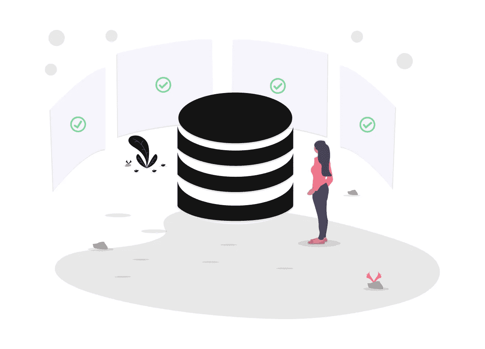

# NoSQL 不是指！有关系的

> 原文：<https://itnext.io/nosql-does-not-mean-relational-8aac79ce6b9c?source=collection_archive---------3----------------------->

我们都遇到过一些文章、推文和博客文章，建议您应该使用 SQL(例如，MySQL)来处理所有与关系相关的事情。这不是真的。我们使用的大多数(如果不是全部)数据都有某种关系。让我们看看我们是如何在 MySQL 和 Google Cloud Firestore 中创建和引用关系数据的。我将使用一个有`users`、`restaurants`、`dishes`和`orders`的订餐应用程序来展示 MySQL 和文档数据库的数据模型之间的差异



https://undraw.co

# 模型

首先，我们需要理解数据中的关系。然后我们可以开始构建我们的模式。不管我们使用 SQL 还是 NoSQL，重要的是考虑你的数据，设想查询它，并建立一个合适的模型。也就是说，让我们看看我们的数据模型

```
**SQL Model****App_User
**  - id
- given_name
  - surname
  - email
  - phone**App_Restaurant
**  - id
- name
  - address
  - city
  - state
  - postal_code
  - phone**App_Dish
**  - id
- name
  - description
  - price
  - app_restaraunt_id**App_Order
**  - id
- user_id
  - restaurant_id
  - order_total**App_Order_Item
**  - order_id
- dish_id
  - quantity
  - price_at_order
  - special_requests (e.g., no onions)
```

这些关系细分如下:

*   **一家餐厅** `has_many` **菜肴**
*   **某餐厅** `has_many` **点菜**
*   **发出用户** `has_many` **命令**
*   **某餐厅** `has_many` **顾客:用户** `through` **订单**
*   **点菜** `has_many` **菜品** `through` **点菜 _ 物品**

让我们看看这个模型在 Firestore 这样的文档数据库中会是什么样子。在 Firestore 中，他们将文档存储在集合中，而不是像 SQL 那样存储在表中。简单点说，集合=表。

```
**Document Model - Firestore****users {** id{
    givenName,
    surname,
    email,
    phone,
  }
**}****restaurants {
**  id {
    name,
    address,
    city,
    state,
    postalCode,
    phone,
  }

  **dishes (**sub-collection)
    id {
      name,
      description,
      price
    } **orders (**sub-collection)
    id {
      customerName,
      customerId,
      items: [
        {dishId, name, price, quantity, specialRequest},
      ],
      orderTotal
    }
**}**// users & restaurants are collections
// dishes & orders are sub-collections
```

在文档模型中，我们利用子集合以及订单中项目的数组。我们可以在文档存储中对此进行不同的建模，并将所有内容作为顶级集合，但是我更喜欢在这个用例中使用子集合。

大多数送餐应用程序会向您展示一个餐馆列表，我们如何使用 SQL 和文档存储来展示餐馆列表呢

```
**SQL Query**
SELECT * from App_Restaurant;**Document Query**
firestore.collection('restaurants').get();
```

现在我们已经向用户展示了餐馆列表，我们想向他们展示他们提供的菜肴。

```
**SQL Query**
SELECT * from App_Dish WHERE app_restaurant_id = restaurant_id;**Document Query**
firestore
  .collection(`restaurants/${restaurantId}/dishes)
  .get();
```

如您所见，文档模型看起来非常类似于 API route `restaurants/${restaurantId}/dishes`。接下来，我们需要保存用户的订单——他们通常会选择一个项目，并指定数量和任何特殊要求(例如，不要添加洋葱)。让我们看看 SQL 与文档数据库的对比

```
**SQL**
-- start an order 
INSERT INTO App_Order (user_id, restaurant_id, order_total) VALUES (user_id, restaurant_id, 0);-- add items to an order
INSERT INTO App_Order_Item (order_id, dish_id, quantity, price_at_order, special_requests) VALUES (order_id, dish_id, quantity, price_at_order, special_requests);**Document DB** // start an order
firestore
  .collection(`restaurants/${restaurantId}/orders)
  .add({
    customerName, 
    customerId, 
    items: [{
      dishId,
      name,
      price,
      quantity,
      specialRequest
    }], 
    orderTotal
  });// add items to an order
firestore
  .collection(`restaurants/${restaurantId}/orders)
  .update({
    items: [
      ...items,
      {dishId, name, price, quantity, specialRequest}
 *// or you could pass the new array*
    ]
  })// or user the firestore arrayUnion method
firestore
  .collection(`restaurants/${restaurantId}/orders)
  .update({
    items: firebase.firestore.FieldValue.arrayUnion({
      dishId,
      name,
      price,
      quantity,
      specialRequest
    })
  })
```

现在我们有了一些用户、餐馆、菜肴和订单，是时候看看我们如何查询数据了。

为了向餐馆显示他们的订单、每个订单的商品以及订购它的顾客姓名，我们需要执行几个查询，其中包括获取相关数据的连接。

```
**SQL**
-- Restaurant Orders with user name and phone
**SELECT** order.id, order.restaurant_id, order.user_id, item.quantity, item.special_requests, item.price_at_order, dish.name, user.given_name
**FROM** App_Order order
**JOIN** App_Order_Item item **ON** order.id = item.order_id
**JOIN** App_User user **ON** order.user_id = user.id
**JOIN** App_Dish dish **ON** item.dish_id = dish.id
**WHERE** order.restaurant_id = restaurant_id;
```

我使用了一个基本的连接查询来显示获取我们需要的所有数据所需的代码量。

现在，让我们看看如何在 Firestore 中查询餐厅订单，包括商品和用户信息

```
**Firestore** firestore
  .collection(`restaurants/${restaurantId}/orders`)
  .get();
```

由于非规范化数据和子集合的使用，我们有一个非常快速的访问模式。

现在，假设用户想查看他们的订单历史，而不考虑餐馆

```
**SQL** -- Grab orders regardless of restaurant
**SELECT** dish.name, restaurant.name, order.order_total 
**FROM** App_Order order
**JOIN** App_Order_Item item **ON** order.id = item.order_id
**JOIN** App_Dish dish **ON** item.dish_id = dish.id
**JOIN** App_Restaurant restaurant **ON** order.restaurant_id = restaurant.id
**WHERE** order.user_id = user_id
```

我们再次执行 SQL 查询并连接多个表中的数据，以显示用户请求的信息。下面是我们如何在 Firestore 上做同样的事情

```
**Firestore** firestore
  .collectionGroup('orders')
  .where('customerId', '==', user.id)
  .get();
```

正如您在上面看到的，Firestore 查询再次变得更加简单。它还使用 Firestore 的一个奇妙的查询功能，称为[集合组查询](https://firebase.google.com/docs/firestore/query-data/queries#collection-group-query)。

公平地说，我们可以对 SQL 存储中的数据进行反规范化以使查询更容易，或者我们可以使用数组/映射等。但是，这篇文章的目的是展示如何使用文档数据库来建模关系数据并简化访问模式。

在 [Now IMS](https://nowims.com) ，我们更倾向于使用 Firestore 作为我们的主数据库，因为它具有高度可扩展性，提供对连接设备的实时同步，并提供强大的 SLA，并且托管在我们认为最好的云上— [谷歌云](https://cloud.google.com)。

我们希望这有助于您理解如何利用文档数据库不仅对关系数据建模，而且简化您的访问模式和开发。我们的下一篇文章将关注非规范化关系数据。