# 构建实时公共交通状态物联网设备:OneTesselAway

> 原文：<https://itnext.io/onetesselaway-public-transit-status-iot-device-70b80ab8475b?source=collection_archive---------1----------------------->

## 制造一个物联网设备来监控下一辆公交车的到达。使用 Node.js、OneBusAway API 和 Tessel 2 构建。

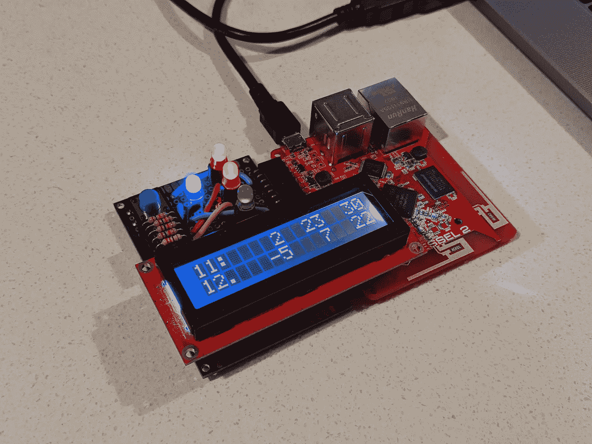

11 路车将在 2 分钟、23 分钟和 30 分钟后到达。

OneTesselAway 是我制作的一个(接近)实时公共交通状态[物联网(IoT)](https://en.wikipedia.org/wiki/Internet_of_things) 设备，它可以告诉我下一辆公交车何时到达。它具有一个液晶显示屏，状态 led，音乐闹钟和网络用户界面。它由 [Node.js](https://nodejs.org/en/about/) 、 [OneBusAway](https://onebusaway.org/) API 和 [Tessel 2](https://tessel.io/) 物联网平台构建而成。硬件和网络用户界面的软件完全是用 JavaScript 编写的。你可以在 GitHub 上找到[的源代码。](https://github.com/robatron/OneTesselAway)

为什么我要离开？每天早上等公交的时候不停地查看我的手机和 OneBusAway 应用程序很烦人。我还想通过学习新的硬件编程和电子组装技能来挑战自己。

我写这篇博文是因为我对这个项目的结果很满意，我想分享它是如何工作的，我是如何构建它的，以及我在这个过程中学到了什么。我认为这个项目有几个新颖的方面值得分享，包括脸书通量启发的数据管理系统，以及报警系统的脉宽调制音乐。

我希望你会觉得我的项目有趣和丰富！如果您有任何反馈，请随时发表评论。

# 目录

1.  设备组件和功能概述
2.  Web 用户界面概述
3.  一号船的软件设计
4.  一次性硬件设计和组装
5.  结论
6.  附录

# 1.设备组件和功能概述

> 在计算能力方面，它介于 Arduino 和 Raspberry Pi 之间。

OneTesselAway 设备由几个主要组件组成:一个 Tessel 2、一个 LCD 屏幕、“交通信号灯”状态 led 和一个音乐警报系统。

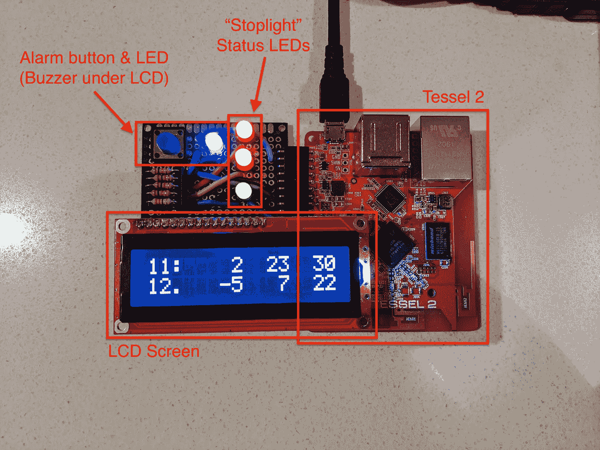

## 宇宙 2

该设备的大脑是一个 [Tessel 2](https://tessel.io/) [物联网(IoT](https://en.wikipedia.org/wiki/Internet_of_things) )开发平台。它是一台基于 WiFi 路由器[片上系统(SoC)](https://en.wikipedia.org/wiki/System_on_a_chip) 运行 [OpenWrt](https://openwrt.org/) Linux [操作系统(OS)](https://en.wikipedia.org/wiki/Operating_system) 的单板电脑。它被设计成使用 [Node.js](https://en.wikipedia.org/wiki/Node.js) JavaScript 运行时来运行应用程序。就计算能力而言，它介于 Arduino 和 Raspberry Pi 之间。

## 液晶显示屏

最重要的组件是液晶显示屏，它(近)实时显示即将到来的公交车到站。要显示的[目标公交路线](https://github.com/robatron/OneTesselAway/blob/master/src/Constants.js#L83)在软件中配置。

## “停止灯”状态指示灯

“停止灯”状态 LED 由一个绿色、黄色和红色 LED 组成，用于指示[主总线路线](https://github.com/robatron/OneTesselAway/blob/master/src/Constants.js#L54)上最近总线的状态。[可能的状态](https://github.com/robatron/OneTesselAway/blob/master/src/Constants.js#L75)有:

*   准备好了——公共汽车还有 5 分多钟就到了。绿色的 LED 灯亮起。放松点。
*   稳定——公共汽车大约在 2 到 5 分钟的路程。黄色的 LED 灯亮起。
*   **走！—**1、2 分钟路程。*所有的*发光二极管点亮。马上离开！
*   **Miss —** 公交车零分钟或负分钟路程。红色的*LED 灯亮起。*

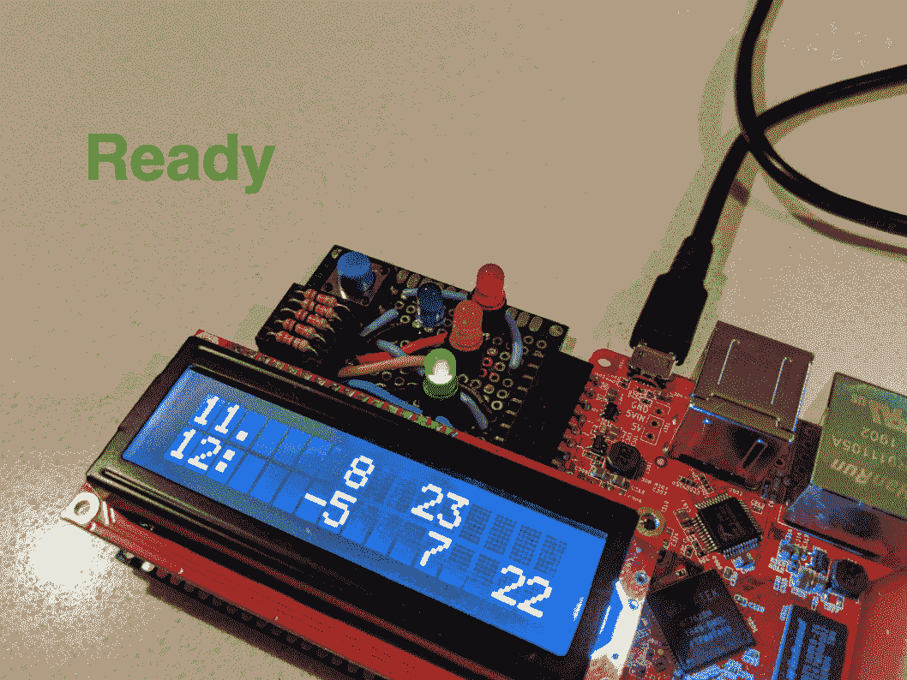

所有可能的“红灯”状态的动画 gif

## 音乐报警系统

我最喜欢的组件是音乐警报系统，它由一个按钮、[压电蜂鸣器](https://en.wikipedia.org/wiki/Piezoelectric_speaker)和蓝色 LED 组成。当“停止灯”状态变为“开始”时，报警器会发出蜂鸣声。如果您想在不查看设备的情况下知道公交车何时到达，此功能非常有用。

您可以通过按蓝色按钮来设置闹钟，蓝色 LED 将亮起，指示闹钟已设置。闹钟下次播放时会自动复位。

声音打开！这里有一个音乐闹钟演奏曲子的视频演示。首先，当按下蓝色按钮时，设置警报，如蓝色 LED 所示。然后，当 11 路公共汽车还有 2 分钟的路程时，闹钟就会响起一首曲子。

# 2.Web 用户界面概述

> web UI 中的模拟硬件显示了设备硬件组件的实时状态。

OneTesselAway 设备拥有自己的 web 用户界面，提供实时模拟硬件、高级设备控制和调试信息。相应地，由于 Tessel 2 是基于 WiFi 路由器硬件的，因此 OneTesselAway web UI 与 WiFi 路由器的设置页面没有什么不同，它通常也位于 WiFi 路由器本身。关于如何构建 web UI 的更多信息可以在“软件设计”一节中找到。

## 模拟硬件

web UI 中的模拟硬件显示了设备硬件组件的实时状态。模拟硬件应始终反映硬件的当前状态，包括屏幕上当前显示的内容、“停止灯”led 的状态以及警报的状态。警报也可以从这里设置。

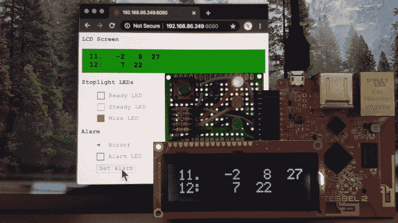

托管在 OneTesselAway 设备(右)上的 web 用户界面(左)。这演示了从 web 用户界面设置警报。当点击网络用户界面中的“设置闹钟”按钮时，闹钟也会在设备上设置。还要注意，模拟的和实际的 LCD 屏幕和“停止灯”led 是匹配的。

## 高级设备控制

先进的设备控制允许在设备本身可能的限制之外操作 OneTesselAway 设备。例如，高级控件允许来自 OneBusAway API 的模拟响应，这些响应展示了用于测试的不同“停止灯”状态，并允许根据命令播放警报。

## 调试信息

由于 OneTesselAway 设备是独立运行的，因此我们需要一种方法来查看有关设备运行情况的深入信息，例如，诊断错误。web UI 提供这种调试信息，包括设备日志和当前设备状态。

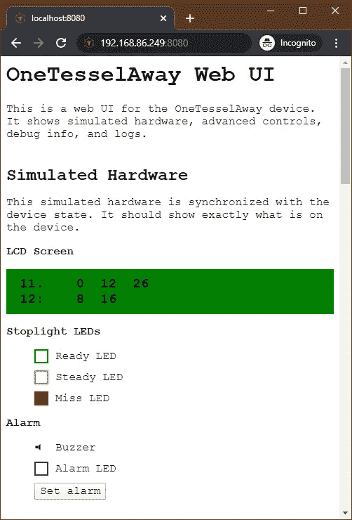

显示模拟硬件的 OneTesselAway web UI 的屏幕截图。“高级设备控制”和“调试信息”位于屏幕下方。

# 3.一号船的软件设计

> 数据管理系统借鉴了**脸书通量**和发布-订阅软件架构模式。

OneTesselAway 后端软件是一个运行在 Tessel 2 上的 [Node.js](https://nodejs.org/en/about/) JavaScript 应用程序。初始化硬件后，它开始[每 5 秒钟轮询](https://en.wikipedia.org/wiki/Polling_(computer_science)) [OneBusAway API](http://developer.onebusaway.org/modules/onebusaway-application-modules/1.1.14/api/where/index.html) 一次公交车到站信息。当接收到新的到达信息时，LCD 屏幕和其他组件相应地更新。

OneTesselAway 后端应用程序还启动一个 [Express.js](http://expressjs.com/) web 服务器，该服务器为 web UI 前端应用程序提供服务。web UI 也是一个 JavaScript 应用程序，但是它运行用户的 web 浏览器。它具有与后端应用程序和硬件组件同步的模拟硬件。例如，模拟 LCD 屏幕应该总是显示与物理 LCD 屏幕相同的到达时间。

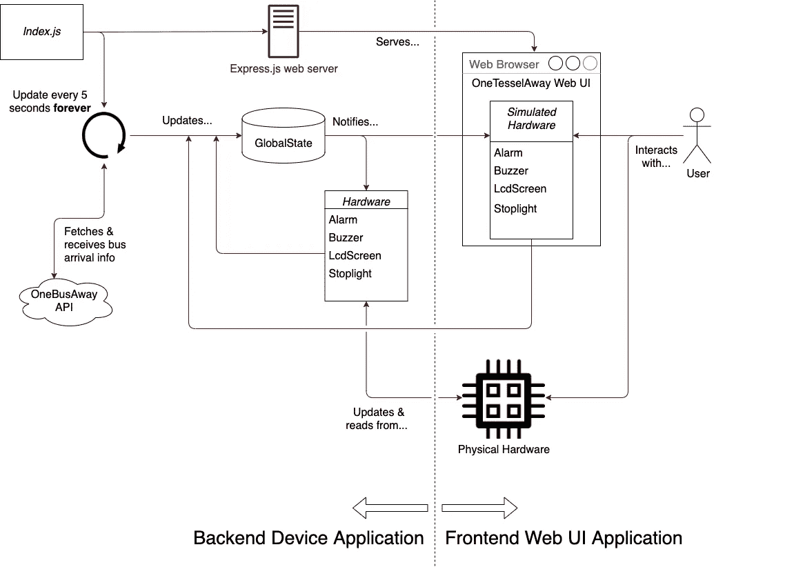

后端(左)和前端(右)应用程序的高级交互图。 ***注:*** 虽然从技术上来说不是“前端 web UI”的一部分，但大部分硬件都是用户界面，这也是它位于“前端”的原因。(两边真的不太搭。)

## 脸书通量启发的数据管理和事件系统

OneTesselAway 软件架构的支柱是数据管理系统，它处理后端和前端应用程序中的所有信息流。数据管理系统借鉴了[脸书通量](https://facebook.github.io/flux/docs/in-depth-overview)和[发布-订阅](https://en.wikipedia.org/wiki/Publish%E2%80%93subscribe_pattern)软件架构模式。

脸书通量模式的简化架构图。OneBusAway 中的数据管理工作方式类似。信用:[通量深度概述](https://facebook.github.io/flux/docs/in-depth-overview)文档。

数据管理系统有一个保存所有应用程序数据(后端和前端)的全局存储。组件可以订阅对全局存储的特定更改，这样当它们关心的信息更新时，它们会得到通知。所有数据流都是单向的。信息变化总是从全球商店开始，然后从全球商店*流向下游的*用户。

例如，当新的公交车到达信息从 OneBusAway API 进入应用程序时，它被保存在全局存储中，然后全局存储会将新的公交车到达信息通知所有订户(LCD 屏幕)。用户(LCD 屏幕)可以使用这些信息(显示新的到达时间)。

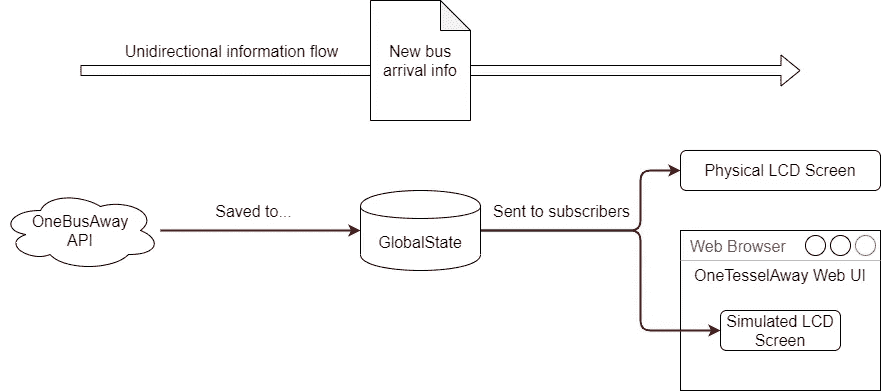

这种单向信息流适用于所有数据。*应用程序或组件内部或之间没有直接通信*。如果一个组件需要与另一个组件通信，数据必须从全局存储开始，并向下游流向另一个组件。

例如，当按下报警按钮时，报警 LED 所订阅的全局存储中会保存一个`isAlarmSet`标志。设置标志时，报警 LED 将点亮，未设置时，报警 LED 将熄灭。

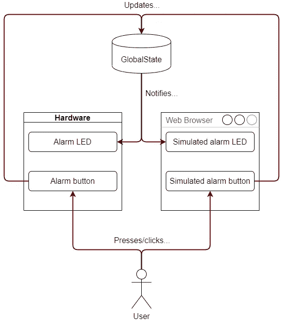

## 同步设备后端和 Web UI 前端应用程序

当设备后端应用程序启动时，它运行一个 [Express.js](http://expressjs.com/) web 服务器。当 web 浏览器发出请求时，web 服务器将为 web UI 前端应用程序提供服务。web 服务器使用[嵌入式 JavaScript 模板(EJS)](https://ejs.co/) ，构建 web UI 的 [HTML 文档](https://en.wikipedia.org/wiki/HTML)，供 web 浏览器解释和运行。

web UI 的模板包括创建一组模拟硬件、高级控件和调试信息所需的所有标记、样式和 JavaScript。后端应用程序还注入全局存储的副本，因此模拟的硬件将显示正确的初始状态。

web UI 还通过[套接字使用](https://socket.io/) [WebSockets](https://en.wikipedia.org/wiki/WebSocket) 维护与后端应用程序的实时连接。IO 库。每次从后端应用程序更新全局状态时，web UI 都会更新其全局存储的副本以进行匹配。

当从 web UI 更新数据时，后端应用程序将更新其全局存储，这又会更新 web UI 的全局存储。这样，后端和前端应用程序中的全局存储将是同步的，物理和模拟硬件应该总是匹配的。

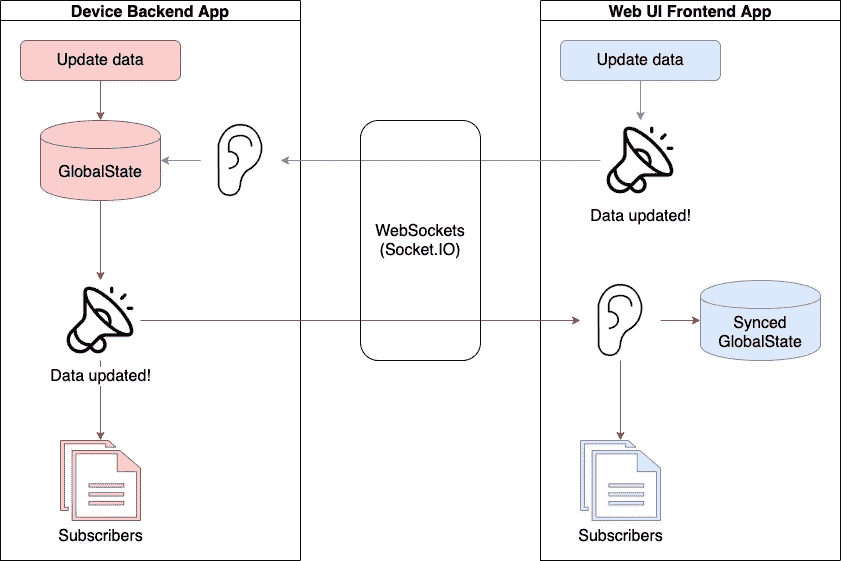

该图显示了从后端(左)和 web UI(右)应用程序开始的数据更新流程。注意，当 web UI 上有数据更新时，**前端的全局存储通过后端**更新。这样，我们只需从后端到前端单向同步全局数据存储。前端的同步全局存储仅供模拟硬件参考。

## 音乐报警软件:如何播放一首曲子

OneBusAway 设备通过[压电蜂鸣器](https://en.wikipedia.org/wiki/Piezoelectric_speaker)播放音乐。为此，[后端应用程序向蜂鸣器引脚输出](https://github.com/robatron/OneTesselAway/blob/master/src/hardware/Buzzer.js#L43)适时的[脉宽调制(PWM)](https://en.wikipedia.org/wiki/Pulse-width_modulation) 频率和占空比变化。

[歌曲](https://github.com/robatron/OneTesselAway/tree/master/src/audio/songs)被定义为一系列分数[音符](https://github.com/robatron/OneTesselAway/blob/master/src/audio/Notes.js)，例如四分音符、二分音符等。，以及速度。例如 [nyan-intro.js](https://github.com/robatron/OneTesselAway/blob/master/src/audio/songs/nyan-intro.js) 的[节拍为每分钟 120](https://github.com/robatron/OneTesselAway/blob/master/src/audio/songs/nyan-intro.js#L32) 拍。当播放一首歌曲时，音符[逐个播放](https://github.com/robatron/OneTesselAway/blob/master/src/hardware/Buzzer.js#L43)，根据速度考虑[频率和持续时间](https://github.com/robatron/OneTesselAway/blob/master/src/hardware/Buzzer.js#L47-L48)。产生频率[并输出](https://github.com/robatron/OneTesselAway/blob/master/src/hardware/Buzzer.js#L26)到蜂鸣器连接的 PWM 引脚。

一个[低级 Tessel PWM API](https://tessel.gitbooks.io/t2-docs/content/API/Hardware_API.html#pwm-pins) 用于实现 PWM 值的改变。请记住，对这些 PWM 值的任何更改都会影响所有的 PWM 引脚。当我的一个发光二极管意外地随着年夜饭的节拍闪烁时，我学到了惨痛的教训。

归功于 GitHub 上的 [j5-songs 项目，OneTesselAway 歌曲就是基于这个项目。](https://github.com/julianduque/j5-songs)

原创的“Nyan Cat”歌曲，作为 OneTesselAway 音乐闹钟的曲调播放

## 硬件模拟:不需要设备

后端应用程序通常在设备上运行，但是因为它是 Node.js 应用程序，所以它可以在 Node.js 可以运行的任何地方运行，比如台式机或笔记本电脑。您可以[在“仅网络”模式](https://github.com/robatron/OneTesselAway/blob/master/package.json#L10)下启动 one sesaway，所有设备硬件将被[模仿](https://en.wikipedia.org/wiki/Mock_object)，这允许软件在完全没有 one sesaway 设备的情况下运行。

在开发软件时，以“仅网络”模式开始是一个非常有用的功能，因为在 Tessel 2 上上传和运行代码可能需要几分钟，这加起来会打断你的[流程](https://en.wikipedia.org/wiki/Flow_(psychology))。

**注意:**唯一的要求是你必须使用 Tessel 2 版本 8 LTS 支持的[最新版本 Node.js。OneTesselAway 代码库包括一个](https://tessel.io/blog/176773423942/say-hello-to-node-8)[。nvmrc 文件](https://github.com/robatron/OneTesselAway/blob/master/.nvmrc)以便您可以`[nvm](https://github.com/nvm-sh/nvm) use`node . js 的正确版本。

# 4.一站式硬件设计和组装

> 为了产生音乐警报的歌曲，OneTesselAway 向警报蜂鸣器引脚输出适时的 PWM 频率和占空比变化。

由于大多数电子逻辑由 Tessel 2 控制，电路设计相对简单。基本上，所有组件都连接到 [Tessel 2 端口和引脚](https://tessel.gitbooks.io/t2-docs/content/API/Hardware_API.html#ports-and-pins)，通过它们进行控制。此外，组件连接到电源和[地](https://en.wikipedia.org/wiki/Ground_(electricity))，电阻器用于根据组件需要调整电流和电压。

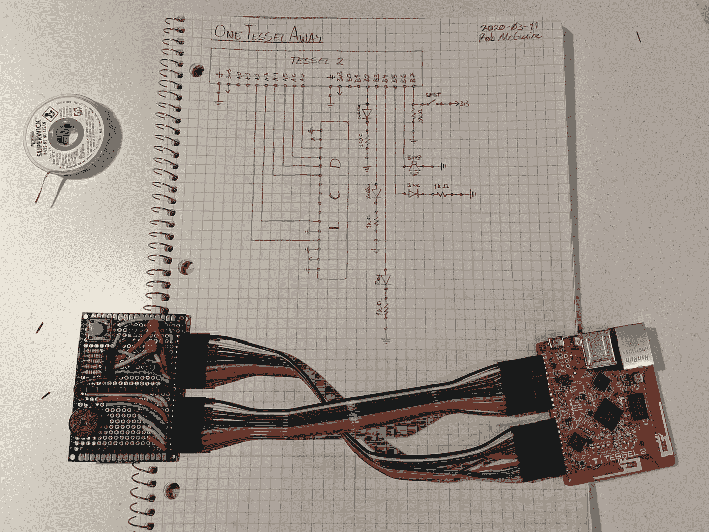

电路图(上图),带 OneTesselAway 组件板(左)和 Tessel 2(右)。组件板上没有液晶屏。在组装的这个阶段，元件板和 Tessel 2 用彩虹[带状电缆](https://en.wikipedia.org/wiki/Ribbon_cable)连接，因为管脚在软件中排序错误。

## 发光二极管、按钮和电阻

OneTesselAway 使用 led 显示设备状态(“警报已设置”、“公交车即将到达”等)。)、触发警报的按钮以及控制向 Tessel 2 上的每个组件或引脚输送多少功率的电阻器。

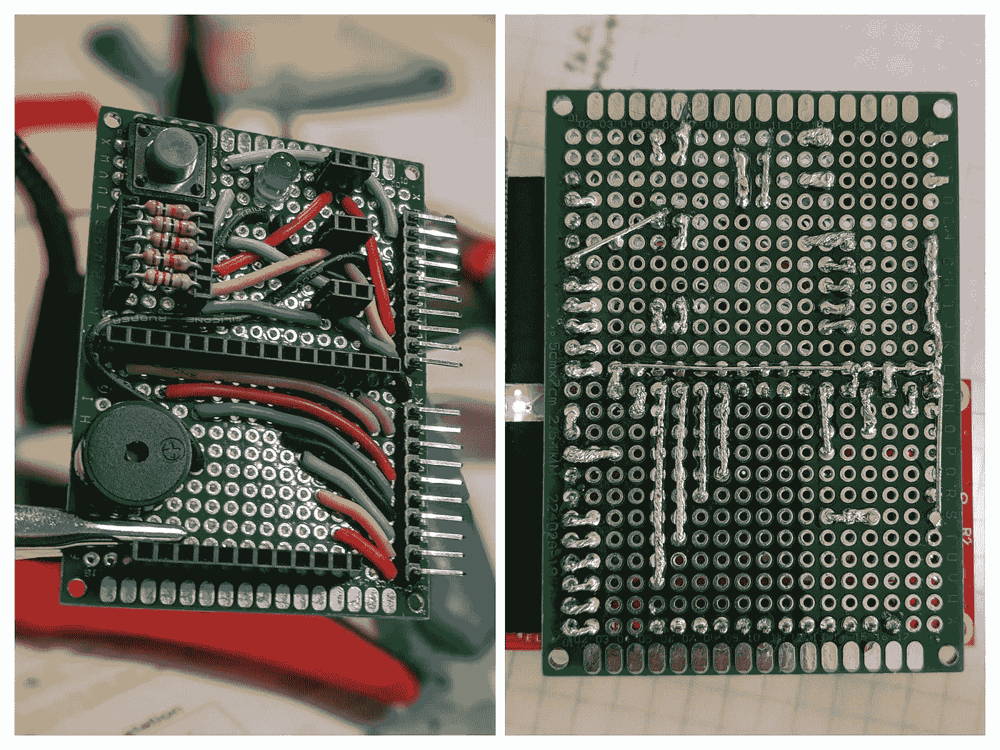

**图 S:** 移除 LCD 屏幕后的 OneTesselAway 组件板的正面和背面。通过将电子元件的引线穿过电路板上的孔并用焊料将电子元件连接到电路板上。绝缘细导线连接着元件。几个“轨道”用于创建长的、连续的连接，其中许多组件附接到公共连接，例如，几乎所有组件都需要接地。

## 通孔技术

OneTesselAway 的电子元件全部采用[通孔技术](https://en.wikipedia.org/wiki/Through-hole_technology)。“通孔”是指元件如何安装到[印刷电路板(PCB)](https://en.wikipedia.org/wiki/Printed_circuit_board) 。元件的引线穿过 PCB 上的孔，并通过焊料连接到 PCB 上的焊盘。然后，根据需要用绝缘的 22- [号](https://en.wikipedia.org/wiki/American_wire_gauge)细电线将组件相互连接起来。(参见图 s。)

## 液晶屏的通用并行接口

LCD 屏幕是一个基本的 16 字符 2 行显示器,连接到 Tessel 2 上端口 B 的 6 个引脚上。每个字符由一个 5×8 像素的矩阵组成。LCD 屏幕支持一个[通用并行接口](https://www.sparkfun.com/datasheets/LCD/HD44780.pdf)，因此很容易从 Tessel 2 发送完整的字符，如“a”、“b”、“c”等。与控制每个单独像素来创建每个字符相反。

## 脉宽调制&音乐报警蜂鸣器组件

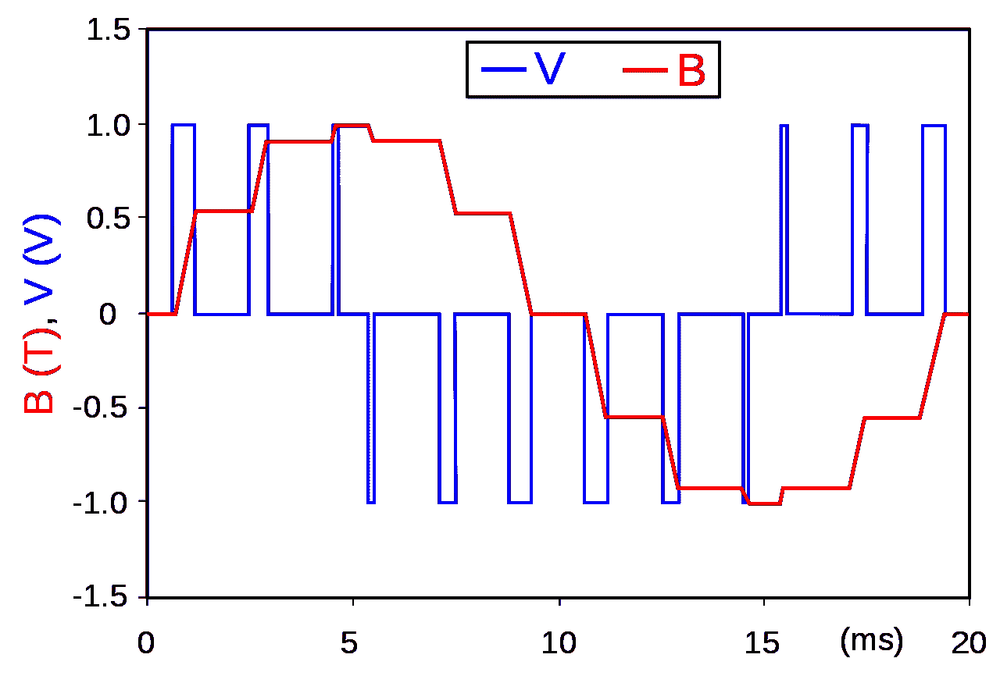

**图 M:** 由电源电压(蓝色)驱动的 PWM 示例，产生类似模拟的正弦波(红色)。Tessel 的 PWM 实际上只有两种状态，即零和正，而此图显示了三种状态，即负、0 和正。鸣谢:[【脉宽调制(维基)](https://en.wikipedia.org/wiki/Pulse-width_modulation)图由 [Zureks](https://commons.wikimedia.org/wiki/User:Zureks) 制作。

音乐闹钟的扬声器是一个小型的[压电蜂鸣器](https://en.wikipedia.org/wiki/Piezoelectric_speaker)。压电蜂鸣器通常由模拟信号驱动，以产生频率和音调。然而，OneTesselAway 使用来自 Tessel 2 上的[特殊引脚](https://tessel.gitbooks.io/t2-docs/content/API/Hardware_API.html#pwm-pins)的[脉宽调制(PWM)](https://en.wikipedia.org/wiki/Pulse-width_modulation) 信号驱动其蜂鸣器。

PWM 引脚可以在特定频率和[占空比](https://en.wikipedia.org/wiki/Pulse-width_modulation#Duty_cycle)下快速开启和关闭，模拟模拟信号产生不同的音调。(见图 m)为了产生音乐警报的歌曲，OneTesselAway 向警报蜂鸣器引脚输出适时的 PWM 频率和占空比变化。有关更多详细信息，请参见“软件设计”部分。

## 引脚和接头

我没有将元件直接焊接到电路板上，而是使用[母头插座](https://en.wikipedia.org/wiki/Pin_header)将大部分元件连接到电路板上，如图 h 所示。将元件连接到头插座上可以拆卸、重新排列或更换元件。例如，如果你想增加 LED 的亮度，你可以把它的电阻换成低电阻的。事实上，整个元件板通过引脚连接到 [Tessel 2 的端口插座](https://raw.githubusercontent.com/tessel/t2-docs/master/images/pindiagram.jpg)，这使得分离元件板和 Tessel 2 变得容易。

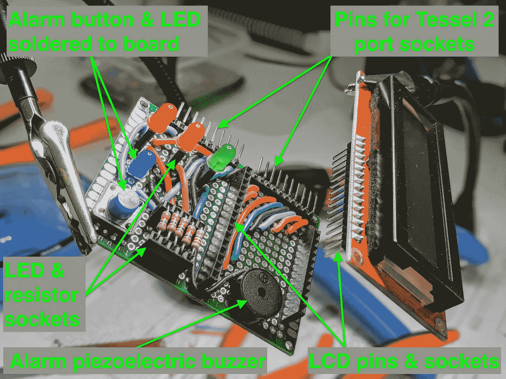

**图 H:** 移除 LCD 屏幕(右)后的一个血管分离板(左)的特写镜头。“停车灯”led 和电阻器通过母头插座连接到电路板。LCD 屏幕引脚插入板中心的长母头插座。整个电路板通过离摄像机最远的一排插脚插入 Tessel 2 端口插头插座。

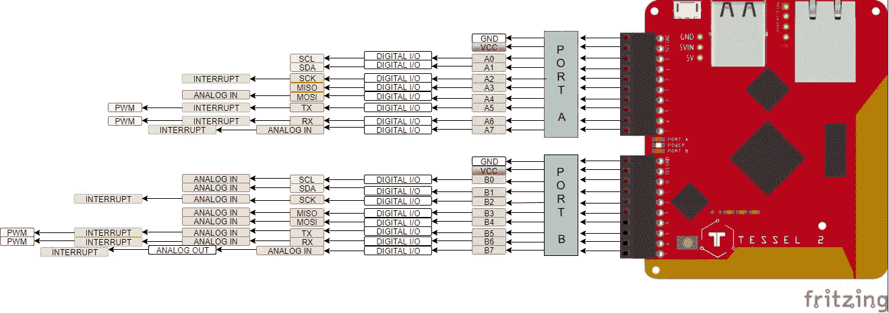

**图 P:** 显示端口 A 和 b 的 Tessel 2 引脚图。OneTesselAway 组件板通过其右侧的引脚连接到 Tessel 2 左侧端口的母头插座。鸣谢:图片来自[官方 Tessel 2 文档](https://tessel.gitbooks.io/t2-docs/content/API/Hardware_API.html#pin-mapping)。

# 5.结论

感谢您对我的 OneTesselAway 项目感兴趣！我很高兴与你分享它。如果您有任何反馈，请随时发表评论。要了解这个项目的更多信息，请访问 GitHub 页面:

 [## robatron/OneTesselAway

### 一种实时公共交通状态设备，具有 LCD 屏幕、状态 led 和音乐警报。用 Node.js 构建…

github.com](https://github.com/robatron/OneTesselAway) 

# 6.附录

## 项目组件和工具列表

这个项目需要许多零件和工具，其中大部分是我必须购买的，但其中一些我手头已经有了。

零件:

*   [Tessel 2 物联网开发板](https://smile.amazon.com/Tessel-Development-capabilities-scripts-Node-js/dp/B01HSMEJN6/ref=sr_1_2?dchild=1&keywords=tessel+2&qid=1586146589&sr=8-2)
*   [16x2 字符液晶显示屏](https://www.sparkfun.com/products/709)
*   [原型试验板](https://smile.amazon.com/gp/product/B0819VF8T3/ref=ppx_yo_dt_b_asin_title_o08_s00?ie=UTF8&psc=1)
*   [各种公/母插头连接器](https://smile.amazon.com/gp/product/B07CWSXY7P/ref=ppx_yo_dt_b_asin_title_o08_s01?ie=UTF8&psc=1)
*   [各种跳线](https://smile.amazon.com/gp/product/B01EV70C78/ref=ppx_yo_dt_b_asin_title_o08_s01?ie=UTF8&psc=1)
*   [各种通孔印刷电路板](https://smile.amazon.com/gp/product/B07P73X8WS/ref=ppx_yo_dt_b_asin_title_o00_s00?ie=UTF8&psc=1)
*   [各色发光二极管](https://www.sparkfun.com/products/12062)
*   各种电阻器(现有)
*   STDP 瞬时开关(手动)
*   压电蜂鸣器(手头)

工具:

*   [助手焊接放大镜站](https://smile.amazon.com/gp/product/B077PN7FJK/ref=ppx_yo_dt_b_search_asin_title?ie=UTF8&psc=1)
*   [FX-888D Hakko 焊台(强烈推荐！)](https://smile.amazon.com/gp/product/B00AWUFVY8/ref=ppx_yo_dt_b_asin_title_o08_s00?ie=UTF8&psc=1)
*   [63/37 焊料](https://smile.amazon.com/gp/product/B0149K4JTY/ref=ppx_yo_dt_b_asin_title_o08_s00?ie=UTF8&psc=1)
*   [脱焊编织带](https://smile.amazon.com/gp/product/B00424S2C8/ref=ppx_yo_dt_b_asin_title_o08_s01?ie=UTF8&psc=1)
*   [22 AWG 绝缘线](https://smile.amazon.com/gp/product/B01LH1FR6M/ref=ppx_yo_dt_b_asin_title_o06_s00?ie=UTF8&psc=1)
*   [剥线钳](https://smile.amazon.com/gp/product/B000XEUPMQ/ref=ppx_yo_dt_b_asin_title_o07_s01?ie=UTF8&psc=1)
*   [储物盒](https://smile.amazon.com/gp/product/B07GX5XW6M/ref=ppx_yo_dt_b_asin_title_o09_s00?ie=UTF8&psc=1)

## 额外资源

以下是博文中提到或使用的一些额外资源。

*   [OneTesselAway 源代码(GitHub)](https://github.com/robatron/OneTesselAway)
*   [Tessel 2 硬件概述](https://tessel.gitbooks.io/t2-docs/content/Hardware/Tessel_2_Overview.html)
*   [优秀的开源网络图表软件，diagrams.net](https://www.diagrams.net/)
*   [Tessel 2 文档中的 PWM 教程](https://tessel.gitbooks.io/t2-docs/content/Tutorials/Pulse_Width_Modulation.html)
*   [spark fun 上的 PWM 教程](https://learn.sparkfun.com/tutorials/pulse-width-modulation)

## 多几张项目照片

请欣赏项目中更多的照片:

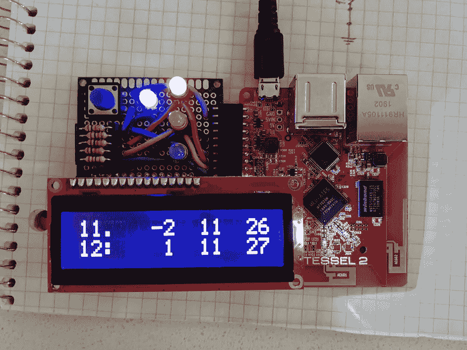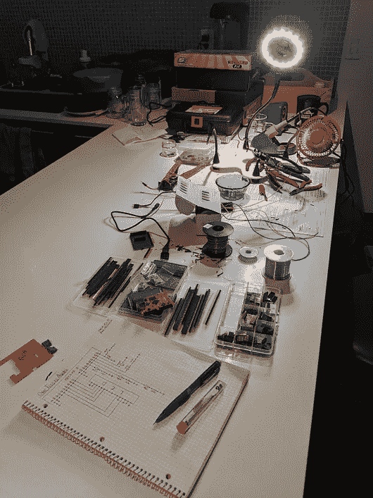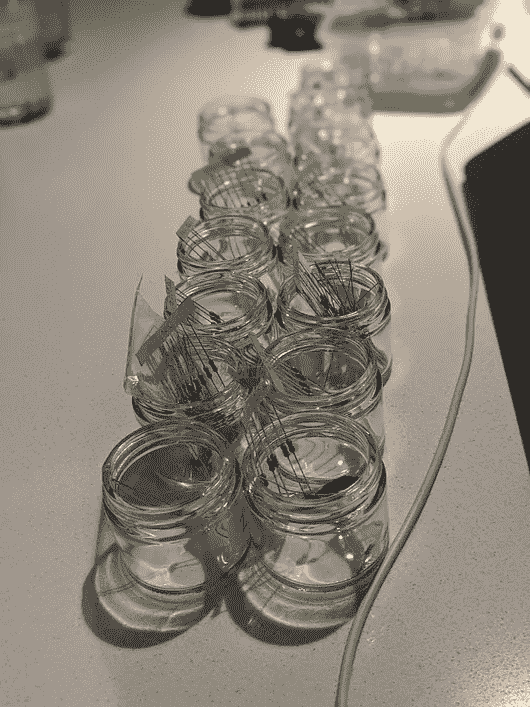

设备的清晰视图(左)，我几周的厨房柜台(中)，和我的电阻组织系统(右)

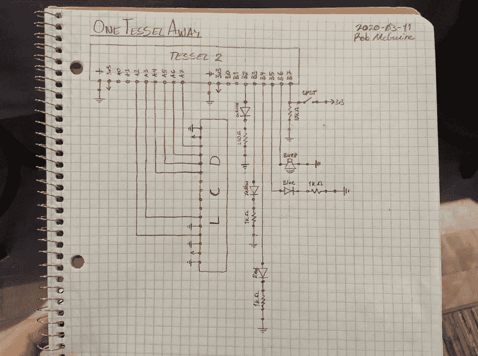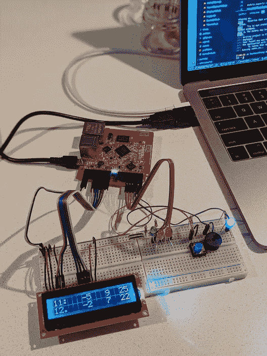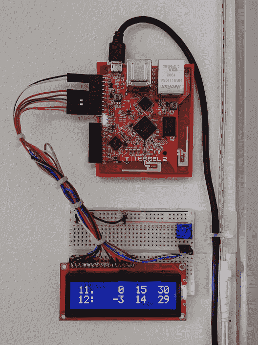

电路图的清晰视图(左)，当前器件的硬件原型(中)，器件的早期原型(右)