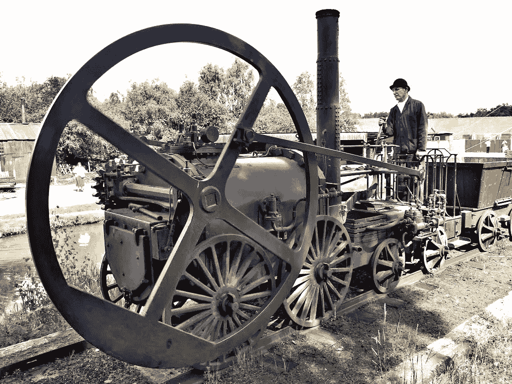
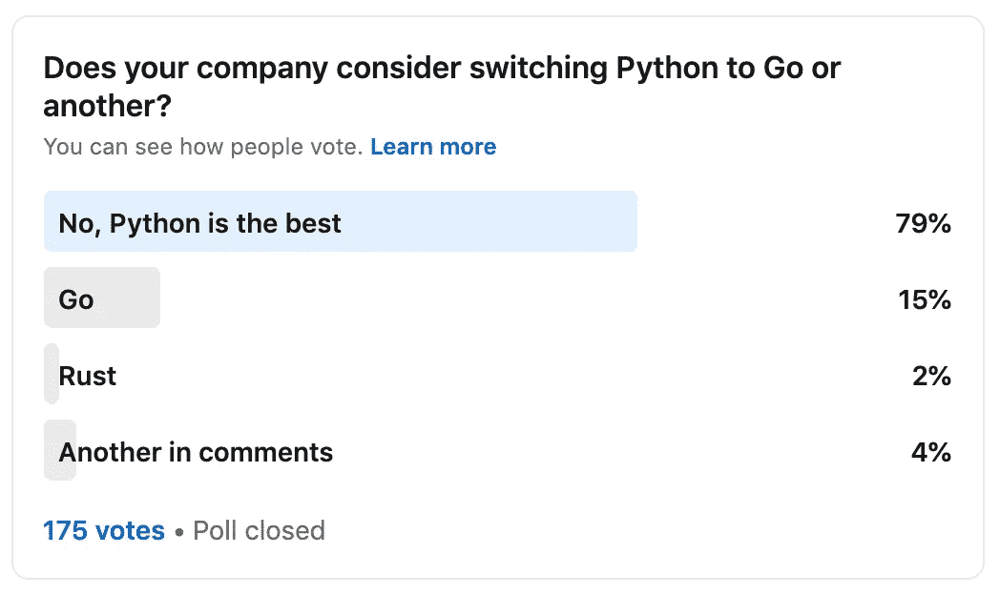

# 如何让 Python Switch to Go Lang 走向成功

> 原文：<https://itnext.io/opinionated-view-on-python-project-evolution-975b859ff2d6?source=collection_archive---------5----------------------->

本文简要介绍了我对 python 项目长期发展的看法。

在这种情况下，长期是跨越数年的。我的观察是基于在一家金融科技初创公司工作五年的经验。

## 你如何开始

每个项目都是从最先进的技术开始的。细心的开发人员跟踪使用中的技术堆栈的最佳实践，并相应地更新项目组件。

这个过程包括保持最新的库和框架版本、改进数据库使用、持续的云增强等等。

为了带来一些背景，我将描述一下我从事的项目。它最初是一个整体的 Python 2 web 应用程序，带有一个流行的 Flask 框架。

我不记得最初的部署过程，但在那个时候(大约在 2014 年)，使用 [Fabric](http://www.fabfile.org/) 自动化直接将源代码部署到虚拟机是很常见的。

这是一个简单的设置。它不需要对基础设施和自动化进行大量投资。更重要的是，它允许有效地将开发集中在小型开发团队的特性交付上。

## **抓住增长的浪潮**

创业公司获得了牵引力，新用户不断涌入，产品经理要求产品尽快具备新功能。

如果这是你熟悉的东西，那么你知道这是成长问题的信号。这些都是需要解决的好问题。

增长问题有两个方面:技术和组织。

技术方面很容易理解——您需要开发一个解决方案，通常通过创建可扩展的软件架构和基础设施，在技术上允许处理不断增长的活跃客户数量。

另一个，组织，很容易被忽视。另一方面，企业明白它准备投入更多资金来增加员工人数和购买强大的硬件。

不要低估组织问题的影响——它会以多种方式伤害你。更多的人在船上意味着花更多的时间进行员工之间的交流；每个新员工都需要一些指导，这将在入职期间引起同事的注意。如果你也想一想如何组织团队合作，使工程师之间的交叉依赖最小化(在代码审查上的冲突，在其他工作上被阻止)，这将会有所帮助。缺乏对应用架构和基础设施与组织结构之间的联系的关注是导致灾难的原因。

每个新员工(尤其是在项目的早期阶段)都通过向现有的技术堆栈中引入新的项目，带来了他们对事情如何完成的愿景。工程师花时间学习新事物，导致系统复杂性增加，功能交付变慢。

这些风险应该由领导层/管理层的愿景和行动来解决。

现在，当我们有了一个上下文，让我们把重点放在技术部分。

## 进化的建筑

苏珊·d·威廉姆斯在 [Unsplash](https://unsplash.com?utm_source=medium&utm_medium=referral) 上的照片

我们现在看到问题了。我们来分解一下。

您为使应用程序可伸缩而采取的一些措施:

*   启动应用程序的多个实例，并在前端放置一个负载平衡器。
*   调整硬件以匹配应用程序细节:实例 CPU 和内存之间的平衡。
*   引入缓存层。
*   密切关注数据库:SQL 优化和 DB 模式反规范化。
*   将高负载组件隔离到单独的应用程序和支持基础架构中。

这里我们不深入讨论极端的解决方案，比如分布式缓存、数据库分片等等。但是，该列表并不完整，项目可能会因具体应用而异。

这里的主要思想是，你不要从根本上改变你的技术堆栈，并试图 100%地利用你所拥有的。

## 然后呢？

然后，您可能会有数千个 python 应用程序实例运行在数百个虚拟机上。

企业可能开始推动工程部门进行成本优化。

反过来，工程师也感受到了变革的需求。我无法解释这种心理现象，但是你的直觉告诉你这个系统是次优的。一个结论浮现在你的脑海中:这里的优化是使用正确的工具，而正确的工具不是 Python。

根据我的经验，要求技术革命的声音获胜了。

有几个选择:

*   切换到异步 Python。
*   迁移到去郎。

我们已经使用异步 Python 和 [Tornado](https://www.tornadoweb.org/) 和 [aiohttp](https://docs.aiohttp.org/en/stable/) 框架编写了一些应用程序，但是它没有被广泛采用是有原因的。

当时 Python 社区正处于过渡状态。Python 3 正在取代 Python 2。对于您的项目所使用的库在迁移后能否正常工作没有信心。更糟糕的是，由于 Python 3 支持异步性，Python 库可以是同步的，也可以是异步的，这进一步降低了构建可靠的异步 Python 项目的可能性。

Go lang 并没有继承所有那些问题。Go lang 是以异步方式开发的(准确地说是协作多任务处理)，是网络密集型应用领域的霸主。在各种用途和任何规模的应用程序中采用 golang 已经成为一种趋势。

我们也是。

## 优秀的公司

吉姆·科林在他的《从优秀到卓越》一书中，这样描述了飞轮效应:

> 飞轮效应是《从优秀到卓越》一书中提出的一个概念。无论最终结果多么戏剧性，从优秀到卓越的转变永远不会一蹴而就。在建立一个伟大的公司或社会部门企业时，没有单一的决定性行动，没有宏大的计划，没有一个致命的创新，没有单独的幸运突破，没有奇迹时刻。相反，这个过程就像无情地推动一个巨大而沉重的飞轮，一圈又一圈地转动，积累动力，直到一个突破点，并超越它。

让我们暂时忘记这个话题，环顾四周，尝试在其他科技公司中找到这种模式。

我首先想到的是脸书。最初是用 PHP 编写的，虽然 PHP 是解释语言，但脸书面临着性能问题(关于该主题的一些细节，请参见链接 [FasterCGI with HHVM](https://hhvm.com/blog/1817/fastercgi-with-hhvm) )。

从一个好公司到伟大公司的角度来看，我们可以将其与以下概念联系起来:

1.  [飞轮](https://www.jimcollins.com/concepts/the-flywheel.html)的作用。他们的工程师通过保留技术栈来推动巨大的发展飞轮。
2.  [刺猬概念](https://www.jimcollins.com/concepts/the-hedgehog-concept.html)。他们对用 PHP 编写软件充满热情，他们可能是世界上最擅长的。事实证明，它还能带来积极的业务成果。
3.  [保留核心/刺激进步](https://www.jimcollins.com/concepts/preserve-the-core-stimulate-progress.html)。表现出动态的双重性。一方面，随着时间的推移，对 PHP 的承诺保持不变。另一方面，他们通过修正它的弱点来改进它的应用。

另一个例子是 DropBox 与 [Pyston](https://blog.pyston.org/) 项目。然而，它并没有完全连接( [Pyston 0.6.1 发布，以及未来计划](https://blog.pyston.org/2017/01/31/pyston-0-6-1-released-and-future-plans/))，并且该计划并不成功。意图是一样的。

最后，想提一下[哨兵](https://sentry.io/)项目。他们遇到了众所周知的 python 性能问题。但是通过下面的[第五级领导](https://www.jimcollins.com/concepts/level-five-leadership.html)概念，他们提出了一个有吸引力的解决方案。事情是这样开始的:[用 Rust 修复 Python 性能](https://blog.sentry.io/2016/10/19/fixing-python-performance-with-rust)。

他们再一次没有试图替换他们已经创建的所有代码库。哨兵仍然在建立他们的飞轮势头，没有失去任何东西。他们保护核心/刺激进步。最终，他们添加了越来越多的 Rust，而 Python 仍然是一等公民。

## 现在怎么办？

当然，只有少数公司能够负担得起专门为其目的构建虚拟机。即使有资源的公司也可以放弃这样做，改变路线。

从一种语言到另一种语言重写一切似乎不是最好的选择。

我喜欢 Sentry 采取的方式，我从客户的角度看到了他们取得的惊人进步。它们最初是一个异常报告工具，现在提供了应用程序性能监控和分布式跟踪。一些事情告诉我，他们将接管这些和其他新领域的市场。

Python 很适合 Rust。您可以从在 Python 中嵌入 Rust 开始，然后逐渐转向 Rust first 方法。Rust 是一种现代语言，编程模型与 python 非常相似。

## 结论性的

根据我在 LinkedIn 上的民意调查，大约 15%的公司可能会考虑将技术栈切换到 Go lang。少数人想到使用铁锈。剩下的 4%投票赞成使用混合物。

我想强调以下评论。

> 健康的软件开发组织将组件集成到他们的项目中，而不必将自己局限于一种语言。
> 
> 例如，使用 C、C++、Go 是很常见的，尤其是通过 Python 中的 API 绑定使用 Rust。这不是关于迁移，从 Python 中切换出来。这就是全部，扩展 Python 来提供对服务的合理的“Python 式”访问，而不管它们的实现细节。

这与我想表达的想法密切相关。

我更喜欢的策略是首先扩展 Python(例如使用 Go/ [gopy](https://github.com/go-python/gopy) 和 Rust/ [pyo3](https://github.com/PyO3/pyo3) )，以一种现有 Python 工程师参与切换的方式，然后在需要时逐渐迁移到新的技术栈。

在偏好微服务架构的组织中，通过在新技术中添加更多新服务来转换技术堆栈是很有诱惑力的。这种方法可能是一个滑溜溜的 sloap，并可能在工程团队中创建筒仓，因此现有的工程师将不能有效地为新的技术栈做出贡献。有意识地、谨慎地做出这个决定。

你有什么看法和经验？请发表评论。