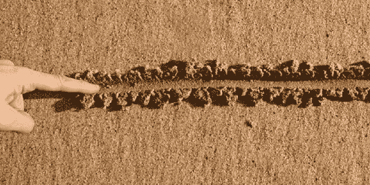
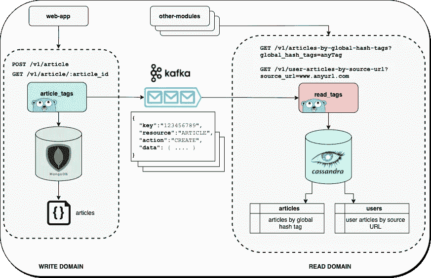

# 使用 CQRS 架构模式优化您的数据访问—第二部分

> 原文：<https://itnext.io/optimize-your-data-access-by-using-cqrs-architecture-pattern-a-theoretical-and-practical-approach-part-1-b31fe259ea04?source=collection_archive---------2----------------------->

## *理论和实践方法*

这是“*通过使用 CQRS 架构模式优化您的数据访问—一种理论和实践方法*”系列的第二部分。在本系列的[第一部分](https://godoy-lucas-e.medium.com/cqrs-architecture-pattern-c7f5c613c59c)中，我们回顾了 CQRS 模式的概念、优点，以及何时该解决方案适合且便于实现。因此，如果你是第一次阅读这篇文章，建议你在阅读这篇文章之前先看看它。否则，如果您只是对完成 PoC(概念验证)感兴趣，可以跳过第一部分。让我们深入研究一下这个问题，看看 CQRS 能如何帮助我们解决它。

# **问题**

假设一家公司有一个 web 应用程序，允许用户保存他们喜欢的文章以及其他相关的元数据，如源 URL、标签等。然后，在构建应用程序时，通过实现一个简单的 CRUD API 解决了这一需求，web 应用程序在这个 API 上发布并保存文章，以便稍后通过使用 POST 方法返回的 article_id 发出 GET 请求进行查询。他们使用 MongoDB 作为存储，这在当时是合适的，因为他们需要通过 ID 查询文章集合。

随着业务开始增长，应用程序变得流行，有必要开始链接分享同一篇文章 的 ***用户，以及分享完全相同标签*** 的 ***其他文章的用户。此时，他们将文章数据存储到 Mongo 集合中的方式使得查询实现很难继续。这样做，他们将需要开始用大量的索引污染集合，并在服务代码本身上处理数据映射，以进行最终的调整并将其转换为客户端可读的 d to。***

不仅如此，由于受欢迎程度的提高，他们期望获得更多的阅读流量，因为多个新的业务客户将开始从这个 CRUD 服务中读取数据，尤其是对这些新的文章数据视图感兴趣。

如果我们停留在 CRUD 模型上，上面列出的一组需求将使这个解决方案在可伸缩性和性能方面几乎无法实现，原因有两个:

*   我们不想把数据处理带给客户，
*   很难在给定的数据结构上利用这些新的查询。

因此，让我们直接进入我们提出的解决这些公司问题的可行方案。

# **通用架构**

正如我们已经知道的，该模式旨在将读操作与写操作分开，主要目标是提高性能、可伸缩性，并为查询性能提供主数据的不同视图，避免在后端查询数据后进行复杂的连接操作或映射操作。

借此机会，我挑选了一套不同的工具来进行 PoC(我不想将本文变成 Golang、Mongo、Cassandra 或 Kafka 的教程，因此我不会深入研究它们，只是简单描述一下它们做了什么以及它们如何协作来实现解决方案)

架构实现

# **分而治之**

随着架构图的产生，我们将问题分成两个世界。一端是写域。在那里，我们遗留的 CRUD API 就位。像以前一样接收所有的文章创建、更新和删除。

另一边是读取域。在此基础上我们将利用所有特定的查询。一种全新的服务将覆盖这一端。它将位于 Cassandra DB 之上，包含我们希望执行的尽可能多的非规范化表。该阅读服务将公开一组端点，允许运行这些查询，并将结果作为响应体返回。

但是等等，这些责任是如何联系在一起的？我们如何保持双方的一致性(在某一点上)？为了回答这些问题，一个卡夫卡式的话题被带到了这个混合体中。后者用作事件源来广播影响文章实体的每个事件。每次写端发生变化时，都会有一个事件发布到主题上。

一旦事件到达 read 服务，它将接收该事件并执行数据转换，以将其存储到相应的 Cassandra 的非规范化表中。

正如您从图表中看到的，您可以注意到许多好处:

1.  根本不需要修改你的 CRUD API 逻辑。验证任何文章创建/更新/删除的所有业务规则仍然可以存在，并且只能存在于此。
2.  这个话题成了数据的黄金来源。通过重放所有事件，您可以获得原始数据当前状态的快照。
3.  所有的查询都需要最低限度的业务验证。因此，读取端与这种事情是分离的，允许它在需要合并新查询时快速扩展。
4.  如果需要新的数据视图，您仍然可以添加新的表来表示它们，编写所有的逻辑代码来处理新的数据转换，并创建一个新的非规范化表来存储数据。一旦你这样做了，一个新的端点将向客户端公开数据。
5.  此外，如果您有使用另一个 DB 引擎的其他需求，因为您认为它最适合某些用例，但是您仍然希望让这个引擎继续工作，那么您可以创建一个使用另一个不同的数据库引擎的新的读取服务。并且仍然拥有最新的数据。从而重放 Kafka 主题的整个事件集合，我们可以用当前的数据快照填充新的 DB。
6.  廉价查询:Cassandra 提供的查询性能可以用来生成不同的数据视图，从而避免昂贵的数据处理。Cassandra 将允许我们根据不同的领域对数据进行分组，这要归功于它的列式数据存储方法。

尽管列出了许多好处，但是当我们决定在这个架构上前进时，复杂性增加了。我们需要开始考虑跨越新的卡夫卡和卡珊德拉集群。所以我们不再需要维护一个简单的架构，现在我们有了一个相当复杂的架构。你将开始面临新的问题，例如:

*   为 Kafka brokers 和 Cassandra cluster 定义合适的分片策略
*   可能的热点碎片需要重新分割你的经纪人
*   为您的存储添加更多基础架构
*   弹性策略等

希望这篇文章对你有兴趣。如果你想玩一会儿，并通过一个实际的示例应用程序深入研究实现，这里你可以找到我一直在做的这个 [**GitHub repo**](https://github.com/godoylucase/cqrs-pattern-impl) 。在自述文件中，您可以找到运行它的说明。

PS:这个回购不是一个生产就绪的服务，它只是一个概念验证。记住你可能会发现一些丑陋的东西，只是想证明一些想法。感谢阅读！

 [## 使用 CQRS 架构模式优化您的数据访问——一种理论和实践方法

### 为什么应该避免使用 CRUD 架构，对于某些用例，使用 CQRS 模式会更好。第一部分

godoy-lucas-e.medium.com](https://godoy-lucas-e.medium.com/cqrs-architecture-pattern-c7f5c613c59c)