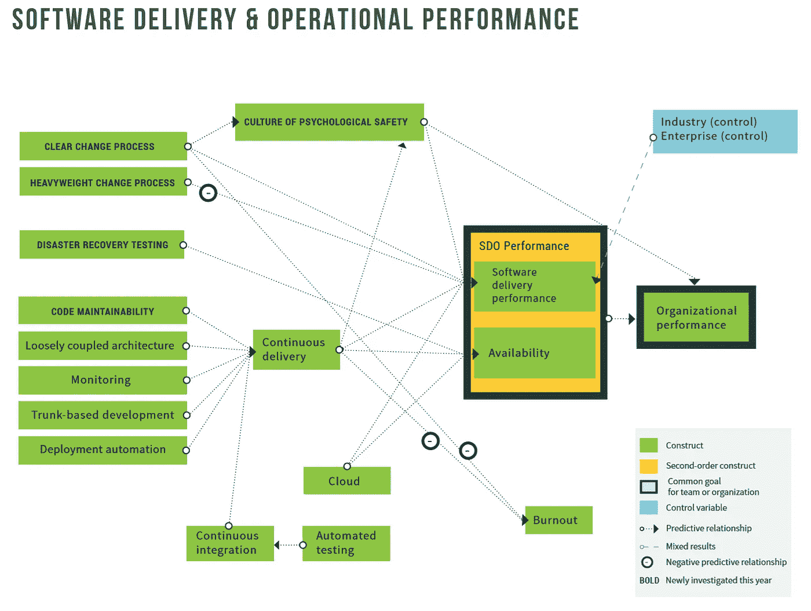

# 为持续集成和工作流优化软件开发过程

> 原文：<https://itnext.io/optimizing-the-software-development-process-for-continuous-integration-and-flow-of-work-56cf614b3f59?source=collection_archive---------4----------------------->

这篇文章是一系列文章的一部分，这些文章与软件开发行业在采用研究成果时遇到的困难有关。你可以阅读介绍性文章:[对 Dev-Fu 和过程清教主义的痴迷](https://medium.com/@mortensensc/the-obsession-with-dev-fu-and-process-puritanism-5b00676f3e24)(如果你还没有的话)来了解一点上下文。

在这篇文章中，我将深入一个开发过程，我发现它极大地优化了工作的持续集成和无摩擦的价值流。介绍性文章中详细概述了这些属性为什么重要的原因。

这里提供了一个简短的重要性回顾。(如果您已经阅读了介绍性文章，请跳到下一个标题:-))

在 2016 年 DevOps 报告中，您可以阅读:

> “我们发现，在被合并到主干之前具有非常短的生命周期(不到一天)的分支或分叉，以及总共少于三个活动分支，是连续交付的重要方面，并且都有助于更高的性能。每天将代码合并到主干或主数据库中也是如此。”

在[后来的作品](https://puppet.com/resources/report/state-of-devops-report/)中，这一发现被反复验证，而且比以往任何时候都更有说服力。似乎没有什么歧义。

基于 runk 的开发(TBD)和持续集成提高了软件交付的性能。

第 31 页，来自 DevOps 2019 加速状态

这不仅仅是一个积极的影响，这是对监控、部署自动化和代码可维护性的影响。

除非分支保持在最低限度并且非常短暂，否则软件交付性能的一些改进仍然是无法实现的。

先说清楚。DevOps 状态中显示的交付性能改进并不小…它们是两位数的改进乘数。

我认为持续集成和无摩擦的工作流是设计流程和工作流时最重要的优化措施。针对这些进行优化，似乎可以让其他一切都井井有条。

在这篇文章中，我将深入研究我发现做得最好的软件开发过程。注意，本文关注的是软件开发人员的日常工作，而不是周围的过程。即他们是否使用 Scrum、Safe、Shape Up、某种类型的瀑布或完全不同的东西，是(“在很大程度上”)与这里所描述的正交的。

我还忽略了使用什么样的 QA 机制，自动化测试的程度，手动与自动化的比率，单元与集成，因为我看不出做 TBD w. NBR 或特性分支与那部分的拉请求之间有什么不同。当然，这是一些差异，特别是如果比较聚与单一回购，但我会离开这些文章，因为字数已经令人生畏…

鉴于上述内容超出了讨论范围，让我们开始讨论吧。

# TBD·w·NBR

我发现在“mono”repo 中进行基于主干的开发时，摩擦最少，速度最快，CI/CD 值也最高。使用特性切换来实现和成熟特性。

评审是非阻塞的，能够从自动和手动测试中获得快速的反馈。

我相信这个过程有很多微妙的推动效应，累积起来会诱导人们使用更简单、更增量的解决方法。

生产中的“频繁部署”被认为隐含在这种“方法”(或方法组合)的目标中。但这种频率取决于许多因素，我不认为特定的部署频率是从“TBD·w·NBR”模型中获得大量价值的先决条件。

那么它实际上是如何工作的呢？

首先，它不应该被视为纯粹主义者。总会有例外…(我们痛苦地知道…即使是经过良好测试的代码也会有例外…)。像所有有趣的事情一样，看情况而定。

它是面向“80/20”规则的。也就是说，有一个占主导地位的默认行为/过程，但对处理偏差持开放态度。让我们通过评估通常以最小的成本或摩擦提供最大的价值来选择默认行为。不要让离群值或异常定义一个昂贵或乏味的过程，“以防万一”。

## 基于主干的开发(TBD)

TBD 的理念是，每个人都尽可能经常地将自己的改变整合到大师身上。

TBD 的重点是持续集成，即让每个人的工作与其他人的工作相集成。快点。一些团队发现拥有非常短暂的特性分支+拉请求非常有用。我将在后面解决这个问题，并且在这一节中，描述“直接提交给主服务器以接近所有更改”的过程。

TBD+CD 并不等同于持续交付生产。也就是说，并不要求所有提交都立即部署到生产中。也不要求 master 可以在任何时候意外部署。我已经多次遇到这种假设，因此想把它去掉。

TBD 允许发布分支(一次 1 个)。实际上，我会推荐使用发布分支，除非你真的在为每次提交进行连续的交付。(而且对你有好处！:-))

拥有尖峰分支和偶尔的“打破所有重构”分支也是好的。**然而**分支应该是短命的，分支应该是例外。在重构分支的情况下，这应该是一个罕见的事件。穗状分枝基本上可以被丢弃——再也不会被合并。90%以上的提交应该发生在主服务器上。不是在树枝上。

我的经验是，让临时/兼职开发人员(例如，学生工人每周工作 1 或 2 天)在分支机构工作可能是有利的。这样做的原因是，如果一个“兼职”开发人员为其他人破坏了一些东西，当它被发现时，他们通常不会在场帮助快速修复它。此外，预代码集成审查在这些情况下可能更相关，因为有更多的学习和指导发生。对于初级开发人员来说，后者也是一种可能的情况，但是我认为，在这种情况下，结对编程或亲自进行代码评审可以获得更多。

> 允许中断主/中继

打破主干是允许的——但你会感到尴尬，并有强烈的动机去避免它……当我说允许时，我的意思是人们可能会犯错误。疏忽大意是**不是**可以的。

一句不太上口的话…

被流程反复阻止和延迟与偶尔被某个人犯了错而阻止或延迟是有很大区别的。在我看来，在两者之间做出选择是显而易见的。

## 功能切换

当我在这里写[特性切换](https://martinfowler.com/articles/feature-toggles.html)时，需要注意一些事情。

一个是功能切换也可以很容易地使用时，做非 TBD。然而，在 TBD，这是一种更为关键的做法。在 TBD，你不能假装不需要功能切换。

> 功能分支是穷人的模块化架构。
> 它们不是构建能够在运行时/部署时
> 轻松换入和换出特性的系统
> ，而是将自己耦合到源代码控制
> ，通过手动合并提供这种机制
> 
> —丹·博达特

在 TBD，我们无法“忽略”关闭某个功能的需求。它需要被编织到我们如何开发东西的结构中，因为我们将有在制品(WIP)代码部署到生产中。因此，我们需要能够安全地关闭(和打开)它。

能够在不同的环境中切换不同的功能，使我们能够在测试环境中像婴儿和幼儿一样切换它们。当功能更加成熟时，它们可以在演示或预生产环境中切换，在生产中，我们可以为特定用户启用它，让功能从青少年发展到(希望如此)适应良好的成年人。(注意:并不要求所有功能都可以在特定于用户的级别上切换。)

理想情况下，特征切换是独立的，但通常现实世界并不理想。理论上，理论和实践是一样的。实际上，它们并不像爱因斯坦所说的那样。所以评估一下什么是有意义的，不要宗教化。
如果代码更简单，通过一个特性切换依赖于另一个特性的功能，这可能是一个很好的权衡。即为了降低复杂性而增加依赖性。

功能切换不需要任何高级或复杂的东西。实际上我建议不要这么做。一些功能在运行时打开/关闭可能非常复杂。如果你不需要那种能力，就不要承担复杂性。使用功能切换时，具有挑战性且重要的事情不是如何关闭和打开功能。这就是你如何逐步地构建东西并使之可移植。

## 非屏蔽评论

几年前，当我把一个团队搬到 TBD 时，我们就如何做评审进行了很多讨论。远离特性分支的主要问题之一是缺少作为审查手段的拉请求。

就我个人而言，我喜欢做评论，我发现从评论中可以获得非常重要的收获。如果所有人都参与其中，你会对正在发生的事情有一个共同的理解和感觉，你会发现偶尔的错误、误解或直接的失误。还有一种“有人要看我现在写的东西”的感觉——感性诱发。

代码审查似乎也对[早期缺陷检测](https://blog.codacy.com/impact-of-code-reviews-on-developer-productivity-and-code-quality-a-quantitative-assessment/)、[代码质量](https://blog.semmle.com/code-review-metrics/)和[知识共享](https://croz.net/news/0800-devops-9-code-review-breaking-monoliths-and-interview-with-emily-freeman/)产生了可衡量的积极影响。

我真的不希望在代码审查过程中，工作流被阻塞、延迟或中断。这将对增加批量和反馈周期时间产生推动效应。查看上面链接的一些发现，质量的提高并不依赖于“预集成”评审。(注意部署前审查的改进—而不是集成前)。

似乎[更多的评审评论= >更好的代码](https://blog.semmle.com/code-review-metrics/)获得更多评论的一个方法是让更多的人评审代码。然而，如果您有阻塞评审，那么您必须平衡阻塞评审的收益与代码和变更集成的中断和延迟的成本。非阻塞审核能够保持审核“开放供评论”的能力。让评审者在最合适的时候提供这些。

还有一个不太明显的，但是在我看来非常真实的推动作用，让评审作为一个安全网或者从一个开发人员到另一个开发人员的“责任转移”。无论是通过拉式请求还是在推式请求前亲自检查，情况都是如此。

> 你的变化打破了 X-某人
> 
> 井“审查者”审查并批准了它——提交者

**审稿人** …

这种交换有一些不良影响。

首先，“提交者”被哄骗到一种错误的安全感，认为评审者会“QA 它”。这可能导致提交者不彻底测试变更，清理变更，确保一切都“按书办事”，因为任何越轨或错误都会在评审中被发现。实际上，这可能会降低责任感和对变革的主人翁意识。

第二，审查者得到了令人生畏的(/不可能的)或潜在的极其耗时的任务，即确保除了“一切按常规进行”之外，代码更改没有破坏任何东西，没有遗漏任何测试，并且完成了适当的质量保证。

即使有一个连续的交付环境或者非常简单的方法来运行某些东西，使得(集成)测试变更成为可能，评审者仍然应该深入地理解所做的变更，潜在的副作用等等。如果审查者感觉责任和所有权被转移，这可能导致审查过度耗时和延误。

担心所有责任都被转移的审查者

根据我的经验，只有大约 10%的提交和变更真正值得详细的评审工作。这当然会因地而异。但是对于大多数人制作的面包和黄油代码来说，我相信将你的大部分精力花在少数几个重要的评审上比将你的精力平均分配在所有评审上要好得多。(研究表明，每小时审查更多的代码行，会大大降低缺陷消除的效率。即我们从评论中得到什么。所以明智地使用复习时间，会对质量产生很大的影响。( [*设计和代码评审对软件质量的影响:基于 PSP 数据的实证研究— 2009*](https://www.pitt.edu/~ckemerer/PSP_Data.pdf) )

通常你可以很快识别出重要的。基本上是通过浏览提交的内容，找出“奇怪的”事情或一些需要花更多时间的事情。80%或更多的评审都是轻而易举地完成的——让它们阻塞将是一种浪费，并引入不必要的延迟，以获得集成的变更，并可用于反馈和测试。

即使有快速审查拉式请求的良好文化，在 NBR 中，通过将代码集成到测试中，反馈的速度仍然有所提高。在评审结束或开始之前。如果评审者正在开会，请病假，真的忙于一个 bug 或者其他的处理，他们不需要被打断，打扰或者被要求上下文切换，以确保改变能够被整合。(或者，查看被阻止的工作流)

对于经验不太丰富的程序员来说，审查是一个阅读大量代码的好机会——接触未知的事物和做事的方式。同样，这是在没有阻塞工作流的情况下应该获得的收益。

通过结对编程，或者通过在集成之后检查提交或特性，可以进行非阻塞审查。这些都是非常好的做法。但是现在有了工具，允许非阻塞/后代码集成审查。不幸的是，在 https://trunkbaseddevelopment.com/continuous-review/还没有提到，但我真的希望看到更多支持 NBR 或后代码集成审查的工具。

JetBrains(【https://www.jetbrains.com/Upsource/】T2)的 upsource 就是这样一个工具(没有从属关系)。尽管它非常简单，但它支持一个非常简单的工作流，这个工作流很好地支持了 TBD·w·NBR。我已经在不同的团队中使用它好几年了。

您可以设置 Upsource 为每个提交创建审核，将提交添加到现有审核中(如果标记了票证/任务编号，例如通过#前缀)。您可以设置应该分配多少个审阅者。和各种其他特征。

它支持有一个仪表板显示待定的审查，提出的关注等。仪表板上有一些额外的功能会很好——而且有迹象表明它们可能会在其他地方膨胀。但是现在，它是一个非常好的工具，可以进行无阻碍的评论，并保持跟踪。许多人可能会对审查以后可能会改变的东西保持警惕(例如，审查一个提交，在以后的提交中已经修复了一个 bug)。然而，我认为从 CI、及早发现问题和 WIP 意识中获得的收益大大超过了偶尔的多余审查。我宁愿一个球被接住两次，也不愿它掉到地上。

应该注意的是，确保评论不堆积是一项非常重要的文化任务。我认为可视化会有所帮助。使用拉请求时的阻塞有一个内置的提示(/胡萝卜),让提交者去唠叨(/鞭笞)评审者。使用配置项后检查时不会出现这种情况。所以这是团队应该意识到并关注的事情。

如果要求在代码进入预编程或生产之前对其进行审查，这就是一把锤子。

而羞耻心也多少有些效率。

## 连续交付测试

向测试环境连续交付所有集成的代码是非常有用的。

当人们谈论连续交付时，有被术语“连续交付到生产”所困扰的风险。然而，通过向测试环境连续交付，已经获得了大部分的好处。这通常意味着部署到生产环境中也变得例行公事。

如果正确地使用连续交付到测试，它可以减少来自“非编码者”的反馈延迟，失败(并修复)-如果某些东西坏了，快速，容易审查“特性”(而不仅仅是代码，审查者可以在测试中查找并尝试它)。最后，它迫使开发人员保持应用程序/系统/集成的工作版本运行，确保模拟、存根和始终可用的测试数据。

我见过很多次人们“优先化/优化”测试环境设置，将它推迟到某个 QA 阶段。每当 QA 阶段临近，人们开始设置测试环境时，一切都会爆发。依赖性被忽略了。仿制品和存根不见了。没有“后门”或功能切换的假人或类似的已经推出。最后，“你的”特性所依赖的另一个特性被延迟了，因为没有引入解耦/模仿，你的特性无法被测试。我数不清有多少次硬编码的 json 或集成端点中的类似虚拟数据挽救了局面。

我甚至看到磁盘上的 json-documents 在生产中被用作外部服务的实际端点的替代物。外部服务不断被延迟，在启动阶段有一个每日更新的文件是好的。

让测试环境一直运行，可以减少尝试一些东西或者向其他团队成员、同事或者最终用户展示一些东西时的摩擦。因此，快速调查直觉、错误或系统如何工作，需要更少的努力，因此更有可能发生。它支持“[发明原理](https://www.youtube.com/watch?v=PUv66718DII)中描述的一些“即时反馈”，这是 CI/CD 的核心优势之一。

## 单核细胞增多症或肥大性回购

我喜欢在一个存储库中有多个相关的服务，使人们能够以“一致”的状态检查所有的东西。CI/CD 流程也得到简化。然而，我不同意单一回购要求整个公司只有一个存储库的观点。在我看来，这是关于使存储库尽可能的大，而不是，我有很多人认为他们需要的印象；[让它们尽可能小，尽可能“单一服务”](https://softwareengineering.stackexchange.com/questions/386066/how-to-structure-microservices-in-your-repository)。通过将服务放在不同的存储库中来分离服务会引入很多额外的复杂性，这应该是值得的。你也错过了一个庞大的单一回购中的许多机会。

出于某种原因，人们开始痴迷于拥有尽可能小的存储库。这似乎有各种各样的原因。有些人认为每个资源库只能有一个[可构建/可部署/容器——因此得出结论，拥有多个服务是不可能的。或者至少，如果东西在同一个存储库中，它应该同时被部署。](https://hashnode.com/post/choosing-between-one-project-per-repository-vs-multiple-projects-per-repository-architecture-cj8kmhmdy012800wu62v3x48v)

另一种观点认为，在一个存储库中拥有多种服务或功能[等同于构建一个整体](https://blog.nrwl.io/misconceptions-about-monorepos-monorepo-monolith-df1250d4b03c)(这被隐含地认为是非常糟糕的实践)。或者，如果不是一个 VCS 独石，它将冒着诱惑开发人员跨越服务或责任之间的界限的风险。([缺点 1:紧耦合和 OSS](https://medium.com/@mattklein123/monorepos-please-dont-e9a279be011b) )

许多人还提到回购的规模和对冲突的担忧。

正如我在开始时提到的，我不会花这一“章节”来批评，我不会在这里解决上述问题。其中一些将在[“姊妹文章”](https://medium.com/@mortensensc/how-feature-branches-and-pull-requests-work-against-best-practice-a13a85a016ef)中讨论。

人们可能会提供一些其他原因——但基本上我不认为聚回购或纳米回购的优势远远超过庞大回购的优势。换句话说，我认为没有必要为更小的存储库而奋斗。在有疑问的情况下，宁可选择更大的存储库。

我在这里没有说，服务不能存在于它们自己的存储库中。肯定会有。这是有充分理由的。然而，我会避开它作为一个默认的决定，而是默认将代码放在同一个存储库中或者几个大的存储库中。然后当实际需要出现时，将“单一服务存储库”作为一个例外来处理。

在单个回购中拥有“所有”相关代码有很多好处。横切变更可以在单个原子提交或相关的提交中完成(下一节将详细介绍)。

还有一些与能够对库或共享 API 模型/规范进行简单关联相关的优势。不需要人们更新一个共享的包，发布它，更新它的引用，而且不能在变化中测试它，可以使用一个简单得多的“快速反馈”的工作流程。简单地做改变，如果你打破了什么，你会很快知道，你会很快做出改变。调试共享包更简单，应用一个补丁并把它从所有使用它的地方取出来更简单。

与聚合或微回购相比，大规模回购能够实现更快的迭代、更好/更简单的工作一致性和更简单的原子横切变化。不过，这确实会带来一些重大后果。对共享代码的更改会更快地破坏其他组件或服务。然而，这种成本实际上是一种好处——因为它鼓励以更好的方式实施变更，并且修复其他组件实际上可以作为变更的一部分来完成。但是和其他事情一样。看情况。也许版本化的包在您的特定情况下更好，但是我发现大多数情况下，系统环境中 80%以上的共享代码都不是这样。

在许多不同的服务共享包的情况下，版本控制更为重要——向后兼容也很重要。但是(广义地说)对于大多数服务/应用耦合来说，这种耦合是一对一的，或者说是一对一的。在索伦·劳森对一个使用 SOA 的大型项目的研究中，有一个相关的发现。在大约 1600 个服务中，大约 100 个被重用了一次，只有 20 个被重用了几次。

> 承诺是您可以预先以逻辑和面向业务的方式定义服务，并在许多项目中重用它们。实际情况并非如此。集成平台获得了 1600 项服务。其中大约 100 个重复使用了一次，20 个重复使用了几次。其余的基本上都是点对点连接。此外，当一个系统所依赖的一个系统出现故障时，该系统的性能很低，可用性也很脆弱。为了提供足够的可用性，系统复制属于其他系统的数据。
> [-大型政府 IT 项目中的损坏和损坏原因— 4。讨债，起因 A5。](https://www.itu.dk/~slauesen/Papers/DamageCaseStories_Latest.pdf)

对 1600 个服务强制实施相当大的开销(如报告中其他地方所见)，即使重用需求只适用于 100%(= 6%)显然不是一个设计良好的商业案例。后来的事实证明:

> 雄心勃勃的 SOA 需求并不是真正的客户需求，而是由客户顾问的 IT 架构师实施的理想主义概念。用一些务实的东西取代这些理想花了很长时间，而且增加了成本和时间。

因此，不要将工作设计成“最复杂的分母”，而是将异常作为异常来处理，保持一切简单，并采用针对服务之间一对一耦合的默认情况而优化的流程——或者根本不拆分到服务。或者至少不要把它们放在不同的存储库中，如果它们应该或者能够总是保持同步的话。做到这一点的一个方法是使横向变化变得简单，这就是大规模回购的情况。

我认为单一/庞大回购的主要优势是:

*   诱导更多的共享代码所有权
*   更容易进行跨职能变革
*   更容易确定要更改什么，(通过查看类似的先前更改的提交)
*   更容易进行全栈测试
*   横切变更的原子变更
*   轻松的依赖性管理(自我兼容)
*   通过 Git 历史记录的文档——也适用于横切变更
*   减少分支和“最新”混淆。

当然，在没有必要或不可取的情况下，人们将组件或代码耦合在一起是有风险的。这是团队在评审中应该注意的事情。

然而，我认为这种风险被夸大了，而且在任何情况下，我都不认为“储存库策略”是针对这个问题的最佳对策的前三名。我还希望有更多的时间用于这些对策和审查，因为花在担心将几个存储库保持在“相同”分支上的时间要少得多，所有的存储库都是最新的…并且在发现一个或多个存储库由于错误的分支或遗漏的拉取而没有处于预期状态时进行清理…

## 几个原则

最后，我想充实一下与 TBD·w·国家经济研究局所描述的方法相关的一些内在原则。

我们感觉到大脑中声音的许多选择:

> …作为一名专业的现代开发人员，我应该…

或者当我们感到来自他人的评判在我们头顶盘旋时，我们应该停下来思考。这些时刻往往与是否投入额外的努力或成本来实现某件事有关。通常是一些我们可能还不需要的，深奥的或者不太具体的长期收益。例如服务的独立部署时间表、组织的可伸缩性、系统的可伸缩性或质量诱导过程。

只有当我们确实需要时，才应该投入额外的努力或成本。如果你有一个 10 个用户的简单后台系统，那么请不要把重点放在水平伸缩上，也不要把它作为 docker+openshift 的论据。在这种情况下，正常运行时间可能也不重要。

> 只为你真正需要的东西付出努力或成本。你要用。

我知道这似乎是不言自明的。然而，我惊奇地(令人震惊地)经常发现事实并非如此……(我以前的大部分作品都是关于这个的。是的。这是我[最讨厌的事情之一](/value-driven-technical-decisions-in-software-development-c6736f74167)

不相信 TBD·w·NBR 的上述描述和所提供的随大流的理由？然后让我们进入为什么我认为纯粹主义特性分支&拉式请求(FB&PR)是，如果不是坏的实践，至少引入了许多适得其反的过程并阻碍了软件交付性能。没有障碍你会做得更好。

本系列的下一篇文章:[特性分支和拉请求如何违背最佳实践](https://medium.com/@mortensensc/how-feature-branches-and-pull-requests-work-against-best-practice-a13a85a016ef)