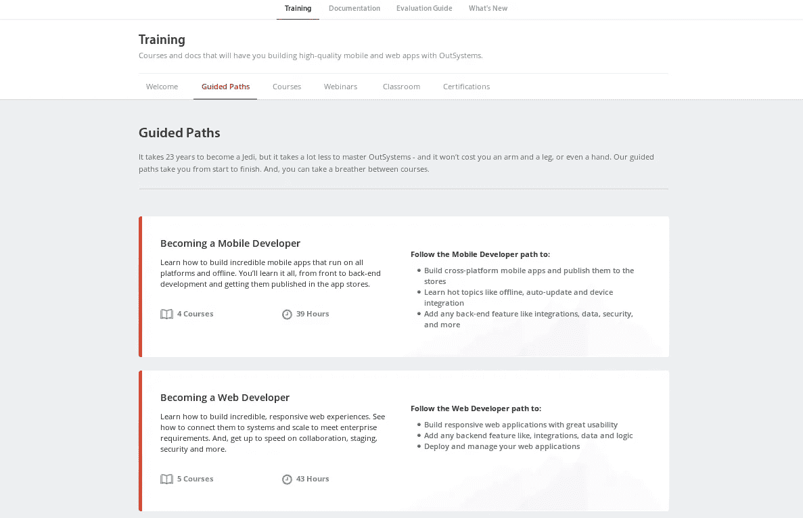
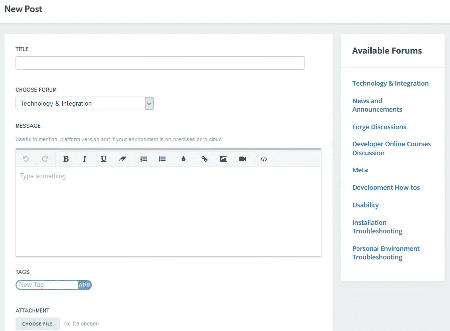

# 外部系统“如何”#1

> 原文：<https://itnext.io/outsystems-how-to-1-2c677f7efb8d?source=collection_archive---------4----------------------->

## 如何寻求帮助…

所以，你有一个问题，并正在考虑把它张贴到 [OutSystems 论坛](https://www.outsystems.com/forums/)？酷！论坛是社区的一部分，它的主要目的是提供一个地方，让我们这些系统外的开发者可以互相帮助，分享知识和经验。对每个人来说，问题是[学习新东西的机会](https://medium.com/@renato0307/learning-from-the-outsystems-forum-series-d6ea7db06bfc)！

但是(总有但是吧？)，在你提问之前，让我们花点时间来看看如何提出一个既能直截了当又能及时得到答案的问题。

# 你真的知道如何编码吗？

如果这个问题的答案是“不”，请注意:论坛不是你学习基础知识的合适地方。

正如一位教授曾经告诉我的那样:“要想提出一个好问题，你必须对你要问的问题有所了解。”

如果你在没有编程基础知识的情况下编程，你会很快走进死胡同，并且很难在论坛上得到帮助。你很难解释这个问题。对你来说理解这些答案是困难的。

先花点时间学习编程的基本原理。从长远来看，这将是非常有益的。

# 你完成培训了吗？

这是 OutSystems 网站学习区的打印屏幕。

这里我真的需要指出一件很重要的事情。有很多热心的人提出了很多问题，他们渴望用外部系统构建很酷的应用程序，但是在他们所有的兴奋中，他们似乎不记得你需要在实际使用工具之前学习如何使用它。

是的。在论坛上提问之前，问问自己是否已经参加了 OutSystems 培训。还没有？所以，去拿吧！你可以做现场培训或者[在线培训](https://www.outsystems.com/learn/)(这个是免费的……)。

为什么？因为适当的培训是在外部系统中开始制作酷应用的最快方式，因为它遵循逻辑路径并且高度优化。因为经常在论坛中提供帮助的人通常会对那些答案就在培训材料中的问题感到非常沮丧…

所以…不要找借口！接受培训！

# 文档呢？

哦，是的… OutSystems 有很多文档供你在需要的时候查阅。学习新的东西。或者只是为了好玩。对你最合适的。

这里有一个非常重要的环节是你不应该错过的:[https://success.outsystems.com/Documentation](https://success.outsystems.com/Documentation)

除了问题本身，当问题表明正在努力解决问题时，社区会更愿意提供帮助。

# 我是第一个问这个问题的吗？

虽然这是可能的，但这个元问题的答案很可能是否定的！😜除非你的问题是关于某事，否则它不符合你自己的逻辑。即使这样…

那么，你现在该怎么办？

使用搜索功能。一遍又一遍地搜索所有内容，尝试不同的关键字组合。如果你更喜欢使用搜索引擎(如 DuckDuckGo、Google、Bing 等)，记得在搜索中包含关键字“OutSystems”。

学习搜索是开发人员的一项重要技能。

# 问题是…

当在搜索阶段找不到问题的答案时，就该在论坛上提问了。

每个问题可能需要不同的方法，这取决于问的是什么。因此，为了便于理解什么是(可能)解决问题的最佳方法，让我们将典型问题分成三个不同的类别:

**a)***它不工作了……”。*当有一个代码，但它没有按预期运行时，人们会问这些问题。没有比这更难回答的问题了。当你的代码面临一个你无法解决的问题时，你需要以正确的方式提供所有最重要的信息，否则将会花费社区大量的时间来弄清楚发生了什么。在下一节(*如何提问*)中，你会发现在论坛中提问时你应该遵循的一些最佳实践。

**b)** *“怎么…？”。在 OutSystems 论坛上，这些问题经常出现。它们通常有两种味道:*“如何* ***实现*** *某事”*(逻辑)和*“如何* ***使用*** *某事”*(大多数时候是一个锻造的组件，或者一个声明/小部件)。通常这两个问题都不难回答，除非它与 Forge 组件有关。然而，你需要表明你正在尝试(以及你在哪里搜索文档，等等)。对于这种类型的问题，这是非常重要的。*

有人能解释一下吗？。像这样的问题通常是关于平台本身的工作方式。你可以说是理论。通常，当人们需要了解平台的“内部结构”时，就会发布这些信息，因为它会对应用程序的行为产生影响，而这些信息在任何地方都找不到。这些问题很难回答，因为不是每个人都知道事情在幕后是如何运作的。这些问题可能需要更长时间才能得到答案。

# 如何提问？

如果你在准备问题时遵循下面的列表，你就能得到一个好的答案。

1.  信息太少是不好的。
2.  信息太多不好。
3.  如果适用，告知问题是在 **Web** 还是**移动**应用程序(iOS 或 Android)中，是在个人还是企业环境中，服务器是在云中还是在本地，以及平台服务器和 Service Studio 的版本。
4.  试着在[新帖](https://www.outsystems.com/forums/Forum_Post_CreateEdit.aspx)页面中了解你所拥有的信息。你可以选择一个特定的论坛来张贴你的问题，添加标签和附加文件。这将有助于提供关于您的问题的易于查看的信息。
5.  如果问题是关于 Forge 组件/应用程序的，在组件的子论坛中提问(通过组件的支持选项卡)。
6.  简单地解释一下你想要达到的目标。换句话说，给**上下文**。对你需要达到的目标的总体描述允许社区提供你正在尝试做的事情的替代方案。
7.  简要地解释你已经尝试过的，以及预期的结果和实际的结果。
8.  提供错误消息(服务中心)和调试信息。
9.  这是一个问题，你还没有调试？在张贴问题之前这样做是个好主意，因为你(可能)会被要求这样做。
10.  如果你试图解决的是一个“错误”或者一个奇怪的行为，提供一个最小功能的应用程序来重现这个问题。这也会帮助你对问题提供更好的解释，甚至解决问题。
11.  图像会有所帮助，我们鼓励你使用它们，但是它会提供上下文或者很难解释它们。
12.  如果有人用你的问题的答案解决了你的问题，把它标记为解决方案。这样在搜索类似问题时会对别人有所帮助。

新文章页面。

按钮将文章标记为解决方案。

# 你应该不惜一切代价避免什么？

是的，有些事情你应该不惜一切代价避免。

*   不要复活旧帖子。死帖是几个月以来不活跃的帖子。如果你发现一个与你的问题相关的帖子(并且它是不活跃的)，创建一个新的，并放置一个旧的引用。这将有助于社区找到你的问题，因为一个没有回复的帖子比一个有 10 个以上回复的帖子更突出，而一个已经标记为已解决的帖子将得到更少的关注。此外，保持死者…嗯…死亡，可以帮助防止僵尸启示录。😜
    ***附:这条规则有一个例外:如果这个职位还不算太老，而你正面临着同样的问题或者有同样的疑问(或者可能是解决方案)，并且还没有解决方案。***
*   尽量把不同的问题放在不同的帖子里。这将帮助其他人找到类似问题的答案。你会得到更好的帮助。
*   永远保持尊重。如果你认为有人对你不尊重，忽略它或者如果问题升级，通过[community@outsystems.com](mailto:community@outsystems.com)与外部系统对话。他们可能没有意识到这个问题。每个人都想要一个没有压力的地方。我们在寻找帮助和学习机会，而不是更多的问题。我们工作中的压力已经够大了，你不觉得吗？
*   此外，如果你期待一个教程，“如何做一个特定类型的应用程序”不是一个合适的论坛问题。社区无法给你一个满意的答案。相反，如果您需要一些关于如何在外部系统中实现某些东西的指导，请询问方向。运气好的话，社区里有人已经在做类似的工作了，他会给你一些指导。

# 结束(或开始)

正如本文开头所述，社区是外部系统开发人员分享知识和经验的地方。为了做到这一点，遵循一些规则是很重要的。OutSystems 社区有一个[行为准则](https://www.outsystems.com/forums/discussion/27050/outsystems-community-code-of-conduct/)，你应该阅读并遵守。

对此有什么想法吗？我很想听你亲口说。😉

*免责声明:我在文章中表达的任何建议或观点是我的全部责任，可能反映也可能不反映其他人(个人或公司)的观点。*