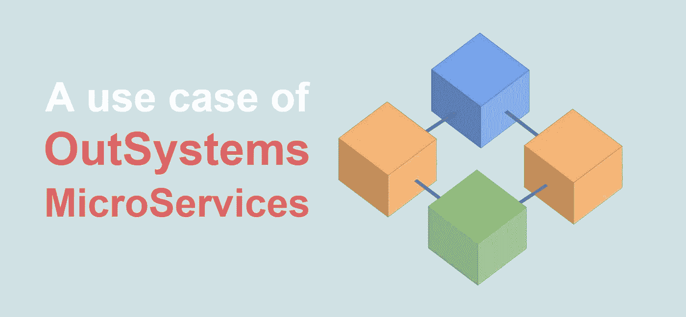
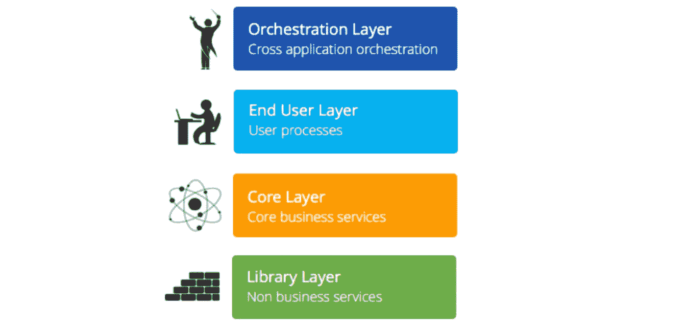
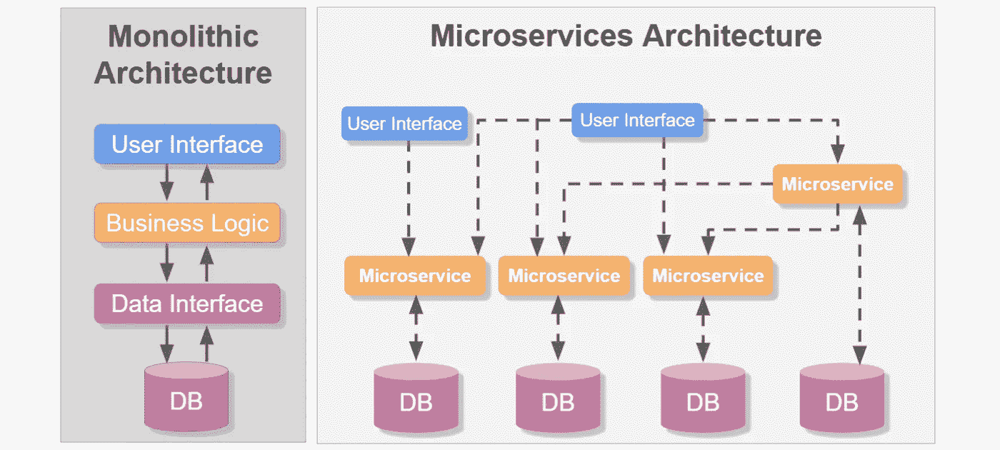
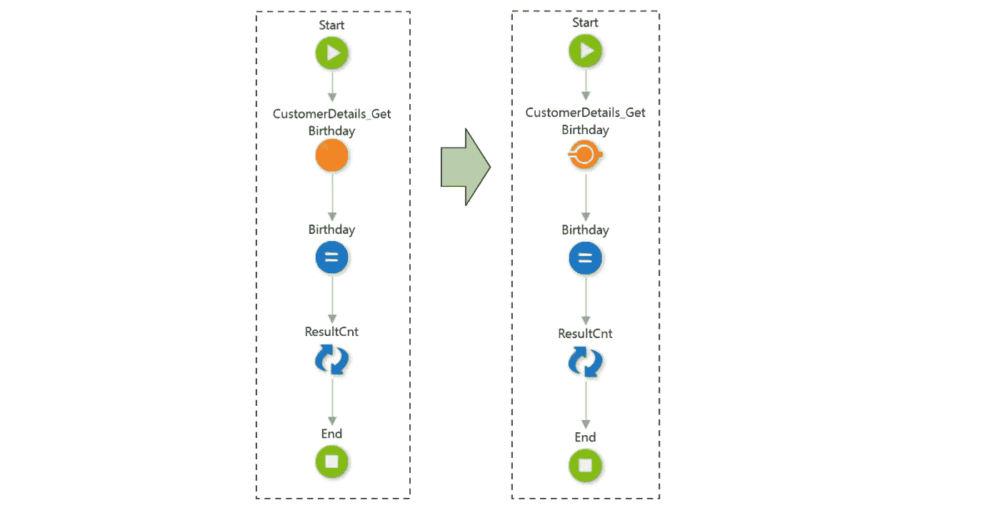

# OutSystems 微服务架构—用例

> 原文：<https://itnext.io/outsystems-microservices-architecture-use-case-edf522608077?source=collection_archive---------3----------------------->

本文展示了外部系统技术中微服务架构的一个可能的用例。此示例基于一家零售公司及其遵守 GDPR 法规的挑战。

# 1.开始前的基础知识

记住以下概念会让你的阅读变得容易得多。

## a)4 层画布

启动应用程序时，OutSystems 建议基于 4 层画布定义架构。该模型有助于抽象概念和隔离功能模块的实现*(参见* [*更多*](https://success.outsystems.com/Support/Enterprise_Customers/Maintenance_and_Operations/Designing_the_architecture_of_your_OutSystems_applications/01_The_4_Layer_Canvas) *)* 。

4 层画布

本文将关注蓝色(用户界面)和橙色(业务服务)模块，因为这些模块是外部系统中微服务架构的主要目标。

## b)4 项微服务原则

在定义微服务时，通常采用一套原则。有四个重要的原则，将在下面解释。

4 个微服务原则

> 重用组件会产生依赖性，有时最好使用副本
> 
> -由于实时依赖性，应避免同步调用
> 
> -当解耦模块共享数据时，应支持数据复制
> 
> -服务发现有助于在运行时发现修改的和新的服务

还有更多原则，但它们不在本文的讨论范围内。

## c)单声道与微型架构

在整体架构中，模块之间存在强耦合连接，而微服务架构模块是松散耦合的。

单一与微型架构

由于多种因素，大多数应用程序都有一个整体架构。在某些情况下，外部系统架构师需要不同的方法，比如微服务策略，来构建适合大规模企业的解决方案。

# 2.实际使用案例

我们的用例来自一个真实的案例场景。这里我们关注一个更广泛问题的子集。这个子集包含足够的概念来演示微服务的实现，使用 OutSystems 平台版本 11*的一些新功能(参见* [*此处*](https://success.outsystems.com/Documentation/11/New_in_OutSystems_11) *)* 。

该用例来自一家大型零售公司，该公司有几个虚拟和实体商店，由许多部门组成。从这些部门中，我们将选择销售、财务和营销部门进行建模。

## a)挑战

该公司面临的挑战是遵守 GDPR 全球数据保护法规。这是一套公司需要遵守的关于个人数据隐私的规则。我们选择了 GDPR 的一个方面来展示我们的用例，只有在需要的时候才可以恢复它来维护用户数据。

特别是，这家公司决定不保留用户敏感数据的记录，这些数据没有被用作出生年份。他们只需要客户的出生日期和月份，就可以向他们提供年度礼物(出生年份没有必要)。

## b)问题

为了确保这种一致性(避免使用和存储用户的出生年份)，开发人员必须改变他们系统的一部分。然而，将这种变化应用到某些系统会影响到大多数其他系统，所有系统都需要同时部署到生产环境中。

下图显示了此使用案例的范围。在这里，我们的重点是来自销售、财务和营销部门的应用程序，它们是整体架构的一部分。箭头表示部门和客户应用程序之间的强类型关系。像这样的架构是很难改变的，因为模块之间存在很强的联系。

部门和核心应用程序之间的问题(子集)。

更改客户应用程序操作内容的结果会对部门应用程序产生直接影响。正如我们在下面看到的，消费者应用程序有过时的引用。

改变客户应用时过时消费者的后果

## 解决方案

在这种情况下，微服务架构方法解决了这个问题。因为在所有应用程序中没有很强的依赖性，它允许将来在不改变整个应用程序的情况下改变一些模块。

由于这个架构还没有到位，最初我们需要过渡到微服务架构，然后实现规则。因此，它简化了未来的变化。

可以采取以下方法:

> c.1)设计以适应松散耦合模块的应用
> 
> c.2)构建向微服务架构的过渡
> 
> c.3)在模块上实施进一步的变更增量

可以存在其他方法，这只是一个例子。为了更好地理解每个步骤，让我们来看一下这种方法的细节:

**c.1)** 在考虑微服务的规模和范围时，请遵循以下规则:

> -不存在“一刀切”的想法
> 
> -应与业务领域保持一致
> 
> -取决于团队的规模和能力

在大多数情况下，我们需要一个过渡架构。这对于每个人理解这一变化的目标是至关重要的。只有这样，团队才能自治，独立地构建他们的微服务，知道何时以及如何为这种变化而协作。

下图显示了应用于我们的用例的架构转换示例，从单片应用程序到微服务应用程序。

转换体系结构，其中强类型关系被松散耦合的关系所取代，核心客户应用程序被复制和/或更改，以向部门应用程序提供新型服务。

由于几个系统中的大量变化，过渡架构主要用于企业系统中。但是任何企业规模的项目都将受益于这种转换架构。

最终目标是拥有一个模块化的架构。因为未来的变化可以作为功能的增加而发生，模块之间没有太多的依赖关系。

在这个用例场景中，旧的核心应用程序客户需要被新的客户应用程序替换。其中每个部门用户界面应用程序包含与核心应用程序客户的松散耦合关系。这种松散耦合的连接是通过外部系统中的服务动作来完成的。

具有核心应用程序和连接的微服务架构被松散耦合的服务所取代。

为了实现这种架构，外部系统在平台 11 内部提供了新的元素，称为服务动作，具有以下特征:

> -松散耦合的动作元素
> 
> -在单独的事务中运行
> 
> -发布后立即可用

# 3.示范

我们将使用 OutSystems platform(版本 11)来演示我们的案例，并实现一个微服务架构。本演示的目的并不广泛，而是参考该平台提供的功能。

## a)实施

要实现这个架构，需要几个步骤。但是下面描述了其中的一些，以演示如何在 OutSytems Service Studio 中使用微服务:

> a.1)为客户应用程序创建一个新模块，并选择模块类型“服务”(也可以复制现有模块)。

> a.2)重命名旧模块 Customer 以添加后缀“_ 已弃用”。
> 
> a.3)在客户模块中，在分隔符“逻辑”下方和服务器操作文件夹中，基于服务操作创建服务操作。有三个可用选项:创建新的服务操作、复制现有的服务器操作或移动服务器操作(从文件夹服务器操作到文件夹服务操作)。

> a.4)为新的服务器操作添加必要的功能，并发布模块 Customer。
> 
> a.5)然后在用户界面模块中，刷新和更新依赖关系。

> a.6)在每个用户界面模块中，用新的服务操作替换旧的服务器操作。
> 
> a.7)并调整现有屏幕逻辑以使用新的服务动作。

> a.8)发布模块并验证/测试实施变更。

这些步骤是在外部系统中实现微服务架构的一个例子。

## b)好奇心

在将应用程序迁移到微服务时，一些对开发人员有用的特性:

> -在服务器/服务之间移动操作
> 
> -将空间转化为服务
> 
> -禁用代码中的元素
> 
> -服务变更签名/内容的影响

## c)依赖性

在修改核心模块客户后，要更改服务操作的内容，影响分析没有返回任何警告。这是因为没有任何相关的改变，也没有预期的影响。

使用松散耦合关系的优点是，当我们改变核心模块动作的内容(作为服务行为)时，该动作的消费者应用程序将不会有引用影响(因为没有关键的东西被改变)。签名坚持认为，改变的是行为。

但是，请注意，当更改服务签名时，服务可能不再兼容。*真实变化*将提供一个警告。然后，我们需要验证签名更改对消费者使用的服务操作没有影响。即使签名发生变化，我们决定不重新发布消费者模块，应用程序仍然可以在不重新发布消费者模块的情况下部署。

服务动作内容(行为)的任何变化都会立即反映在消费者身上(在运行时)。这样做的好处是不需要发布所有的消费者，只需要改变系统的一部分。但是也可能带来一些风险，开发者需要考虑这些风险。

# 4.其他主题

除了上面提到的主题之外，为了完整地参考 OutSystems 中的微服务架构，还需要涉及许多其他主题。

这些主题被排除在本文之外，因为这里的目标只是给出一个简单的例子，而不是探讨与分布式系统相关的典型问题，例如:

> -可扩展性(*)
> 
> -交易
> 
> -网络
> 
> -基础设施
> 
> *(*)* 阅读另一篇文章([此处](https://medium.com/@marcoarede/outsystems-microservices-architectures-performance-guidelines-202ef03af611))，关于微服务指南。

# 5.摘要

本文展示了微服务架构在 OutSystems 中的实现，以解释它们在真实场景中的优势。

OutSystems Platform 11 最有趣的特性是本机服务发现工具，它可以在运行时轻松发现新的或修改过的服务。它允许微服务在大型企业应用程序组合中扩展。

总而言之，微服务架构的优势在于:

> -微服务支持快速开发
> 
> -微服务可以独立修改
> 
> -微服务可以独立扩展

# 6.参考

文章内容于 2018 年 10 月 16 日在荷兰的 meetup 上发布(链接[此处](https://www.meetup.com/nl-NL/Netherlands-Outsystems-Community-Meetup/events/247538140/))。

其他参考文件:

> [外部系统 4 层画布](https://success.outsystems.com/Support/Enterprise_Customers/Maintenance_and_Operations/Designing_the_architecture_of_your_OutSystems_applications/01_The_4_Layer_Canvas)
> 
> [使用服务公开功能](https://success.outsystems.com/Documentation/11/Developing_an_Application/Reuse_and_Refactor/Use_Services_to_Expose_Functionality?utm_source=ost-outsystems+tools&utm_medium=ost-servicestudio&utm_campaign=ost-docrouter&utm_content=ost-helpid-30180&utm_term=ost-contextualhelp#Dealing_with_transactionality_and_networking)
> 
> [OutSystems 微服务架构](https://success.outsystems.com/Support/Enterprise_Customers/Maintenance_and_Operations/Designing_the_architecture_of_your_OutSystems_applications/Microservices_Architecture_in_OutSystems)