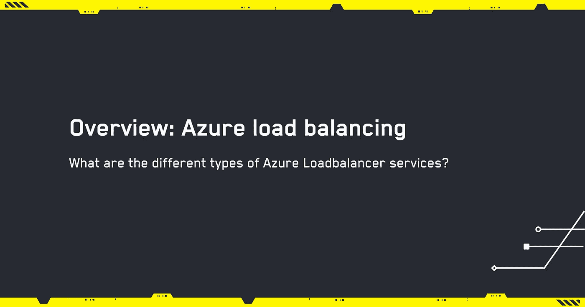

# 概述:Azure 负载平衡

> 原文：<https://itnext.io/overview-azure-load-balancing-5827da0bf14d?source=collection_archive---------1----------------------->

## 有哪些不同类型的 Azure 负载平衡器服务？

# 为什么要写另一篇负载平衡器的文章呢？

在写这篇文章的时候，我正在准备我的 Azure 基础考试。现在，我已经作为一名开发人员以专业和个人的身份与 Azure 一起工作了一段时间。当查看所有类型的服务时，我发现 Azure 负载平衡和网关产品的命名约定有点令人困惑，它们做什么，以及何时使用它们。

# 谁会觉得这个有用？

不熟悉 Azure 或者只是想快速浏览一下的人。网上有一些很棒的参考资料，Azure 门户确实提供了一个向导/问卷来决定一个适合你的解决方案的负载平衡解决方案。

## 什么是负载平衡器？

一个基本的使用案例是，假设您有一个虚拟机或一个应用程序实例，并且存在流量高峰时间，或者它是一项关键服务，如果它的唯一实例不可用，将会发生不好的事情。或者您希望在区域或全球级别为所有入站流量设置特定的路由规则和安全性。这就是负载平衡器的用武之地。如果后端服务的一个实例出现故障，流量将被路由并发送到该服务的下一个可用的健康实例，这有助于流量分配。

在最高层次上，它是一个路由入站流量并将其分发到其后端实例的软件。根据服务的不同，它可以公开、私有或两者都公开。使用前端和后端的概念，其中前端是对其进行调用的服务/机器，后端是向负载平衡器注册的服务或虚拟机，以便将流量分配给它们。它还可以充当系统中的单一入口点。请注意，您选择的 Azure 负载平衡器的类型还取决于您系统的地理分布，如全球、单个或多区域。

服务流量的协议类型会影响您选择的负载平衡器的类型。这就是 OSI 模型的用武之地，即使您只是一名开发业务应用程序的开发人员，我也强烈建议您熟悉 OSI 模型。出于本文的目的，我们只对第 4 层和第 7 层感兴趣。

供参考:

## 什么会影响解决方案的类型？

决定负载平衡解决方案时要考虑的因素包括:

*   所有服务都在云中运行还是这是一个混合云环境？
*   流量是通过外部(公共互联网)还是内部(在 VNet 内或通过 VNet 对等)发送到您的应用程序，或者两者都有？
*   您需要在 OSI 模型的哪一层(第 4 层或第 7 层)平衡流量？
*   系统的地理分布，即全球、单一或多区域。

## 负载平衡器的类型

在撰写本文时，这是负载平衡服务的列表，我想指出的是，这些服务中的每一项都有更多的详细信息，我鼓励您参考每项服务的官方文档，如果一起研究，可能会让人不知所措，尤其是如果您以前从未在云环境中工作过。所以现在简短的总结就可以了。

## 第 4 层

## Azure 负载平衡器

最常用于作为后端的虚拟机池，具有路由规则、流量管理器、端口转发和运行状况探测等功能。在这里，您可以根据端口或 IP 地址来路由流量。它有 3 个 SKU:标准、基本和网关负载平衡器。

在撰写本文时，有一个[跨区域负载平衡器](https://learn.microsoft.com/en-us/azure/load-balancer/cross-region-overview)功能正在预览中，它使负载平衡器能够跨区域而不是单个区域进行平衡。

## 第 7 层

## Azure 应用程序网关

特定于地区且必须在 VNET 中部署的服务。它的后端可以是虚拟机、Azure 应用服务和变体、IP FQDN，在 Kubernetes 世界的 Standard_v2 和 WAF _ v2 SKUs 上，它可以配置为 Azure 网关入口控制器，以部署到您的 AKS 集群中。

支持自动扩展、端到端加密、区域冗余、多站点托管 URL 重写、SSL 终止和健康探测，并配置为与 Web 应用程序防火墙(WAF)一起工作。需要指出的是，应用程序网关是一个单一入口点，可以配置为公共或公共+私有。我的意思是，您不能将应用程序网关部署到您的 VNET 中，只能让私有 VNET 服务访问它，而没有公共端点。

支持:HTTP/ HTTPS/ HTTP2/ FTP/ SMTP 和网络套接字流量。

## 天蓝色前门

它是一个全球负载均衡器，在这里你可以添加 Azure CDN 和 WAF。它有 3 个 SKU:标准、经典和高级。在这里，您可以让它处理全局流量，并将其路由到特定于您所在区域的负载平衡器。它的功能类似于应用负载平衡器，但带有缓存、流量加速、URL 重写/重定向、DDOS 保护、端到端 TLS 加密和地理过滤。

这适用于需要多区域支持以及需要管理大量流量的情况，这通常是大中型企业需要高可用性、冗余性、安全性以及来自世界各地的服务的情况。由于成本原因，你不会为非常小的企业或副业项目提供这种服务。

## 域名服务器(Domain Name Server)

## Azure 流量管理器

是一种全球可扩展的 DNS 路由服务。它会根据配置的路由标准将入站请求路由到您的 DNS 别名。这里的关键概念是你的目的地需要公开。

例如，您在不同地区有多个应用程序，可能还有一些本地域，您希望建立一个 DNS 记录(通常是一个 CNAME ),并让流量管理器将流量路由到每个已配置的下游路由。

## 摘要

负载平衡器协助**安全**、**冗余**、**高可用性**、**扩展**、加密、**健康探测器**和**路由规则**等等。我想说，如果上述属性对您的应用程序或客户很重要，那么在生产环境中应该重点考虑。您可以查看微软解决方案的更详细的[概述](https://learn.microsoft.com/en-us/azure/architecture/guide/technology-choices/load-balancing-overview)以及如何将它们结合起来以获得适合您系统的最佳负载平衡解决方案。

感谢您在百忙之中抽出时间阅读或浏览本文，非常欢迎您的反馈。