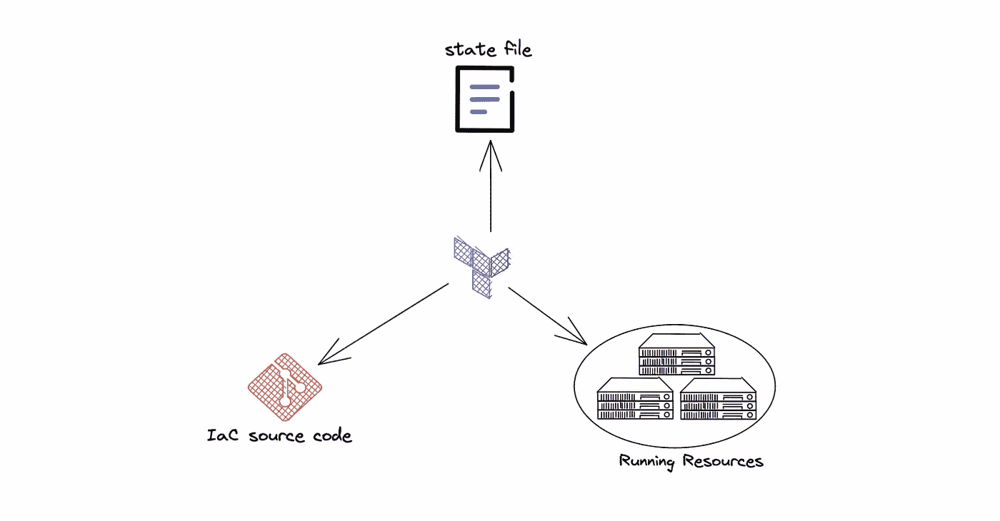
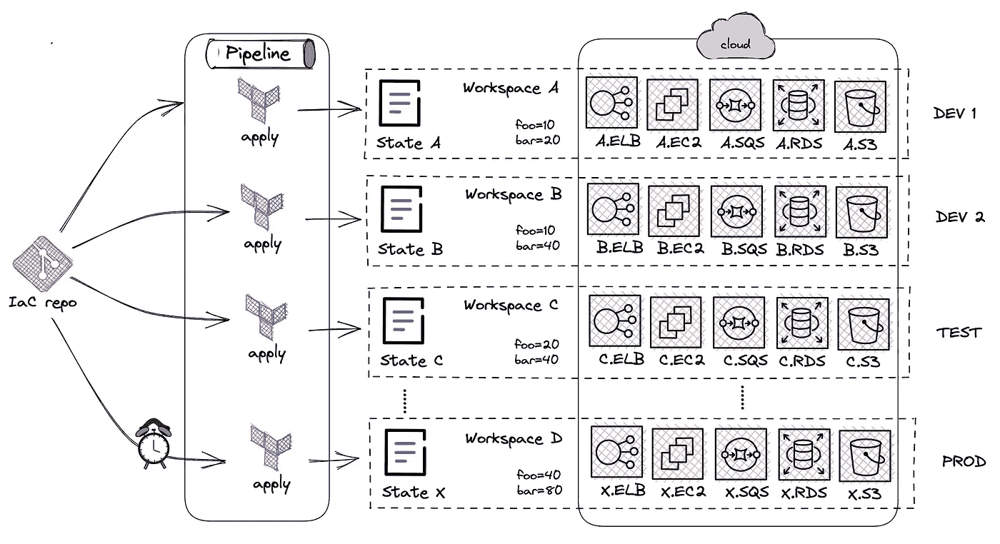
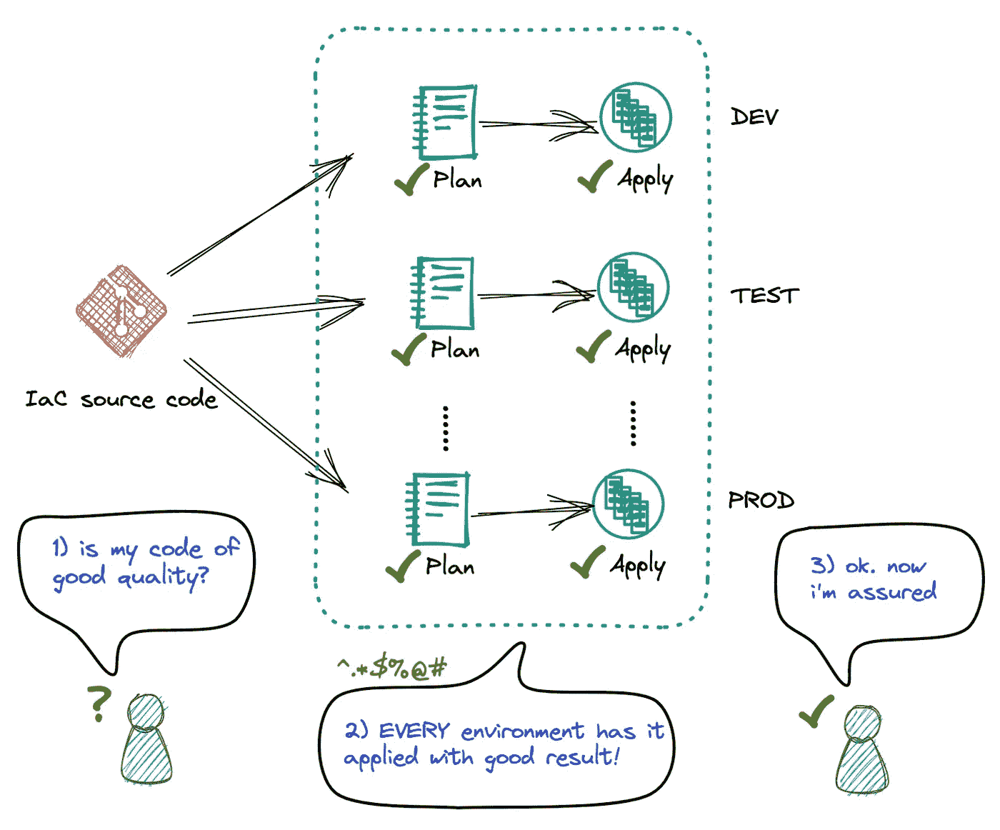
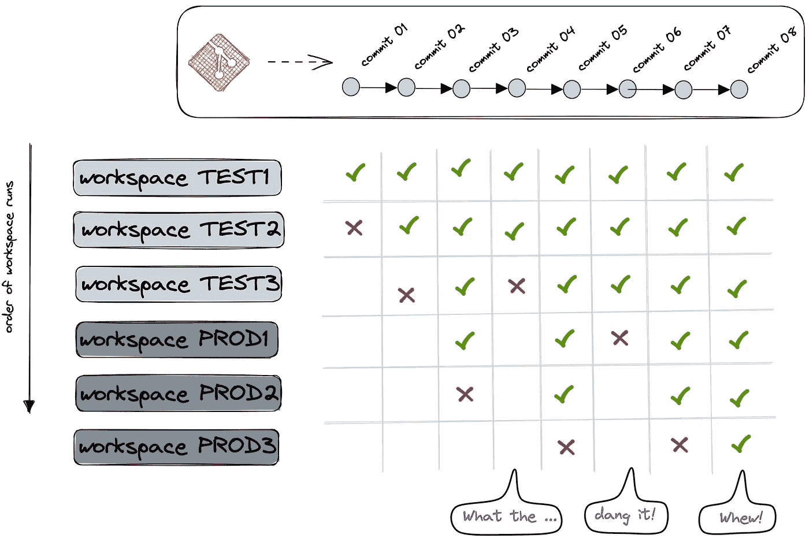
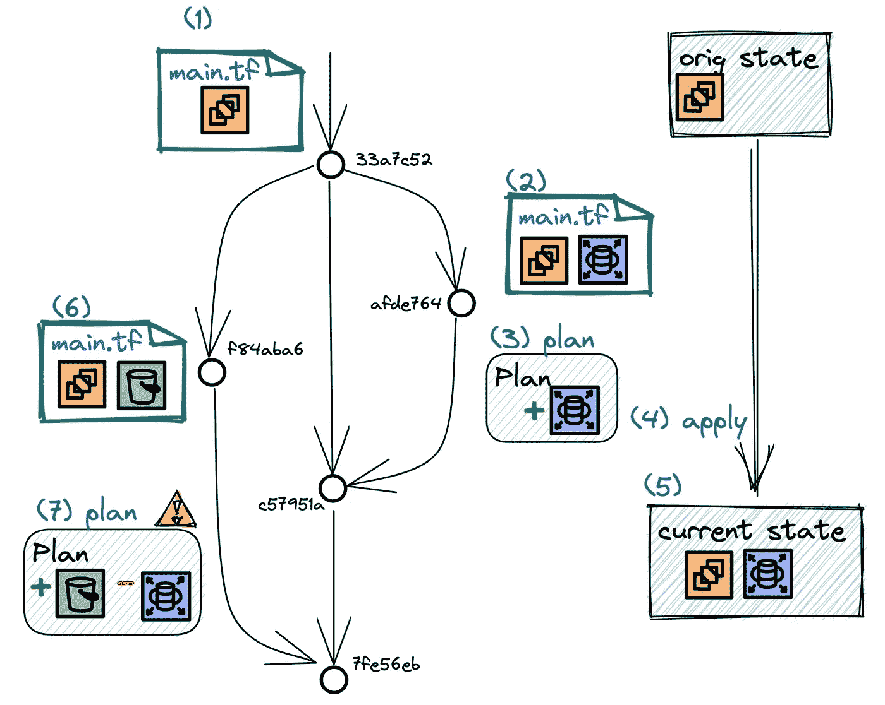
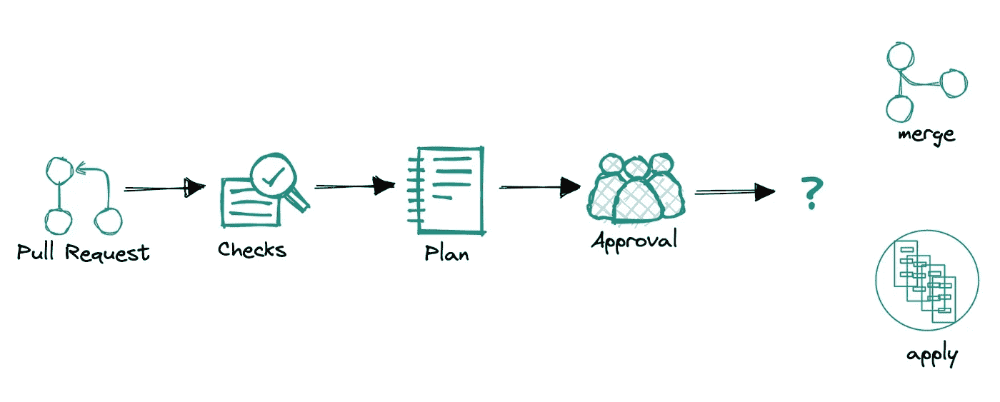

# 平台协作的痛苦

> 原文：<https://itnext.io/pains-in-terraform-collaboration-249a56b4534e?source=collection_archive---------1----------------------->

可能会阻碍您采用 Terraform 的障碍以及如何应对

马文·迈耶在 Unsplash 上的照片

我将基础设施代码(IaC)分为三类。**像 [CloudFormation](https://aws.amazon.com/cloudformation/) 和 [ARM](https://learn.microsoft.com/en-us/azure/azure-resource-manager/management/overview) 这样的标记语言**有简单的格式，但是代码体随着更多的对象聚集在一起而巨大地蔓延。**领域特定语言**如 Terraform 的 HCL，具有灵活的语法和适度的抽象，创造了愉快的编码体验。支持**通用编程语言**的库，比如 AWS [CDK](https://docs.aws.amazon.com/cdk/v2/guide/home.html) 和 Pulumi，非常强大，但是需要很高的编程水平来驯服超抽象。

毫不奇怪，位于中间地带的 Terraform 获得了发展势头。2022 年，GitHub 的 [Octoverse 报告](https://octoverse.github.com/)认定 HCL 是发展最快的语言。随着采用率的上升，出现了一波痛苦的团队修补任意工作流设置的浪潮。在本文中，我将阐述在 Terraform 中协作过程中的一些难点，并强调预先规划工作流工具的重要性。

# 状态管理

我们中的许多人是通过“*init*-*plan*-*apply*”的本地运行被介绍到 Terraform 的，这是一个有目的的简化场景，旨在在几分钟内展示 IaC 的魔力。 *init* 命令下拉模块和提供者。*计划*命令项目发生变化。并且*应用*命令通过云[服务端点](https://docs.aws.amazon.com/general/latest/gr/rande.html)提交变更。整个三部曲是在一台笔记本电脑上进行的独角戏。当我们在团队成员中划分编码任务时，曾经坚实的操作手册开始崩溃。团队经常遇到的第一个障碍是状态管理。

在 Terraform [工作空间](https://developer.hashicorp.com/terraform/language/state/workspaces)中，状态文件充当云资源最后已知状态的缓存。根据设计，状态文件经常过期，需要反复刷新。当与团队远程共享时，我们必须处理比赛情况，即并发*申请*，或者*计划*在*申请*期间。此外，状态文件包含敏感数据[所以我们必须保护访问。事实上，使用状态的想法一开始就有争议，并且一直受到挑战。最终，Terraform 的开发者们决定状态是一种必要的邪恶，并在](https://developer.hashicorp.com/terraform/language/state/sensitive-data)[这个](https://developer.hashicorp.com/terraform/language/state/purpose)页面上总结了这种必要性。

地面作战中的三个运动目标

为了远程管理状态，Terraform 提供了各种带有存储后端的接口。例如，在 Azure 上，我们将状态文件存储到 blob 存储中。在 AWS 上，我们一起使用 S3 和迪纳摩 DB。即使有了丰富的选项，自我管理状态文件仍然让人感觉吃力:我们必须控制对状态的访问，并清除不时出现的[锁定错误](https://discuss.hashicorp.com/t/s3-backend-state-lock-wont-release/21367/4)。为了安心起见，考虑一下[远程状态](https://developer.hashicorp.com/terraform/language/state/remote)的托管后端，并查看 [GitLab](https://docs.gitlab.com/ee/user/infrastructure/iac/terraform_state.html) 、 [Terraform Cloud](https://developer.hashicorp.com/terraform/cloud-docs/workspaces/state) 、 [Scalr](https://docs.scalr.io/docs/workspaces) 和 [Spacelift](https://docs.spacelift.io/vendors/terraform/state-management) 。

我们将状态保存在[工作区](https://developer.hashicorp.com/terraform/language/state/workspaces)中。我们经常重用资源声明来部署到不同的环境中。在这种情况下，我们希望不同的部署具有共同的资源结构，以及每个环境的个性化属性。Terraform 的本地[工作空间](https://developer.hashicorp.com/terraform/language/state/workspaces#using-workspaces)机制满足了第一个要求，但[却在第二个要求上苦苦挣扎](https://developer.hashicorp.com/terraform/cli/workspaces#when-not-to-use-multiple-workspaces)。

多工作空间部署的组件

半生不熟的原生工作区特性让我们自己来计算每个工作区的输入变量(例如，文件、命令参数或环境变量)，其中可能包含秘密。

# IaC 的状态本质

IaC 管理云资源的生命周期。例如，我们通过运行 Terraform *apply* 来改变属性、升级数据库引擎或者清理资源。工作区的大小可以是单个数据库或数百个虚拟机。一旦创建，我们通常会将资源保留很长时间。认为资源会永远保持原始状态是一个很大的错误。事实上，随着时间的推移，我们应该看到资源漂移到非常不同的状态。原因可能是配置漂移、从中断中恢复不完全、软件错误或者只是云服务中断。如果 IaC 技术是完全幂等的，那么它应该能够智能地处理底层逻辑中的所有异常值。事实上，我们从未设想过这样的乌托邦。

我们在 IaC repos 中声明期望的状态。通过*应用*操作，Terraform provider 调用云 SDK 来协调目标资源，使其与所需状态保持一致。这一过程的动态性和复杂性与相关资源的数量、它们的实时状态以及它们的相互依赖性有关。结果，用 IaC 管理运行资源的结果是**我们不能确定我们的代码是好是坏，直到它成功地应用到所有的目标资源**。

IaC 的状态本质

我将这个特性称为 IaC 的**有状态本质。*应用*动作是工作流程中最不可预测的部分。这种性质深刻地塑造了与 Terraform 的可用合作模式，以及可能的补救措施。让我们来看看一些具体的烦恼。**

# 迭代之旅

有状态的本质要求我们进行大量的迭代。假设我们应用新的 HCL 提交，首先更新三个测试工作区，然后更新三个生产工作区。根据有状态的本质，我们需要将新的提交成功地应用到所有六个工作区，然后才能确保代码质量，这可能需要几次更新的提交。在反复试验的过程中，要警惕以下陷阱:

1.  一个新的提交可能在不同的工作空间上导致多种类型的错误；
2.  在一个工作空间中修复问题的提交可能在另一个工作空间中失败，而前一个提交已经成功；
3.  失败可能会改变目标资源。下一次传递可能会在同一资源上遇到不同的状态，并由于不同的原因而失败；
4.  生产环境的变更通常需要提前计划和批准。
5.  当一个更新已经通过测试并等待应用于生产时，一个更高优先级的变更可能会弹出并需要插队。

所有这些场景都很平常。如果我们保留每次提交时所有工作空间运行的记录。它可能看起来像下面的图表:

多个工作空间运行的迭代之旅

该图表举例说明了反复试验和错误的过程。顶部是从左到右运行的提交链，箭头指向更新的提交。下表标记了每次提交时工作区运行的结果。如果有一个失败，我们给它一个新的尝试，并从头开始。需要八次提交(八次过山车运行),直到所有工作区运行成功，包括生产中的四次失败。如果同一个源 repo 连接到更多的工作区，这种痛苦会急剧增加。对于大规模内存中难以捉摸的错误，看似永无止境的迭代很快会变成一场漫长的噩梦。

# 拉式请求驱动的工作流

有状态的本质告诉我们,*应用*是最危险的活动。我们最好推迟对主分支的提交，直到我们克服了*应用*风险。一些团队因此转向拉动请求，以推动*应用*活动。通过提出一个拉请求(PR)，提交作者从一个特性分支提出一个变更。在交互式人工批准之前，PR 触发自动操作来验证代码质量。批准后，PR 将功能分支合并到主分支中。在 Terraform 协作环境中，PR 触发*计划*和*对多个工作空间应用*操作。如果全部成功，PR 完成代码合并。虽然 PR 驱动的工作流是正确的想法，但不幸的是，它需要更多的细微差别。

## 相互竞争的计划

PR 的一个行动是 Terraform *计划*。*计划*的输出基于特征分支上最近的提交和当前状态。

当有两个特征分支，每个分支都有自己的 PR 时，两个*计划*行动的时间选择会导致不同的(通常是意想不到的)效果。如果它们同时发生，那么用*应用*动作的那个先完成的 PR，将使另一个 PR 的计划无效。即使第二个 PR 重新运行它的*计划*动作，它在主分支上分叉的代码仍然不知道新的资源。

从具有当前状态(5)的过时分支(6)创建的计划(在步骤 7)意外地计划删除最近添加的资源(从步骤 3 和 4)

例如，初始状态从 EC2 实例开始。第一个 PR 添加了一个 RDS 实例，第二个 PR 添加了一个 S3 桶。当第一个 PR 被合并时，它已经创建了一个 RDS 实例，剩下当前状态的 EC2 实例和 RDS 实例。如果第二个 PR 在 RDS 添加后运行 terraform *plan* ，那么它的分支上的代码没有对 RDS 实例的引用。因此，Terraform 将此视为删除 RDS 实例的意图。

亚特兰蒂斯带来了两个修复。首先，在*计划*和*应用*之间的窗口中，其他运行地形*计划*的尝试应该被锁定。一次只允许一个待定的*计划*。第二，就在任何*计划*行动之前，PR 应该首先从主分支同步其分支中的代码，以便 Terraform 计划针对当前期望的状态运行。当计划锁定应用得太广泛时，它可能会阻碍速度。为了减轻干扰， [Terrateam](https://terrateam.io/blog/no-lock-on-plan) 建议锁上的条件。锁定应该只放在涉及变更的计划上，或者在任何*应用*动作期间。

## 合并-应用的困境

*计划*行动发生在交互批准请购单之前。批准之后，PR 还有两件事情要完成:将代码从 feature 合并到 main 分支，然后*将提交应用到所有的工作区。决定这两个活动的顺序是很微妙的。乍一看，这两种方式都不理想:*

*   **合并并应用**:如果我们先将代码合并到主分支。主分支上的新提交将推动部署。考虑到有状态的本质，我们应该假设*应用*动作很有可能失败。因此，我们将不得不沿着主分支，通过大量的 PRs 和合并，经历迭代的旅程。在这种情况下，主分支被视为一个喋喋不休的便笺，而不是一个认真保护的黄金副本。
*   **应用并合并**:如果我们首先应用来自特性分支的提交，我们可以沿着与拉请求相关联的特性分支进行迭代之旅，这将保持主分支更干净。应用并合并方法以一种优雅的方式处理了由有状态特性引入的风险。然而，现在等待我们下一步的是合并冲突的风险。如果出现合并问题，我们将不得不用不需要的*应用*动作再次检查 PR。

合并-应用的困境

我称之为 PR 驱动工作流中的**合并-应用困境**。Atlantis 提出[应用需求](https://www.runatlantis.io/docs/command-requirements.html)作为修正。因为 PR 可以访问两个分支，所以合并结果比工作区运行的结果更容易预测(即*应用*活动)。因此，公关首先评估合并是否会成功。PR 然后开始对工作区的*应用*操作，只有在合并被估计为成功的条件下。如果工作区运行顺利，合并将在之后完成。应用需求特性最小化了合并风险，并极大地改进了应用-合并方法。

上面的两个难点展示了 PR 驱动的工作流是高度灵活的，但同时也是危险的。许多团队只是远离公关驱动的工作流程。相反，他们使用 PRs 只是为了审查 Terraform 代码，并阻止他们执行*应用*动作。

# 工具和解决方案

当检查工具和解决方案来促进平台协作时，我有太多的选择。工具通常针对特定的工作流问题，而工作流解决方案渴望交付端到端的体验。至于工具，一些团队可能会尝试扩展现有自动化管道的使用(例如 Jenkins、GitHub Actions ),用于 Terraform 协作。

有许多专门构建的扩展( [GitHub](https://github.com/marketplace/actions/hashicorp-setup-terraform) ， [Azure DevOps](https://marketplace.visualstudio.com/items?itemName=ms-devlabs.custom-terraform-tasks) )来方便 Terraform 的安装和命令调用。然而，如前所述，Terraform 协作的真正难点是状态和随之而来的问题。尽管自动化管道在 SDLC 的持续集成中发挥着重要作用，但在这方面仍有不足。它的脚本功能几乎可以完成任何任务，但是用大量代码路径来处理状态逻辑和有状态资源并不有趣。对于多工作空间部署，我们无法在不使管道臃肿的情况下解决这些问题。

Terragrunt 是一个著名的 Terraform 包装器，用于提高可配置性和可重用性。然而，Terraform 中最近的增强(加上管道)已经排除了它的大部分用例。我不会用它开始新的项目。

对于基于公关的工作流程，从[亚特兰蒂斯](https://www.runatlantis.io/)开始，检查[定制](https://www.runatlantis.io/docs/custom-workflows.html)。Atlantis 是一个开源的 Go 应用程序，它要求用户在 VM 或 Kubernetes 集群上进行自托管。对于具有 PR 驱动的部署以及管理状态和配置服务器的能力的团队来说，Atlantis 自 2017 年以来一直是一个很好的选择。PR 驱动部署的替代方案是 [Terrateam](https://terrateam.io/) ，带有 SaaS 选项。2022 年刚上线，还在早期。

必须关注 IaC 编码的团队可以考虑工作流解决方案。这些解决方案也被称为 Terraform 自动化协作软件(TACoS)。值得注意的是 Scalr、Terraform Cloud/Enterprise、Env0 和 Spacelift。对于前述的多工作空间部署模型，工作流解决方案通常具有其工作空间的增强实现(例如 [Scalr](https://docs.scalr.io/docs/workspaces-4) 、 [Terraform Cloud](https://developer.hashicorp.com/terraform/cloud-docs/workspaces#workspace-contents) )，以缩小每个工作空间输入变量的差距。

从工作流的角度来看，这些解决方案通常支持 VCS 驱动的工作流。为了推动部署，用户在 IaC repos 上配置 Git 挂钩。然后，一旦对被监控的分支进行新的提交，它就自动在所有工作区上启动*计划*动作。其中一些允许用户使用 CLI 工具和定制挂钩将其流程插入现有管道或 PR 驱动的工作流。

工作流解决方案提供不同的托管模型和一套面向操作的功能。这篇[玉米卷供应商评论](/spice-up-your-infrastructure-as-code-with-tacos-1a9c179e0783)帖子有更多细节。

# 建议

有状态的本质使得 IaC 工作流与 SDLC 过程有很大的不同。潜在的 Terraform 采用者应该调查他们的技术能力，并制定一个经过深思熟虑的工作流程要求。

对于团队合作，我不建议单独使用自动化管道，因为这需要付出巨大的努力和过多的定制。如果团队有很强的 Terraform 专业知识，Atlantis 是一个可定制的 PR 驱动的工作流的发电站。对于人手不足的团队，花时间选择一个成熟的工作流解决方案。无论哪种方式，对未来工作流程的全面预见都可以让你的团队在 Terraform 协作中避免令人惊讶的痛苦。