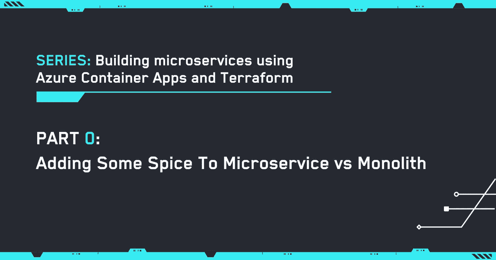

# 第 0 部分:为微服务与整体服务增加一些趣味

> 原文：<https://itnext.io/part-0-adding-some-spicy-to-microservice-vs-monolith-4303c869684f?source=collection_archive---------2----------------------->

## 系列:使用 Azure 容器应用和 Terraform 构建微服务

## 系列:

*   [第 1 部分:Azure 容器应用简介](https://medium.com/@armandjordaan6/part-1-introduction-to-azure-container-apps-3e879343ae9b)

# 介绍

作为一名网络开发者，我与各种团队、公司和行业合作过，我遇到过一些疯狂的角色，但也遇到过一些杰出的专业人士。我经常在这些团队中发现争论，有一个开发者反对任何不是他们 10 年前的 monolith 应用程序的新东西，另一个开发者放弃双手让团队转向微服务。

在这篇文章中，我会给出我的观点，它会变得辛辣，会有不同意见，有健康的不同意见是可以的。:D

# 所以，你的团队正在考虑微服务？

请将您的代码库升级到 Dotnet 的最新长期支持版本。善待您的新员工，拥有体面的自动化 CI/CD 管道，没有手动 Powershell 脚本来在环境之间移动代码，甚至更糟的是，继续 RDP 到虚拟机，并将您的 dll 复制到新的新目录。不要成为害怕新事物和拒绝创新传统团队。

请进行适当的发布管理

微服务不会修复你的文化，或者你的不良编码习惯，或者一夜之间解决你的伸缩问题，只会恶化它们。你必须清楚你的组织的沟通结构，以及你的产品为客户提供了什么价值。清楚地定义你的领域和范围。

无论你改变架构的原因是什么，你、你的团队、高管和利益相关者都必须保持一致。如果做不到这一点，将会导致不一致，优先级的不断变化，你的团队将既没有预算也没有时间。如果有一个团队成员不在船上，他们将成为你的项目的危险，并将破坏项目。如果你的企业不关心任何技术，只想要新的功能，即，该公司是一个功能工厂，那么你就陷入了疯狂的时间，就像在车辆高速行驶时更换发动机和轮胎一样。并非一切都失去了，有一些模式和实践来应对这些挑战。

最后，不管你是新开发人员还是老胡子开发人员，都要适应失败，并快速学会失败。你不能花几个月的时间来编写代码，而且每隔一个月只有一天或一周的发布时间。发现你认为你提供的价值与客户想要的不一致的成本可能会让你的公司破产。与您的客户形成反馈回路，并尽快将反馈反馈给您的开发团队。

# 香料必须流动

如果您这样解释您的系统，并想走微服务路线:

每个开发人员都这样做过

朋友，你的日子不好过了。我的建议是要么重新开始，但这很昂贵，而且需要时间。或者去清理您的数据，弄清楚您的领域、有限的上下文和价值，然后回来重新审视微服务。

在你拿起你最喜欢的 Reddit 键盘来找我之前，让我们把自我放在一边，废话少说:

听我说完…

*   当所有东西都指向同一个数据库时，代码被分割成单独的项目，这不是微服务，而是一个分布式的整体。
*   *“我已经使用共享数据库*推出了自己的发布订阅。不要这样做，请使用与您的服务分离的消息或事件总线。
*   以漫威或 DC 人物命名你的服务不是炫耀你的智力，而是你缺乏智力，这很烦人。在命名上要清楚简洁，说明这项服务存在的原因和它的作用。
*   不要做那个家伙:*“但是网飞和 Spotify 做……”*。不，很有可能你的公司远没有达到这个规模，也没有开发能力在给定的季度内建立&维护 500 个服务。
*   如果你从一个新的未知领域开始，那里有大量的实验和高代码流失率，那么小的 monolith 可能是一个更好的选择，因为你可以移动得更快，但是目标是在该领域显露出来后将其重构到 MS 架构中，并且你正在寻求规模化你的代码、开发团队和产品。

> 如果做错了，将会导致数年的重构和产品交付的平衡，同时努力扩展你的团队和平台。

*   不，当你的代码没有优化，整个系统是一团乱麻时，微服务或任何云服务都不能解决你的扩展和性能问题。
*   从整体服务到微服务是一个过程，不会一蹴而就，而且需要重构成本。
*   重构和分解代码比使用单个大规模数据库更容易，在单个大规模数据库中，没有源代码控制，严重依赖于域存储的进程，而这些进程又相互连接，并与其他数据库相互连接。
*   *“在模块 A 中进行更改会导致不相关的模块 Z 的磨合”*，然后你会遇到一个典型的紧密耦合的整体性问题，而你的 DDD 会有意想不到的副作用。这将是你以后重构到微服务时的眼中钉，有能力就修复吧。
*   *“这是一种建筑风格对另一种建筑风格”*。不，这是时间、成本和质量的问题。每一种都有自己的权衡，需要在开始架构计划之前清楚地理解。

好消息是，如果你被困在地狱的巨石上，你还有选择。

如果你的系统没有达到这个要求，那么 Azure App Services 可能是一个替代选择，它是一个成熟的云服务，有很好的文档，你可以逐步迁移到容器，在 IIS 上运行，并有一些变种。首先，让您的系统摆脱虚拟机和手动部署，以节省重构的预算和开发时间。

*“你在那里等一分钟先生”*，我的 monolith 架构是完美的，并且符合你可以扔给它的所有软件架构缩写。

伟大的东西，你得到一颗金星，你的迁移之路应该相对简单，只要你继续遵循最佳实践，当打破整块石头。

# 最后

明确地说，我更喜欢在微服务架构中工作，并且已经看到交付率、稳定性和冗余性的提高有助于对业务增长至关重要的成功产品。在我的职业生涯中，到目前为止，我还没有遇到过一个被许多开发者大肆吹嘘的完美的庞然大物。但我也见过一些糟糕的微服务实施，大多数时候是由于业务、开发人员和客户之间的沟通中断而导致的失败。