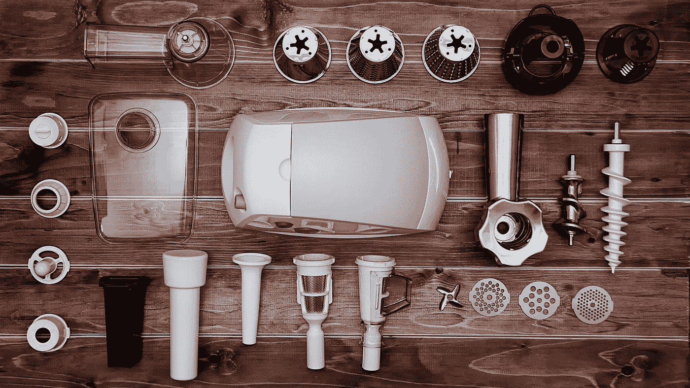

# 具有角分量的部分反应形式

> 原文：<https://itnext.io/partial-reactive-form-with-angular-components-443ca06d8419?source=collection_archive---------2----------------------->

组成一个整体的多个部分

这是我即将发布的多篇帖子中的第一篇，我想分享我的一个个人项目的进展。

最近我不得不实现一个页面，里面有一个相对较大的表单。我想设计它，所以我会将所有相关的领域分为自己的组，每个组都有一个稍微不同的设计和逻辑。

我选择做大多数 Angular 开发人员可能会做的事情:构建几个组件，让它们操作自己的表单，并使用反应式表单来更好地处理表单本身。

为了这篇文章，让我们假设我想实现一个简单的订单结帐，它将有一个`fullName`字段，以及两个部分`billing`和`shipping`。

**TL；这是我们目标的一个演示。**

我们想要做的事情的基本思想是让我们的父组件处理通用字段(`fullName`)，让组件构建自己的表单(从而将逻辑从父组件中分离出来)并将其与父组件同步。

听起来相当简单直观，对吧？

[Nicholas Jamieson](https://blog.angularindepth.com/@cartant?source=post_header_lockup) 在他的一篇[帖子](https://blog.angularindepth.com/connecting-components-with-reactive-forms-55f56fce2aad)中提出使用反应式的`valueChanges`能力来解决这个问题，这种能力可以在每次变化时将值发送给父节点。

这很好。但是我想要一个解决方案，我可以做一个**单个**动作来‘绑定’我的嵌套表单和父表单。

因此..不，那对我来说还不够好。

然后我读了大卫·赫格斯的[解决方案](https://medium.com/spektrakel-blog/angular2-building-nested-reactive-forms-7978ecd145e4)，找到了我想要的。他在我们的父组件中创建了一个`formGroup`，并将其注入到子组件中，然后对其进行处理。*单次*简单动作。

…但是它不是把我们的孩子和它的父母结合在一起了吗？

是的。是的，它是。如果我们决定删除其中一个字段，我们必须重构父字段和子字段。

对此，我的解决方案是采用 [David Herges](https://medium.com/@davidh_23?source=post_header_lockup) 的解决方案，但从另一方面实施。我们将在我们的子组件中创建表单，当它准备好时，我们将通知父组件一个新的表单组已经初始化，并在表单中设置它。

让我们看看这里的一些代码。我们的子组件优先:

当我们的表单准备好了，我们使用 Angular 的`@Output`来发出它。

让我们看看如何在我们的父母中处理这个问题:

就是这样！我们将表单分成几个块，但是我们仍然得到一个与小表单同步的整体表单。

你可以点击查看完整代码[。](https://stackblitz.com/edit/monolithic-reactive-form)

# 异步初始数据

我的挑战还没有结束。

与大多数 web 应用程序一样，我们倾向于用从服务器接收的数据预填充表单。例如— `User`。

我们所要做的就是将用户数据传递到子组件中，用`[OnChanges](https://angular.io/api/core/OnChanges)` 生命周期钩子发现变化(我们可以更进一步，用`[SimpleChange.firstChange](https://angular.io/api/core/SimpleChange#firstChange)`只在第一次或每次变化时填充它)，并修补表单值。

这是我们的子组件，支持异步接收用户:

这里是[演示](https://stackblitz.com/edit/monolithic-reactive-form-async-fill)

# 结论

我们设法找到了一种方法，将我们的形状分成几个组件，并将它们从周围环境中分离出来，但仍然能够同步它们，并仅使用*的*反应形式和 Angular 的`@Input` `@Output`获得一个流体形状对象。

似乎我们用很少的收获了很多。