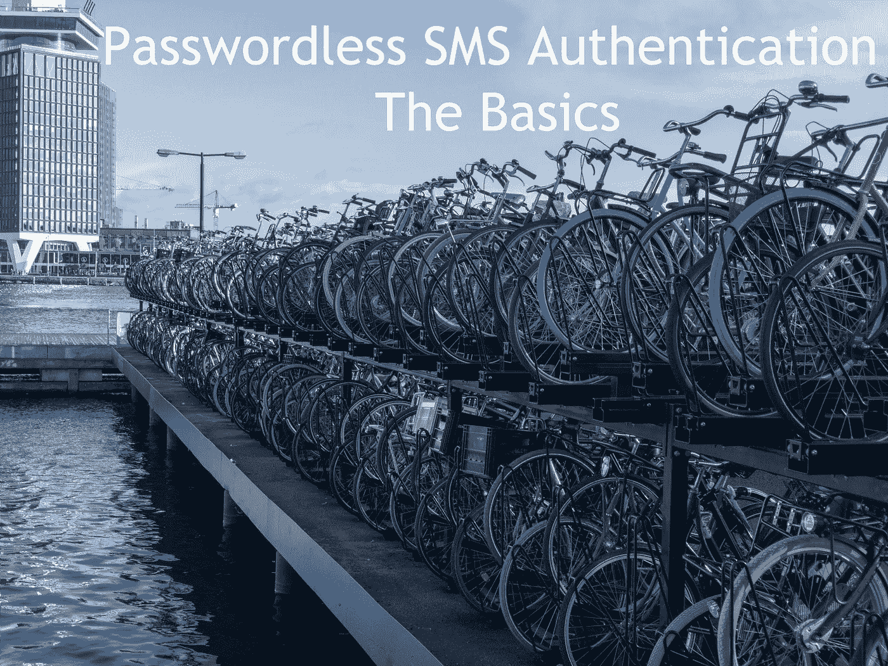
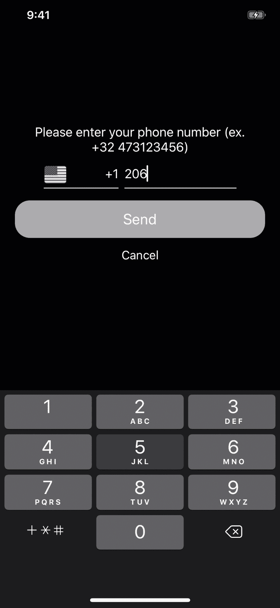

# 无密码短信认证:基础知识

> 原文：<https://itnext.io/passwordless-sms-authentication-the-basics-fdf9dbecab04?source=collection_archive---------2----------------------->

我一直渴望在自己的应用程序中实现无密码短信认证。我总是有点渴望其他应用程序，它们只是简单地询问你的手机号码，你收到一个一次性密码，你就通过了身份验证。嘭！没有用户名，密码，电子邮件，或“记住我”复选框。在我之前的文章中提到的所有认证方法中，脸书[登录](/facebook-login-using-aws-amplify-and-amazon-cognito-4acf74875a04)、[谷歌登录](/google-sign-in-using-aws-amplify-and-amazon-cognito-69cc3bf219ad)和[亚马逊登录](/add-login-with-amazon-to-your-ios-swift-app-d1b07655d31a)、**这种方法是目前最简单的让移动用户登录的方法**。那么，为什么在更多的 app 中看不到这个选项呢？每个移动设备都有一个电话号码，对吗？作为开发者实现起来很难吗？它的成本是否太高，能否在全球范围内扩展到数百万用户？用户愿意提供他们的电话号码吗？最大的问题是…，这安全吗？让我们深入回答这些问题，然后在我的下一篇文章中，我将使用 Amazon Cognito 和 Amazon Pinpoint 提出一个用于 iOS 的无密码短信认证的解决方案。

首先，让我们回顾一下**身份验证的三个因素**，这样当我们试图通过 SMS 对用户进行身份验证时就很清楚了。即使有了触摸和 Face ID 的进步，身份认证的三个核心因素仍然存在。

# 认证三要素

1.您知道的信息，例如密码、密钥或 pin 码

2.你拥有的东西——例如手机、优比卡，甚至是一把实体钥匙

3.你是什么(想想触控 ID，Face ID)

到目前为止，我之前关于脸书、谷歌和登录亚马逊的文章都集中在第一点，用户知道什么。在这些场景中，用户知道他们的社交登录凭证，或者简单地链接到先前认证的会话。还有，这里值得一提的是 MFA(多因素认证)甚至 3FA(三因素认证)。当您听说这些因素正在移动和 web 应用程序中实施时，这些只是更安全的用户身份验证方式，因为他们对 MFA 使用**两个身份验证因素**而对 3FA 使用所有**三个身份验证因素**。涉及的因素越多，意味着所有表单被伪造或假冒的可能性就越小，但对开发人员来说实现起来就越困难，更不用说对用户来说很麻烦了。

现在我们已经熟悉了身份验证的所有三个因素，您将会看到无密码短信身份验证属于第二类(用户拥有的东西)，因为显示一次性短信密码的手机是用户拥有的东西。注意:支持短信功能的手机不必是安装了您的应用程序的同一台设备。

所以，让我们回顾一下这个话题，然后我们再继续。将基本身份验证(用户名/密码)添加到您的应用程序是对用户知道的东西应用#1，并且只是单因素身份验证。对于短信无密码，我们也应用一个因素认证，但使用因素#2，用户拥有的东西，如手机。如果我们同时应用基本身份验证和 SMS 一次性密码，这将被视为 MFA，因为我们应用了两个或更多身份验证因素。希望我不是太多余，但一开始我并不太清楚，所以我想确保您运行这个，并在将来将这些概念应用到任何应用程序中。

# 为什么要进行无密码短信认证？

在你的应用程序中提供无密码短信认证是最简单的用户登录方式。它的**方便**，**安全**(见下文)，而**容易实现**。它为您的用户消除了障碍，就像添加脸书和谷歌联合身份简化了基本认证，因为用户不必创建额外的凭证。即使有过多的密码管理器，如 [1Password](https://1password.com/) 和 [LastPass](https://www.lastpass.com/) ，用户仍然不想设置另一个用户/密码组合，而且大多数时候，他们甚至不记得自己使用了什么用户名。或者，更糟糕的是，他们对所有账户使用相同的用户名/密码。

# 无密码短信是怎么工作的？

无密码 SMS 身份验证只是针对用户拥有的安全平台(在这种情况下是用户的手机)的另一个身份验证因素。当移动用户第一次在您的应用中进行身份验证时，系统会提示用户输入电话号码，作为回报，他们会从物理设备上的开发人员服务器端应用以 SMS 文本消息的形式收到一次性密码。用户在应用程序中输入短信密码，然后通过身份验证。如果这是第一次(注册)，将为用户创建一个帐户，如果不是，将对他们进行身份验证，并将使用身份提供者提供的现有唯一身份 ID。在我的下一篇文章中，我们将使用 Amazon Cognito 用户池作为身份提供者，并通过 Amazon Pinpoint 发送 SMS。要使这种方法起作用，用户必须提供能够接收 SMS 消息的正确电话号码，并且能够实际接触接收 SMS 密码的设备。

# 无密码短信认证流程如下:

# 无密码短信安全吗？

是的。与基本身份验证相比，大多数用户提供非常弱的密码，并且经常在应用程序之间重复使用相同的密码。这些做法的结合增加了某人或某个应用程序猜测用户凭证并冒充它们的风险。这里唯一显而易见的风险是，如果有人获得了物理电话的访问权，并绕过手机的安全性来阅读短信。

# 如果无密码短信如此伟大，为什么我们很少看到开发者采用它？

开发者可能不会在他们的应用中采用无密码短信有几个原因。一个主要原因是基础设施。我之前提到过，这很容易实现，确实如此，但是你需要使用云提供商或第三方服务来管理运营商的短信。 [Auth0](https://auth0.com/) 、 [Twilio](https://www.twilio.com/) 、 [okta](https://www.okta.com/) 和 [Amazon Cognito](https://docs.aws.amazon.com/cognito/latest/developerguide/cognito-user-identity-pools.html) 只是让这个解决方案安全且易于上手的几个服务。

采用率较低的另一个原因是 SMS 的额外成本，尤其是全球 SMS 和可变定价。尽管这些是一次性密码，而不是 MFA(用户每次尝试访问应用时都会发送的密码)，但每条短信的成本比联合脸书和谷歌的免费选项更昂贵。

采用无密码短信的最后一个障碍是，你的应用很可能会在没有电话号码或蜂窝计划的移动设备上运行，如 iPad wifi 版。在这种情况下，当用户想要在非蜂窝设备上进行身份验证时，他们需要将手机放在身边。再说一次，大多数时候这不是问题，然而，在我家，我的儿子，有一个 wifi iPad 和没有手机短信功能的电话。因此，在这种情况下，开发人员需要提供额外的身份验证因素，比如基本的用户名/密码。不太激进，但确实增加了一个额外的障碍，这就是为什么大多数移动开发者会为用户提供几种认证方式。

# 最后的想法

对你的应用进行无密码短信认证可以改善用户体验，让用户快速认证并使用你的应用。在安装应用程序后的最初几天，用户数量会有相当大的下降。让用户进入并使用应用程序需要无缝衔接。简单地提供通过短信发送一次性密码可能是一个杀手级的功能，可以大大增加用户的保留。我迫不及待地想在我的下一篇文章中向您展示实现细节和示例 iOS 应用程序！

# 参考资料:

无密码短信认证如何改进您的应用:

[https://auth 0 . com/blog/how-password-SMS-authentic ation-can-improve-your-app/](https://auth0.com/blog/how-passwordless-sms-authentication-can-improve-your-app/)

金雅拓的三重认证:

[https://blog . gemalto . com/security/2011/09/05/三因素认证-你所知道的东西-你所拥有的东西/](https://blog.gemalto.com/security/2011/09/05/three-factor-authentication-something-you-know-something-you-have-something-you-are/)