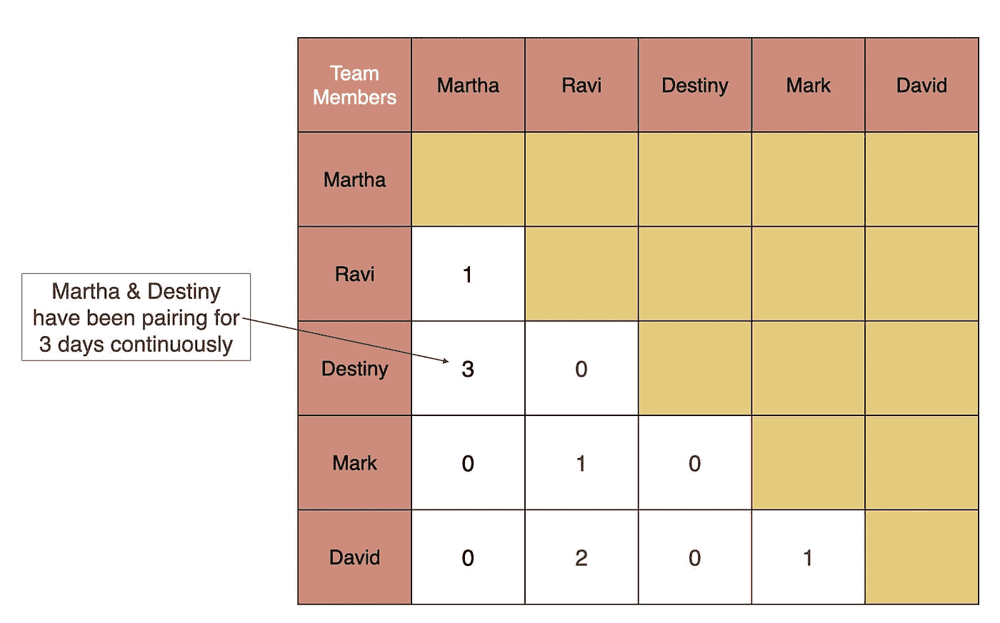
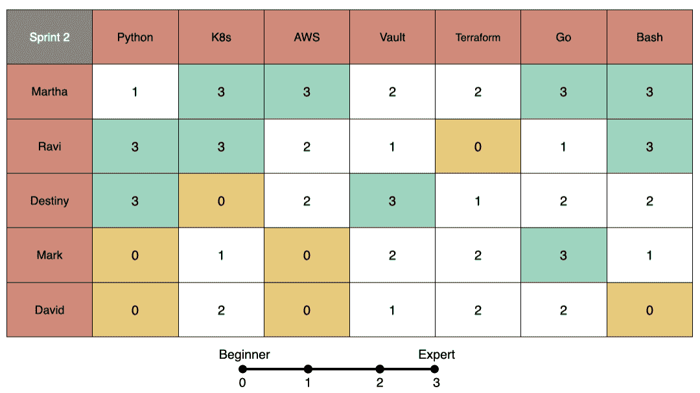
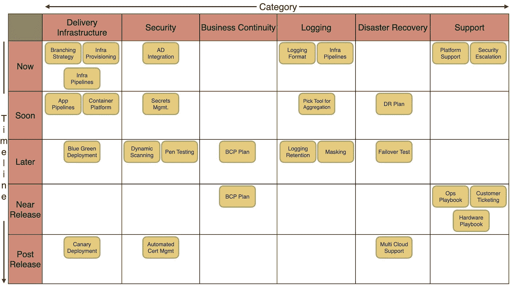

# 平台工程:挑战与解决方案

> 原文：<https://itnext.io/platform-engineering-challenges-and-solutions-122abbd3e84d?source=collection_archive---------5----------------------->

## 根据我在不同组织领导平台工程项目的经验

我在我的[上一篇文章](https://shahadarsh.com/2020/10/12/platform-engineering/)中谈到了平台工程(PE)是什么，它什么时候有用，以及我在使用它时遇到的挑战。在这篇文章中，我们将介绍在解决这些挑战中对我和我的团队有效的解决方案。我在不同规模的公司(从初创公司到企业)领导过平台工程团队，这些挑战和解决方案都是基于我的经验。

# 挑战

让我们来看一下每一个挑战，以及我为解决它们做了些什么。

# #1:避免创建另一个竖井

正如在[之前的文章](https://shahadarsh.com/2020/10/12/platform-engineering/)中提到的，DevOps 运动的一个重要方面是减少不同团队之间的孤岛。创建另一个团队听起来与此相反，您应该小心不要创建另一个筒仓。下面是一些你应该考虑避免的做法。

## 推动者而不仅仅是实干家

PE 团队成员应该专注于支持其他团队，提供工具来完成他们的工作。他们不应该为他们做任何事。这有时会变得很有挑战性，因为它需要组织中的文化变革，特别是如果您的组织中已经有了孤岛，但是我强烈建议这样做。

例如，提供模板和示例管道，让开发团队创建和管理他们的管道。这样，开发人员仍然拥有他们的应用程序管道，但获得了加速开发所需的工具。

另一个例子是，PE 团队应该创建和维护公共的 Terraform 模块，其他团队可以使用这些模块来配置他们的基础架构，并且拥有这些模块，而不是由 PE 团队为他们进行配置。

## 跨团队实习

在跨团队实习中，我们鼓励不同团队的成员(开发、运营、信息安全等。)短期加入 PE 团队(可能是几周或一次冲刺)，与团队成员结对，了解团队如何运作，了解一个平台的内部。完成后，他们将这些知识带回他们的团队，并成为他们在实习期间了解到的平台方面的主题专家，并与他们的团队分享这些知识。这是我在多个地方成功使用过的一种做法。

实习不只是一种方式。PE 团队成员也应该加入其他团队，了解他们是如何运作的，以及他们所面临的挑战。这也有助于了解客户如何使用有助于改进平台的平台。

## 不断与开发团队结对

作为一名 PE 团队成员，你应该寻找机会与其他团队的开发人员配对。例如，如果有人在使用平台时遇到问题，需要 PE 团队的帮助，这可能是一个与他们配对并一起解决问题的机会。因此，下次发生类似问题时，他们知道如何进行故障诊断，而不是为他们解决问题。

## 知识分享会

开展持续的知识分享会议，如午餐和学习、午餐包等。尤其是对于新的重要特征。如果有足够的兴趣，这有助于向您的客户介绍有助于理解平台内部的平台功能和课程。

## 证明文件

文档对于 PE 团队成员和消费者都是至关重要的，尤其是随着事情的变化保持文档的更新。以下是创建更好文档的一些技巧。

**提示 1:创造一个入职故事**

在过去的几个地方，对我有用的一件事是为新的 PE 团队成员和任何新加入使用该平台的团队的人创建一个入职故事。入职故事通常包括对其中一个应用程序进行小的更改，并使用平台将其部署到生产环境中，最好是在他们成为团队一员的第一天。每当有人使用 onboarding story 时，询问他们的体验如何，他们是否容易找到部署应用程序所需的所有信息，等等。然后利用这些反馈来改进入职故事、文档或平台。

**提示 2:创建运行手册**

按照 AWS 架构良好的框架文档定义的操作手册:

*通过在操作手册中记录程序，对熟知的事件做出一致而迅速的响应。*

在这里阅读更多关于 Runbooks 的信息:[https://wa.aws.amazon.com/wat.concept.runbook.en.html](https://wa.aws.amazon.com/wat.concept.runbook.en.html)

这里有一些很好的例子:[https://containersolutions.github.io/runbooks/](https://containersolutions.github.io/runbooks/)

运行手册在事故或不同类型的事件中帮助待命人员。即使他们不是专家，他们也可以利用手册中记录的其他人的知识。

**提示 3:让文档更接近代码**

如果文档更接近代码，您就有更多的机会更新文档。如果你正在使用 GitHub，试着把文档保存在你的 Github repo 中。如果您使用 wiki，您可以在 wiki 中提供对文档的引用。这样，它仍然可以在你所有其他文档所在的 wiki 中被搜索到。作为拉取请求清单的一部分，包括文档，以便审查拉取请求的人验证没有遗漏由于代码更改而需要的文档更新。

## 不是服务中心

PE 团队不应该是一个拥有基于票证的系统的服务中心，在该系统中，客户为需要完成的事情创建票证，而 PE 团队在黑盒中完成工作。平台应该是自助式的，在定义/构建特性时，团队之间应该有更好的协作。

## 共同目标和激励措施

团队/个人的目标和激励在人们如何合作中有很大的作用。如果目标和激励不一致，他们会被激励去做一些无助于公司共同目标的事情。我怎么强调这一点的重要性都不为过。领导层有责任确保团队和个人的目标和激励一致。

# #2:解决团队内部的知识孤岛

上面我们谈到了避免团队之间的孤岛，但是团队内部的孤岛又如何呢？PE 团队通常使用许多不同的编程语言、工具和技术。软件工程领域的工具和实践不断变化。由于这些原因，我看到团队内部出现了竖井。一个典型的例子是，只有一个团队成员知道平台的某个特定部分是如何工作的。

以下是我见过的一些行之有效的做法。

## 故事对轮换

结对编程不仅有助于提高生产率，还能通过在团队不同成员之间实现知识共享来减少孤岛。你可以使用像结对楼梯这样的技巧来确保每个人都和其他团队成员结对。

**一对楼梯**

结对楼梯是在结对编程时确保团队成员之间有足够的结对轮换的一种方式。下图中的纵轴和横轴是团队成员。方框中的数字是两个团队成员配对的天数。例如，如下图 1 所示，Martha 和 Destiny 已经连续配对三天了，与其他人轮流配对可能更好。最好让两个人中的一个继续写同一个故事(如果还有更多工作要做的话),另一个轮换。这样，就有了连续性，也有了分享故事知识的轮换。

**示意图一:**双人楼梯

## 技能矩阵练习

技能矩阵练习有助于跟踪团队成员在团队使用的各种语言/工具方面的熟练程度。然后，它可以用于确保团队成员的技能不断提高，从而减少团队内部的孤岛。

参见下面的技能矩阵示例。所有团队成员首先对所有语言/工具进行自我评估。每天在团队会议后，查看矩阵，看看是否可以通过给语言/工具初学者提供机会来改进矩阵，可能的方法是将他们与团队中的其他专家配对。

**图表 2:** 技能矩阵练习

从图 2 的动画中可以看出，在 Sprint 2 & 6 期间，David (2)多次与 Martha (3)配对，并与其他 Kubernetes 专家一起研究 Kubernetes 的故事，之后 David 成为了这方面的专家。

## 支撑对旋转

因为团队正在构建一个产品，他们需要支持它。支持是详细了解您正在调查的问题以及如何解决该问题的好方法。这是在团队内部分享知识的好方法。

支持组负责回答客户的任何问题，并关注任何事件。建议确保轮换，这样每个人都能得到支持。与故事结对一样，支持结对有助于分享知识。此外，寻找机会与客户一起解决问题，并培训他们自己解决问题。

## 术语表

正如上面多次提到的，由于 PE 团队使用许多不同的语言、工具和技术，最好有一个术语表来定义一个特定的单词对团队的意义。这是为了让团队对各种术语有一个共同的理解，以避免混淆和改善沟通。

例如，在一个地方，“环境”一词在不同的上下文中有不同的含义。定义并同意按照定义使用这个术语有助于团队内部的交流。每次有人误用它，其中一个团队成员会纠正他们，随着时间的推移，我们都开始恰当地使用这个术语，这对团队有很大的帮助。

## 死后的

如果您在生产中部署和操作您的应用程序，事故是必然会发生的。从中吸取教训至关重要。正如 John Allspaw 在下面的推文中所说，“事故是无计划的投资；他们的费用已经产生了。您的组织面临的挑战是获得这些活动的投资回报。”

当你做尸检时，要确保它们是无可指责的。在这里阅读更多关于无过失验尸[的内容。](https://codeascraft.com/2012/05/22/blameless-postmortems/)

> *无可指责的事后分析的真正价值在于这些汇报过程中的对话。*
> 
> 约翰·奥斯鲍

# #3:构建正确的功能

我认为这对大多数 PE 团队来说是一个挑战，因为他们通常与来自不同团队的不同涉众打交道，所以定义和区分特性的优先级并不简单。以下是一些过去对我有效的做法。

## 促进产品思维

产品思维是在搭建平台的时候提倡整体思维，而不是单个功能。根据文章[Product over Project thinking](https://martinfowler.com/articles/products-over-projects.html)，product-mode 允许团队快速地重新定位，减少他们的端到端周期时间，并通过使用短周期迭代来验证实际的好处，同时维护他们的软件的架构完整性以保持他们的长期有效性。它有助于通过考虑长期目标来定义和区分特性的优先级。

## 产品所有者优先顺序

生产之路(路线图)练习

生产实践之路(或路线图)是一种定义将应用程序投入生产并在生产中高效运行所需的一切的方法。这包括所有非功能性需求、灾难恢复、支持等。请参见下面的练习输出示例。您可以在纵轴上看到时间轴，在横轴上看到各种类别。现在发布、不久发布、稍后发布、即将发布和发布后发布应该根据您的时间表来定义。根据您正在构建的内容，类别也会有所不同。表格中的每个条目本质上都是一部史诗或超级史诗，然后可以对其进行优先排序并分解成故事。我定期与各种利益相关者一起浏览这张表，并根据他们的需求对他们进行优先排序。

**图 3:** 生产路径(路线图)练习

## 观察顾客并与之交谈

像任何产品一样，确保你的客户是中心。观察他们如何使用平台，并告诉他们需要改进的地方。在结对活动、午餐和学习时寻找这样做的机会。一旦你观察并与他们交谈，将反馈带回你的团队，改善客户的体验。

## 关键绩效指标驱动

提出特性的 KPI，并使用它们来回顾和衡量特性的性能。例如，在发布一个新的突出特性后，你的客户得到了一个更短的特性交付周期吗？

## 创新(解决问题)和实验

创新和实验是这个团队应该做的很大一部分。确保您在构建/增强客户功能的同时，不断改进实践、工具和技术。

# #4:保持敏捷

由于客户是技术团队，这个团队的特点更具技术性，所以我看到 PE 团队在使用敏捷原则和实践时很吃力。

## 故事写作和分析

故事的写作和分析将更具技术性。如果你有一个业务分析师，他们需要理解技术术语和团队正在做什么。请记住这一点，并尝试想出一种方法来描述故事的预期结果。由于 PE 团队不断尝试新的实践、工具和技术，因此他们往往会有更多的峰值(概念验证)。确保你对这些峰值进行了多次计时，它们最终是无限的，永无止境的。时间盒是一种简单有效的管理峰值的方法，因为它确保你不会在不值得努力的峰值上花费太多时间，并且你希望在时间范围内结束。

## 站立、追溯和其他敏捷实践

所有其他敏捷实践对于平台工程都是必不可少的。我见过 PE 团队要么为不敏捷找借口，要么为此苦苦挣扎。对于敏捷实践来说，做对你有用的事情是很重要的，因为这项工作更具技术性，你需要确保你确定了对你的团队有用的实践。

决定[团队规范](https://blog.lifeatexpediagroup.com/technologyandinnovation/allthingsagile/)(团队将如何沟通，站立时间等。)，这将有助于团队中的每个人都保持一致。

## 计划、进度和状态报告

报告计划、功能的进度和状态、依赖性、阻止程序等。对于让您的客户了解信息并保持满意至关重要。确保你有一个良好的流程和节奏来报告这些。这里的目标应该是让您的客户和您都能够轻松地了解您的位置并实现沟通。

# #5:拥抱快速采用

由于 PE 团队使用的实践、技术和工具经常变化，团队需要快速采用，这可能具有挑战性，因为团队成员需要不断学习，并让他们的客户了解最新的变化。这里有一些方法可以解决这个问题。

## 展示+生产路径/路线图

展示是向客户展示进展的一种方式。它们是展示你一直在做的事情(即使还没有完全准备好)，获得早期反馈，和你的客户开始对话的好方法，尤其是当事情经常变化的时候。此外，提供一种简单的方法来查看团队的生产路径(或路线图),并定期与客户讨论，以便他们知道未来会发生什么。

## 允许

让您的客户能够使用结对、知识共享、跨团队实习等技术来使用和解决平台问题。上面提到的。

## 可维护性

确保您正在构建的功能从长远来看是可维护的。从小处着手&简单，但也要考虑可维护性。请记住，重点是构建自助服务平台，以便客户可以自己使用，而不是需要团队来使用这些功能。

## 建立信任(传达原因、方式、时间——发布说明和说明)

在生产中不断打破东西不会给客户信心。确保您有良好的实践来沟通(为什么、如何和何时)停机和新版本。

例如，为 terraform 模块提供良好的版本管理实践，包括测试版和客户认为可靠的稳定版。

# 结论

我也做过关于平台工程的演讲，你可以看这里的&[这里的](https://shahadarsh.com/2017/10/17/enabling-devops-culture-with-a-platform-engineering-team-devops-days-nashville/)。我希望这篇文章是有帮助的。如果您有任何问题，请通过[关于我](https://shahadarsh.com/about-me/)页面上提到的任何方法联系我。

*原载于* [*我的网站*](https://shahadarsh.com/2020/11/11/platform-engineering-challenges-and-solutions/)