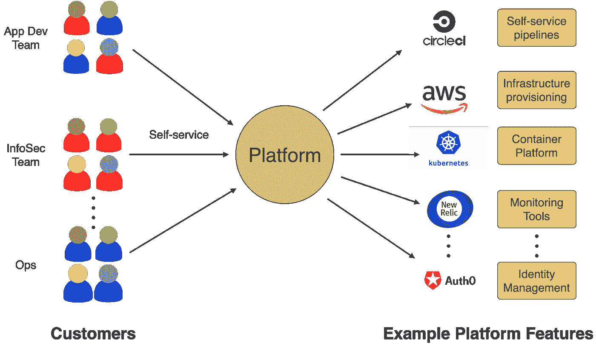

# 平台工程:利用信息技术获得竞争优势

> 原文：<https://itnext.io/platform-engineering-using-it-to-gain-competitive-advantage-8d1feb2cbbee?source=collection_archive---------2----------------------->

## 它是什么，什么时候有用，以及它带来的挑战

# 目录

> [什么是平台工程？](#f97f)
> [平台工程团队](#c10a)
> [客户是谁？](#ac33)
> [什么时候有用？](#bd03) [挑战与平台工程](#666f) [结论](#63b5)

***注意:*** *平台是一个广泛使用的术语，用来定义各种类型的平台，所以要小心使用。在一个地方，我们选择不在团队名称中使用术语平台，而只称它为基础设施团队，因为还有另一个人工智能平台团队。另一个地方我们称之为基础设施平台团队。使用对您的组织有意义的术语，但概念保持不变。只是不要因为显而易见的原因而称之为“DevOps 团队”。*

# 什么是平台工程？

在这个数字化转型的时代，公司不断寻求创新以获得竞争优势。获得竞争优势的一个方法是拥有一个在生产中部署和操作应用程序的有效机制，使团队能够更快地向最终用户提供功能。为了实现这一点，许多公司意识到，有一个专门的团队来构建和维护一个通用平台，并不断寻求创新应用程序在生产中的部署和操作方式，会有所帮助。这种创建一个通用平台作为产品的实践被称为平台工程。请看下面我对平台工程的定义:

> **平台工程**是为技术团队构建和操作一个公共平台作为产品的实践。它通过为基础架构和应用程序提供自助式部署以及在生产中轻松操作应用程序，缩短了上市时间并降低了复杂性。构建和操作公共平台的团队不断创新，并提供最佳实践实现、工具和自动化。

应用程序开发团队和其他技术团队仍然负责构建、部署和操作他们的应用程序，但是他们以自助方式使用平台来帮助简化他们的工作。

## 典型平台的示例

基于您组织的需求，平台会有所不同，但是我想解释一下典型的平台是什么样子的。在下面的图 1 中，该平台是自助式的，客户使用它来实现诸如自助式管道、基础架构供应、容器平台、监控、身份管理、日志聚合等功能。

**图表 1:** 平台示例

# 平台工程团队

构建和操作公共平台的团队通常被称为**“平台工程团队”**，但是正如在顶部的警告中提到的，根据您的情况，使用其他名称可能更有意义。DevOps 运动的一个关键方面是通过支持不同团队(开发、运营、安全、法规遵从性等)之间的协作来消除组织中的孤岛。).确保这个团队不会成为另一个筒仓是至关重要的。

请看下面的**电梯间推介**示例，它解释了典型的平台工程团队会做什么。

> ***针对*** *应用程序开发、信息安全、法规遵从性和基础架构团队*(客户)***需要*** *部署&在生产中操作应用程序*(目标)***我们提供*** *可扩展、安全、 可重复使用的自助服务平台*(解决方案)***可支持*** *开箱即用的复杂部署&运营采用行业最佳实践*(关键成果)***即*** *声明式、可扩展的&全面即插即用解决方案&*(关键优势)

# 客户是谁？

该平台的客户是其他技术团队，如应用程序开发、信息安全、运营、法规遵从性、基础架构等。这些通常是公司内部的技术团队，但是我可以看到外部团队也在使用平台工程。

# 什么时候有用？

仍然强烈推荐跨职能团队，其中每个团队管理其基础设施、应用和操作堆栈，因为这是交付软件的最有效方式。尽管如此，还是有 PE 有用的情况。在下面的案例中，我看到了平台工程的用处。

## 想要一个专注于不断创新应用在生产中的部署和运行方式的专门团队

平台工程团队的主要职责之一是不断创新和即兴发挥应用在生产中的部署和运行方式，为使用平台的技术团队提供竞争优势。该团队不断尝试和学习新的实践、技术和工具。他们与客户密切合作，然后实施并提供新的功能/改进。

## 希望应用程序团队专注于为最终用户构建业务功能

许多公司没有意识到，即使部署了云，将复杂的应用程序部署到生产环境中也需要做大量的工作。除了上面图 1 中提到的平台特性之外，还有秘密管理、代码合规性等。通常需要工具/最佳实践知识和大量工作。如果您希望应用程序团队专注于为最终用户构建业务特性，而不是担心基础设施和应用程序的自动化和工具，那么拥有一个公共平台是非常有用的。

## 协调不同团队在整个组织中部署和操作应用程序的方式

调整团队在整个组织中部署和操作应用程序的方式是有好处的。这并不意味着不同的团队不使用其他的实践、工具和技术，但是让一些共同的东西容易地为团队所用是有帮助的。

## 团队缺乏自我管理部署和运营的技能

如果技术团队缺乏自我管理部署和操作的技能，那么拥有一个拥有适当技能的独立团队有助于为他们提供在生产中部署和操作应用程序所需的东西。

## 启动绿地应用程序时

当您开始一个全新的应用程序，并希望拥有一个“[行走的骨架](https://wiki.c2.com/?WalkingSkeleton)”和一个具有端到端功能的应用程序的微小实现(包括在生产中构建、部署和操作应用程序)时，创建一个临时平台工程团队也很有帮助。一旦你完成了行走骨架，你就解散 PE 团队，其他技术团队拥有平台。

**注意:**注意不要在没有采用原则和实践的情况下，将一个现有的团队(操作或发布管理团队)重命名为平台工程团队。

# 平台工程面临的挑战

我曾与不同规模和领域的各种组织合作，将一个公共平台作为一个产品来构建。下面是我在做这件事时遇到的一些挑战。

## #1:避免创建另一个竖井

如上所述，DevOps 运动的一个重要方面是减少不同团队之间的孤岛。创建另一个团队听起来与此相反，您应该小心不要创建另一个筒仓。

## #2:解决团队内部的知识孤岛

上面我们谈到了避免团队之间的孤岛，但是团队内部的孤岛又如何呢？PE 团队通常使用许多不同的编程语言、工具和技术，这些语言、工具和技术经常变化。由于这些原因，我看到团队内部出现了竖井。一个经典的例子是，团队成员中只有 1 人知道平台的某个部分是如何工作的。

## #3:构建正确的功能

我认为这对大多数 PE 团队来说是一个挑战，因为他们通常与来自不同团队的不同涉众打交道，所以定义和区分特性的优先级并不简单。这个团队经常成为不属于其他技术团队的所有事物的统称。

## #4:保持敏捷

由于这个团队工作的特性更具技术性，因为客户是技术团队，所以我看到 PE 团队在使用敏捷原则和实践时很吃力。

## #5:拥抱快速采用

由于 PE 团队使用的实践、技术和工具经常变化，团队需要快速采用，这可能具有挑战性，因为团队成员需要不断学习，并让他们的客户了解最新的变化。

# 结论

我将很快就如何应对这些挑战写一篇后续文章。我也就这个话题做过演讲，你可以看这里的&[这里的](https://shahadarsh.com/2017/10/17/enabling-devops-culture-with-a-platform-engineering-team-devops-days-nashville/)。我希望这篇文章是有帮助的。如果您有任何问题，请通过我的网站[关于我](https://shahadarsh.com/about-me/)页面上提到的任何方法联系我。

*原载于* [*我的网站*](https://shahadarsh.com/2020/10/12/platform-engineering/)