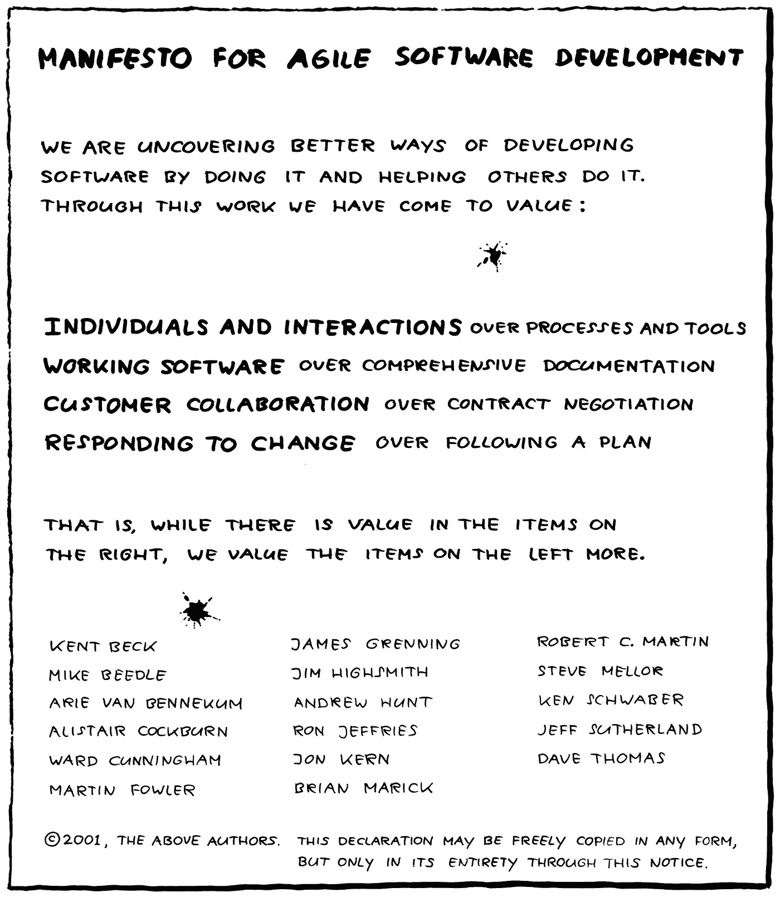

# 请 Scrum，不要伤害我的项目

> 原文：<https://itnext.io/please-scrum-dont-hurt-my-project-a2501847007d?source=collection_archive---------1----------------------->

## 应用 Scrum 之前你需要考虑的 3+1 案例

这年头谁不做敏捷软件开发，对吧？谁是敏捷的宠儿？Scrum 是一个轻量级的、迭代的、增量式的框架，用于管理复杂的工作，通过它基于经验的方法，保证你到达生产力之地。

但是 Scrum 总是有效吗？有没有不同的管理方法或框架可能更适合的情况？应用 Scrum 真的会损害你的项目吗？

在我们探索 Scrum 不一定是你最好的朋友的一些常见情况时，请和我一起关注这篇文章。

# Scrum 和敏捷软件开发宣言

敏捷软件开发宣言

如果你选择阅读这篇文章，你可能已经在使用 Scrum 了，或者至少对 Scrum 是什么有了一个很好的了解，但是对于你们中的少数人来说，这里有一个来自 ScrumAlliance 的简短引用:

> Scrum 是一套轻量级的，但却非常强大的价值观、原则和实践。Scrum 依靠跨职能团队在短周期内交付产品和服务，实现快速反馈、持续改进、快速适应变化和加速交付。

Scrum 是一个交付敏捷软件开发宣言(或者敏捷宣言，因为它通常被用作误称)原则的框架。

# scrum——什么时候不是？

在继续之前，请允许我澄清一件事:我真的很喜欢 Scrum，我从事的大多数项目都是基于 Scrum 的。在这篇文章的后面，我将讨论一些 Scrum 不应该是你的首选的情况，尽管记住还有很多其他的情况 Scrum 真正闪耀。

## 案例 1:没有(真正的)产品所有者

Scrum 有几个角色，但它们都是有用的，尤其是产品负责人(PO)的角色:

> 产品负责人是项目成功的基石，负责定义需要完成的工作并确定工作的优先级。他或她需要知道项目期望交付什么，以及为什么这些元素对客户、市场、组织是重要的。产品负责人还必须是项目团队所有利益的代言人，在团队执行项目时充当专家指导。

来自 [Scrum Alliance](https://www.scrumalliance.org/) 的上述角色定义听起来是不是很容易满足？除非你的组织已经以 Scrum 为中心，否则找到一个好的 PO 的任务可能比你想象的更有挑战性。

对于内部项目，项目经理(PM)或业务分析师(BA)的角色是当 Scrum 打电话给你而你还没有准备好的时候，经常要被洗礼成 POs 的角色。嗯，我只能从个人经验来说，这是行不通的。PO 需要是多才多艺的，并且结合了从项目经理的角度来看的某些技能以及从 BA 的角度来看的其他技能。一个伟大的总理或伟大的总理不一定会成为一个伟大的总理。

对于外部项目、客户项目和预定项目，采购订单(通常)将由客户方的人员担任。这就是棘手的地方。有时候，你会发现自己与那些对自己的业务有着深刻了解的客户一起工作，他们在有效的优先排序方面有着丰富的经验。其他时候，你的客户可能知道业务，但没有真正的洞察力。当然，也有业务知识没有集中到一个人身上，在几个人参与之前无法确定优先级的情况。

= >找到一个能够承担 PO 角色及其职责的人是项目成功的基础。不要因为你需要就把这个角色分配给某人，除非你确定这个人能够完成 Scrum PO 的高要求任务。

## 案例 2:需要高度专业化

Scrum 开发团队应该由世界上最好的魔术师组成:

> 开发团队是跨职能的，拥有团队创造产品增量所需的所有技能。

当然，Scrum 没有告诉你团队内部的专业化是被禁止的，也没有告诉你每个人都需要知道如何做每件事。然而在实践中，你的团队需要的专业化程度越高，实现高速度就越困难。

为了以最高速度运行，你的 Scrum 开发团队的每个成员都应该能够在任何时候进入你的 sprint backlog，并且总是能够找到等待下一个执行的任务。如果你的项目需要高度专业化的资源，sprint backlog 可能并不总是满满的果实让他们采摘。

= >尝试将你的任务/故事以一种需要最少专业化的方式分割。不可避免地，会有一些任务甚至项目确实需要非常特殊的技能；你应该考虑用 Scrum 管理这样的项目是否是最好的方式。如果条件允许，你可以使用“传统的”管理方法来执行项目的高专门化部分，而你仍然对项目的剩余部分/阶段应用 Scrum。

## 案例三:埋没在法规里

谁不喜欢受到严格监管的行业给我们带来的稳定和控制的温暖感觉？嗯，嗯……Scrum 团队不会:

> 在 sprint 结束时，工作应该是潜在可交付的:准备好交给客户，放在商店货架上，或者展示给利益相关者。

如果你开发的软件需要冗长的验证过程和官方监管批准，这需要不确定的时间，那么在使用 Scrum 之前要三思。sprint 是 Scrum 的方形指南针，它的目标非常明确:可交付的工作。如果在 sprint 完成 3 个月后，监管者能带回无数关于你的 sprint 产出的评论，你会怎么做？如果实际的*完成*部分被你的 Scrum 团队之外的实体控制，你的团队对完成的*定义是什么？在 Scrum 中，这些都是很难处理的情况，尤其是考虑到 Scrum 有一种倾向于成为一种内省的方法。*

= >和上面的情况 2 一样，试着看看你是否可以应用一种混合方法，将你的工作分成需要监管机构批准的任务和不需要的任务。通过这种方式，你仍然可以对后者应用 Scrum，对前者应用一些其他的“传统”方法。当然，请记住，您现在必须维护两个独立的——通常是并行的——过程，因此您需要指定严格的检查点，以确保整个项目保持在正确的轨道上。

## + 1 情况:地理分散

[Scrum 指南](https://www.scrumalliance.org/learn-about-scrum/the-scrum-guide)没有将团队搭配作为先决条件，然而，许多敏捷教练会建议不要将团队分散在不同的地理位置。主要的论点是 Scrum 由某些事件组成，这些事件需要团队频繁且毫不费力地沟通。如果这种交流完全通过在线方式进行，往往会更慢、效率更低。花在无效沟通上的时间越多，交付工作的时间就越少——我们不希望这样，不是吗？

很明显，上面所说的是一个可证明的事实，在一个理想的世界里，我们应该让所有的 Scrum 团队共处一室。但是我们并不是生活在一个理想的世界里，全球化以及实行在家工作友好政策的公司不得不与分散在不同地区、城市、国家甚至大洲的 Scrum 团队打交道。我个人对此的看法是:试试看。投资于沟通工具，确保你的 Scrum 团队中的人可以通过聊天、语音或视频，只需点击一下鼠标就能相互联系。

交付软件时，敏捷和 Scrum 并不是万能的。你需要理解你将要使用的方法和框架，确保它们符合你的团队和组织以及你的客户的需求、能力、文化和成熟度。确定优势和劣势，验证什么对你、你的项目和你的客户有效。

你有没有想过或者遇到过其他 Scrum 不太好用的例子？请分享知识，在评论里告诉我。