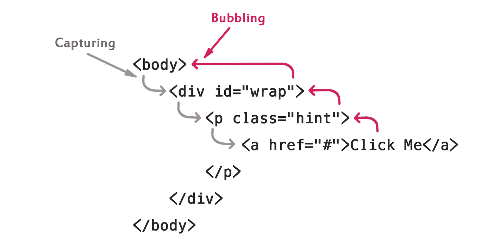

# 预防故障与停止传播

> 原文：<https://itnext.io/preventdefault-vs-stoppropagation-3631de9fe1c6?source=collection_archive---------1----------------------->

## event.preventDefault 和 event.stopPropagation 有什么区别？

[JESHOOTS.COM](https://unsplash.com/@jeshoots?utm_source=unsplash&utm_medium=referral&utm_content=creditCopyText)在 [Unsplash](https://unsplash.com/s/photos/development?utm_source=unsplash&utm_medium=referral&utm_content=creditCopyText) 上的照片

乍一看，我会说他们也是这样做的。大概，一旧一新。让我们停止猜测，回应主要问题“event.preventDefault 和 event.stopPropagation 有什么区别？”。什么时候应该用`[event.preventDefault](https://developer.mozilla.org/en-US/docs/Web/API/Event/preventDefault)()`和`[event.stopPropagation()](https://developer.mozilla.org/en-US/docs/Web/API/Event/stopPropagation)`？大家一起调查一下吧。

首先，我们应该了解“什么是事件传播？”。事件传播是事件如何通过 DOM 树传播到达目标的一种机制。事件传播有三个阶段:

*   **捕捉阶段**-事件从车窗下降开始，直到到达`event.target`。
*   **目标阶段**-事件已经到达`event.target`。
*   **冒泡阶段**——事件从`event.target`元素开始冒泡，直到到达窗口。

事件传播

**预防违约**

`event.preventDefault()`方法防止元素的默认行为。如果我们使用`form`元素，它会阻止提交。如果我们使用`a href`元素，它会阻止导航。如果我们使用`contextMenu`元素，它会阻止显示。

`event.preventDefault()`不允许用户离开页面并打开 URL。

**停止繁殖**

`event.stopPropagation()`方法在冒泡或捕获阶段阻止事件的传播。

href 元素 id="child "上的事件停止从子元素传播到父元素。

我希望这篇文章对你有帮助，并且你知道什么时候使用`event.preventDefault()`和`event.stopPropagation()`。你也可以阅读关于`[event.stopImmediatePropagation()](https://developer.mozilla.org/en-US/docs/Web/API/Event/stopImmediatePropagation)`和`[event.returnValue](https://developer.mozilla.org/en-US/docs/Web/API/Event/returnValue)`的内容。

# 资源

*   [事件.预防默认](https://developer.mozilla.org/en-US/docs/Web/API/Event/preventDefault)
*   [事件停止传播](https://developer.mozilla.org/en-US/docs/Web/API/Event/stopPropagation)
*   【event.preventDefault 和 event.stopPropagation 有什么区别？
*   [如何正确使用 preventDefault()，stopPropagation()，或者对事件返回 false](https://medium.com/@jacobwarduk/how-to-correctly-use-preventdefault-stoppropagation-or-return-false-on-events-6c4e3f31aedb)？
*   [Javascript 中的事件传播](https://www.tutorialrepublic.com/javascript-tutorial/javascript-event-propagation.php)