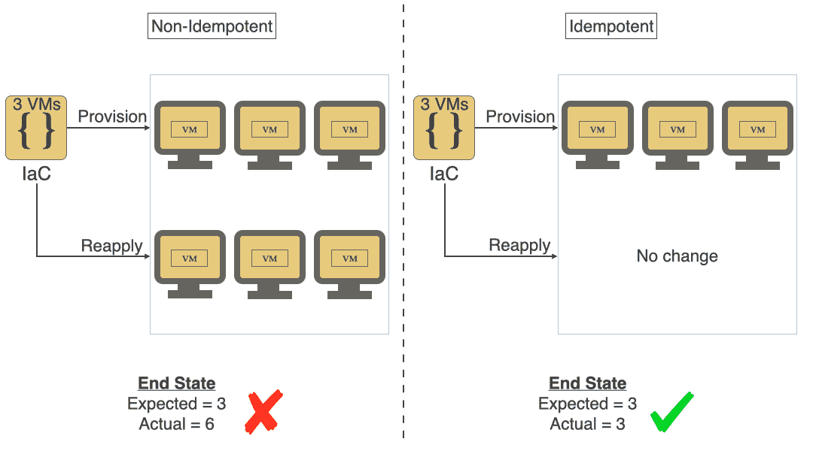
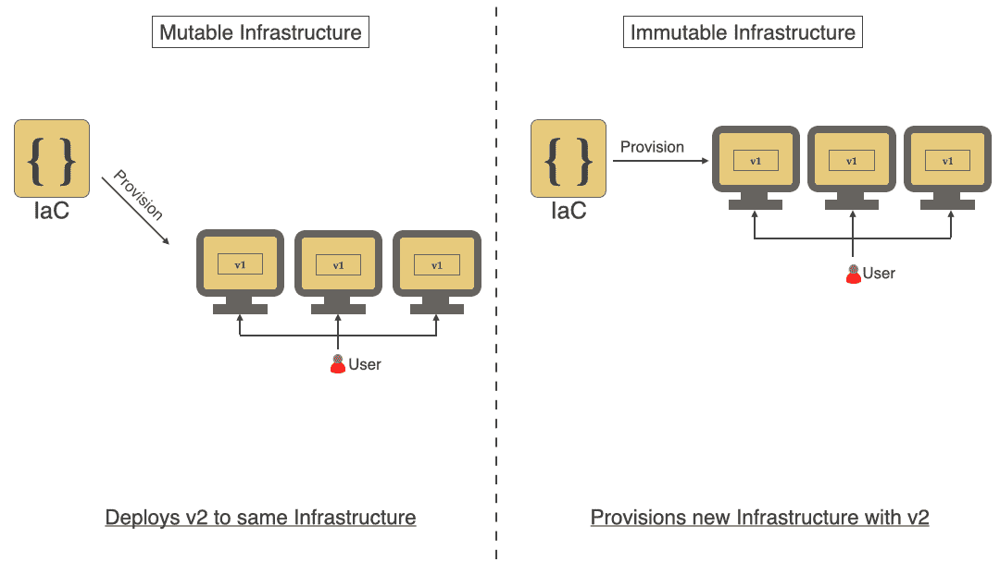
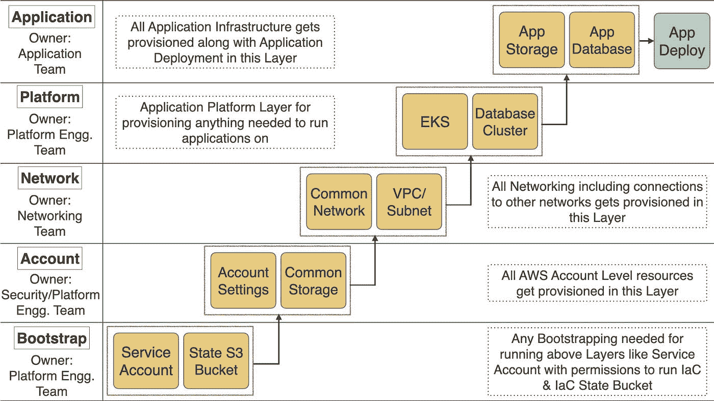
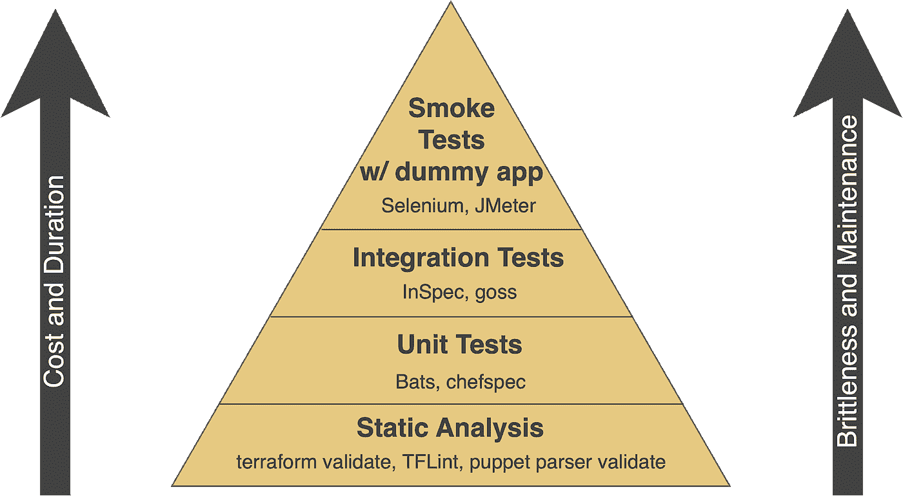
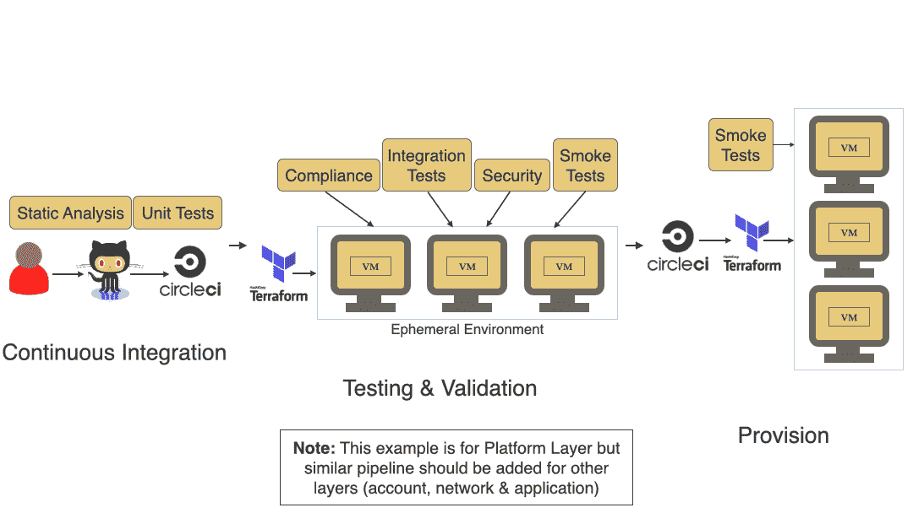
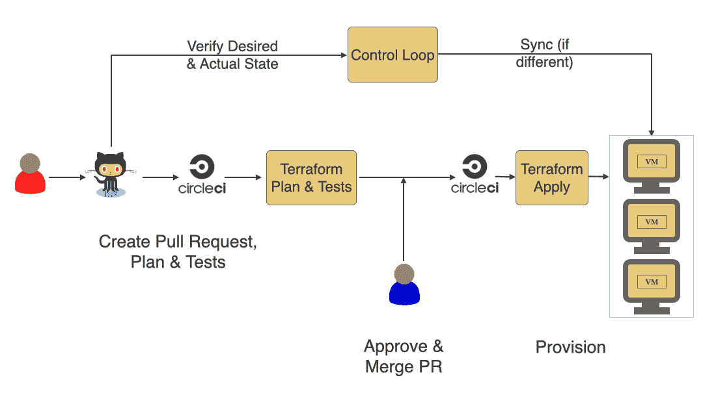

# 作为代码的有效基础设施的原则、模式和实践

> 原文：<https://itnext.io/principles-patterns-and-practices-for-effective-infrastructure-as-code-e5f7bbe13df1?source=collection_archive---------2----------------------->

## 大规模快速可靠地交付基础架构和运行于其上的软件

# 目录

> [什么是基础设施作为代码](#86fa)
> [关键原则](#d9d9)
> - [等幂](#cfa3)- [不变性](#df0e)
> [模式和实践](#1a75)
> - [一切尽在源代码控制](#2b5e)
> - [模块化和版本](#6abf)-[文档](#ac0a)-[测试](#5308)-
> -

**备注:**
*1。使用这些原则、模式和实践需要一定程度的组织成熟度。这篇文章的重点不是文化方面的东西，但它对于成功地采用这些东西是非常重要的。
2。本文中使用的示例是使用 Terraform 和 AWS，但是这些原则、模式和实践是通用的，并且大多数情况下可以应用于其他 IaC 工具，如*[*Pulumi*](https://www.pulumi.com/)*、*[*cloud formation*](https://aws.amazon.com/cloudformation/)*等。还有像 GCP 和 Azure 这样的云提供商，甚至是内部部署。*

# 什么是作为代码的基础设施？

> 基础设施即代码(IaC)是一种采用软件系统使用的成熟编码技术并将其扩展到基础设施的方法。这是关键的 DevOps 实践之一，它使团队能够大规模、快速、可靠地交付基础设施以及在其上运行的软件。

如果您想要为您的应用程序实现[连续交付](https://martinfowler.com/bliki/ContinuousDelivery.html)，为您的基础架构提供一个快速可靠的供应机制是非常重要的。

在这篇文章中，我们将回顾这些年来帮助我和我工作过的组织的各种原则、模式和实践。

# 关键原则

在我们开始讨论模式和实践之前，让我们看看有效的 IaC 的关键原则。

## 幂等性

> 幂等性意味着无论运行 IaC 多少次，无论起始状态是什么，最终都会得到相同的结束状态。这简化了基础架构的配置，并降低了结果不一致的可能性。

幂等性可以通过使用带有声明性语言的有状态工具来实现，如 Terraform，其中您定义了您想要的基础架构的期望最终状态，然后 Terraform 的工作就是让您达到该最终状态。如果它不能达到期望的状态，它就会失败。

在下面的图 1 中，您可以看到，对于非等幂的 IaC，如果运行两次，它将调配 6 个虚拟机，而不是所需的 3 个。在幂等 IaC 的情况下，即使您多次运行它，它也只提供 3 个虚拟机，从而使它更加可靠和一致。

图 1: **非等幂** vs **等幂 IaC**

## 不变

配置漂移是基础设施的一个大问题。当在一段时间内对基础设施进行了未记录的更改，并且您的各种环境以不容易重现的方式相互偏离时，就会发生这种情况。如果您有一个长期存在的可变基础设施，通常会发生这种情况。对于长期存在的基础设施来说，系统通常更脆弱，因为会出现缓慢的内存泄漏、由于日志累积导致的磁盘空间不足等问题。可能会持续一段时间。这还意味着您不会像应用程序或配置那样频繁地配置基础架构，因此对自己的能力没有信心。这些问题可以通过使用不可变的基础设施来解决。

> 不可变的基础设施意味着你不用改变现有的基础设施，而是用新的来代替它。通过每次配置新的基础架构，您可以确保它是可重复的，并且不允许随着时间的推移而发生配置漂移。

在云环境中调配基础架构时，不可变基础架构还支持可扩展性。您可以在下图 2 中看到，对于可变基础架构，应用程序的 v2 部署在与 v1 相同的服务器上，但对于不可变基础架构，它为新虚拟机配置了应用程序的 v2。

图 2: **可变的**与**不可变的基础设施**

# 模式和实践

## 源代码控制中的一切

不言而喻，**一切都应该在源代码控制**中。甚至是您偶尔运行来修复问题的脚本，以及用于提供基础设施和部署软件的管道(代码为的[管道)。我去过一些地方，那里没有人知道运行在生产环境中的脚本在哪里，谁创建了它，以及它的变化历史。这是你不想遇到的情况。](https://www.thoughtworks.com/radar/techniques/pipelines-as-code)

确保公司的每个人都可以访问**代码，**即使是不修改 IaC 代码库的开发人员。一个例外可能是你有一个很强的理由不这样做，比如一个合法的理由。这为那些在您的基础架构上运行应用程序的人提供了可见性和更好的理解，因此当您的消费者想要对某个问题进行故障排除，并且想要了解基础架构是如何配置的时，他们可以通过查看代码轻松做到这一点。他们应该能够查看代码，了解基础设施是如何配置的，如果他们选择这样做，甚至可以做出贡献。我曾经与这样的团队合作过，不仅 IaC 存储库对于组织的其他部分是不可访问的，而且它们还存储在单独的源代码控制工具上，使它们保持隐藏。这是一种反模式。

## 模块化和版本化

模块化 IaC 类软件代码有助于维护、可读性和所有权。它还有助于保持较小的变化和独立的可部署性。与软件相比，重构 IaC 相对困难，尤其是对于 DNS 记录、CDN、网络、数据库等关键部分。所以预先偏向于过度抽象会更好，即使这意味着处理比需要的稍微复杂一些的 IaC。

在许多组织中，他们有不同的团队，如网络、安全和平台工程  将基础架构的各个层分开，并赋予适当的团队所有权，以便更好地进行控制，这可能是有意义的。由于上面提到的其他原因，在跨职能团队管理软件和基础设施的情况下，我也将这些层分开。在下面的图 3 中，我展示了一个部署到 Amazon Elastic Kubernetes Service(EKS)的示例，每个基础架构层中有各种模块及其所有权。根据您的设置，这些模块/层可能会有所不同。

图 3: **基础设施层示例**

模块的版本控制非常重要，以确保您不会破坏生产中的东西，除非您使用 monorepo，在这种情况下，您总是使用来自同一个 repo 的最新版本。

## 证明文件

有了 IaC，您应该不需要大量的文档，因为所有的东西都被编码了，但是一些文档仍然是必不可少的。更高质量的文档不仅有助于维护 IaC 的团队，也有助于基础设施的消费者。

> 文档很难。就像代码一样，确保你有足够的文档来传达你想要的信息是很重要的。文档越多不代表越好。过时的文档更糟糕。

让文档在需要时容易获得是很重要的。例如，如果您显示一条错误消息，最好包含一个指向文档的链接，以解决类似的问题。此外，针对典型场景的[操作手册](https://en.wikipedia.org/wiki/Runbook)有助于在生产问题期间进行故障排除。

文档应该更贴近代码。如果它和代码在一起或者更接近代码，你就有更多的机会保持更新。例如，在与 IaC 相同的存储库中添加一个自述文件，而不是在存储库之外的某个外部位置，如 confluence 或 wiki，这样会更好。这样，当代码发生变化时，您就有更多的机会记得在同一次提交中更新文档，这也可以作为拉请求过程中的一个提醒。如果您可以从代码中生成文档或者将测试用作文档，那是最理想的。

## 测试

就像在软件开发中一样，您需要考虑在不同层次上测试您的 IaC。如果你不知道测试金字塔，这里的[是马丁·福勒网站上的一篇文章。下面是我为 IaC 尝试的一个测试金字塔。](https://martinfowler.com/bliki/TestPyramid.html)

这里的想法是，当你在测试金字塔上向上时，测试更昂贵，更脆弱，运行时间更长，并且需要更高的维护。因此，出于这些原因并为了获得更快的反馈，您应该尽可能频繁地运行金字塔底部的测试，而不要频繁地运行顶部的测试。

图 4: **测试代码为**的基础设施金字塔

静态分析:因为这是获得反馈的最快方法，所以你应该尽可能经常地运行它，即使是在你的机器上。当您在文本编辑器或 IDE 中保存文件时，有一些集成可以自动完成这项工作。您可以使用类似于 [terraform validate](https://www.terraform.io/docs/commands/validate.html) 或 [TFLint](https://github.com/terraform-linters/tflint) 的工具进行静态分析。

单元测试:由于大多数工具(如 terraform 和 ansible)都是声明性的，IaC 通常不需要单元测试。然而，在某些情况下，单元测试可能是有帮助的，比如当你有条件或者循环的时候。如果你正在编写 bash 脚本，你可以使用 [bats](https://github.com/sstephenson/bats) 进行单元测试，或者如果你正在使用 [Pulumi](https://www.pulumi.com/docs/guides/testing/unit/) ，它支持像 TypeScript、Python、Go 或 C#这样的语言，你可以使用语言测试框架。

**集成测试:**这是您在一个环境中提供您的资源并验证您是否满足某些需求的时候。请记住，不要为您的工具负责的事情编写测试，尤其是当您正在编写声明性代码时。例如，您应该编写自动化测试来确保您的 s3 存储桶都不是公共的，而不是验证 IaC 中指定的策略是否被应用。另一个例子是测试所有 EC2 实例中只有某些端口是开放的。您还可以提供一个短暂的  环境(您可以稍后拆除)来运行这些测试。根据这些测试需要多长时间，您可能希望在每次提交之后或者作为每夜构建运行这些测试。像 [Chef InSpec](https://www.inspec.io/) 和 [goss](https://github.com/aelsabbahy/goss) 这样的工具对这些类型的测试很有帮助。

**使用虚拟应用程序进行冒烟测试:**最后但并非最不重要的一种测试方法是提供一个环境，部署一个虚拟应用程序，并运行快速冒烟测试来验证应用程序是否部署正确。使用一个虚拟应用程序来测试您的真实应用程序可能会有的场景，但不是为生产而配置的。例如，如果您的应用程序连接到外部托管的数据库，您应该尝试在虚拟应用程序中连接到它。这让您确信，您正在配置的基础架构允许您运行您打算在其上运行的应用程序。由于这些测试速度较慢，因此您可以在配置新环境后定期运行这些测试。

## 安全性和合规性

确保您的基础架构以及在其上运行的应用程序是安全且合规的，这一点非常重要，但却常常被忽视。传统上，许多组织对此进行手动检查和把关，这非常耗时，并且通常发生在部署周期的后期阶段，但有了 IaC，您可以自动执行这些检查和把关，以提供更好的安全性/合规性，并在周期中更频繁、更快地运行它们。

以下是一些需要考虑的方面:

**身份和访问管理:**确保您的 IaC 和 it 供应的基础设施拥有强大的身份和访问管理。对 IaC 使用**基于角色的访问控制(RBAC)** 来配置基础设施有助于减少整体攻击面。有了 RBAC，你就给了你的 IaC 足够的权限来执行它应该做的操作。

**秘密管理:** IaC 通常需要秘密来提供任何基础设施。例如，如果您在 AWS 中提供资源，您将需要 AWS 凭证来连接到它。确保使用可靠的秘密管理工具，如 [Hashicorp Vault](https://www.vaultproject.io/) 或 [AWS Secrets Manager](https://aws.amazon.com/secrets-manager/) 。

如果您需要在状态文件中输出或存储任何秘密(尽管您应该尽量避免)，请确保它们是加密的，这样如果有人得到了状态文件，他们就无法从中提取秘密。

**安全扫描:**在较低或短暂的环境中配置或更改基础架构后运行安全扫描有助于避免生产中的安全问题。使用像 [CIS Benchmark](https://www.cisecurity.org/cis-benchmarks/) 和 [Amazon Inspector](https://aws.amazon.com/inspector/) 这样的工具有助于发现常见的漏洞/暴露，并确保遵循安全最佳实践。

**法规遵从性:**许多公司都有法规遵从性要求，但如果您在医疗保健或金融领域工作，要求会更加严格。我相信您知道其中的一些(如果不是全部的话):HIPAA、PCI、GDPR 和 SOX。如上所述，传统上，合规团队习惯于手动完成所有检查和文书工作。使用各种工具，如 Chef Inspec 或 hashi corp Sentinel(T21)来自动化这些合规性要求，有助于更频繁地运行它，并更快地发现问题。例如，通过提供一个短暂的  环境，您可以在每次更改 IaC 时运行这些符合性测试，这样您就可以在投入生产之前发现新代码是否有任何问题。

# 从共享环境中自动执行

应将上述所有步骤整合在一起，并按照一定的顺序执行 IaC 和适当的检查，以便在各种环境中放心地配置基础架构。为此，我将在下面讨论两个选项。

## 作为代码管道的基础设施

下面的示例演示了 IaC 管道中的典型步骤序列。我在下面的例子中使用了 CircleCI，但是你可以使用任何管道工具来执行。管道为依赖于基础设施的每个人提供了可见性，并在出现故障时通知相应的团队。

图 5: **作为代码管道的基础设施**

## GitOps

执行 IaC 的另一种方式是使用 GitOps，它扩展了 IaC 并添加了一个工作流(拉请求流程),以便将更改应用到生产或任何环境中。它还可以具有控制循环，该控制循环周期性地验证基础设施的实际状态是否与期望状态相同。例如，它将确保如果直接对基础结构进行了任何更改，它将根据源代码控制恢复到所需的状态。可以使用 GitOps 代替上面定义的 IaC 管道。关于 GitOps 的更多信息，你可以在 Weaveworks 网站[这里](https://www.weave.works/technologies/gitops/)阅读文档。

> GitOps = IaC +(工作流+控制循环)

图 6: **GitOps 工作流程**

# 将基础设施作为代码进行扩展的挑战

基础设施即代码(IaC)在许多方面使管理基础设施变得更容易，但公司接受采用 IaC 的成本存在许多挑战，尤其是在扩展时。阅读下面的文章来了解这些挑战，以及如何使用环境作为代码来解决它们。

*   [挑战扩展基础设施代码](https://compuzest.com/2021/08/09/challenges-scaling-infrastructure-as-code/)
*   [从基础设施代码到环境代码](https://compuzest.com/2021/09/23/from-infrastructure-as-code-to-environment-as-code/)

# 结论

感谢您阅读本文，希望您会觉得有用。如果你知道其他 IaC 原则、模式或实践，可以添加到本文中，或者有任何问题，请在下面的评论中告诉我，或者在 [twitter](https://twitter.com/shahadarsh) 上联系我，我会研究一下。

***鸣谢:*** Matt Kuritz、Michael Wytock 和 Arielle Sullivan 阅读了本文的草稿版本，并提供了改进意见。

[1]:图 3 中提到的平台工程团队负责操作平台，使交付团队能够以更短的交付时间和更低的复杂性自助部署和操作系统。想了解更多，请阅读关于它的文章，点击这里，或者观看我和普里扬卡·拉奥在爱丁堡国际发展周上的演讲，点击这里，或者看看这里的 T4。

[2]:短暂的环境意味着在需要时按需提供环境，然后在之后破坏它。这是一种测试 IaC 和其上运行的应用程序的有用技术，无需让它一直运行，从而节省成本。

*还发布在* [*我的网站*](https://shahadarsh.com/2020/07/12/principles-patterns-and-practices-for-effective-infrastructure-as-code/) *。*