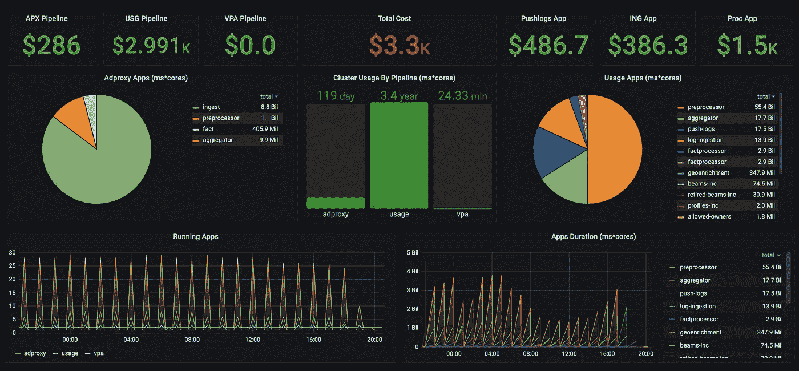
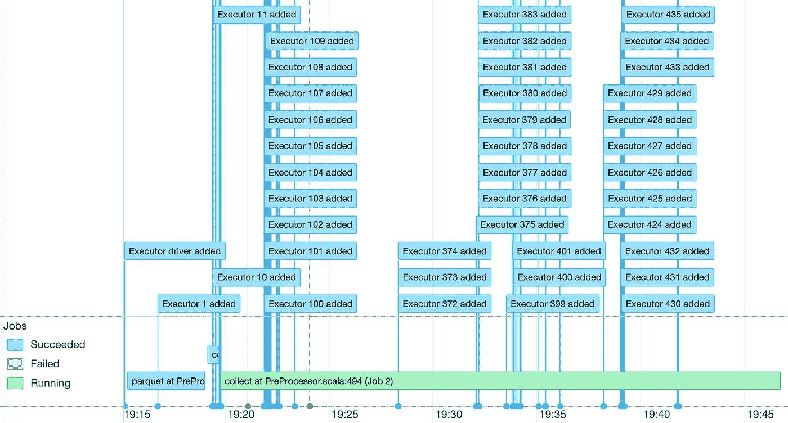
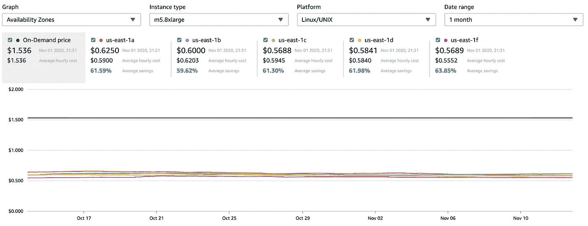
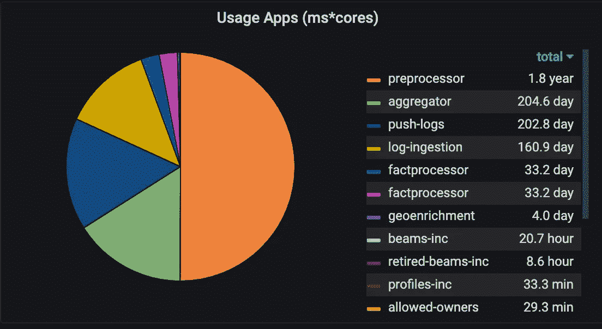
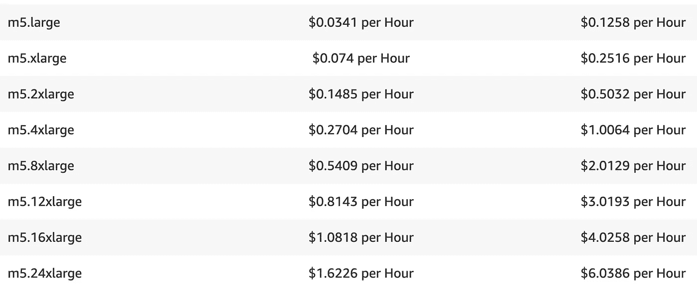
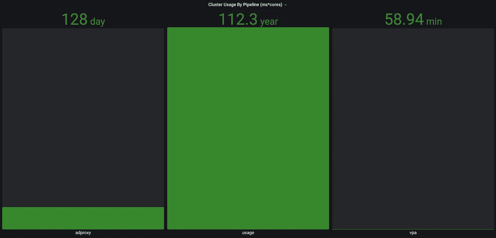
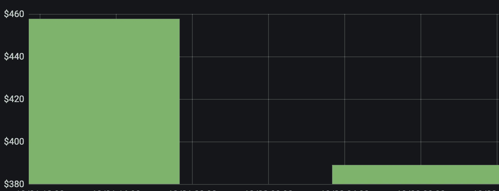

# 多租户电子病历集群的处理成本测量

> 原文：<https://itnext.io/processing-costs-measurement-on-multi-tenant-emr-clusters-be09a2e021ca?source=collection_archive---------2----------------------->



# 介绍

[架构良好的框架](http://aws.amazon.com/well-architected)的五大支柱之一是成本优化。成本优化支柱侧重于避免不必要的成本、选择最合适的资源类型、分析一段时间内的支出、扩大/缩小规模，以便在不超支的情况下满足业务需求。一方面，很清楚为什么任何组织都必须投入必要的时间和资源来持续执行成本优化任务，另一方面，推动这种变化真的很难，尤其是在不熟悉云技术的组织中。

从成本意识文化入手的最佳方式之一是通过游戏化来实现。这可以通过公开可见的仪表板或报告来完成，这些仪表板或报告可以跨团队、工作负载和应用程序比较标准化成本和使用情况。

# 问题陈述

给定一个共享的 AWS EMR 集群，它服务于整个组织来运行 Apache Spark 工作负载(管道)。每个管道由一定数量的不同 Spark 应用程序组成。Spark 应用程序使用动态分配策略，这意味着运行时的应用程序可以在有需求时请求资源，如果不再使用资源，就将资源归还给集群。一些应用程序会在运行时多次执行这样的分配/释放循环。在下面的屏幕截图中，您可以看到动态分配机制在起作用。在这个特殊的例子中，Apache Spark 应用程序从 19:15 开始，在 19:25 分配了 100 个执行程序，然后在 19:40 又分配了 330 个执行程序(总共 430 个执行程序)。



分配历史记录

除了分配的动态特性，这个 EMR 集群可以使用 [AWS 实例群](https://docs.aws.amazon.com/emr/latest/ManagementGuide/emr-instance-fleet.html)。对于实例车队，您可以为每个车队中的按需实例和定点实例指定目标容量。当集群启动时，Amazon EMR 提供实例，直到目标实现。最后，它将按需运行并并排运行，这意味着每个执行器的成本将取决于底层机器的当前价格。在下面的截图中，您可以看到 m5.8xlarge 实例的历史现货价格。现货价格会随着时间的推移而变化，并且在不同的可用区域之间是不同的。



m 5.8 x 大价格历史

目标是建立一个成本仪表板，跟踪不同管道和应用程序的历史成本和使用情况。仪表板应包含视图，一方面允许识别成本效率的提高，另一方面允许在代码更改导致成本增加时从错误中学习。

# 解决办法

理论上，这个问题很简单。为了测量每个应用程序的成本，我们必须以小时(D)为单位测量应用程序持续时间，然后测量每个应用程序使用的 EMR 群集份额，最后执行:

```
**S / Cluster Cost Per Hour * D**
```

问题在于资源分配的动态性和 EMR 集群价格。应用程序的群集份额和 EMR 群集成本都可能在一小时内变化多次。因此，我们需要找到一种方法来跟踪应用程序执行过程中每一点的分配情况。

幸运的是，我们可以使用 Spark API 来准确跟踪资源分配。特别是， [SparkListener](https://spark.apache.org/docs/latest/api/java/index.html?org/apache/spark/scheduler/SparkListener.html) 将非常有助于这项任务。SparkListener 从 Spark 调度程序中截取事件。Spark 调度程序在 Spark 应用程序的执行过程中会发出许多类型的事件。例如，我们可以拦截事件 ExecutorAdded 和 ExecutorRemoved。

SparkListener 实现

在本例中，当添加(分配)新的执行器时，SparkListenerClient 保存执行器的状态(开始时间、内核数量、id 和底层主机)。当执行程序被删除时，SparkListenerClient 计算执行程序的执行时间。方法 *onExecutorBlacklisted* 处理底层机器丢失或由于任何其他原因无法访问执行器的情况。当应用程序结束时，SparkListenerClient 通过计算所有活动执行器的执行时间来最终确定状态。最后，SparkListenerClient 包含每个执行器非常详细的分配/取消分配历史:分配时间、执行时间、内核数量、底层主机。现在，我们可以将这些数据刷新到我们的监控系统(AWS CloudWatch)中。

SparkListenerClient

这里有趣的部分是 flush 方法，第 18 行。在将我们的指标发送到 AWS Cloud Watch 之前，我们将执行时间标准化为时间/核心单位。例如，对于任何执行时间为 X、内核数量为 Y 的执行器，归一化执行时间为 X*Y。这就是我们如何区分运行时间相同但使用不同内核数量的执行器。它给出了一个非常有趣的指标，即应用程序在单核上运行时完成任务所需的时间。



标准化执行时间

在*标准化执行时间*图中，您可以看到一个巨大的计算密集型应用，在单核上需要 1.8 年才能完成。

现在，当归一化的执行时间已知时，我们需要找到每个内核的价格。在按需 EC2 机器的情况下，任务真的很容易。例如这里的价格 [M5 EC2](https://aws.amazon.com/ec2/pricing/on-demand/) 机器在美国-西方-2。



EC2 按需价格和 EMR 费用

在这种情况下，每个内核的成本为 0.048 美元/小时，即大约 5 美分。因此，标准化执行时间为 1.8 年的应用程序实际成本为 1.8*365*24*0.05 =788 美元。当然，我们还要加上 25%的电子病历费用，所以大约是 955 美元。

现在的问题是我们能做些什么。正如我们所看到的，spot 实例的价格随着时间的推移而变化，并且在不同的可用性区域之间是不同的。一种可能的解决方案是使用以下 Python 脚本将价格连续提取到内部数据库中:

该脚本返回指定实例价格的数组。例如，您可以获得以下 JSON:

```
[{u’Timestamp’: datetime.datetime(2020, 11, 12, 18, 15, 48, tzinfo=tzlocal()), u’AvailabilityZone’: ‘us-west-2a’, u’InstanceType’: ‘m5.8xlarge’, u’ProductDescription’: ‘Linux/UNIX’, u’SpotPrice’: ‘0.673900’}, {u’Timestamp’: datetime.datetime(2020, 11, 12, 5, 5, 52, tzinfo=tzlocal()), u’AvailabilityZone’: ‘us-west-2a’, u’InstanceType’: ‘m5.8xlarge’, u’ProductDescription’: ‘Linux/UNIX’, u’SpotPrice’: ‘0.668600’}, …]
```

现在数学很简单，现货实例价格/实例核心数量，您就有了每个核心所需的价格。标准化执行时间为 1.8 年的应用程序在 EC2 spot 实例上运行时的成本为 0.67/32*1.8*365*24=330 美元。

另一种方法是使用 Java SDK，并在执行程序分配时获取底层 EC2 价格。所以你可以选择最适合你的。当您获得了成本和规范化执行时间度量时，您可以构建非常有趣的仪表板。您可以根据不同团队运行的工作负载来分解 EMR 的成本。



工作负载标准化执行时间

另一个非常有用的仪表板是显示同一应用程序随时间变化的成本时间。当执行优化任务时，或者当代码/配置更改导致成本增加时通知开发团队时，这些数据非常有用。



应用优化

在应用程序优化屏幕截图上，您可以看到性能优化代码更改的结果。特定 Spark 应用程序的每日成本从 458 美元下降到 389 美元，从而节省了 69 美元的成本。当预测每月成本降低时，我们得到 2000 美元，当进行年度预测时，我们得到高达 24，840 美元的数字。因此，通过查看这些数字，我们可以很容易地证明(或不证明)优化任务。

# 摘要

有时，很难准确识别工作负载的成本和使用情况，尤其是在共享集群上运行不同的应用程序时。有鉴于此，花时间进行这样的测量总是值得的。它允许以美元数字量化每一个应用程序、服务、功能，因此，它有助于获得财务成功和加速产品的商业价值。