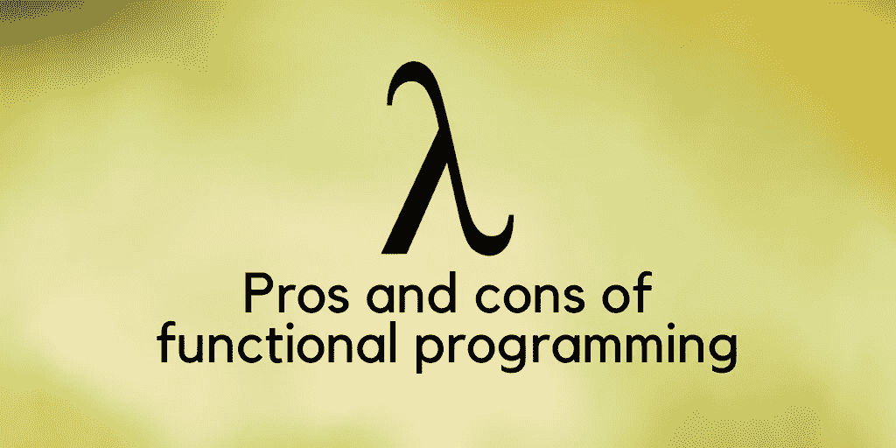

# 函数式编程的利弊

> 原文：<https://itnext.io/pros-and-cons-of-functional-programming-32cdf527e1c2?source=collection_archive---------0----------------------->

最初我把这个翻译分享给了 Syndicode 博客。

本文是根据伊琳娜·林尼克的[原始资料](https://dou.ua/lenta/articles/functional-programming/)翻译的。我认为她所写的这些想法和考虑对说英语的读者来说是非常有用的。在这里，您将发现函数式编程的一些基本优点和缺点，以及为什么您应该考虑它。

程序员是非常有创造力的人，但同时，他们在选择编程语言时往往会遵循一些趋势。例如，PHP 被认为是“懒惰”的语言，而 JavaScript 是“难以预测的魔法”。如今，函数式语言变得越来越流行，并得到了世界大公司的关注。根据不同的分析和对 GitHub 和 Stack Overflow 上的语言流行程度的共同评估，函数式语言(如 Elm 或 [Elixir](https://syndicode.com/2018/03/20/12-main-open-source-elixir-frameworks/) )正在慢慢获得势头。JavaScript 受欢迎程度的巨大增长也导致了对函数式编程兴趣的增加。此外，具有函数式编程经验的开发人员随后开始致力于 SPA 框架，结果，我们有了 Redux、React、MobX 和其他数百万人使用的库。

那么，什么是函数式编程，为什么它变得如此流行呢？让我们仔细看看。

# 基础

从头开始是值得的。

JavaScript 世界非常活跃。几年前，只有少数开发人员有函数式编程的想法。但是在过去的三年里，几乎每个大型应用程序代码库都在使用函数式编程的思想。这是有客观原因的:

1.  函数式编程允许您编写更加压缩和可预测的代码，
2.  比较好考(虽然从头学不容易)。

使用函数式编程(FP)的软件开发的主要区别特征:

*   纯函数的组合；
*   避免共享状态、可变数据和副作用；
*   陈述性方法比命令性方法更流行。

函数式编程本质上是基于上述基本的、决定性的原则。当你开始学习 FP 时，有必要切换到“学术”模式，学习你会遇到的所有定义或术语:纯函数、函数组合、共享状态避免等。在那之后，你将会从整体上看待功能和编程两方面完全不同。这里举一些术语的例子:

[纯函数](https://en.wikipedia.org/wiki/Pure_function)是没有副作用的确定性函数。确定性函数意味着它对同一组输入值返回相同的结果。对于 FP 来说，这类函数的性质非常重要。例如，纯函数具有引用透明性——您可以用其最终值替换函数调用，而无需更改程序的值。

函数组合是指组合两个或多个函数以创建新函数或执行计算的过程。

什么是共享状态？共享状态的主要问题是理解函数的效果。你需要知道函数使用的每个变量的全部历史。因此，函数式编程避免了共享状态，而是依靠不可变的数据结构和纯粹的计算来从现有数据中提取新数据。使用共享状态时出现的另一个细微差别——改变函数调用的顺序会导致大量错误。这就是为什么避免共享状态将帮助您避免这个问题。

**不变性**是函数式编程的核心(不要和常量混淆)。“const”creates 用于创建后不能重新分配的变量名。但是它不创建不可变的对象。您将无法更改与绑定相关的对象，但仍可以更改该对象的属性。

[副作用](https://en.wikipedia.org/wiki/Side_effect_(computer_science))意味着除了返回值，函数还与外部变量状态交互。为什么 FP 避免了副作用？因为通过这种方式，程序的效果更容易理解和测试。例如，Haskell 使用单子将副作用从纯函数中分离出来。

# 为什么选择声明式方法？

命令式方法遵循工作流控制的原则，并回答“如何做”的问题。声明式方法描述了数据流，并回答了“做什么”的问题。此外，命令式代码最常使用指令(操作符)，而声明式代码更多地依赖于表达式。

所以，我们似乎弄清楚了什么是函数式编程，以及你需要了解它的什么。在我们继续讨论它的优点之前，让我们先看看它的缺点。“函数式编程不自然”这种刻板印象的本质是什么。

# 成为代码

一些程序员仍然认为函数式编程很奇怪。这在某种程度上是正确的。这是从互联网上引用的描述 FP 的话:

> 编写功能代码就像是逆向编写代码。而且更类似于解谜，而不是向计算机解释过程。

事实上，这是一种对函数式编程的主观态度，这种态度是由那些不想花足够的时间去理解函数式编程的细微差别的人形成的。

现在我们将继续

# FP 利弊

**缺点**

*   函数式语言没有高效的[词汇](https://github.com/hemanth/functional-programming-jargon)。纯函数式词汇表比散列表运行得慢，对于某些应用程序来说，这一点很关键。其次，不存在纯功能的弱哈希映射。然而，对于大多数开发人员来说，这个缺陷可能没有被注意到。
*   函数式编程不适合图形中的算法(由于工作速度慢)，一般来说也不适合那些几十年来基于命令式编程的解决方案。

查看 Quora 和 Alexander Alvin 的[文章中关于 FP 劣势](https://alvinalexander.com/scala/fp-book/disadvantages-of-functional-programming)[的列表。](https://www.quora.com/What-are-some-limitations-disadvantages-of-functional-programming-Where-does-it-break-down-when-you-want-to-get-things-done/answer/Tikhon-Jelvis)

好吧，我们提到的最后一点和缺点没有太大关系，因为我们不能因为函数式编程不符合初衷而责怪它。

**优点**

*   函数式编程以其高级抽象而闻名，这些抽象隐藏了迭代等常规操作的大量细节。这使得代码更短，因此保证了可以容忍的更少的错误。
*   在函数式编程中，语言原语的数量较少。众所周知的类不在 FP 中使用。在函数式编程中，有几个基本的语言原语在内部得到了很好的优化，而不是用方法形式的操作来创建对象的唯一描述。
*   由于语言和结构的灵活性，作为函数式编程开发人员，您可以让语言更接近问题。反之亦然。此外，FP 提供了一些新的有趣的工具来解决 OOP 开发者经常忽略的复杂任务。
*   使用函数式语言可以提供准确快速的代码编写，方便测试和调试。你正在使用高级程序，函数签名提供了更多的信息。

你可以在这里找到其他函数式编程的好处[。](https://www.quora.com/What-are-the-advantages-of-functional-programming-over-object-oriented-programming-What-are-some-languages-that-are-mainly-functional)

# 函数式编程用例

如今，开发人员试图解决并行处理和处理大数据的问题。通过并行处理这些数据，您可以很快获得想要的结果。另外，不要忘记像区块链这样的分散(分布式)计算。由于函数式编程原则，函数式代码最适合这种计算。所有基本 API 技术的使用促进了代码及其支持的并行执行。

一开始，函数式编程只用于解决特定的问题。但是现在它甚至被应用在大型 it 公司创建的经典项目中。

# 如果你想学习函数式编程

在这里你会找到一些帮助你开始 FP 的小贴士。

1.  放松点。一开始，会很难。抛开你以前知道的，努力学习新的方法和原则。
2.  从一个微任务开始。
3.  从学习 Haskell 开始，然后上 Scala(或者 F #)更好的理解函数式编程的原理。
4.  您可能会发现这些资源很有用:

—这本书[学你一个哈斯克尔](http://learnyouahaskell.com/)

—《真实世界函数式编程:F #和 C #中的例子》

—课程[编程语言，A 部分](https://www.coursera.org/learn/programming-languages)(使用 SML、球拍、Ruby 学习 FP 的概念)

—课程[函数编程介绍](https://www.edx.org/course/introduction-functional-programming-delftx-fp101x-0)

— [GitHub](https://github.com/MostlyAdequate/mostly-adequate-guide) (针对 JS) + [牛逼 FP JS](https://github.com/stoeffel/awesome-fp-js)

祝你好运！

不久前，我发表了一篇关于长生不老药和红宝石的简短对比。这可能也是一本有用的读物！