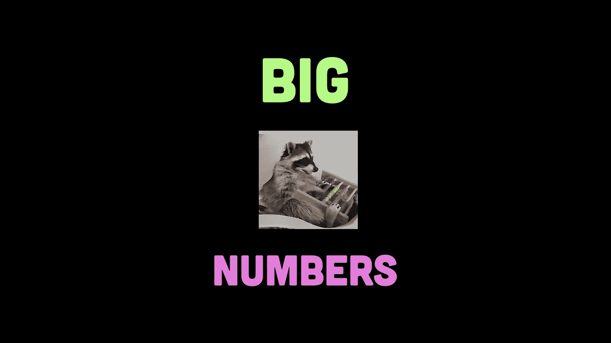

# Python 方便的数字符号

> 原文：<https://itnext.io/pythons-convenience-notation-for-numbers-6be850b0adf2?source=collection_archive---------6----------------------->

可能会拯救一艘或两艘宇宙飞船！

大家好，这里是 Thijmen，在这篇 ***超短*** 文章中，我将演示如何在 Python 中分隔任意数字文本中的数字以提高可读性。

这篇文章在 YouTube 短片上也有视频格式

当处理大数字时，如果不计算单个数字，有时很难看出确切的数字是多少。除了购买新眼镜，一个很好的解决方案是使用 Python 的*方便符号表示数字*，就像在 [PEP 515](http://Underscores in Numeric Literals) 中提议的那样。

> PEP 515 —数字文字中的下划线可以帮助长文字的可读性，或者其值应该清楚地分成多个部分的文字，如十六进制符号中的字节或单词。

您可以使用**下划线**作为**可视分隔符**，以您喜欢的任何方式对数字进行分组。这适用于任何数字文字，因此*整数*、*浮点数*，甚至*二进制数*和*十六进制数*。

```
one_million = 1_000_000one_thousand = 1_000.00nobody_likes = 0xbad_c0ffeebinary = 0b_1001_1001two_million = int('2_000_000')
```

下划线没有语义*也没有语义*，所以数字文字被解析为好像下划线不存在一样。他们唯一的目的是让你作为开发人员的生活稍微轻松一点。

虽然我大胆地假设你没有低估善待你的数字的重要性，但这里有一个温和的提醒[如果我们不这样做，会发生什么！](http://ta.twi.tudelft.nl/users/vuik/wi211/disasters.html)

如果你从这篇文章中学到了一些新东西，请考虑订阅我的 YouTube 频道。谢谢！🙂

这篇文章和相应的视频是我的 Python 片段系列的一部分，其中我们以字节大小的格式涵盖了 Python 编程的各种主题。

