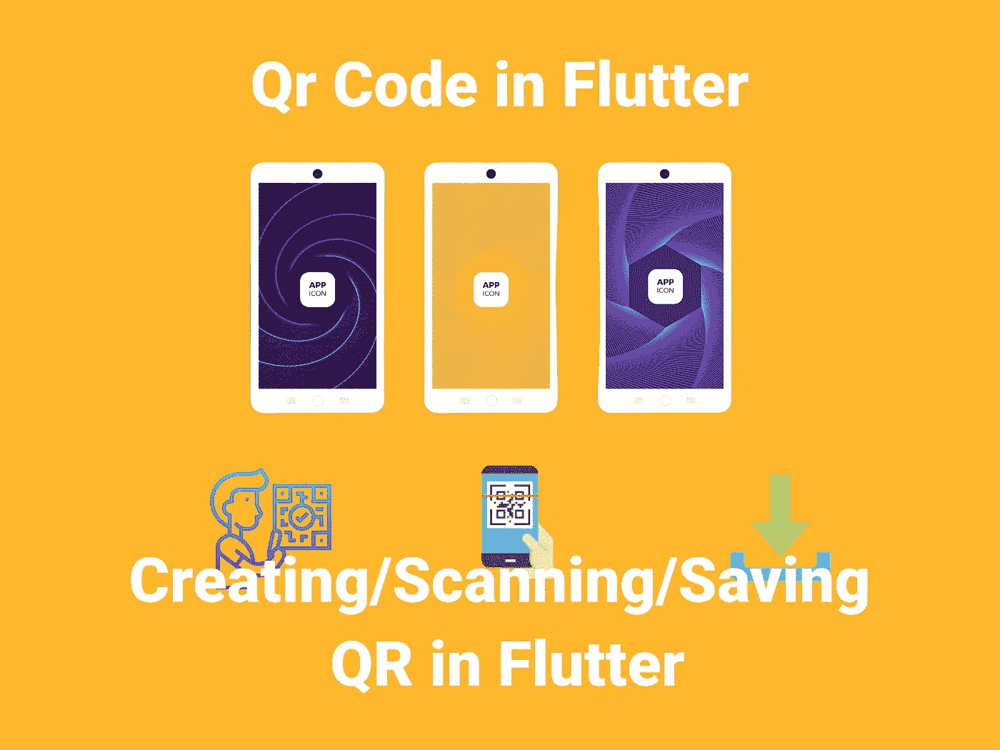

# 如何在颤振中处理二维码

> 原文：<https://itnext.io/qr-code-in-flutter-9b7072343598?source=collection_archive---------0----------------------->

## 在 Flutter 中创建/扫描/保存 QR



随着技术的进步，QR 对我们的生活越来越重要。二维码被支付网关和许多其他服务广泛使用，因为它们可以存储文本、URL、电子邮件地址、ph 值或任何其他形式的数据。现在二维码扫描可以通过手机轻松完成，不需要特殊的扫描设备。本文将展示如何创建、扫描 QR 并将其保存到用户的手机上。

## 二维码的主要特点

*   安全可靠，只能由机器读取。
*   它们可以轻松存储任何类型的数据。
*   快给我回应。
*   易于生成和扫描。

## 生成二维码

为了生成二维码，我们将使用这个包。

[](https://pub.dev/packages/qr_flutter) [## qr _ 颤振|颤振包

### QR。Flutter 是一个 Flutter 库，用于通过一个小部件或自定义画师简单快速地渲染二维码。请不要…

公共开发](https://pub.dev/packages/qr_flutter) 

首先，我们需要 QR 的数据。您可以通过文本字段从用户处获得它，也可以通过用户信息或其他方式获得它。只有一件事你必须考虑，那就是必须是`String`型。

# 如何生成 QR

这很简单，因为我们成功地为我们的应用程序创建了 QR。🥳

# 扫描二维码

对于扫描二维码，我们会使用这个包。

[](https://pub.dev/packages/qr_code_scanner) [## qr_code_scanner |颤振包

### 由于这个包的底层框架，android 版的 zxing 和 iOS 版的 MTBBarcodescanner 都不再…

公共开发](https://pub.dev/packages/qr_code_scanner) 

为了让这个包工作，我们需要改变 Android 和 IOS 的一些东西。

# Android 集成

*   在`android/build.gradle`改变

```
ext.kotlin_version = '1.3.50'===>ext.kotlin_version = '1.5.10'
```

*   在`android/build.gradle`改变

```
classpath 'com.android.tools.build:gradle:3.5.0'===>classpath 'com.android.tools.build:gradle:4.2.0'
```

*   在`android/gradle/wrapper/gradle-wrapper.properties`改变

```
distributionUrl=https\://services.gradle.org/distributions/gradle-5.6.2 all.zip===>distributionUrl=https\://services.gradle.org/distributions/gradle-6.9-all.zip
```

这就是 Android 的全部内容，让我们继续关注 IOS。

# IOS 集成

*   在`Info.plist`增加以下内容；

```
<key>io.flutter.embedded_views_preview</key>
<true/>
```

IOS 就这些了。我们准备扫描二维码。

# 如何扫描二维码

这很简单，因为我们成功扫描了应用程序的 QR 码。🥳

# 保存二维码

为了将二维码保存到我们的手机中，我们需要几个包。

*   对于权限

[](https://pub.dev/packages/permission_handler) [## 权限处理程序| Flutter 包

### 在大多数操作系统上，权限不仅仅是在安装时授予应用程序的。相反，开发人员必须问…

公共开发](https://pub.dev/packages/permission_handler) 

*   将二维码保存到我们的图库

[](https://pub.dev/packages/gallery_saver) [## gallery_saver | Flutter 包

### 将网络或临时文件中的图像和视频保存到外部存储器。图像和视频都将显示在…

公共开发](https://pub.dev/packages/gallery_saver) 

我们还需要改变 Android 和 IOS 的一些东西。

对于`AndroidManifest.xml`中的 Android，在清单下添加以下内容

```
<uses-permission android:name="android.permission.WRITE_EXTERNAL_STORAGE"/>
```

对于`Info.plist`中的 IOS，添加以下内容:

```
<key>NSCameraUsageDescription</key>
<string>This app needs camera access to scan QR codes</string>
```

*   获取我们画廊的目录

[](https://pub.dev/packages/path_provider) [## path_provider | Flutter 包

### 一个用于查找文件系统中常用位置的 Flutter 插件。支持安卓、iOS、Linux、macOS 和…

公共开发](https://pub.dev/packages/path_provider) 

# 如何将二维码保存到我们的手机

就这么简单。我们成功地将 QR 保存到我们的手机中。🥳

这是 QR 应用程序的工作示例。你可以去看看。

[](https://github.com/SncOne/qr_code_example) [## GitHub - SncOne/qr_code_example

### 此时您不能执行该操作。您已使用另一个标签页或窗口登录。您已在另一个选项卡中注销，或者…

github.com](https://github.com/SncOne/qr_code_example) 

本文到此为止。🎉🎉

## **感谢您的阅读！**👏👏

如果你喜欢这篇文章，请点击👏按钮(你知道你可以升到 50 吗？)

另外，别忘了关注我，在你的社交网站上分享这篇文章！也让你的朋友知道吧！！