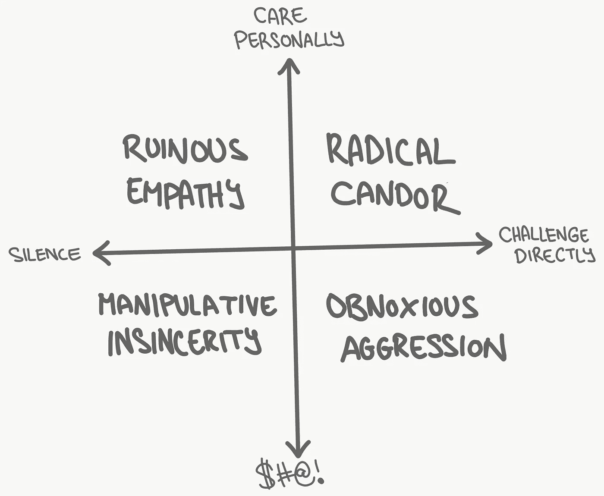
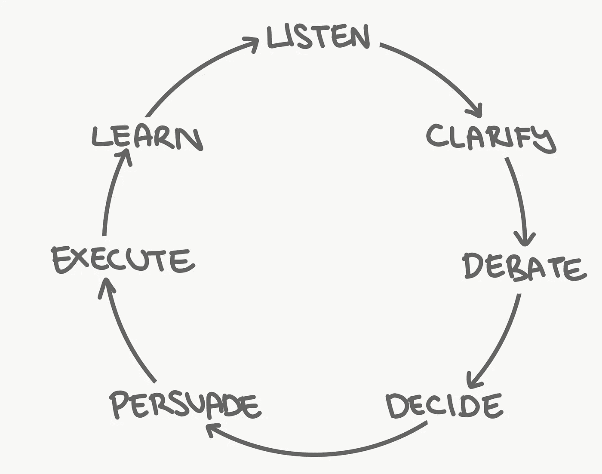

# 彻底坦白:软件版

> 原文：<https://itnext.io/radical-candor-software-edition-d4b5ad401be3?source=collection_archive---------3----------------------->

当金·斯科特(Kim Scott)来到 Dropbox 的总部谈论她的新书《激进的坦诚》(Radical Candor)时，我很幸运。Dropbox 很好，可以免费分发拷贝(耶！免费书籍！)所以实际上我在回家的飞机上读完了大部分书。

尽管这本书是为管理者而写的，但我发现自己经常回头参考它。它的见解在我作为软件工程师的日常工作中非常有用，尤其是在需要与同事进行书面或面对面交流的过程中。一点点彻底的坦诚可以*完全*改变我们对代码或设计评审的行为和反应，带来更好的结果和更高的满意度。

# 激进的坦白:一些背景

在我分享你应该如何在创建软件时使用彻底的坦诚之前，解释一下什么是彻底的坦诚*可能会有所帮助。我将尽量缩短这一部分，因为它只是为如何在软件过程的上下文中使用激进的坦诚设置背景。如果你已经熟悉了这个框架，你可以直接跳到下一部分(标题为激进代码审查)。*

正如你将在下面看到的，我有充分的理由创建我自己的版本。

> ***激进的坦诚是关于给予善良、明确、具体、真诚的指导*** *(来源* [*此处*](https://www.radicalcandor.com/our-approach/) *)。*

要实现这个目标你必须*亲自关心*和*直接挑战。*

## **亲自关心**

还记得 HR 代表什么吗？我们可能不喜欢被贴上“资源”的标签，但是“人”的部分是我们应该注意的。作为人类，我们有感情。这些感觉会影响我们的工作。一些文化可能认为情感是一种不专业的设计缺陷，但事实上，它不是。这是一揽子计划的一部分——你不能指望人们在工作中充满激情、投入和兴奋，同时又指望他们把沮丧、担忧和尴尬留在家里。

忽视人类情感会导致不快乐。不快乐导致疏远和愤世嫉俗。疏远和愤世嫉俗导致糟糕的结果和磨损。

你不一定要和工作中的每个人都成为好朋友，但是承认感受并表现出你的关心是一起工作的重要部分。作为一个额外的奖励，这是作为一个体面的人的一部分，没有团队合作的想法。

## **直接挑战**

我们都尽量避免说让人不舒服的话。也许有些文化比其他文化更受欢迎，但每个人都会尽量避免尴尬和困难的对话。如果我们真的鼓起勇气给出一些强硬的反馈，我们会试着用一种缓和打击的方式来掩饰它。

然而，当我们不清楚和直接时，我们就冒着我们的信息被误解的风险。从长远来看，回避残酷的事实对任何人都没有好处。如果不清楚什么需要改进，什么应该建立和加强，人们就无法改进和成长。糟糕的结果和挫败感随之而来。

这两个维度的结合决定了我们是否会说任何话，我们是否会说正确的话，以及我们所说的话是否会被很好地接受并在长期内有效。

彻底的坦诚是我们的目标象限:你关心个人并直接挑战。你已经花了时间来证明你关心、理解你面前的人，并给他们清晰可行的反馈。他们可能仍然会受到伤害，或者在接受反馈时感到尴尬，但很可能会欣赏反馈，并相应地改变自己的行为。

**令人讨厌的攻击性**是当你给出需要给出的反馈时，却不花两秒钟来表示你的关心。说“你是个白痴”这样的话是没有成效的。即使是赞美，在说“哇！你设法没有失败！”。

这比*什么都不说*要好，但从长远来看，这会让你的同事想要远离你。和一个混蛋在一起一点都不好玩，而且很让人泄气。人们不会想听你说什么，你的信息也不会被理解。即使本质上，你说的是真的。

操控型不真诚是指你不在乎提供真正的反馈。你只是给予空洞的赞扬，因为这比质疑他们更容易:“很棒的演示！真的很喜欢！”即使演示很糟糕，也要走开，甚至在背后取笑他们。

你可能会告诉自己，你这样做是因为你不想伤害他们的感情，但实际上这是为了保护你免于不得不进行艰难的对话或冒着不被喜欢的风险。

毁灭性的同理心是指你过于强调友好相处，最终完全避免了冲突。这个象限中的表扬是空洞的“干得好”，批评是不存在的。这让人们不知道他们做得好的地方和应该改进的地方，直到他们被解雇(或者团队的其他人因为厌倦了掩盖表现不佳的人而辞职)。这甚至不是他们的错——没有人告诉他们要改进什么，所以他们怎么能改进呢？

> 如果要我用两句话来总结激进的坦率，我会说:
> 
> 彻底的坦诚并不意味着无论如何都要说实话。
> 
> 彻底的坦诚是关于**建立关系**，在那里**欢迎真相**，以便获得**更好的质量结果**和**个人的提高。**

# 激进代码审查

为什么我们还要进行代码审查？

## 更高质量的结果

代码审查，如果做得好，可以保持高质量的代码。另一双眼睛审查命名、结构、流程和测试覆盖范围，确保代码是逻辑的、清晰的和可读的。这意味着从长远来看它是可维护的。这意味着开发新功能的速度更快，将来也不容易出错。

## 个人提高

当有人检查你的代码时，他们会指出可以做得更好的地方。当您审查其他人的代码时，您有机会看到他们正在做什么，了解您可能没有做过的代码区域以及其他人的风格和思维方式。无论哪种方式，都有很多需要学习和成长的经验。

## 代码审查咬

你可能会想“好吧，我明白了。质量结果，个人提高。但是激进的坦诚在哪里呢？只是一次代码审查！”。让我告诉你:当有人参与的时候，它从来都不是“仅仅是一次代码审查”。

在代码评审过程中，你有没有感到一阵尴尬，一种不充分或沮丧的感觉？或者更强烈的感觉，比如愤怒或伤害？如果你有，你并不孤单。我当然有这种感觉。我也问过周围的人，我知道其他人也有。

事实上，当我不记得如何称呼“编写被评审代码的人”时，人们建议用“受害者”(两次！)、“可怜的混蛋”和“潜在的白痴”，这表明许多经历过代码评审的人并不认为代码评审是一项愉快的活动。对了，我决定选“作者”。

不仅仅是代码。这是我们的工作。我们对它投入了感情(还记得吗？感情是人类包裹的一部分)。然后有人进来，漫不经心地评论说我们的代码没有任何意义，测试都是错误的，我们应该重写整个代码。可能就在周末之前。难怪我们会心烦意乱。

所以，我们心烦意乱，对着电脑发牢骚，疯狂地打字，愤愤不平地做出他们要求的修改。也许懈怠的朋友抱怨。也许我们决定完全忽略这些评论，因为它们显然是由一个一无所知的白痴给出的，不值得我们浪费时间。

看多了**质量成果**或**个人改善**最后一段？我不这么认为。

## 再一次，带着感情

我敢肯定，没有人在审查他们的代码时打算摧毁一个人的精神。至少我希望没有人这么做，因为这是一种非常非常糟糕的态度。我想他们只是想专注于获得高质量的结果，而忘记了人性的一面。

就这篇文章的目的而言，我假设你已经记下了技术部分，所以这一部分将涵盖如何以一种完全坦诚的方式传达你的评论:

记住**一个人写了这个代码**:作者投入了很多精神上的努力和时间，他们想为他们的工作感到骄傲。永远不要说代码是“坏的”或者其他对他们工作的概括判断。当然，不要认为他们有任何个人偏见，比如“愚蠢”或“懒惰”。这很伤人，会让他们拒绝任何进一步的反馈。

你的心态应该是一种教学/学习的心态。不要炫耀你高超的知识或者用它来欺负别人。其实，不要以为你*有*高超的知识。不管怎样，你都可以从任何人身上学到东西。

也不要隐瞒你的技术评论——你的观点很重要！如果你退缩，你将错过一个教学的时刻和整体的代码质量。如果你认为有什么可以改进的，请留言！

## 带注释批准

告诉过你我创造自己的版本是有原因的

每个代码管理系统都有自己的代码审查和批准过程。有些有一个结构化的流程来选择审核者、评论和批准。其他人进行自由形式的讨论，通过获得所有参与者的 LGTM 批准来达成协议。

如果你有一个正式的流程，你通常可以选择**阻止**或**批准**变更。在 Dropbox 上，这些被标记为*请求更改*或*批准*，所以我将使用那个术语，尽管我知道其他系统使用不同的术语。

在**讨厌的攻击**象限中，我们有**请求更改**。基本上，任何阻塞状态都表示您不信任作者在他们推送代码之前进行必要的更改。如果你觉得绝对有必要阻止——例如，变更带来了安全风险或引入了重大错误——继续使用它，但记住要清楚地解释你为什么选择阻止，以减轻不信任和不尊重的感觉，这导致作者不太容易接受你的评论。

从作者的角度来看，被屏蔽*并不意味着* 允许你将自己的修改提交给其他人审阅，不管你觉得自己受到了多么不公平的对待。但是这种事情已经发生了，这不仅仅是对评审者令人讨厌的攻击，也是对新评审者的不真诚的操纵，他们甚至不知道他们在推翻别人的决定。

在**操纵的不真诚**象限中，我们有那些**评论而不赞同**的人。你做一些评论，但不要决定是阻止还是批准。这让作者搞不清这些评论是重要的还是无关紧要的，同时仍然让它们被屏蔽。

如果你有问题或者觉得你没有足够的领域知识来批准，这当然是一个合法的行动过程，但是像以前一样，你应该考虑作者是如何接受的，并且清楚你的意图和为什么你不批准。只是说“嘿！我添加了一些评论，但没有批准，因为我认为 Alice 是这方面的专家”或“我不太明白你在这里做了什么，所以我留下了一些问题，我需要在我批准之前回答这些问题”,这些都有助于消除另一端的挫折感。

在**毁灭性的同理心**象限中，我们有那些**赞同**却没有任何意见的人，尽管他们*有*意见要给出。有时他们觉得他们的批评会伤害作者的感情，或者会花太多的精力去解释。这阻止了作者从他们的错误中学习和改进，同时也损害了代码的质量。不要退缩，评论你认为可以和应该改进的地方，这是专业和个人应该做的事情。

**彻底坦白**的方式是**带着评论批准。**通过评论批准告诉作者，你相信他们会对评论做出回应，并在推动他们的更改之前做出必要的修改。作者是不受阻碍的，但是能够从你写的评论中学习，代码质量得到维护。每个人都赢了。

> 不幸的是，我们的系统中没有将**批准和评论**作为正式状态，但是我们可以在添加**评论**后**批准**。聊胜于无，但可能会令人困惑，容易被忽视。当我在推送过程中注意到评论，不得不在推送过程中取消它时，我有几次侥幸脱险。我正计划跟进此事，并尝试添加一个**带评论的批准**状态，该状态会解除封锁，但在推动更改之前会非常明确和直接地表达期望。也许在下一个“黑客周”。

# 激进设计评论

小任务可以通过事后的代码审查来完成，但是需要设计和计划的大任务怎么办呢？

进入 GSD(完成工作)圈，它描述了一个团队完成工作的框架。

在网上找不到一个合适的版本，这也符合我的个人风格，所以…

不同的工作场所有不同的团队结构和流程，但我认为可以肯定的是，每个大型任务都有一个 DRI(“直接负责的个人”——无论是经理、技术负责人、架构师还是团队成员)，以及一个由非 DRI 人组成的团队，他们协作完成工作。GSD 圈为如何在没有权威的情况下领导提供了一些很好的指导，当 DRI 不是经理或者需要其他团队的贡献来完成手头的任务时，这通常是必要的。

有时，我们在设计和规划上花费了太多时间，最终得到一个过度设计的、可能是错误的解决方案。有时，为了节省时间，我们在没有适当的设计或规划过程的情况下就匆忙实施，结果在重写上浪费的时间比我们在适当的准备上浪费的时间还多。在我看来，车轮上的最初几个步骤涵盖了设计和规划过程(倾听—阐明—辩论—决定—说服)，如果执行得好，从短期*和长期*来看，可以节省很多时间。

## 学习

记住，DRI 并不代表所有的天才。首先，首字母缩略词不匹配，而且，在现实中，没有一个人脑子里有全部的真相，即使他们是技术领导或高水平的经验丰富的工程师。设计软件不是一个人的任务。我们甚至*拥有*团队的原因是，我们可以从每个人的知识和独特视角中受益。

DRI 应该组建一个多元化但相关的团队。如果人们没有什么要补充的，不要浪费他们的时间，但是不要仅仅因为他们不打算为这个特定的项目写代码就排除他们。可能 5-7 人是理想的:他们应该有不同的资历，如果可能的话，包括一些来自其他团队的具有相关知识的人。

作为一个团队，我们需要对在场的每个人保持敏感:有些人天生安静。其他人缺乏自信，不敢大胆发言。有些人主导了谈话。初级工程师可能害怕与高级工程师意见相左。请记住，好的想法不一定与沟通风格或资历相关，安静的人可能有最好的想法，初级工程师可能有高级工程师忽略的新观点。

所有的观点都应该得到尊重，决不能轻易否定。如果我们不尊重不同的意见(无论我们只是不同意还是他们客观上是错误的)，那个人下次就会关闭，不再提供任何想法。

倾听的文化意味着每个人都能够参与讨论并提供有价值的意见，这将产生一系列不同的好想法。

我们不需要一个经理来做这件事，但是适度的讨论可能是合适的。这可以是 DRI，也可以是在会议开始时分配的角色(就像记录者一样)。

为了使这次会议真正有效，DRI 应该分享一些试图解决的问题的背景，与会者应该有所准备。由于人们倾向于不提前准备，在会议的前 5 分钟做一个简短的概述可能是让每个人都集中注意力和同步的好方法。总共一个小时应该足够提出一些想法，并为下一步做好准备。

## 澄清

一旦我们有了一套想法，我们需要将它们处理成可供整个团队和其他决策者理解的备选方案。有时候，围绕着一个想法可能会有很多争论和辩论，但在座的所有人都不理解。

我认为这一部分应该离线完成，每个参与者都有一个选项，他们希望设计考虑选择一个合作伙伴来激发这个想法。如果从时间和团队的角度来看，DRI 可以成为每个人的合作伙伴。合作伙伴应该挑战和质疑这个想法，直到他们都清楚这个设计，他们可以清楚地定义基本概念(API、代码结构、接口)以及它与其他选项的区别。

如果可能的话，你应该试着找一个简短的标题，抓住设计选项的本质。这将使事后沟通变得更加容易。“巧克力工厂”比“通过统一界面创建的一系列可可对象”更容易讨论。此外，在未来，当做出其他较小的决策时，将更容易确定它们是否与选项的“核心”一致。

这一步可能需要几次迭代，因为有时想法需要一些时间来“消化”。我知道我有一些直觉上对我来说是正确的想法，但我还是花了一两天时间才能真正解释为什么它们是问题的正确解决方案。总之，这个过程需要一两天的时间。

完成后，应将解决方案总结成一份通用设计文档，供所有参与者审阅。如果他们有问题，他们可以发表意见，设计选项可以在下一步之前进一步澄清。

## 辩论

一旦你清楚了不同的选择，就到了争论的时候了。让每个人回到一个房间，讨论每个选项的利弊。

人们往往会对自己的想法情绪化，所以要小心行事:你是在辩论这个想法的价值，而不是提出这个想法的人！你不应该争论*去赢得*，你应该争论让最好的*选择*获胜。如果讨论过于情绪化，主持人可以指出来，并在必要时暂停一下。你也可以试着让某人为其他人的立场辩护，这迫使他们思考这个选择的优点，同时减轻部分情感依恋。

有时人们太早接受一个想法:也许是因为它听起来不错或容易实现，也许是因为提出者有魅力、可爱或处于权威地位。不同意是团队的职责！如果没有人不同意，指定一个魔鬼代言人——没有辩论就不可能有好的决定。

注意清楚地设定对会议实际情况的期望，以便人们理解他们想要达到的目标——辩论的心态不同于决策的心态。在辩论时，人们可以看到问题的两面，如果他们愿意，可以改变立场，并考虑不同方法的利弊:速度、简单性、可维护性等。你可以尝试结合不同的方法来实现一个最佳选择。你仍然可以尝试不同的想法。在某些时候，你必须切换到决策模式，你必须权衡每个选项的成本和收益，然后继续前进。

这可以只是一个辩论，也可以是一个辩论和决定的会议，但无论你选择哪一个，你都需要确保分配一个单独的时间来决定，并清楚地知道你什么时候进入决定模式。当一些人还在争论的时候，没有什么比试图做决定更没效率的了。

## 决定

由于 DRI 并不总是最资深的工程师或经理，值得一提的是，每个人都应该清楚谁做最后的决定。这并没有让 DRI 成为独裁者，他们必须考虑讨论并以此为基础做出决定，否则将面临信任和合作的彻底崩溃(加上所有浪费在倾听和辩论上的时间……)。但是因为他们是对结果负责的人，所以他们必须有最后的发言权。

> **常见设计审查流程错误**
> 
> 我们有时会忽略设计评审过程中的倾听-澄清-辩论部分，直接跳到决策阶段。当我们将设计评审视为决策会议，有点像橡皮图章时，我们就忽略了这一点。此外，当期望不一致，有人质疑我们推荐的选项或提出新的问题时，我们会很反感——因为我们确信我们正处于决策阶段，而他们正在进行审核以进行辩论。
> 
> 消除摩擦和减少时间浪费的一个有用的做法是让所有利益相关者尽快参与进来。一旦你在 5-7 人的有限团队中完成了最初的倾听-澄清-辩论，让其他评审者(来自其他团队和小组)跟上进度，并尽快获得他们的反馈。虚心倾听他们要说的话，他们会提供他们的观点和知识。倾听-澄清-与他们辩论，并达成最终评审，为做出决定做好准备。
> 
> 我看到一种趋势，为了节省时间，我会跳过一些或所有的会议，只使用共享的文档和评论进行讨论。这听起来可能很有效，但实际上并非如此——它让会议的所有问题变得更糟——群体思考，主导行为者，人们不说出他们的真实想法。没有公开的讨论，就很难提出和提炼创新的想法！

## 劝说

> 不同意并承诺——英特尔首席执行官安迪·格罗夫
> 
> 我不想！—我 3 岁的孩子

不同意和承诺是一项需要学习的重要技能。我们不能总是随心所欲，有时我们不得不执行我们不同意或不理解的决定。然而，我们内心 3 岁的孩子总是准备出来说“我不想”，如果项目中出现任何问题，我们会有一点“我告诉过你”来配合它。

当团队中有人觉得这样做很难时执行。每一个小决定都会被事后批评，每一次挫折都会被视为重新审视整个决定并重新开始的机会。

团队中通常有一些人需要执行你的决定，但他们不是决策过程的一部分，你不能指望他们不同意并在不理解 T1 的情况下做出承诺。一旦设计评审结束，决策应该被广泛地传达。包含所有选项的文档的简短描述或参考，以及使所选选项成为最佳选项的解释通常就足够了。对于那些有其他顾虑的人，请耐心等待，找出根本问题所在:

*   他们可能不同意这个决定，因为他们没有看到这个过程，也没有意识到他们认为更好的选择已经被讨论和否决了。解释为什么他们试图推动的想法没有被选中。
*   他们可能会反对这个想法，因为这听起来工作量很大，而且他们累坏了。这在情感上不是一个好的地方，可能应该在一般情况下解决，但在这种情况下——解释这个决定不会有多大作用。你需要解释为什么这项工作是值得的，或者它将如何在未来节省时间，以及他们在这个项目中可以期待什么样的支持。
*   他们可能会因为觉得自己被排除在决策过程之外而感到不满。如果有必要的话，道歉，并努力在下次包括他们。如果有一个很好的理由(最好是好理由)，直接告诉他们，给他们时间接受他们不会得到他们想要的。询问您是否还能做些什么让他们感到被包含在内(例如，邀请他们对设计评审文档发表评论，而不是参加会议)。
*   他们可能有其他不同意的理由。花点时间弄清楚并直接解决它。

不是每个人都必须喜欢这个想法，但是你必须确保他们是一致的，并且会遵从你的决定。

## 执行

这是停止参加大量准备会议，只做工作的时候了。您仍然应该通过定期会议或非正式沟通，让团队在进度和较小的决策上保持一致，但这是您加倍努力编写一大堆代码的部分。

## 学习

当我们完成执行(一些特定的任务，我们从来没有真正完成执行…)时，我们需要后退一步，回顾它是如何进行的。庆祝成功，回顾哪些进展顺利，哪些可以改进，并努力在下次做得更好。回顾会议是一种常见的做法，不应该被跳过。对不同观点的坦诚和开放对回顾会议也很重要——如果我们不放心分享我们的观点，我们就无法继续做好的事情，也无法在不太好的事情上做得更好。

> **敏捷的重要性**
> 
> 我敢肯定，有很多工程师在阅读设计评审部分时，会绞尽脑汁，想知道这如何适应敏捷框架。这个过程对于一周、两周甚至四周的短跑来说听起来很耗时。我同意，确实如此。
> 
> 对于这种非常可以理解的担忧的一个答案是，如果一个团队在过程中已经建立了对彼此的信任，并且习惯了这种工作方式，那么 GSD 转轮可以转得更快，并且整个周期可以在几天内完成。
> 
> 第二个答案是，这个过程应该留给[1 型](https://www.businessinsider.com/jeff-bezos-on-type-1-and-type-2-decisions-2016-4)决策，这些决策很难逆转，而且成本高昂。对于这些决定，你应该花合理的时间来做出正确的决定，即使它“浪费”了 sprint 的一大块时间。

# 概述

*   **彻底的坦诚**是关于**建立关系**在这里**真相是受欢迎的**为了得到**更好的质量结果**和**个人的提高。**
*   **激进的代码评审**是关于给出可靠的技术反馈，尽快解除阻塞，并受到**批准和评论**的尊重。
*   **彻底的设计评审**是关于通过给团队中的每个人发言权并让每个人都参与选择解决方案来做出**最好的可能决策**。

# 行

我真的很感动你能做到这一步，阅读这么长的帖子是一个很大的挑战，不要想当然。

看到我做了什么吗？这是一个非常坦率的赞美——清晰而具体。这里有一些你可以采取的行动:鼓掌或留下评论将是非常受欢迎的！

*特别感谢 Erel Sharf 在设计评审部分推我，没有他这篇文章会短得多:)*