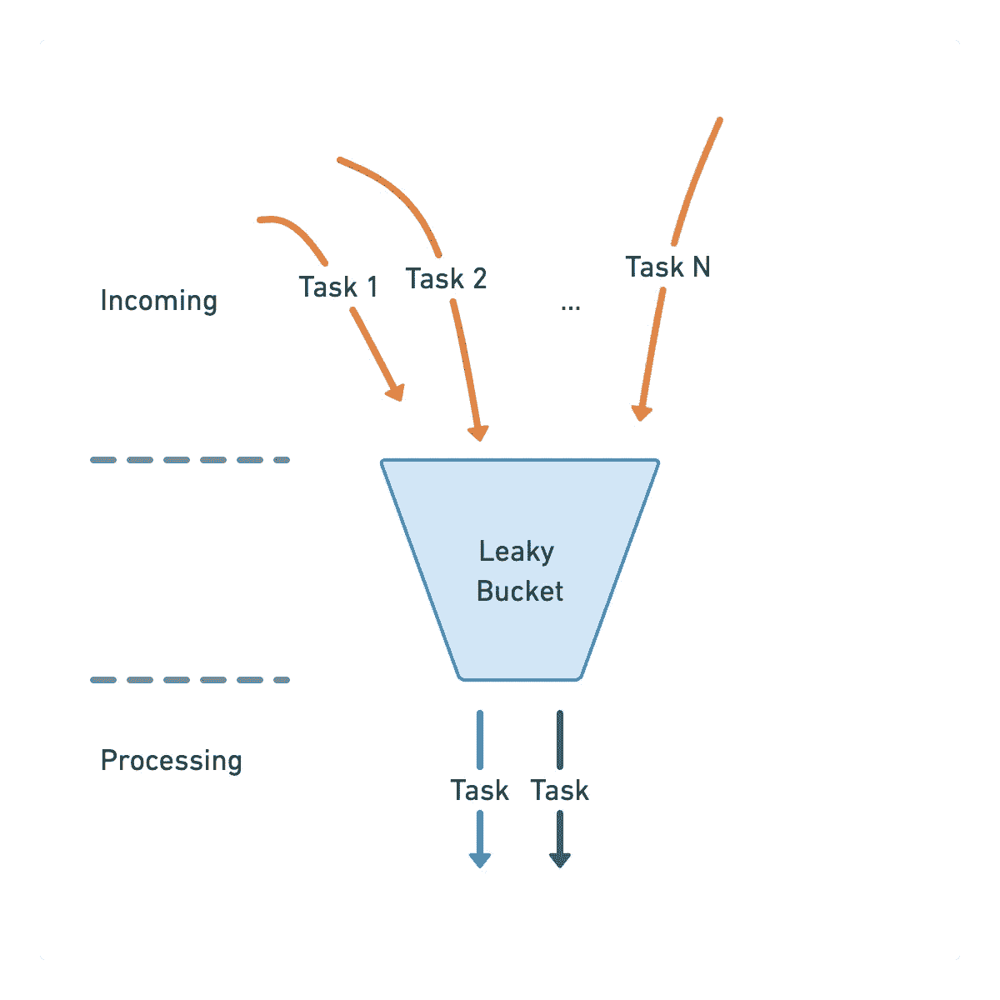

# 漏桶算法的速率限制

> 原文：<https://itnext.io/rate-limiting-with-leaky-bucket-algorithm-using-go-generics-7a5086c02695?source=collection_archive---------0----------------------->

分布式系统中最常见的可靠性模式之一是限制任务的处理速度。该任务可以是要处理的请求或事件。这样做或者是为了平滑流量的形状并避免流量的突发，或者是为了在底层系统运行时，在任何给定时间只允许最大数量的操作在进行中。速率限制器模式用于[负载平衡器](https://docs.aws.amazon.com/waf/latest/developerguide/waf-rule-statement-type-rate-based.html)、[公共 API](https://stripe.com/docs/rate-limits)，并作为不同层网络策略的一部分。

实现速率限制器的方法之一是一种称为“漏桶”算法的算法。我也在面试中看到这种情况出现在编码挑战中。虽然我知道这个算法，但我从未亲自实现过。通常使用算法实现概念验证有助于我更好地理解所涉及的设计决策和注意事项。在写这篇文章的时候，我利用这个机会使用了 Go 的泛型，我以前也没有用过。

该算法背后的思想很简单:想象有一个装满新任务的任务桶。这个桶的底部也有孔，任务可以滴到任务处理器中。

描述漏桶算法的图像

存储桶可能处于几种状态:空、满或者有一些任务正在处理，但既不是空的也不是满的。只要桶还没满，它就会以恒定的速度把任务交给处理器。当它满了，它应该“溢出”，并且在一些任务完成之前不允许任何进来的任务。

这概述了漏桶速率限制器应该如何工作。现在让我们来看一下实现。

我通常从定义我想向外界公开的接口开始。这些 API 在开发过程中是可变的，但它让我立足于抽象层，隐藏了实现的复杂性:

速率限制器的接口定义

它们还允许作者独立于向用户公开的内容来发展实现，并通过统一的接口支持不同的选项，例如不同的速率限制策略。虽然目前一个`Task`可以是任何东西，但我认为最好从一个抽象层开始，以保持它的灵活性。例如，在未来，我们可能会决定对任务实施不同的权重——这意味着一些任务可能比其他任务更昂贵，并且在桶中占据更多的位置。目前，我们将对所有事情一视同仁。

按照同样的思路，我的下一步是定义另一个用户可以与之交互的部分:

漏桶速率限制器构造器

选择使用 [Go channels](https://go.dev/ref/spec#Channel_types) 从速率限制器提交& read 任务是我的一个选择，因为我认为它会产生一个更简单的实现，更容易理解本文，但它可能不是用于生产的最佳选择。

通道带来的另一个有趣的特性是，用户可以控制任务输入和输出的并发级别。这在[语言规范](https://go.dev/ref/spec#Channel_types)中解释如下:

> 以元素数量表示的容量设置了通道中缓冲区的大小。如果容量为零或不存在，则通道无缓冲，只有当发送方和接收方都准备好时，通信才成功。否则，通道将被缓冲，如果缓冲区未满(发送)或不为空(接收)，通信将成功而不会阻塞。

您可以将输出通道的容量视为任务从存储桶中滴落的速率，而输入通道的容量可以视为存储桶的大小。当我们达到这些限制时，发送者或处理器将被阻塞，直到通道不再满为止。在本文的后面，我们将看到如何处理桶已满的情况。

接下来，我们研究使用漏桶算法实现接口`RateLimiter`。

我们首先定义内部参数，比如执行过程中需要的参数，以及保持速率限制器当前状态的其他参数:

这里，`interval`表示将任务传递到输出通道之间的理想时间，而`pollInterval`是尝试从输入通道读取任务之间的时间。

此外，`running`是一个私有变量，指示速率限制器是否处于“活动”状态，这意味着它正在尝试从输入&输出通道读取&写入。由于我们可能要处理多线程环境，我选择使用`[sync.RWMutex](https://pkg.go.dev/sync#RWMutex)`来确保在检查其状态时没有并发写入。

在通过我们的构造函数创建了速率限制器之后，用户将需要调用`Start`方法，该方法做两件主要的事情:通过`running`字段将自己标记为“active ”,并启动一个 [goroutine](https://go.dev/doc/effective_go#goroutines) ,它执行主要的任务——从输入中读取任务，并将任务传递到输出通道进行处理。如果在输入通道中有一个未决的任务，我们将把它传递给输出通道，并休眠一段时间，让我们以每秒`ratePerSecond`任务的速度抛出任务。否则，我们将等待一段时间，直到我们再次尝试从输入通道读取。

阻止来自输入通道的接收操作是另一种选择，但在这种情况下，如果用户想要停止速率限制，我们需要关闭输入通道以摆脱阻止状态。这就是为什么我选择在这里从输入通道投票。

`Stop`方法相当琐碎:

它设置了由 goroutine 检查的`running`标志，go routine 在输入通道中轮询任务。当标志被设置时，它将停止轮询并退出。

最后，让我们通过一个示例应用程序来看看如何使用这个速率限制器:

演示速率限制器使用的示例程序

在构建了速率限制器之后，我们为处理任务做了一些准备:一个 goroutine 将任务添加到输入通道中，另一个 go routine 控制何时停止处理，以避免无限期地运行示例程序。

这里要注意的另一部分是如何处理“满桶”:在向输入通道发送任务时使用`select`，我们可以检查输入通道或桶何时满了，并调整我们的行为。在一个真实的场景中，我们可能会返回一个响应，比如带有 [429 太多请求状态代码](https://developer.mozilla.org/en-US/docs/Web/HTTP/Status/429)的 HTTP 响应，表明它们已经超出了对这些用户的速率限制。在这种情况下，我们记录桶已满，并在一段时间后继续尝试。

还有其他策略，如[“令牌桶”](https://en.wikipedia.org/wiki/Token_bucket)，它们是漏桶算法的替代方案。如果你有一个有趣的限速策略，让我看看，然后实施，请通过评论告诉我。

就是这个！我希望你喜欢它，并订阅/关注，以防你想阅读类似的帖子。

你可以在这里找到完整的代码。