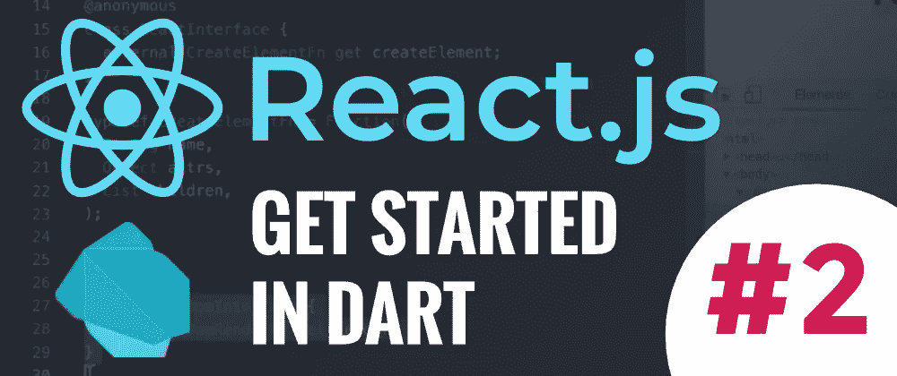

# react . js–从 Dart #2 开始

> 原文：<https://itnext.io/react-js-get-started-in-dart-2-74f956316b3c?source=collection_archive---------7----------------------->

## 了解如何以“模糊”方式使用视图库



在本系列的 [**第 1 部分**](/react-js-get-started-in-dart-1-636f3f7ce7d6) 中，我们构建了带有`name`参数的`Greeting`组件，并将其呈现在屏幕上。下面是这个片段的样子:

```
var Greeting = **createReactClass**({
  "**render**": allowInteropCaptureThis(
    (**ReactClassInterface** **self**) => React.createElement(
      'h1', 'null, ['Hello, ${**getProperty**(**self**.**props**, '**name**')}]),
  )
});
```

我们用它来做:

```
void main() {
  **ReactDOM.rende**r(
    **React.createElement**(
      **Greeting**,
      makeJsObject({
        '**name**': 'John'
      }),
      null,
    ),
    querySelector('**#output**'),
  );
}
```

在这一部分，我们将重构我们的解决方案，并继续构建**有状态组件**示例。以下是完整视频:

→ [**在 YouTube 上观看**](https://youtu.be/bdrqQXg2Gjs)
→ [**获取源代码**](https://github.com/graphicbeacon/reactjs-get-started-in-dart/tree/part-2)

# 结论

我希望这是有见地的，你今天学到了一些新东西。

**订阅** [**我的 YouTube 频道**](https://www.youtube.com/channel/UCHSRZk4k6e-hqIXBBM4b2iA?view_as=subscriber) 第三部准备好了再通知。谢谢！

**喜欢，分享一下** [**跟我来**](https://twitter.com/creativ_bracket) 😍有关 Dart 的更多内容。

# 进一步阅读

1.  [js 包](https://pub.dartlang.org/packages/js)
2.  [如何在 Dart 应用中使用 JavaScript 库](https://dev.to/graphicbeacon/how-to-use-javascript-libraries-in-your-dart-applications--4mc6)
3.  [**采用 Dart 的全栈 web 开发**](https://bit.ly/fullstackdart)