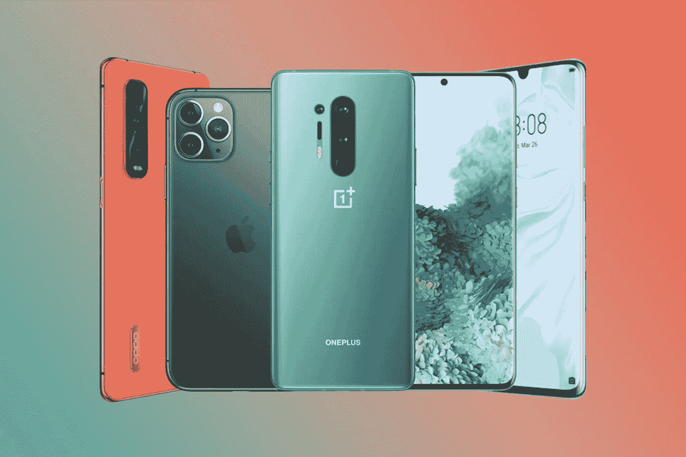

# react-本机设备信息列表

> 原文：<https://itnext.io/react-native-device-info-list-3a9b0b0fb32a?source=collection_archive---------5----------------------->

对于开发人员来说，设备属性对于优化应用程序性能和提供跟踪应用程序崩溃的额外信息非常重要。例如，总 RAM 和已用 RAM、设备制造商以及设备是否在运行时充电等。

这些信息对于做出商业决策非常重要。以 VideoLAN(生产著名的 VLC 播放器)为例，她在 2018 年将华为设备列入黑名单，禁止下载她的应用程序，因为华为系统在内存管理方面的怪异和不受控制的行为——杀死了所有后台应用程序。

幸运的是，在 react-native-community 中有一个优秀的开源库，用于检索所有设备信息。它就是[反应本地设备信息](https://github.com/react-native-community/react-native-device-info)。

 [## 反应本地社区/反应本地设备信息

### 反应本机的设备信息。

github.com](https://github.com/react-native-community/react-native-device-info) 

# 设置

使用您自己的软件包管理器安装 react-native-device-info:

# Android 特定属性

# iOS 特定属性

# Android 和 iOS 共享属性

# 进一步阅读

1.  [Android 官方文档—构建。版本](https://developer.android.com/reference/android/os/Build.VERSION)
2.  [Android 官方文档— LocationProvider](https://developer.android.com/reference/android/location/LocationProvider)
3.  [Android 官方文档—电池电量监控](https://developer.android.com/training/monitoring-device-state/battery-monitoring)
4.  [苹果官方文档——build configuration](https://developer.apple.com/documentation/bundleresources/information_property_list/bundle_configuration)
5.  [苹果官方文档—核心位置](https://developer.apple.com/documentation/corelocation/)

# 结局

React-Native 确实是一种非常容易学习和使用的技术，可以用来构建跨平台的应用程序。然而，为了充分理解关于每个平台的基础知识，请访问并通读由[苹果](https://developer.apple.com/documentation/technologies)和[谷歌](https://developer.android.com/)发布的官方文档。

您可能会发现一些[react-native-device-info](https://github.com/react-native-community/react-native-device-info#getserialnumber)没有涵盖的设备信息！

希望你会发现这个工具很有用，可以帮助你调试你的应用程序。

欢迎您通过[Twitter @ my rik _ chow](https://twitter.com/myrick_chow)关注我，了解更多信息和文章。感谢您阅读这篇文章。祝您愉快！😄