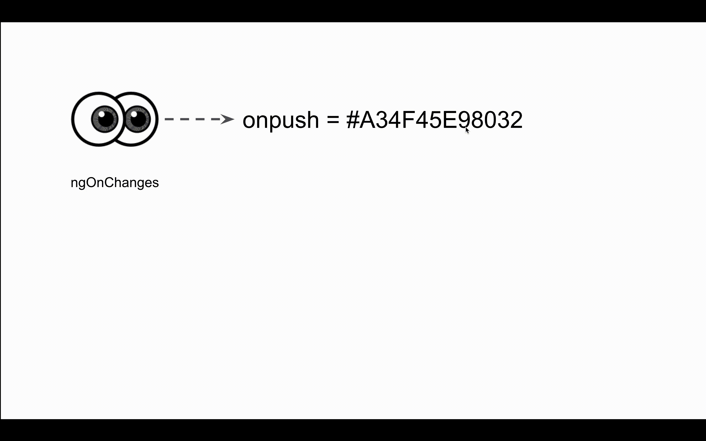
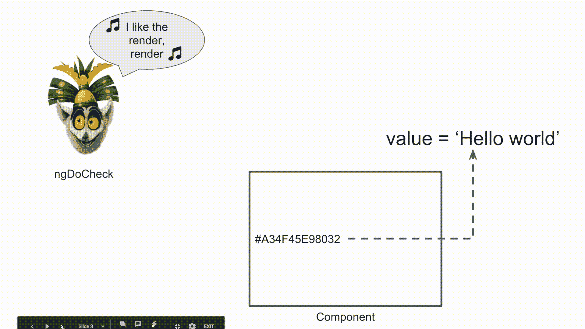
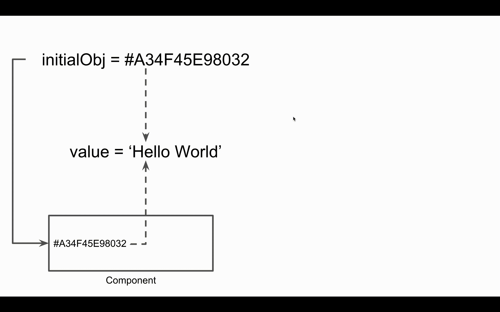

# Angular 中的反应式编程:关于推送通信

> 原文：<https://itnext.io/reactive-programming-in-angular-on-push-communication-af44de553c18?source=collection_archive---------5----------------------->

两年前，当我开始用 Angular 编写代码时，我认为 observables 是处理异步调用的某种奇怪的承诺。是在 Ben Lesh 在 Angular Connection 2016 的演讲之后，我才意识到它的潜力。将数据视为一个序列的事实给了我编码解决方案的其他方式，使它们更加灵活和可持续。如今，反应式编程在我的代码中很常见，rxjs 是我的应用程序的关键部分。这是一个系列的第一篇文章，在这个系列中，我将解释我在 angular 开发中遇到的一些问题的例子，以及我如何应用 rxjs 来解决这些问题。

让我们从使用“推送”更改检测策略来提高我们的应用程序的性能开始。

**理解问题:**

在过去的几周里，一些文章出现在媒体上，解释了“推送”时改变检测的策略。似乎很时尚。然而，我仍然发现有人不明白角度变化检测是如何工作的，以及“按下”到底是什么意思。以下是我的解释:

让我们看看 StackBlitz 中 Angular 的下一个例子:

如您所见，有三个组件非常相似。它们都有一个打印在组件中的输入和一个计数器，每次呈现组件时，计数器就加 1。这是测量器件性能的一种简单易行的方法。渲染次数越少的组件消耗的资源越少。组件输入的值与每个组件拥有的文本字段相关联。我们可以改变组件的输入，改变输入文本的值(至少在两个组件中)。

现在我们将关注第一个组件。该组件在“推送”模式下配置了更改检测，这意味着每次输入值更改时都会呈现该组件。换句话说，组件生命周期中的 onChange 事件是输入到组件中的值的待定更改。每次值改变时，onChange 事件被报告，并且组件模板被刷新以更新显示的值。

您可以在 StackBlitz 的示例中看到，每当您在输入字段中键入一次，渲染计数器就会增加一。

所以，也许，我们现在的问题是，为什么这没有发生在第二部分。答案很简单；因为组件的输入值不会改变…即使您在输入文本中键入其他值。让我解释一下:在这个例子中，组件的输入是一个对象；这意味着它是一个指向真实值的内存引用。当我们修改输入中的文本时，我们改变的是被引用的值，而不是仍然是同一个内存引用的输入值。所以 onChange 钩子看不到任何变化，它也不呈现组件来更新视图。这就是计数器不递增的原因…因为视图从不刷新。

这个问题的最快解决方案是改变默认的变更检测策略…这是第三个例子，但是它有很大的性能缺点。只要看一下渲染计数器，你就会看到它看起来好像永远不会停止增加。这里发生的情况如下:

OnChange 无法检测内存引用中发生的变化，但我们可以肯定，如果发生变化，它将发生在用户交互之后…现在是“doCheck”到来的时候了。“DoCheck”是一个事件挂钩，它监视组件中涉及用户交互的所有事件。它再次刷新发生事件的整个组件树(输入字段已经改变，单击文档中的元素，等等)。)并且，作为结果，视图中的值被更新；包括内存引用所指向的那些。他们是否改变并不重要。当然，当组件更改检测配置为“onPush”时，“doCheck”不起作用，由于执行的渲染数量较少，这大大提高了应用程序的性能。

## 解决方案是:

我们希望我们的应用程序尽可能高效，所以我们决定将所有组件的变更检测配置为“onPush”模式。然而，当组件的输入是对象时，仍然存在视图不更新的问题。有两种解决方案。第一个是使用不可变对象作为输入参数。每次值改变时，它都会强制改变内存引用，这样 onChange 事件就可以看到修改并更新视图。但这是一篇关于反应式编程的文章，所以让我们看看如何用可观测量来解决这个问题。看看我的解决方案:

正如您所看到的，我已经使用 Angular 的模板引用获得了模板的输入元素。之后，在 hook OnInit 中，我从输入的事件‘keyup’中创建了一个可观察对象。基本上意味着，每次用户释放一个键在输入上书写，下一个事件就在可观察到的地方发生。这个可观察值使用操作符映射转换对象中的事件值，结果作为输入传递给我们的“onPush”组件。可观察对象的订阅和取消订阅由“异步”管道管理，该管道还负责获取订阅中的值。

显然，这种解决方案是可行的，但问题是它为什么可行。我的意思是……要更新视图，我们需要呈现模板，但是输入仍然是一个对象，一个内存引用,“onChanges”不需要工作。因为组件处于“onPush”模式，所以 DoCheck 关闭…为什么视图被渲染？看看下一个实验:

这段代码获取初始对象的值，并用它创建一个可观察对象。在 map 操作符中，它接受这个值并创建另一个与初始值相等的对象…或者至少看起来是一样的。在订阅中，我在可观察的结果和最初的对象之间做了一个比较……惊奇！…它们是不同的。

这是因为，当我们创建一个新对象时，我们正在创建指向新值的不同的内存引用。最后，一个新的引用意味着一个不同的条目，它可以被“onChanges”钩子检测到。“onChanges”刷新视图，并且值被更新。事情就是这样的。在 stackblitz 的解决方案的链接中可以看到，每按一个键，渲染的计数器只增加一，所以这个解决方案比默认的更改策略更高效。

# 直到下一次:

我不知道你对这个解决方案有什么看法，但对我来说，这似乎很自然…我的意思是，我使用 observables 创建了一个数据流，它携带信息并将其带到应该在的组件。这是反应式编程的特点之一；来创建数据路径…而这仅仅是个开始。在我的下一篇文章中，我将展示如何在没有样板代码的情况下编码 redux 架构。