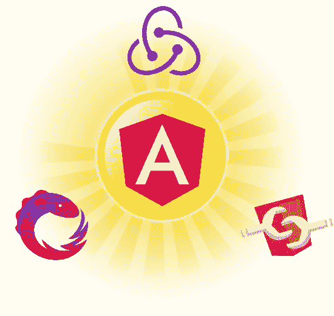
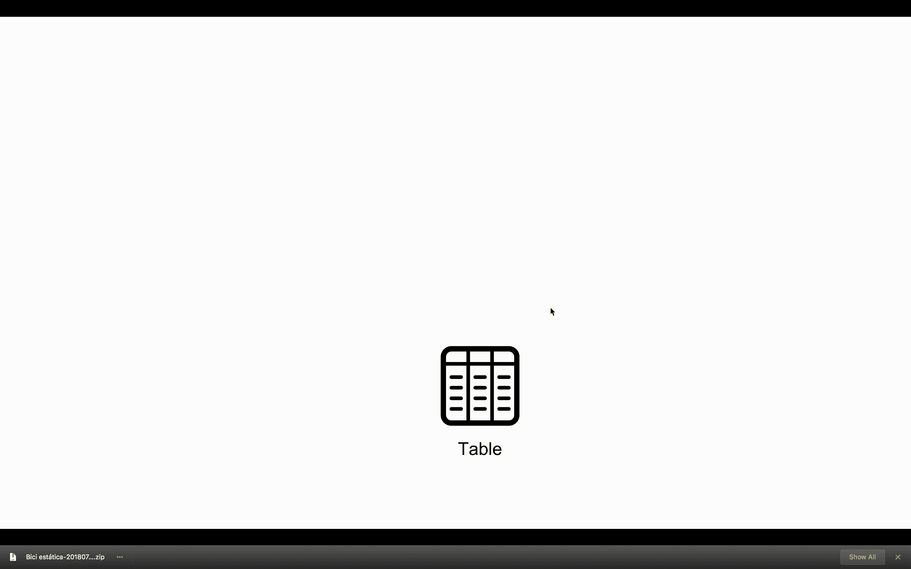
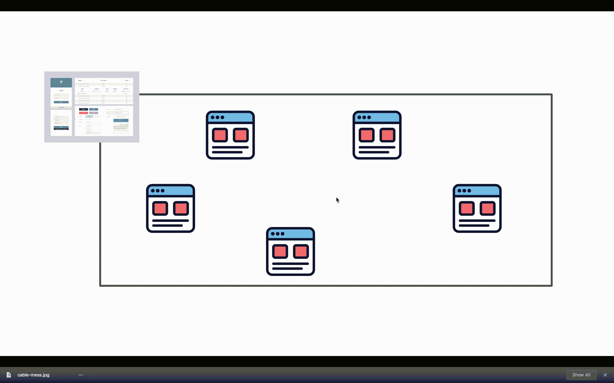
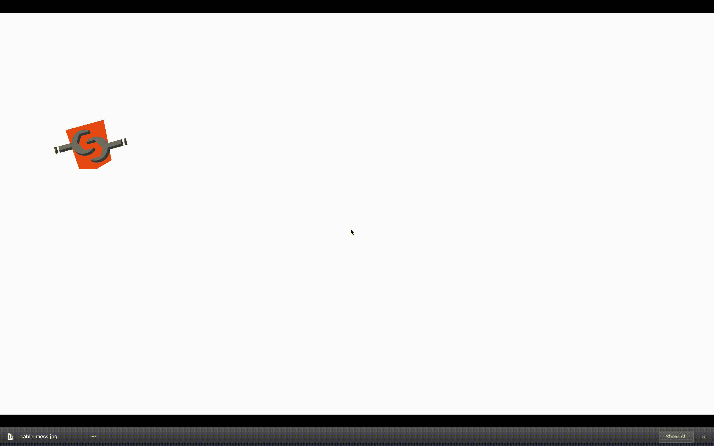

# 角度无功编程:无功分量(第二部分)

> 原文：<https://itnext.io/reactive-programming-in-angular-reactive-components-part-2-eefcff8ab86f?source=collection_archive---------2----------------------->

## 在我的上一篇文章中，我谈到了拥有某种独立组件的想法，这种组件的演化不会影响应用程序。以一个小表为例，我们测试了用 ngrx 库实现的 redux 体系结构，我们的结论是，对于我们的问题来说，这不是一个有效的解决方案，因为 ngrx 创建了一个全局上下文，导致我们编写一个单一的应用程序。在本文中，我们将尝试另一种选择，看看我们是否可以编码一个孤立的真实组件。

# 到目前为止我们有什么？

这是我在 Angular 中关于反应式编程的第三篇文章。第一个是[“on push communication”](/reactive-programming-in-angular-on-push-communication-af44de553c18)，在这里我解释了如何使用 rxjs 来避免不必要的渲染事件。第二个是[“电抗元件(第一部分)”](/reactive-programming-in-angular-reactive-components-part-1-7291882e352c)，我在这里揭露了代码中隔离元件的问题。这篇文章是上一篇文章的直接延续，因此，如果您还没有阅读它，我建议您在继续下一部分之前阅读它。

# 商店的问题

redux 实现成为单一应用程序的第一个原因是因为全局存储。redux 存储就像一个巨大的全局变量，每个组件都可以读取和写入它。这意味着阅读部分依赖于写作部分。在我们的例子中，它发生在桌子和卡片上。该卡需要表和路由器更新全局存储以获得所选人员的信息。没有它们，无法渲染详细视图。

为了避免组件之间的强烈依赖，我们必须将每个组件的全局存储转换为本地存储。这样，每个组件的写/读操作都在本地执行，组件之间没有其他依赖关系。

使用 BehaviorSubject 可以非常简单地实现本地商店。subject 是一个可以发出事件的可观察对象，而 BehaviorSubject 是一个在订阅时总是返回事件的对象。实现存储是理想的，因为当进行订阅时，它总是返回最后发布的状态，如果没有发布状态，则返回默认状态。

因此，我们要做的第一件事是回到表应用程序的初始示例，添加一个名为“state$”的新属性，这将是我们的 BehaviorSubject 存储。

# 是组件吗？…它是可观察的吗？…不！它是一个电抗部件

将存储作为本地存储很好，但是如果我们想要在组件之间共享信息，这可能是个问题。回到 ngrx 示例，全局存储确实在组件之间创建了依赖关系，但是卡组件也需要读取表的状态来获取自己的数据。所以，这里的问题是，没有全球商店，你如何升级卡组件。好吧，从我的角度来看，答案在于 redux 架构的纯粹概念。

唯一能改变视图状态的是一个动作。因为每个组件都有自己的存储，所以每个组件都必须有自己的动作来更新其状态。换句话说，不是卡读取表的状态，而是表的选择必须激活事件来更新卡的组件。主要思想是组件通过链式事件共享信息；就像 Unix 命令中的管道，其中一个执行的输出是下一个执行的输入。

实现这个解决方案的一个方法是创建一个服务，它包装一个 Subject 对象，并允许发出和订阅组件执行的动作…但是我不喜欢这个解决方案。该服务将是一个 100%的样板代码，因为它只公开主题的现有 api，我对增加每个 redux 实现已经庞大的样板代码不感兴趣。因此，相反，我们要做的是将我们的组件转换成反应组件，扩展主体对象。

在 Angular 开发人员中，忘记组件是类型脚本对象(或 JavaScript 对象……取决于我们有多严格)以及对象如何被其他对象扩展是很常见的。我们也经常忘记这些对象可以被“viewChild”装饰器恢复，然后，它们的所有属性和方法都可以像任何其他对象一样被访问。因此，如果我们的组件从 Subject 扩展，这意味着它们的事件可以在它们之间传递，以创建反应，动作可以从一个组件发送到另一个组件，而不需要全局存储。这是无功组件的真实功率。

# 另一个问题；效果问题

移除全局存储并不足以消除将我们的应用程序转换成单一应用程序的链接。我们也必须消除这些影响。这些效果的问题在于，它们预先假定了组件在对象被编码时没有的信息。

回到我们的表格示例；表的组件不应该知道您的数据是来自人、狗还是建筑物，它应该只关心根据配置绘制一组列。然而，组件的效果必须执行数据请求，这迫使我们将组件链接到特定类型的信息。

类似的错误处理问题。HHRR 专家或 IT 管理员可以阅读包含人员列表的表格，我们不应该在这两种情况下显示相同的错误消息。在 HHRR 员工的情况下，我们应该给出一个一般的错误消息，因为他或她可能不了解错误的细节。另一方面，IT 管理员将需要更多的细节，因为他或她可以尝试解决问题。当在不同的上下文中重用组件时，效果在组件内处理数据请求的错误消息的事实降低了灵活性。

总之:影响的主要问题是，如果不考虑应用程序的上下文(在我们编码时应用程序将需要的用户和数据)，我们就不能对它们进行编码，并且使组件在另一个应用程序中或在另一个时间不可重用(数据和用户在将来可能会改变)。

# 内部和外部作用

在分析效果做什么的时候，我觉得可以把动作分为两类:内部动作和外部动作。

内部动作是可以用组件的当前状态和动作的数据来处理的动作。这种类型的操作可以改变当前状态并更新视图，因为它们不依赖于任何其他上下文，所以不可能有任何副作用。所有内部动作都是可预测的。

外部动作是 ngrx 处理效果的动作。这种类型的操作需要来自后台的数据或与其他组件的通信。这些操作不能更新组件状态，因为它们可能会产生不可预知的后果。但是，一旦结果安全，他们就可以执行内部操作。

内部和外部动作的一个共同点是，它们都是在组件中定义的，但是只有内部动作在组件中处理。外部动作就像组件的接口，定义数据的输入和输出。它的工作方式很简单；正如我之前解释的，我们的组件也是可观察的，可以被使用它们的组件订阅。通过这种方式，我们可以过滤由反应性组件发出的事件，只获取外部动作。这些动作可以与一个 http 请求或另一个反应性组件相链接。这样，我们可以定义动作链。

让我们再次以表格应用程序为例；home 组件使用“viewChild”装饰器获取我们的 table 组件的实例，并在表上创建三个订阅。第一个用于获取外部动作“LOAD_CONFIG”，第二个用于外部动作“LOAD_ROW”，最后一个用于外部动作“ROW_SELECTED”。前两个是数据请求。它们中的每一个都通过 ApiService 方法来获得每种情况下所需的数据。最后，在订阅中，内部动作“LOAD_CONFIG_SUCCESS”和“LOAD_ROW_SUCCESS”分别带有配置数据和行数据。“ROW_SELECTED”以导航到详细信息网页结束。

正如你所看到的，这种方法比经典的代码编程更接近于流配置(我已经提到过这些文章是关于反应式编程的……不是吗？).我们将组件视为 Unix 命令，它们有输入和输出，并且可以使用 rxjs 库相互连接。

# 少说多做演示:

现在是离开解释跳到例子的时候了:

和以前一样，让我们分析每次请求新页面或选择元素时表中发生了什么。

请求新页面:

1.  当用户单击其中一个分页按钮时，将运行 table.component.ts 的 changePage 方法(src/app/table/component/table . component . ts 第 68–80 行)
2.  此方法触发外部操作“LOAD _ ROW”(src/app/table/component/table . component . ts 第 73–80 行)
3.  home 组件正在监听“LOAD_ROW”事件(src/app/home/home.component.ts 第 53 -65 行)
4.  之前的可观察对象通过管道传递给 api 服务方法，以获得新的表页(src/app/home/home.component.ts 第 57 行)
5.  如果一切顺利，我们将从后面的新数据中获得答案。(src/app/home/home.component.ts 行 60–65)
6.  使用 facade 服务将从服务获得的数据转换为表数据(src/app/home/home.component.ts 第 63 行)
7.  有了这个信息，home 组件发出内部动作 LOAD _ ROW _ SUCCESS(src/app/home/home . component . ts 第 61–64 行)
8.  该表还订阅了自己的事件(src/app/table/component/table . component . ts 第 46- 48 行)
9.  每个事件都经过缩减器，产生的状态在本地存储中发出(src/app/table/component/table . component . ts 第 47 行)
10.  reducer 创建一个新状态，并使用操作信息更新它(src/app/table/reducers/table-reducers . service . ts 第 8–23 行)
11.  通过异步管道在表模板中订阅存储(src/app/table/component/table . component . html 第 1、4、8 和 9 行)

一个重要的注释:table 组件在 destroy 钩子上为 store 和它自己发出完整的信号。这样我们就避免了内存泄漏，并且不需要在应用程序中处理取消订阅。

选择一个项目:

1.  当用户从表中选择一行时，运行表组件的方法“on select ”( src/app/table/component/table . component . ts 第 94–100 行)
2.  此方法发出外部操作“ROW _ SELECTED”(src/app/table/component/table . component . ts 第 96–99 行)
3.  home 组件正在等待外部事件“ROW _ SELECTED”(src/app/home/home . component . ts 第 67–73 行)
4.  在订阅中，home 组件使用动作有效负载中的索引来构建详细信息网页上的 url，并导航到它(src/app/home/home.component.ts 第 71 行)
5.  细节组件使用 url 中的索引创建一个新的可观察对象，并获得这个人的细节(src/app/details/details . component . ts 第 20 行)
6.  订阅是由详细信息网页中的异步管道进行的(src/app/details/details . component . html 第 5- 7 行)

# 但是…它解决了我们最初的问题吗？

我们不能忘记我们最初的目标。我们希望编写一个组件，它的发展不会影响应用程序的其余部分。为了测试电抗组件是否是我们正在寻找的解决方案，我用拖放功能更新了表，以便对行进行排序。这是一个例子:

让我们检查一下我添加这个新功能的步骤:

1.  我定义了另外两个内部动作“DRAG_ROW”和“DROP _ ROW”(src/app/table/entities/table-actions . ts 第 12- 13 行)
2.  在表的状态中，我创建了一个新属性来存储用户拖动的行(src/app/table/entities/data.ts 第 9 行)
3.  在 reducers 中，我定义了新操作将执行的状态更改(src/app/table/reducers/table-reducers . service . ts 第 20–29 行)
4.  我在表格模板中添加了拖放事件(src/app/table/component/table . component . html 第 10、12、13 和 14 行)
5.  我在 table 组件中添加了当模板中发生拖放事件时触发动作的方法(src/table/component/table . component . ts 第 102–118 行)

如您所见，这些新特性的添加根本不会影响应用程序。当组件使用其本地状态的数据时，任何其他更改都是不必要的。当然，这个新功能在实际应用中是没有用的，因为为了保持行的顺序，我们必须将新位置发送到后端。在这个架构中，这意味着一个新的外部动作，意味着在使用这个特性的网站中进行新的订阅。故事结束。仅此而已。模板不会更改，因为这个新事件是由 subscription 发布的。不允许拖放的其他页面也不受影响。

另一点要考虑的是，如果我们在外部动作中改变有效载荷的结构，会发生什么。在这种情况下，外观会受到影响。facade 是将 ApiService 的对象翻译成组件(src/app/facade/table-facade . service . ts)的对象的服务。它是应用程序和组件之间的主要连接点，其任务是从后台恢复数据的服务和处理数据的组件互不依赖。因此，基本上，有效载荷中的新结构意味着外观上的新转换。当 web 服务改变它的接口时，它以同样的方式发生；它会影响发出 http 请求的前端服务。我们无法避免这一点，但是我们可以通过使用外观服务来集中从后台返回的数据和组件需要的信息之间的所有转换，从而减少这些变化的影响。

# 无状态应用程序

电抗组件的最大优点是可以将信息视为数据流。我们在表格的上一个示例中看到了这一点，当时我们请求在背面添加一个新页面。一切都存在于联系中。外部事件通过管道与 http 请求一起传输，结果通过管道返回到同一个表中，但是还有更多。使用相同的技术，我们可以在不同的组件之间传递数据(当然，因为所有的组件都是主题)。因此，假设现在我们没有详细的 web 页面，card 组件只是模板中表格下的另一个组件。实现这种改变的方法可能是这样的:

可以看到，在这里，表的外部事件“ROW_SELECTED”发送的是选中行的信息，而不是该行的索引。这个事件通过新卡片对象的内部事件“UPDATE_INFO”来传递，该事件显示了卡片内部的数据。

所以这里的问题是:信息在哪里？，真理的来源在哪里？信息存在于事件中。就像你的银行账户。当你检查你的银行账户的余额并发现它是错误的，你不会再去查看余额以发现什么是错误的，它会转到作为你的银行账户的进入和退出事件的交易。这里是一样的。

使用电抗组件的应用程序不存储任何信息，没有任何状态。它只提供了不同可观察对象之间的连接配置。组件与服务、组件与组件、服务与其他组件等等。因此，一旦你编码了一组电抗元件，你就可以在不同的可观测值之间有尽可能多的应用组合。

我们在例子中看到了这一点。开始时，我们有一个有两个网页的应用程序；一个用于表，一个用于细节。只有几行不同之处，我能够将我们以前的应用程序更改为只有一个页面的应用程序，在同一个视图中显示详细信息和表格。电抗元件越多，可能性就越大。这不是魔法。只是反应性而已。

# 哲学的转变

如果我们停下来，开始思考为什么我们要编写一个组件，答案将是我们想要保存工作。也就是说，一旦我们查看了应用程序的需求，并且有了模型，我们就可以区分应用程序的哪些元素是重复的，并将它们转换成组件。这是我们开始编写单片应用程序的时候。问题是我们的组件是应用程序的副作用，所以，最终，它们成为了应用程序的一部分。我们对它们进行编码，考虑它们应该呈现什么信息，什么样的人会使用它们，它们必须为应用程序显示什么信息，换句话说，我们根据应用程序的上下文对它们进行编码。

如果我们想编写一个基于组件的应用程序，我们必须改变应用程序和组件之间的角色。应用程序必须是组件的结果；而不是相反。因此，如果应用程序需要一个表，我们的主要目标应该是编码一个表，并且只编码一个表。没别的了。一旦我们完成了这个表，我们将跳到下一个组件；一个菜单，一个转盘，一个下拉框…如果组件在应用程序中只使用一次也没关系。我们正在几个应用程序中编写可重用的组件，当然我们还会有机会重用它。

一旦所有的组件都编码好了，当我们用管道把它们和服务连接起来或者在它们之间连接起来的时候，这个应用就会出现。在这种情况下，应用程序是无状态的。它的任务是连接不同反应组件之间的事件流。真正的应用程序是拥有自己的逻辑、自己的状态机和自己的契约的组件。

如果你想编写一个组件应用程序，这种观点的改变是非常重要的，因为即使有了反应式组件，除了你自己之外，没有什么能阻止你编写一个完整的应用程序。假设我添加了一个 http 请求来获取我作为示例使用的表组件中的数据。如果我这样做了，我将把数据和组件链接起来，告别可重用性。因此，在开始编写组件代码之前，尝试从应用程序的整个上下文中抽象出思想是非常重要的。

# 恐怕我们离最终解决还很远

正如我在上一篇文章中所说，完美的解决方案是不存在的。因此，按照我的原则，是时候解释一下，如果我们选择电抗元件作为应用架构，会面临什么样的问题了。

我遇到一些人说，在他们看来，ngrx 不是初学者的解决方案。他们给出的理由是，一旦学会 Angular，要在一个项目中使用 ngrx，它必须研究它的所有生态系统(商店、效果、减速器、实体)以及如何使用它们。相信我，当我说我在这里提出的架构更加困难的时候。一旦你学会了使用 ngrx，所有的事情都以同样的方式完成。Ngrx 提供了一条清晰的路线来编码任何特性，并迫使我们使用简单的小代码来这样做，这些代码易于阅读和测试。此外，作为 ngrx 上下文的一部分，可能性是有限的，并且每个组件必须满足的需求是更清楚的。

对于反应式组件，我们正在编写某种“通用组件”，因此没有明确和独特的方法来完成。这些需求更加通用，需要更有经验的开发人员来编码。

另一个缺点是性能。我认为，如果 web 应用程序的性能问题在于 http 请求的响应时间，那么性能问题不在前端。然而，我不得不承认，对用户体验影响最大的一个动作是挂起请求和响应之间的等待时间。记忆的特性和在整个应用程序中共享信息的全局存储的事实减少了请求背面信息的次数，因此应用程序的整体性能更好。

最后，我们陷入了同样的困境，就像我在上一篇文章中给出的两个函数加 4 和 6 的例子一样。整体式应用程序易于编码，应该具有更好的性能，但是组件的应用程序编码更快(一旦组件被编码)，并且易于维护，因为它们更能抵抗破坏性的改变。

# 这结束了，但我会继续

在我个人看来，在短期内，反应式组件可能成为最有用的组件编码方式之一。我们只需看看 [Angular Elements 在这方面为](https://medium.com/selfbits/why-you-should-care-about-angular-elements-fbc8dba7aad)提供了什么。反应式组件提供了将视图和可重用逻辑封装在一个库中的可能性，该库可以在所有类型的 Angular 应用程序中重用…但是应用程序必须有 Angular，这样我们才能重用它们。随着角元素的出现，所有 JavaScript 应用程序都可以共享这种通用性，而不管它们最初是用什么库/框架编码的。

我花了几个星期的时间玩 Angular 元素，我认为它还没有为生产环境做好准备。现在，它是在 alpha 版本中，但是我确信团队和 Angular 社区将会成功地解决所有的问题。我真的很想看看，当我们把反应性和角元素结合起来时，我们将能够实现什么。

在这篇文章中，我结束了电抗元件的主题，但没有结束角度电抗编程。在下个月，我将写如何使用 observable 编写一个集中式库来管理整个应用程序中的事件。

最后，我想说我对这两篇文章相当满意，不管它们是否成功。我在不同的事件中回答了几个警察的问题，讨论电抗元件，我得到的回答总是这个话题很难理解。当然，我不是最好的总结者，这是这两篇广泛文章的证明，所以我可以理解我在撰写活动提案时犯了什么错误:)。既然我已经能够详细地解释我自己，我希望我已经贡献了新的观点，可以引导社区对如何在 Angular 中编写完全可重用的组件进行新的辩论。