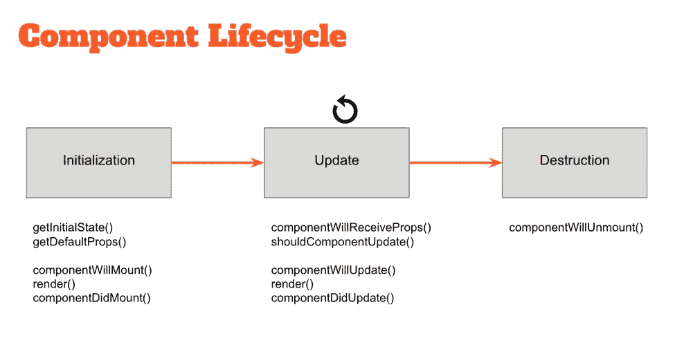

# React 的组件生命周期

> 原文：<https://itnext.io/reacts-component-lifecycle-6c13e09d10ad?source=collection_archive---------5----------------------->

当我在公司面试全栈和前端开发角色时，我不断被问到 React 的组件生命周期是什么。

简单地说，组件生命周期有三个阶段。初始化/安装、状态/属性更新以及销毁/卸载。这些事件中的每一个都有与之相关的 React 方法，并且其中的一些事件会发生不止一次。理解这三个事件可以帮助您决定在给定的情况下使用什么逻辑。例如，我们可能希望在组件呈现后向 DOM 添加一些内容，然后在组件被销毁前移除它。

这让您很好地了解了什么是组件生命周期以及与每个阶段相关的方法。

所有前缀为`will`的方法都在动作之前被调用，所有前缀为`did`的方法都在动作之后被调用。

`render()`

这可以说是最重要的方法。创建的每个组件都需要此方法。`render`方法应该考虑到`this.props`和`this.state`，并返回一个 react 元素(即一个 JSX 形式的 DOM 组件或一个用户创建的`<MyComponent />`形式的组件)、一个字符串或数字(在 DOM 中创建为文本节点)、`null`或布尔值。`render()`不应该修改组件的状态，它应该以可预测的方式呈现。如果`shouldComponentUpdate()`返回`false`，则`render()`不会被调用。

## **初始化/安装**

React 组件生命周期的第一阶段是初始化/安装。这是组件第一次被创建并插入 DOM 的地方。与此阶段相关的方法如上所示。下面我就来讨论两个。

`componentWillMount()`

该方法在组件安装之前调用，因此在`render()`方法之前。如果您最初设置状态，建议您改为在`constructor()`方法中设置。如果你需要在这个方法中调用`setState()`，它不会触发任何额外的渲染，因为组件还没有被渲染。

`componentDidMount()`

组件安装一发生，此方法就调用。任何需要 DOM 上存在特定节点的东西都应该放在这里。如果有需要从 API 请求的数据，这是放置请求的好地方。如果`setState()`在这里被调用，它将触发一个重新渲染，因为初始渲染已经发生。

## 状态/属性更新

每当状态或属性发生变化时，默认情况下会重新呈现一个组件，并且在这个重新呈现器上还会调用其他方法，下面将对其中一些方法进行探讨。

`shouldComponentUpdate()`

当让一个组件知道它是否应该根据状态或属性的改变而更新时，使用这个方法。这是与状态/属性更改相关联的方法链中调用的第一个方法。

`componentWillUpdate()`

当状态或属性发生变化时，在呈现发生之前调用此方法。这是在更新之前可以做的准备工作。您不应该在此方法中对状态或属性进行任何更改，因为它假定对状态或属性的更改已经发生。

`componentDidUpdate()`

更新一发生就调用此方法，而不是在第一次渲染时调用。这是一个提出请求并根据你的状态和道具进行检查的好地方。

## 卸载/销毁

这个类别中只有一个方法，当一个组件从 DOM 中被删除时，这个方法被调用。

`componentWillUnmount()`

这个方法在卸载之前被调用。这是进行任何清理的地方，例如删除任何计时器、事件侦听器以及停止和网络请求。

# **信号源**

 [## 5 个必不可少的 React.js 面试问答| Codementor 博客

### 在 2017 年的开发者调查中，Stack Overflow 指出 React 仍然是最受欢迎的 JavaScript 库之一…

www.codementor.io](https://www.codementor.io/blog/5-essential-reactjs-interview-questions-du1084ym1)  [## 做出反应。成分-反应

### 用于构建用户界面的 JavaScript 库

reactjs.org](https://reactjs.org/docs/react-component.html#the-component-lifecycle)