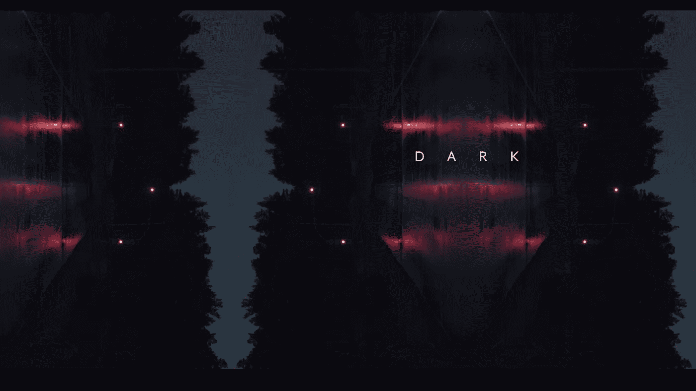

# 用 Html 和 Javascript 再现网飞的黑暗开场效果

> 原文：<https://itnext.io/recreating-the-netflixs-dark-opening-effect-in-html-javascript-4f06e17b88dd?source=collection_archive---------6----------------------->

一步一步的指导你如何用图像和普通的 Javascript 在画布上重建镜像效果



对于那些不了解《黑暗》的人来说，这是一部来自德国温登镇的网飞的精彩而有趣的电视剧。开场效果相当简单却引人注目。在这个片段中，我试图用一个由鼠标移动产生动画的图像来重新创建这个外观。

这里有一个到[演示](http://nikpundik.github.io/dark/)的快速链接。

html 只是一块画布和一个固定位置的标题。画布被设置为用这个 css 填充窗口:

```
* {
  padding: 0;
  margin: 0;
}
html,
body {
  height: 100%;
}
canvas {
  display:block;
}
```

现在我们可以跳到脚本部分。首先，我们必须确保画布尺寸适合窗口，即使发生了尺寸调整。

```
var canvas;
var ctx;
var img;function start() {
  canvas = document.getElementById('dark');
  ctx = canvas.getContext('2d');
  load();
}function load() {
  img = new Image();
  img.addEventListener('load', init, false);
  img.src = 'dark.jpg';
}function init() {
  window.addEventListener('resize', resize, false);
  resize();
}function resize() {
  canvas.width = window.innerWidth;
  canvas.height = window.innerHeight;
  draw(); 
}
```

函数`start`在 body `onload`事件中被调用，它简单地获取我们对画布和上下文的引用，然后开始加载图像(所以我们可以假设我们的资产总是准备好的)。当加载图像时，我们在 resize 事件上添加一个侦听器。当调整大小时，我们更新画布尺寸并重新绘制。

`draw`功能相当简单:

```
function draw() {
  var w = canvas.width / 3;
  ctx.clearRect(0,0, canvas.width, canvas.height);
  drawImage(false, 0, 0, w, canvas.height);
  drawImage(true, w, 0, w, canvas.height);
  drawImage(false, w*2, 0, w, canvas.height);
}
```

在这里，我们只是将画布分成 3 部分，并使用`drawImage`函数在每一部分中绘制我们的图像。

所有的数学计算都发生在`drawImage`函数中。

```
function drawImage(flip, x, y, w, h) {
  ctx.save(); var hW = w / 2;
  var hH = h / 2;
  var sourceRect = getSourceRect(w, h);

  ctx.translate(x, y);
  ctx.translate(hW, hH);
  ctx.scale(flip ? -1 : 1, 1); ctx.drawImage(
    img,
    sourceRect.x,
    sourceRect.y,
    sourceRect.w,
    sourceRect.h,
    -hW,
    -hH,
    w,
    h,
  ); ctx.restore();
}
```

在输入细节之前，理解`ctx.drawImage`功能的工作原理很重要。[这里是完整的解释和 sintax](https://developer.mozilla.org/en-US/docs/Web/API/CanvasRenderingContext2D/drawImage) 。简而言之，它可以从源矩形获取图像的一部分，并将其绘制在画布上的目标矩形上。

我们的目标是在画布的特定区域呈现我们的源图像(从`x, y, w, h`中识别)。但是也应该可以在绘制之前翻转它。为了实现镜像效果，我们必须用负值来缩放我们的图像。然而，这并不简单，因为我们必须将我们的转换应用到上下文中。

因此，首先，我们用`ctx.save()`拍摄当前转换矩阵的快照，并在结束时用`ctx.restore()`恢复它。

第一次平移`ctx.translate(x, y)`会将我们的图像移动到正确的位置。在应用缩放之前，我们需要用`ctx.translate(hW, hH)`将旋转的中心移动到图像的中心。然后用`ctx.scale(flip ? -1 : 1, 1)`根据参数进行翻转。为了回到我们的`x,y`位置，我们将目的地设置为`-hW`和`-hH`。`sourceRect`只是一个实用函数，用于在图像坐标上获得满足目标纵横比的最大矩形，这样我们的图像就不会显得被拉伸。这是:

```
function getSourceRect(srcW, srcH) {
  var destW = img.naturalWidth;
  var destH = img.naturalHeight; var scale = Math.min(destW / srcW, destH / srcH); var scaledSrcW = srcW * scale;
  var scaledSrcH = srcH * scale; var startX = (destW - scaledSrcW) * 0.5;
  var startY = (destH - scaledSrcH) * 0.5;
  return {
    x: startX,
    y: startY,
    w: scaledSrcW,
    h: scaledSrcH,
  };
}
```

现在，我们应该已经在画布上绘制了三个图像，第二个图像已经翻转。现在让我们看看当鼠标移动时，我们如何将这些图像动画化。

我们添加了两个变量，`mouseX`将保持鼠标的 x 位置，`weight`将告诉我们希望图像移动多少像素。

在`init`函数中，我们添加了一个监听器:

```
function init() {
  window.addEventListener('resize', resize, false);
  canvas.addEventListener('mousemove', move);
  resize();
}
```

在每次鼠标移动事件中，我们调用`move`函数，该函数简单地将 x 位置存储为百分比并重新绘制画布。

```
function move(e) {
  mouseX = (e.clientX / canvas.width);
  draw();
}
```

现在我们有了范围从 0 到 1 的`mouseX`值，我们想根据它移动图像。这个想法是将我们传递给`drawImage`的源位置进行移动。

```
ctx.drawImage(
  img,
  sourceRect.x - (mouseX * weight),
  sourceRect.y,
  sourceRect.w,
  sourceRect.h,
  -hW,
  -hH,
  w,
  h,
);
```

这样，我们的图像随着鼠标移动，但是有一个问题。事实上，移动光源是不够的，因为我们在图像之外获得了未定义的像素(这就是我们看到白色像素的原因)。这里简单的修正是取一个比当前矩形小的源矩形，这样我们就可以安全地加上或减去那个`(mouseX * weight)`值。

```
var scaleFactor = weight / img.naturalWidth;var stepX = img.naturalWidth * scaleFactor;
var stepY = img.naturalHeight * scaleFactor;ctx.drawImage(
  img,
  sourceRect.x + stepX - (mouseX * weight),
  sourceRect.y + stepY,
  sourceRect.w - stepX,
  sourceRect.h - stepY,
  -hW,
  -hH,
  w,
  h,
);
```

我们已经做到了。鼠标动画只是一个选项，它可以像这里的[一样连续循环动画](http://nikpundik.github.io/dark/stranger.html)或者由一个动作触发，有很多种可能性！

这是 Github 上的完整代码

这里是[演示](http://nikpundik.github.io/dark)的链接

让我们在推特上连线吧！