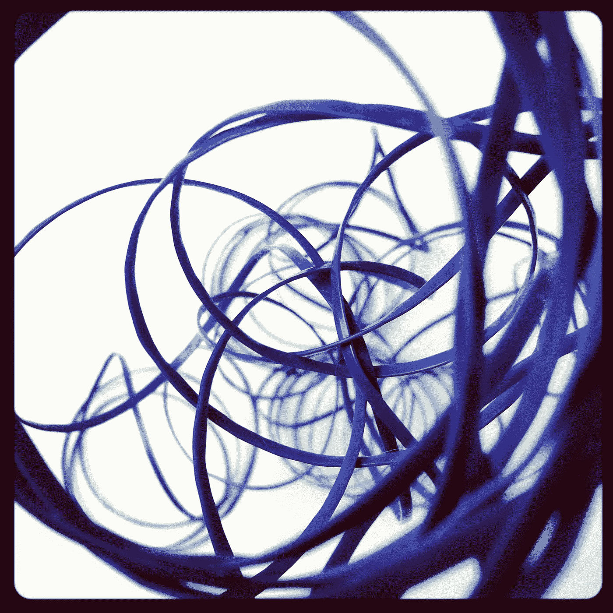

# 递归入门

> 原文：<https://itnext.io/recursion-263745d98999?source=collection_archive---------5----------------------->



关于递归的解释，点击[这里](https://medium.com/@OmisNomis/recursion-263745d98999)。

[*点击这里在 LinkedIn* 上分享这篇文章](https://www.linkedin.com/cws/share?url=https%3A%2F%2Fitnext.io%2Frecursion-263745d98999)

## 为什么我刚刚花了一个小时点击一个链接，只是循环回到这个页面？！

两个原因:

1.  这就是递归。
2.  我希望它能给我更好的数据。

如果你不明白为什么这是递归，你真的花了一个小时点击同一个链接，那么这篇文章的目的是让你明白这个笑话。

## 我为什么要写这个？

我在学开发的时候；递归一直是我能理解的东西之一，我认为它真的很棒，但就是找不到一个用例。

我最近在解决一个问题，我需要将多维对象展平为平面结构。这个问题使用递归很容易解决；我认为这在博客文章中会很有用。

## 那么我们在建造什么？

这部分很简单；我们将编写一个函数，给定一个多维对象，它将返回一个一维对象，其中包含嵌套对象的所有键值对。

注意，我们只对实际上有关联值的键感兴趣；而不是分配给嵌套对象的那些。

## 该功能

让我们看看整个功能，然后我们可以一起讨论每个步骤。

现在让我们一行一行地走一遍。

1.  创建一个我们将添加并返回的空对象。

```
let obj = {}; 
```

2.获取已经传入函数的`object`的`keys`。如果你有一个对象`{one: 1, two: 2, three: { four: 4 }}`，那么键就是`one`、`two`和`three` ( `four`不是嵌套的)。然后我们使用`forEach`函数对每个`key`进行循环。

```
Object.keys(object).forEach(key => {});
```

3.然后我们检查`value`的类型；如果它不是一个对象，那么我们把它添加到我们的`obj`对象中，然后我们继续。

```
if (typeof object[key] !== 'object') {      
    obj[key] = object[key];    
}
```

4.下一步是我们使用递归。如果`value`的类型是一个对象(例如`three: { four: 4 }`三是`key`并且它的`value`是一个对象)，那么我们递归调用`flattenObject`函数返回一个一维对象，然后我们可以将它与`obj`合并

```
else {      
    obj = { ...obj, ...flattenObject(object[key]) };    
}
```

## 有道理！

不，当然不是！连我都有点困惑。让我们更详细地讨论第四点。

与其我们的大对象，有多层次的嵌套对象，不如从一个简单的开始；

```
const obj = {one: 1, two: { three: 3}, four: 4}
```

下面是当我们将它传递给我们的`flattenObject`函数时发生的情况

*   `obj`被分配给一个空对象
*   从`Object.keys(object)` ( `[one, two, four]`)返回一个数组
*   然后我们使用`forEach`循环遍历这个数组
*   第一个键(`one`)的值是`1`，不是对象，所以加到`obj`。
*   `obj`现在等于`{one: 1}`
*   第二个键(`two`)有一个对象值，所以我们要递归调用`flattenObject`函数。
*   用`object[key]`调用`flattenObject`函数，在本例中是`object[two]`，因此是`{three: 3 }`
*   再次创建一个变量(`obj`)，它等于一个空对象(`{}`)。值得注意的是，这个变量与第一次调用这个函数时的变量完全不同；每个调用在调用堆栈中都有自己的位置，因此也有自己的范围。
*   从`Object.keys(object)` ( `[three]`)返回一个数组
*   然后，我们使用`forEach`遍历该数组(您现在应该开始看到与上面要点的相似之处)
*   第一个键(`three`)的值是`3`，不是对象，所以加到`obj`。
*   在数组中没有更多的项需要循环，所以返回`obj`。
*   记住，我们递归地调用了函数，然后将返回的对象传递给 spread 操作符

```
// Changing this
obj = { ...obj, ...flattenObject(object[key]) };// To this
obj = { ...{one: 1}, ...{three: 3} };
```

*   因为[扩展操作符](https://developer.mozilla.org/en-US/docs/Web/JavaScript/Reference/Operators/Spread_syntax)将两个对象连接在一起，obj 现在等于`{one: 1, three: 3}`
*   第三个键(`four`)，记住我们传递的对象是`{one: 1, two: { three: 3}, four: 4}`，有一个值`4`不是对象，所以加到`obj`。
*   `obj`现在等于`{one: 1, three: 3, four: 4}`。
*   在数组中没有更多的项需要循环，所以返回`obj`。

## 快速警告

虽然使用递归看起来很聪明，感觉也很棒，但是应该小心使用。请记住，每次递归调用都会向调用堆栈中添加另一个调用，这可能会让您大吃一惊(**最大调用堆栈大小超过了**)。你应该考虑阅读关于尾部递归的文章，或者我会写另一篇关于尾部递归的博文(敬请关注！).

## 好了

这就是如何使用递归将多维对象变成一维对象。下面是代码: