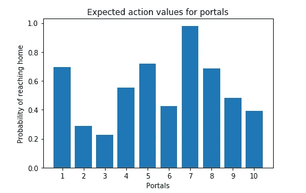
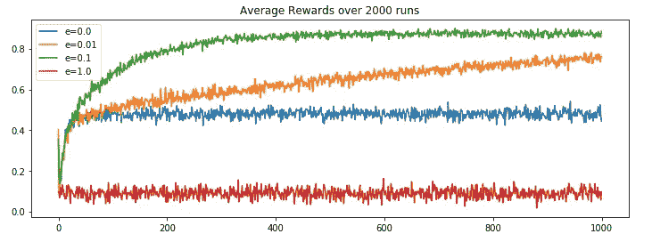
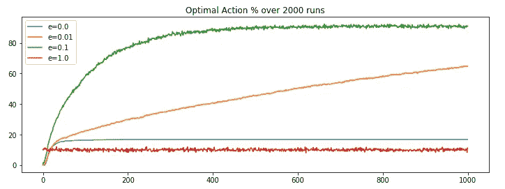

# 多臂 Bandit 强化学习

> 原文：<https://itnext.io/reinforcement-learning-with-multi-arm-bandit-decf442e02d2?source=collection_archive---------2----------------------->


> [点击这里在 LinkedIn](https://www.linkedin.com/cws/share?url=https%3A%2F%2Fitnext.io%2Freinforcement-learning-with-multi-arm-bandit-decf442e02d2%3Futm_source%3Dmedium_sharelink%26utm_medium%3Dsocial%26utm_campaign%3Dbuffer) 上分享这篇文章

让我们来谈谈经典的强化学习问题，它为在探索和利用之间取得平衡的延迟奖励学习铺平了道路。

## 什么是多臂土匪问题？

“土匪问题”是指在不知道决策的全部属性的情况下，学习在静态或动态环境中做出最佳决策。这就像给定一组可能的行动，选择一系列行动来增加我们的总体预期收益。假设你发现了一个传送入口(科幻小说中的任何人)，它要么通向你的家，要么通向海洋的中央，而*或者*是由某种概率分布决定的。因此，如果你踏入传送门，就有可能出现在你的家中，也有可能出现在海洋中央(有鲨鱼在里面，让它更不吸引人)。我不知道你们怎么想，但我想去前者。如果我们知道，比方说 60%的时间传送门通向海洋，我们就永远不会使用它，如果大多数时间它是家，使用传送门会更有吸引力一点。但是如果我们没有任何这样的知识，我们怎么能获得它呢？

假设我们发现了`n` 其他门户，它们都具有相同的目的地选择，并且没有目的地概率分布的先验知识。n 臂或多臂土匪问题是用来概括这种类型的问题，其中我们提出了多种选择，没有事先知道他们的真正行动回报。我们将尝试找到问题的解决方案，讨论不同的算法，以及哪些算法可以帮助我们更快地收敛，即以最少的尝试次数尽可能接近真实的行动奖励分布。

## 探索与开发

给定`n`入口，假设我们尝试了入口#1，它通向家。太好了，现在我们是应该把它命名为家庭门户，并在我们未来的旅程中使用它，还是应该等待，再尝试几次？假设我们又试了几次，现在我们可以说有 40%的机会可以找到家。对结果不满意，我们转向 2 号入口，试了几次，它有 60%的机会回家。现在，我们是否应该停止或者尝试其他的入口。也许传送门#3 有更高的机会回家，也许没有。这就是勘探和开发的困境。当你获得了一些关于奖励分配的知识时，倾向于开发的方法以避免不必要的损失的逻辑来这样做，而倾向于探索的方法以永远不会对早期行动奖励分配有偏见的逻辑来这样做，并且为了获得奖励分配的真实属性而不断尝试每一个行动。

## 家庭门户游戏

在继续之前，让我们定义一些术语，

1.  **环境**:它是代理人、行为和报酬的容器；允许代理采取行动，并根据行动分配奖励，遵循一定的规则。
2.  **预期行动价值:**奖励也可以称为行动的价值。在这个意义上，预期行动值可以定义为所选行动的预期回报，即选择行动时的平均回报。这才是真正的行动奖励分配。
3.  **估计动作值**:这只是对预期动作值的估计，在每次学习迭代后，预期动作值必然会改变。我们从估计的行动值开始，并试图使其尽可能接近真实/预期的行动值。一种方法是取一项行动到目前为止所获得奖励的平均值:


假设我们有 10 个门户，其对有利的回家旅程的预期行动值被给定为均匀分布，

```
>>> import numpy as np
>>> np.random.seed(123)
>>> expected_action_value =  np.random.uniform(0 ,1 , 10)
>>> expected_action_value
array([0.69646919, 0.28613933, 0.22685145, 0.55131477, 0.71946897,
       0.42310646, 0.9807642 , 0.68482974, 0.4809319 , 0.39211752])
```



家庭门户游戏的预期行动价值

有了预期行动价值的知识，我们可以说总是选择门户# 7；因为它回家的概率最高。但是正如现实世界的问题一样，大多数时候，我们对行动的回报完全陌生。在这种情况下，我们对奖励分布进行估计，并随着我们的学习进行更新。另一个有趣的讨论话题可能是初始估计值的选择，让我们保持简单，将其定义为零。

```
>>> estimated_action_value = np.zeros(10)
>>> estimated_action_value
array([0., 0., 0., 0., 0., 0., 0., 0., 0., 0.])
```

让我们定义奖励函数，按照我们的要求，我们想在家里着陆，所以让我们为在家里着陆设置奖励值`1`，为在海洋中着陆设置奖励值`-1`。

```
>>> def reward_function(action_taken, expected_action_value):
>>>    if (np.random.uniform(0, 1) <= expected_action_value[action_taken]):
>>>       return(1)
>>>    else:
>>>       return(-1)
```

## ε-贪婪算法

强化学习中的贪婪算法总是选择估计动作值最高的动作。这是一个完整的开发算法，不关心探索。如果我们已经成功地估计了预期行动值的行动值，这可能是一个聪明的方法，就像如果我们知道真实的分布，只需选择最佳行动。但是如果我们不确定这个估计呢？epsilon 来救援了。

贪婪算法中的ε增加了对混合的探索。因此，与之前总是选择最佳动作的逻辑相反，根据估计的动作值，现在很少几次(以ε概率)为了探索而选择随机动作，而剩余时间表现为原始贪婪算法并选择最佳已知动作。


因此，0-ε贪婪算法总是选择最佳已知动作，1-ε贪婪算法总是随机选择动作。现在让我们用估计动作值修改和ε-贪婪动作选择算法来定义 bandit 问题。

```
>>> def multi_arm_bandit_problem(arms = 10, steps = 1000, e = 0.1, expected_action_value = []):
>>>    overall_reward, optimal_action = [], []
>>>    estimate_action_value = np.zeros(arms)
>>>    count = np.zeros(arms)
>>>    for s in range(0, steps):
>>>        e_estimator = np.random.uniform(0, 1)
>>>        action = np.argmax(estimate_action_value) if e_estimator > e else np.random.choice(np.arange(10))
>>>        reward = reward_function(action, expected_action_value)
>>>        estimate_action_value[action] = estimate_action_value[action] + (1/(count[action]+1)) * (reward - estimate_action_value[action])
>>>       overall_reward.append(reward)
>>>       optimal_action.append(action == np.argmax(expected_action_value))
>>>       count[action] += 1
>>>    return(overall_reward, optimal_action)
```

在 2000 次运行中运行多个ε值的游戏，并绘制平均结果，我们得到，

```
>>> def run_game(runs = 2000, steps = 1000, arms = 10, e = 0.1):
>>>     rewards = np.zeros((runs, steps))
>>>     optimal_actions = np.zeros((runs, steps))
>>>     expected_action_value = np.random.uniform(0, 1 , arms)
>>>     for run in range(0, runs):
>>>         rewards[run][:], optimal_actions[run][:] = multi_arm_bandit_problem(arms = arms, steps = steps, e = e, expected_action_value = expected_action_value)
>>>     rewards_avg = np.average(rewards, axis = 0)
>>>     optimal_action_perc = np.average(optimal_actions, axis = 0)
>>>     return(rewards_avg, optimal_action_perc)
```



e-greedy 奖励性能超过 2000 次运行，每次运行 1000 步



e-greedy 优化操作选择性能超过 2000 次运行，每次运行 1000 步

我们可以观察，

*   完全探索(e=1)算法有其缺点，因为它从不利用它的倾向，它保持随机选择动作。结果并不好，因为我们的多武器强盗问题明显倾向于 7 号入口。如果所有门户都具有相同的预期操作值会怎样？
*   完全开发(e=0)算法有其缺点，因为它锁定在初始的最佳回报上，从不为了更好的回报发现而探索。如果它锁定了最佳行动呢？
*   e(0.01)-贪婪算法比完全对比法执行得更好，因为它非常倾向于探索，而其余时间都在追求最佳已知结果。慢慢改善但最终(太久？)将优于其他方法。
*   e(0.1)-贪婪算法在它的竞争者中脱颖而出，因为它利用其学习的性质，并不时地以良好分布的概率采取探索举措。它探索得更多，通常更早找到最佳行动。

## 结论

这篇文章的主要收获是理解探索/开发的重要性，以及对于给定的问题，为什么混合(0

完整代码@ [Mohit 的 Github](https://gist.github.com/imohitmayank/3b775bedb27a3ed1fbb6a2dbce12532b)

干杯。

## 参考

[1]强化学习——介绍；理查德·萨顿和安德鲁·巴尔托