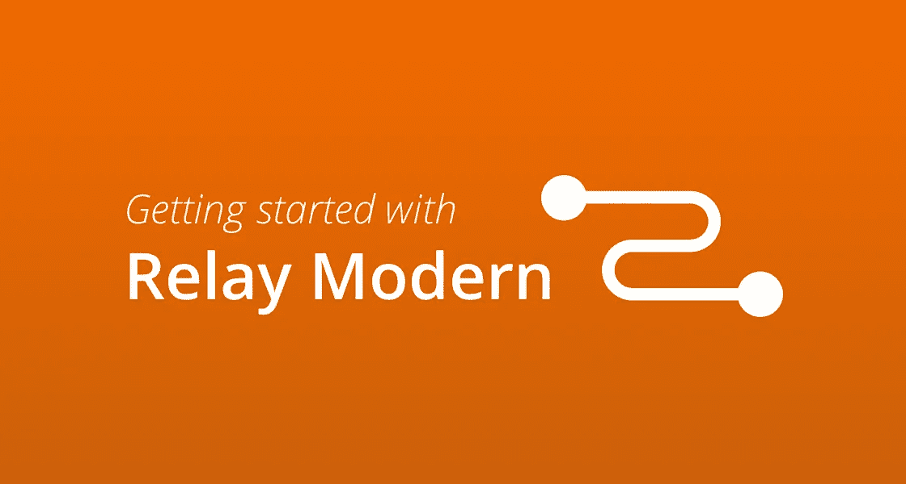

# 中继现代:缓存请求。

> 原文：<https://itnext.io/relay-modern-cache-requests-a0faaa275108?source=collection_archive---------2----------------------->

Relay modern 是一个很棒的图书馆，它已经存在几年了。Relay 的第一个版本(例如 classic)具有开箱即用的请求缓存，并且工作得非常好。来自 facebook 的家伙决定在 Relay Modern 中默认不使用请求缓存，但是他们给了我们[一个工具](https://github.com/facebook/relay/blob/master/packages/relay-runtime/network/RelayQueryResponseCache.js)来这样做。它还没有出现在官方文档中，但是我们现在就可以使用它。这是我自己使用它的经验，我相信有更好的方法，但我还没有找到。让我们开始吧。



感谢 graph cool&[https://www.prisma.io/](https://www.prisma.io/)供图。

首先，我们需要了解请求缓存在 Relay 中是如何工作的。每当我们想要扩展时，服务器中继会使用它的网络助手来完成对 API 的所有调用。中继网络需要一个函数(解析器),它必须实现 API 调用，这就是神奇的地方。假设它看起来像这样:

其思想是通过查询名称和变量将响应数据保存到缓存存储中。查询名称是在查询中定义的，例如:

```
graphql`
  query MyQueryExample($country: String!) {
    getUsersByCountry(country: $country) {
      name
      age
    }
  }
`
```

此查询的查询名称将是 MyQueryExample。我决定使用查询名而不是散列(这个是 relay-compiler 在将 graphql 查询转换成 relay 查询时创建的)，因为它很冗长。稍后，只需使用名称就可以轻松地清除该查询的缓存。variables 参数也是必需的，因为您可能有两个同名但变量不同的查询，例如:

```
// this is a pseudocode, usually it is done by passing args to relay // query renderer
const getRuUsers = relay.fetch({ country: 'Russia' });
const getEuUsers = relay.fetch({ country: 'Europe' });
```

第一个从俄罗斯获取用户，第二个从欧洲获取用户。如果我们只使用查询名称作为关键字，那么 relay 会用第二个响应覆盖第一个响应，因为 relay 不能只通过名称来区分这两个查询。再来一次:使用查询名(或散列)和变量为缓存存储构建一个键。

```
cache.set(queryID, variables, data);
```

现在看看它是如何工作的，在我们强制 relay 向服务器发送请求之前，我们尝试从缓存中获取对该查询的响应

```
const cachedData = cache.get(queryID, variables);
```

如果有，我们就返回它，如果没有缓存，我们就把它发送到服务器。一旦我们向服务器发送请求，我们需要使用相同的名称和变量将其响应保存在缓存中。基本就是这样。

中继将在 ttl 参数中定义的时间内保留缓存，在我的例子中是 60 * 5 * 1000 ms，相当于 5 分钟。

所以这很好，也很有效，但是我们如何为特定的查询或所有查询清除缓存呢？中继缓存帮助器有一个名为 clear 的方法，用于清除所有缓存。要仅删除特定查询的缓存，我们需要重置它。

```
cache.set(queryName, vars, null);
```

这部分还没做好。要清除特定查询的缓存，您需要知道调用该查询时使用的名称和变量。在我的例子中，我在定义查询的地方调用了一个突变，所以我得到了我需要的所有东西，但是正如我所说的，这并不理想。如果你认为这样做可能会更好——留下你的评论吧！

喜欢这家店吗？鼓掌和分享。谢谢！