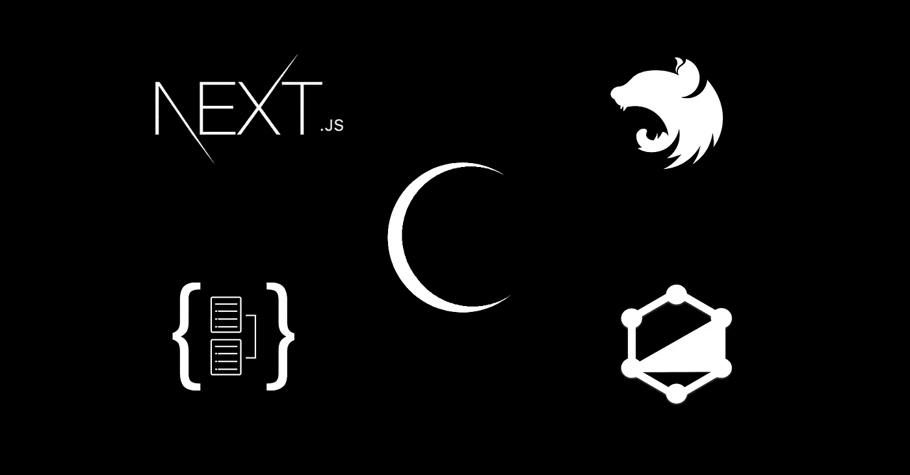
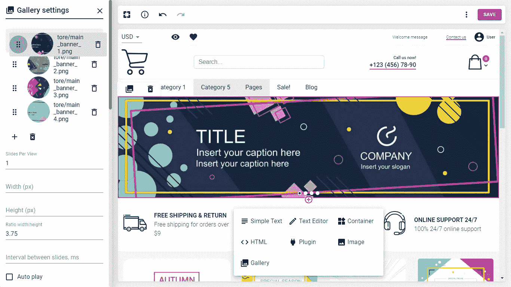
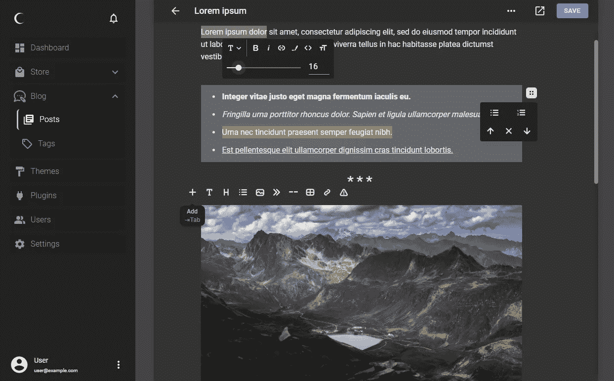
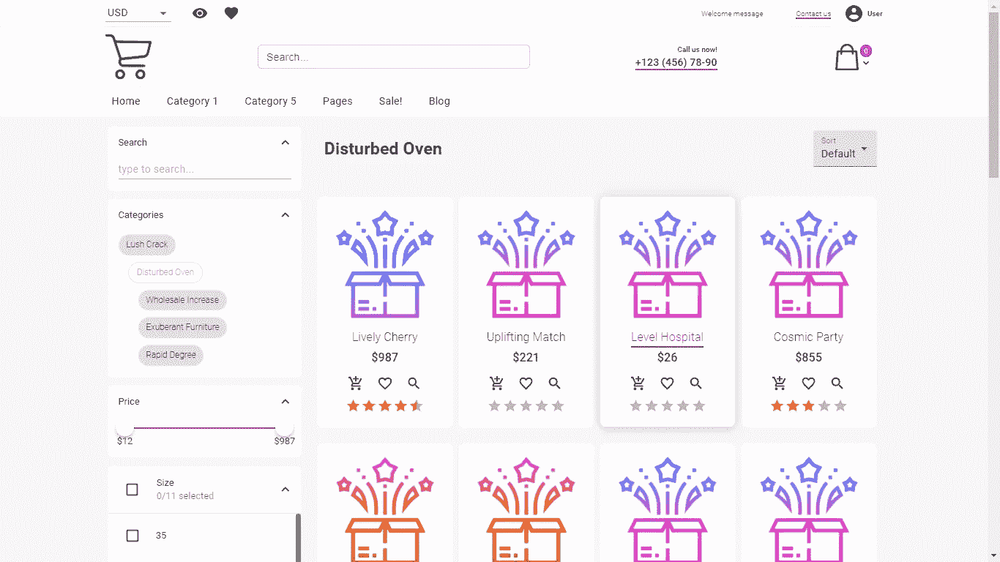

# 在 JS 栈中改造 WordPress。你好，Next.js 网站的新 CMS。

> 原文：<https://itnext.io/remaking-wordpress-in-js-stack-hello-to-a-new-cms-for-next-js-websites-63096bc5f98b?source=collection_archive---------0----------------------->

# 动机

詹斯塔克出去了一会儿。对于我们大多数人(开发人员)来说，静态预渲染 React 网站不足为奇:浏览器中的页面路由，“闪电般的”(他们通常称之为)体验，等等。试试 Gatsby 或者 Next.js 就有了。如果你是一名 web 开发人员，你知道 React，并且可能知道用它做些什么。但对于许多正常人来说，它看起来仍然像一些他们可以没有的昂贵产品。

78.9%的互联网还是在 PHP 上。嗯，很多这样的网站都很老了，现在开发者不经常选择 PHP 了。但是对于 WordPress (39.6%)来说，这个数字一直在增长。在谷歌上输入“电子商务 CMS ”,你会得到一些老前辈的建议，告诉你如何摆脱对开发者的依赖。

与此同时，许多现代 Node.js CMS 走了另一条路，无头。如果你想要一个前端，准备聘请一名开发人员。哦，那会让你付出代价的。或者如果你的 Node.js CMS 不仅仅是无头的，那么我在哪里点击安装插件？嗯，很多都不支持这样的插件。

但是很多非编程人员想要一个独立的平台，他们可以自己简单地管理和定制。这是 WordPress 仍然如此受欢迎的主要原因之一。不然大家也就随便雇个开发者做个超快超酷的网站。

尽管有 Node.js、全栈 Javascript / Typescript、SPA 等优势，但人们还是停留在 LAMP stack 上。并不是因为它是最好的，我们可以把很多问题归咎于它。在我读过的一篇文章中，作者比较了 Wordpress 和 Ghost CMS。他指责 Wordpress 的插件太慢和不安全，因为 Ghost CMS 没有插件，这两点都更好。但是我不认为缺少潜在有用的特性是一种优势。如果只有插件功能的存在是一个问题，那么这个问题是在 CMS 的核心设计中，而不是在插件中。另一方面，如果 CMS 不支持扩展，那么再次，CMS 的核心设计有问题，因为这个 CMS 在我看来不会是面向未来的。

必须有一个能够涵盖所有现代尖端技术的解决方案。静态预渲染 React for frontend，成熟可维护的后端(比如看看 Nest.js 和 TypeORM)。GraphQL API 在 CMS 开发中大放异彩，最终用户可以构建任何类型的前端。
但是我找不到 WordPress 提供的同样水平的通用性、可扩展性、构建插件的能力以及每个人都能处理的强大 GUI。这就是我如何在过去两年的大部分空闲时间里从事兼职项目的原因。

今天我决定公开这个项目，所以我介绍它:克伦威尔 CMS。你可以在以下网站找到一些例子:[https://cromwellcms.com/docs/overview/intro#examples](https://cromwellcms.com/docs/overview/intro#examples)
CMS 是免费开源的，你可以查看代码或者给 at a star[https://github.com/CromwellCMS/Cromwell](https://github.com/CromwellCMS/Cromwell)

# 核心设计

Node.js 环境非常方便地成为一个包系统。一切都是一个包裹。可以通过简单的 npm 命令安装一个类似的组件，并下载到扁平的 node_modules 结构中。
沿袭传统，克伦威尔 CMS 是一套可以独立安装和启动的包和服务。它继承了微服务架构的优势，只需运行一个 npm 或 yarn 命令就可以轻松更新 CMS。我也可以称之为无头 CMS，因为它可以运行任何自定义前端的 API 服务器。

所以有 4 个主要服务:
1。API 服务器服务。API 服务器用 Nest.js 和 TypeGraphQL 编写，REST API 用于事务，GraphQL 用于数据流。这两种类型的 API 都可以通过插件来扩展(下面会详细介绍)。
2。前端服务(Next.js)。基本上就是一个自定义的 Next.js 服务器。
3。管理面板服务。服务管理面板的文件。
4。管理服务。该服务在用户 GUI 输入上启动、观察和重新启动其他服务。例如，在 WordPress 中更改主题更容易，但在 Next.js 中，我们必须用另一个应用版本重新启动服务器。作为产品生命周期的一部分，重启服务器并不常见，但在我的测试中，它相当稳定，我相信只要处理得当，它是可以工作的。

# 主题引擎

所有主题都是 npm 包。只需在 package.json 中安装一个具有特定属性的包，CMS 就会识别它并在管理面板中显示一个主题。然后，用户可以选择一个主题，CMS 将从 node_modules 中的主题包中准备好应用程序构建，将其放在工作前端目录中，并重新启动 Next.js 服务器。

虽然通过 npm 安装对开发人员来说很方便，但听起来不太用户友好。所以我决定更进一步，在管理面板中实现了用于包管理的 GUI。当用户进入主题或插件市场(在管理面板 GUI 中，与 WordPress 中的“添加新插件”相同)并点击“安装”时，CMS 内部运行 yarn 命令来添加一个包。删除/卸载时也会发生类似的情况。

然后，每个主题都可以在管理面板拖放主题编辑器(网站建设者排序)高度定制。用户可以移动块，改变文本，图像，添加插件等。React 使我们能够提供开箱即用的系统。

我试图结合两个世界的优点:React 中正确编程的前端和普通网站建设者 GUI 中的强大功能。嗯，克伦威尔 CMS builder 还没有众所周知的解决方案强大，但我的目标是让它如此。重要的是，它遵循代码优先的方法，在我看来这是建立网站的正确方法。在一个故障网站生成器中，没有从零开始的残缺的布局(在克伦威尔 CMS 中实际上也是可能的，但你不会这样做)。无论如何，几乎每个人在开始使用 CMS 时都会选择一个现成的主题。

至于开发主题，你可以制作任何 Next.js 应用，只需用定制 Next.js 构建流程的克伦威尔 CLI 构建，使你的应用兼容 CMS 即可。也有一些建议，如遵循 Next.js 静态优化实践，因此在运行时 Next.js 将使用[增量静态再生](https://vercel.com/docs/concepts/next.js/incremental-static-regeneration)，使您的网站像任何其他 JAM stack 网站一样快。从技术上讲，构建时预渲染的页面将在用户安装主题后重新生成，但它接近于 JAM stack 工作流，每个人都可以使用。

# 插件

插件是可以导出扩展或者订阅动作的包(和 Wordpress 中的钩子一样)。插件让你能够用最好的(或者至少是最好的)框架来构建你的应用。
您可以导出自定义 Nest.js 控制器、TypeGraphQL 解析器、TypeORM 实体等。因为 REST 和 GraphQL API 都可以作为插件作者进行扩展，所以你可以选择最适合你的应用的插件。
在前端，你可以为管理面板或主题前端注册小工具(用户必须将你的插件放在主题编辑器中)。
更多信息请参见[我们的指南](https://cromwellcms.com/docs/development/plugin-development/)。
插件可以安装在管理面板中，所有扩展将自动应用，无需任何手动 CLI 命令。

# 您的客户能得到什么

React 和 Next.js 静态预渲染页面的强大功能带来了超快的前端体验。
-在线商店和博客平台。除了提供尖端技术，它必须有一个体面的管理面板的经验，不差于众所周知的 CMS。基于 [Editor.js](https://editorjs.io/) 的现代块样式文本编辑器

-免费的全功能在线商店和博客主题。免费插件。这一点，我会添加更多。用户可以从任何其他 CMS 简单地免费开始尝试或使用克伦威尔 CMS。对我来说，这是一个兼职项目，我真的很喜欢把空闲时间投入其中，这不会改变。任何免费添加的东西都将永远免费。

-易于安装和使用主题和插件。管理面板 GUI 中的一切都是正确的。网站建设者。从前面的观点可以得出结论——没有网络开发者也能生存的诱人能力。
- SEO 友好。每个页面都有静态预渲染的 HTML。CMS 允许编辑搜索引擎优化元标签，提供自动生成的网站地图和机器人。txt.
-迁移。将您的数据从其他 CMS 导出到 Excel 文件并导入。
-电子邮件、支付和其他集成。

# 最后

WordPress 经常被选择，因为它的插件和主题丰富。我不能复制它。但是我可以试着创造一个环境，接下来是由社区决定的。我们可以一起创造一个伟大的生态系统。越来越多的人使用它，越来越多的人会使用它。诸如此类的事情可以改变网络。

我并不是说我的系统比 WordPress 更好(因为我还没有花上十几年的时间)，但是我正在努力解决问题，并提供一个可以在许多方面更好的解决方案。
现在，我正在征求如何改进的反馈。而且这个项目是开源的，任何人都可以尝试。最终，这一切都取决于社区。我们多久会在后端开发中采用一种新的最流行的语言？会有 Node.js 为 78.9%的互联网供电的那一天吗？；)