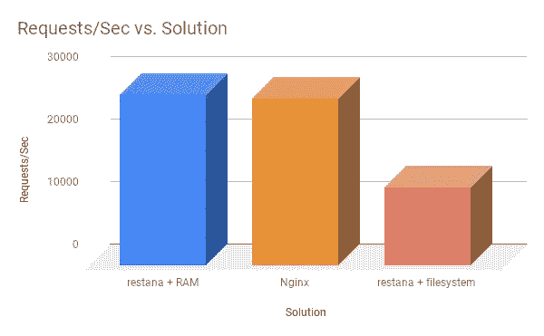

# restana-static，用超出 Nginx 的 Node.js 服务前端

> 原文：<https://itnext.io/restana-static-serving-the-frontend-with-node-js-beyond-nginx-e45fdb2e49cb?source=collection_archive---------3----------------------->


静态文件类比；)——图片由[https://pexels.com](https://pexels.com/)提供

***不要用 Node.js 来服务静态文件，这样效率不高*。你应该用 Nginx！**

这话我听了多少遍了，你呢？正确答案是:
***嗯，看情况吧！***

在本文中，我们将描述如何使用 Node.js 有效地服务静态文件，特别是在前端应用程序的上下文中。

# 码头集装箱？

如今，我们当然使用 Docker 来服务前端应用程序，并且有很多很好的理由这样做:[*Docker 容器的 6 个好处*](https://www.kiratech.it/en/blog/the-6-benefits-of-docker-container)

这意味着，在构建前端应用程序之后，我们将生成的静态文件打包在一个版本化的 docker 映像中，并部署它。在这种情况下，文件状态永远不会改变。

# 我们的前端演示

为了简单起见，在本文中，我们将使用一个非常简单的 HTML 前端:

单个"***【index.html】***"文件下的" ***src*** "目录:

# 使用 restana 和静态服务中间件提供静态文件服务

让我们使用 [*restana*](https://www.npmjs.com/package/restana) 和 [*serve-static*](https://www.npmjs.com/package/serve-static) 实现一个 Node.js 服务器来服务前端静态文件。

## 基本设置，从文件系统加载文件

“ ***serve-static*** ”的默认设置使用***Last-Modified***和 ***ETag*** 头启用 HTTP 缓存，这样我们可以通过在浏览器缓存中保存文件副本来减少网络开销。

这里描述了可用的配置选项和高级用例:[https://www.npmjs.com/package/serve-static](https://www.npmjs.com/package/serve-static)

## 从 RAM 提供文件

正如我们提到的，如果您使用 docker 容器来公开您的前端应用程序，您可能还会发现您的文件永远不会改变。在这种情况下，我们可以直接从 RAM 提供文件，并提供最高的性能:

该应用程序将在*“1 周”*期间提供来自 RAM 的静态文件，并在客户端浏览器上启用 HTTP 缓存。***http-cache-middleware***模块的高级用例可从这里获得:[https://www.npmjs.com/package/http-cache-middleware](https://www.npmjs.com/package/http-cache-middleware)

别担心，通过使用***Cache-Control***头中的 ***no-cache*** 指令，我们告诉浏览器在提交缓存的内容之前向服务器验证缓存状态。因此，如果您部署一个新版本的前端应用程序(意味着一个新的 docker 映像)，新的内容将按预期立即提供。

# restana-static 与 Nginx

这种替代品与 Nginx 相比如何？

> **NGINX** 是一款开源软件，用于 web 服务、反向代理、缓存、负载平衡、媒体流等等。它最初是一个为获得最佳性能和稳定性而设计的 web 服务器。除了 HTTP 服务器功能，NGINX 还可以充当电子邮件(IMAP、POP3 和 SMTP)的代理服务器，以及 HTTP、TCP 和 UDP 服务器的反向代理和负载平衡器。
> 
> [HTTPS://WWW.NGINX.COM/](https://www.nginx.com/)

以下是 MacBook Pro 2016、2,7 GHz 英特尔酷睿 i7、16 GB 2133 MHz LPDDR3 的基本基准测试，使用:

> wrk-t8-c8-d20s[http://127 . 0 . 0 . 1:3000/index . html](http://127.0.0.1:3000/index.html)



> 在这个测试中，我们使用了 HTTP 服务器的单个实例，在集群模式下，数字应该更高。

# Docker 图像

“restana-static”方法也可以通过 https://hub.docker.com/r/kyberneees/restana-static 的 docker 获得，也包括日志支持。

## 使用示例:

```
FROM kyberneees/restana-static:latest
RUN rm dist/index.html
RUN echo "Hello World!" >> dist/index.html
```

# 结论

在本文中，我们已经描述了如何使用 Node.js + restana + serve-static 高效地服务静态文件(即前端)。我们很快提到了浏览器缓存集成以及与 Nginx 的性能比较。

> 不要误会，Nginx 很棒，非常成熟！但是如果你和我一样是一个“全是 JavaScript”的人，并且你也想要更多的自由和对代码的控制，你可以试一试，Node.js 在这方面也很棒！