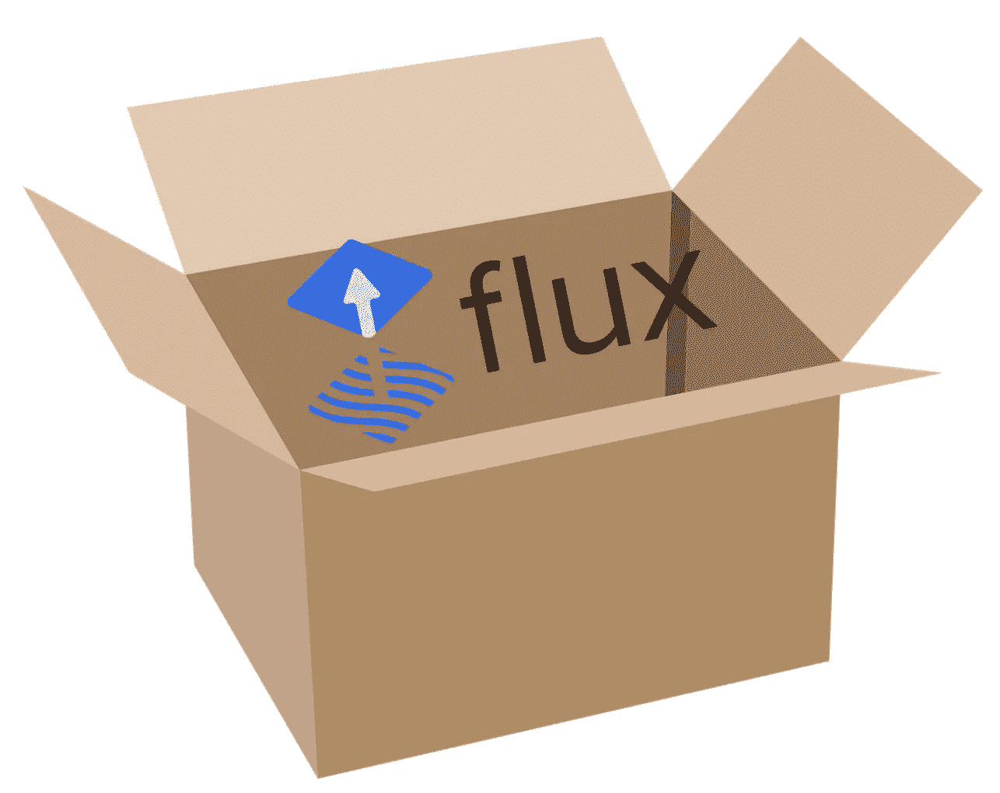

# 限制流量许可

> 原文：<https://itnext.io/restricting-flux-permissions-1f79372c77b5?source=collection_archive---------2----------------------->



# 问题陈述

这项工作的问题陈述如下:

**作为一名**平台工程师
**我希望**将通量权限锁定为“刚好够用”
**这样**我们就能尽可能地保证集群的安全

# 什么是通量？

Flux 是一个工具，可以自动确保集群的状态与 git 中的配置相匹配。它使用集群中的一个操作符来触发 Kubernetes 内部的部署，这意味着您不需要单独的 CD 工具。

它监控所有相关的映像存储库，检测新映像，触发部署，并基于此更新所需的运行配置(以及可配置的策略)。

更多信息见[https://github.com/fluxcd/flux](https://github.com/fluxcd/flux)

# 问题是

默认情况下，Flux helm 图表将 RBAC(基于角色的访问控制)权限设置为能够执行任何操作的集群角色(见下文)

```
rules:
  - apiGroups:
      - '*'
    resources:
      - '*'
    verbs:
      - '*'
  - nonResourceURLs:
      - '*'
    verbs:
      - '*'
```

Flux out the box 不知道要协调什么，所以这个默认位置是有意义的。然而，从安全角度来看，这远非理想。

# 要求

要求如下:

1.  **所有通量所需的一组默认 RBAC 权限**

开箱即用，每个 flux 实例都需要一个默认的权限集，不管它协调什么，我们需要定义这些。

**2。一组 RBAC 权限允许自动提升图像**

如果您正在使用自动图像升级，并在`HelmRelease`资源上使用 flux 注释，我们需要一组权限来实现这一点。

**3。针对 flux 的每个实例的一组 RBAC 权限**

最后，我们需要拥有运行特定 flux 实例所需的权限。这将因所调和的通量而不同。例如，一个特定的实例可能只需要将`SealedSecret`资源协调到一组名称空间中，其他什么都不需要。

# 实施

为了简单起见，我将在这里谈论使用可用的[上游舵图时所需的改变。](https://github.com/fluxcd/flux/tree/master/chart)

## 控制 RBAC

我们需要做的第一件事是完全控制 flux 实例使用的 RBAC。这可以通过设置以下值来实现。

```
rbac:
  create: false

serviceAccount:
  create: false
  name: flux-engineering
```

## 构造我们的 ClusterRoleBinding & service account

我们现在需要一个默认的`ClusterRoleBinding`和相应的`ServiceAccount`(名称在你的舵图表值中指定)。这方面的一个例子如下:

```
apiVersion: rbac.authorization.k8s.io/v1
kind: ClusterRoleBinding
metadata:
  name: flux-engineering
roleRef:
  apiGroup: rbac.authorization.k8s.io
  kind: ClusterRole
  name: flux-engineering
subjects:
  - kind: ServiceAccount
    name: flux-engineering
    namespace: flux-engineering----apiVersion: v1
kind: ServiceAccount
metadata:
  name: flux-engineering
  namespace: flux-engineering
```

## 构建我们的集群角色

当构建`ClusterRole`时，我们需要从添加流图提供的默认的基于角色的权限开始。这些是下面的

```
*# Default RBAC permissions*- apiGroups: ["apiextensions.k8s.io"]
  resources: ["customresourcedefinitions"]
  verbs: ["list", "watch"]
- apiGroups: [""]
  resources: ["namespaces"]
  verbs: ["list"]
```

下一个要添加的部分是完成自动映像升级所需的权限，列出的资源取决于 flux 需要查看的资源，下面是一个示例:

```
*# RBAC required for automatic image promotion*- apiGroups: ["apps"]
  resources: ["deployments", "daemonset", "statefulset"]
  verbs: ["get", "list", "watch"]

- apiGroups: ["batch"]
  resources: ["cronjob"]
  verbs: ["get", "list", "watch"]
```

如果你使用的是`imagePullSecrets`，你需要给 flux 提供`get`和`list`秘密的能力，见下文:

```
*# RBAC required to pull images from a private registry*- apiGroups: [""]
  resources: ["secrets"]
  verbs: ["get", "list", "watch"]- apiGroups: [""]
  resources: ["serviceaccounts"]
  verbs: ["get", "list", "watch"]
```

现在我们需要提供协调存储库中特定资源所需的权限，例如，这可能只是`HelmRelease`资源。这可以从下面看出:

```
*# Specific RBAC permissions for this flux instance*- apiGroups: ["helm.fluxcd.io"]
  resources: ["helmreleases"]
  verbs: ["*"]
```

## 用于访问发现 API 的附加 ClusterRoleBinding

最后，我们需要创建一个新的`ClusterRoleBinding`，为 flux 服务帐户提供`system:discovery` `ClusterRole`权限。这是默认的`ClusterRole`，允许对 API 发现端点进行只读访问，这是发现和协商 API 级别所必需的。下面可以看到`ClusterRoleBinding`:

```
apiVersion: rbac.authorization.k8s.io/v1
kind: ClusterRoleBinding
metadata:
  name: flux-engineering-discovery-api
roleRef:
  apiGroup: rbac.authorization.k8s.io
  kind: ClusterRole
  name: system:discovery
subjects:
  - kind: ServiceAccount
    name: flux-engineering
    namespace: flux-engineering
```

> 这个`ClusterRoleBinding`对于**所有的 flux 实例**都是必需的，不管实例正在协调什么。
> 
> Flux 需要访问 Kubernetes Discovery API，因为它使用它来枚举所有可能需要进行垃圾收集的东西。

# 退关货物

我最后要大声喊出**weave works**的迈克尔·布里根**和**斯蒂芬·普罗丹**。我们三个人踏上了学习如何锁定通量的旅程。**