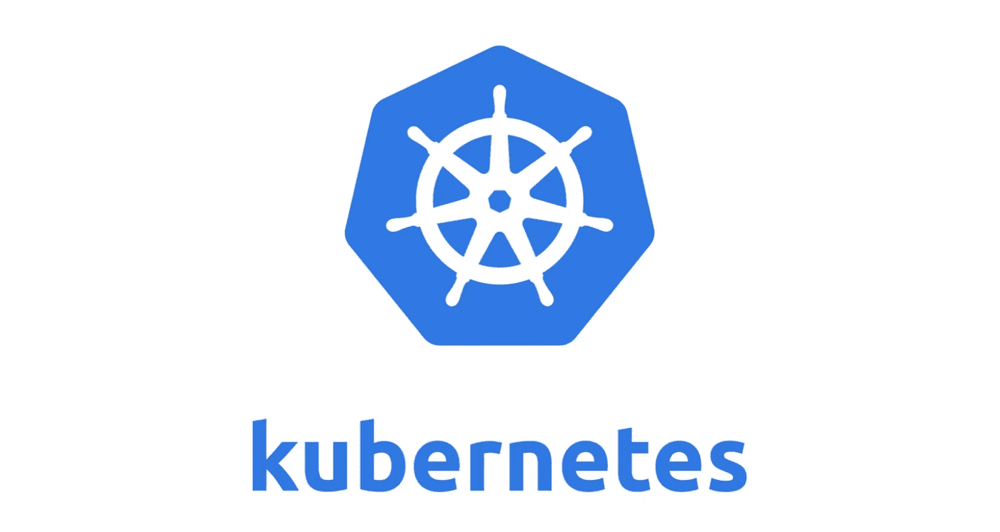

# 在 Kubernetes 中运行 Rsyslog 服务器

> 原文：<https://itnext.io/run-rsyslog-server-in-kubernetes-bb51a7a6e227?source=collection_archive---------3----------------------->



在我的[上一篇文章](https://medium.com/@sudheer.chamarthi/dockerize-rsyslog-server-f8f9754c37d5?source=your_stories_page---------------------------)中，我解释了如何对接 Rsyslog 服务器并将其作为容器运行。现在，在本文中，让我们看看如何使用像 Kubernetes 这样的容器编排工具，在没有任何人工干预的情况下动态地管理和扩展 Rsyslog 服务器。

## 建立和推动您的图像 Docker 注册表

构建并推送你的 Docker 镜像到 Docker 注册中心，比如 DockerHub 或 ECR。在本文中，我将把我的图像推送到 DockerHub。下面是我以前文章的 Dockerfile 文件的副本。

Dockerfile 文件

建立形象。

```
docker build -t sudheerc1190/rsyslog .
```

按下 Dockerhub

```
docker push sudheerc1190/rsyslog:latest
```

请注意，我已经登录到我的 Docker 注册表。

## 创建单独的名称空间

如果您想要隔离 Syslog 服务器，请创建一个单独的名称空间，否则您可以在自己选择的名称空间中运行它。部署以下文件以创建 rsyslog 名称空间

namespace.yaml

```
kubectl apply -f namespace.yaml
```

## 创建持久存储

因为我们的 rsyslog 服务器从不同种类的应用程序和设备收集日志，所以保存这些数据非常重要。在这个例子中，我将使用 AWS EFS 来保存数据。

如果您的集群中尚未配置 efs-provisioner，您可以按照这里的[步骤](https://aws.amazon.com/premiumsupport/knowledge-center/eks-pods-efs/)进行配置。我已经配置了我的 EFS 置备程序。

部署以下 YAML 文件以创建持久卷和持久声明。

efs.yaml

> **注**:将 fs-xxxx 换成有效的 EFS ID。

```
kubectl apply -f namespace.yaml
```

此外，我确实听说人们对 EFS 的性能很少关注，但 EFS 随着最近的功能增加已经改进了很多。如果你有任何关于 EFS 性能的问题，你可以参考这个 AWS 文档[亚马逊 EFS 性能](https://docs.aws.amazon.com/efs/latest/ug/performance.html)

## 创建 Rsyslog 部署

部署以下 YAML 以创建 rsyslog 部署，其中包含三个具有永久 EFS 卷的副本。

部署. yaml

```
kubectl apply -f [deployment](https://gist.github.com/sudheerchamarthi/8f362b72b1f7959009a7fc1d19e91af6).yaml
```

验证部署状态。您可以在这里看到，我的 3 个副本都在运行

```
kubectl get deployment -n rsyslog
NAME                 READY   UP-TO-DATE   AVAILABLE   AGE
rsyslog-deployment   3/3     3            3           3m19s
```

## 向服务公开部署

公开服务，以便该集群中的任何其他 pod 都可以访问和发布日志。

service.yaml

```
kubectl apply -f service.yaml
```

## 向 NLB 公开服务

让我们将服务公开给 NLB，这样我们就可以开始接受来自整个环境中运行的应用程序的日志。暴露于 NLB 还帮助我们创建 VPC 端点，并安全地允许我们接受同一地区任何 VPC 之间的连接。

部署以下内容，并等待几分钟，直到 NLB 配置成功。

nlb-ingress.yaml

```
kubectl apply -f nlb-ingress.yaml
```

几分钟后，描述服务并复制 NLB 端点。

```
kubectl get svc -n rsyslog
```

现在我们有了 Rsyslog 服务器，可以接受来自应用程序的日志了。我们来测试一下。

## 测试

运行以下 Docker 容器，该容器将日志流式传输到 Syslog 服务器(用您的 NLB 端点替换 NLB 端点)。

```
docker run --log-driver syslog --log-opt syslog-address=tcp://<NLBENDPOINT>:514 alpine echo hello world
```

现在进入 rsyslog pod 并导航到/var/log/remote/

```
kubectl get pods -n rsyslog
```

将任何 pod 名称和 exec 复制到其中(替换 pod Name)。

```
kubectl -n rsyslog exec -it <podname> -- ls /var/log/remote/2019/12/21/
```

耶！我能看到我的日志。

## 缩放比例

现在我们已经让 rsyslog 作为 Kubernetes 部署完美地工作了。我们可以使用 HPA 轻松扩展到单元。

## 额外资源

所有 YAML 的文件都可以在这里找到:[https://github.com/sudheerchamarthi/rsyslogd.git](https://github.com/sudheerchamarthi/rsyslogd.git)